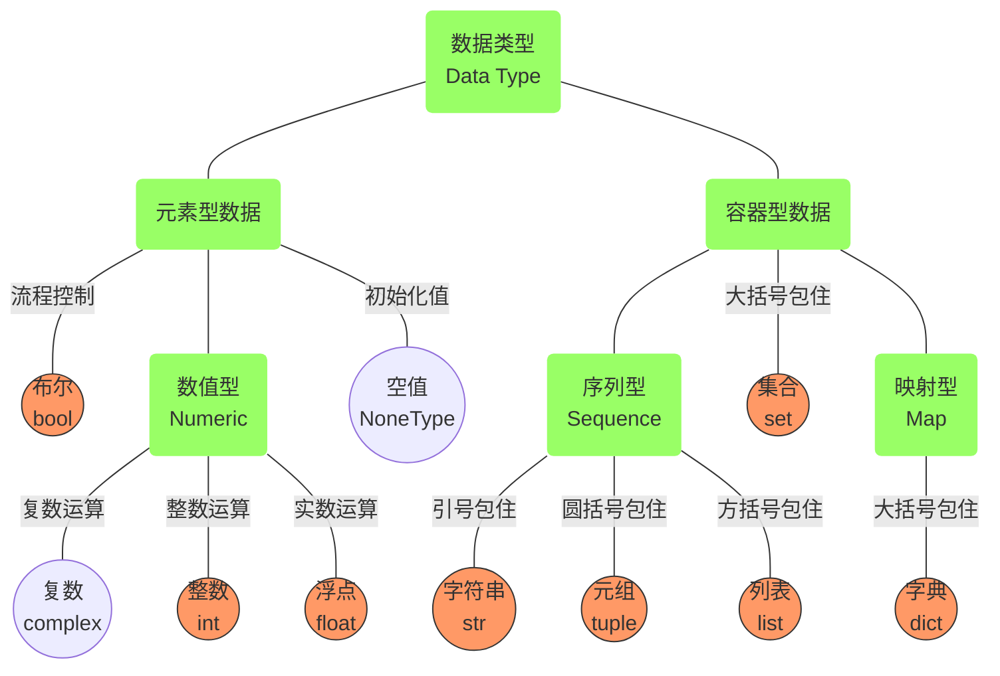
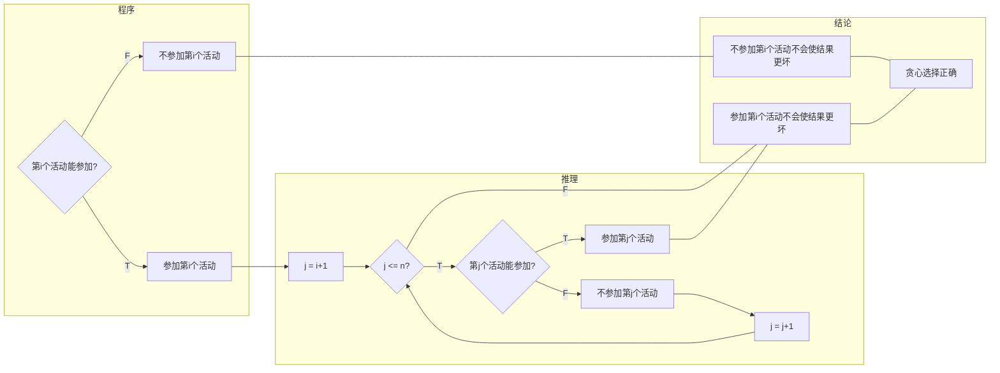

# 计算思维算法实践

*Updated 2025-09-28 12:05 GMT+8*  
*2021-12-27  闫宏飞（北京大学）、陈翀（北京师范大学）编著*


<!--预计 350页，40万字，2025年秋季交稿。-->


**内容简介**

​	本书提供了一个全面而综合的视角，介绍计算机原理与编程实践。内容覆盖了计算机文化与历史、核心原理以及编程语法和计算思维的实际应用。书中不仅探索了计算机文化及其历史背景，还深入讲解了对现代计算机设计至关重要的三大原理：图灵机、进程的虚拟地址空间以及ASCII编码。此外，本书通过常用算法的介绍来培养读者的计算思维能力。

​	全书经过精心编排，精选了200余道编程题目（链接：http://cs101.openjudge.cn），其中约三分之一的内容在本书中进行了详细讲解。其余题目的解析可通过书中提供的链接查阅。针对所选题目，本书不仅提供了清晰的解题思路，还配有完整的示例代码，旨在帮助读者由浅入深、循序渐进地掌握编程核心技能，夯实基础并提升实战能力。

​	本书内容丰富且叙述清晰易懂，既适合计算机及相关专业的本科生作为基础课程的教材使用，也为专业技术人员提供了宝贵的参考资料。无论是初学者还是有经验的开发者，都能从中获得深刻的见解和实用的知识。


**前言**

​	随着计算机科学为基础的信息技术迅猛发展，全球已步入数字经济时代。海量数据已成为日益重要的生产要素，而计算作为一种新型生产工具，已经渗透到经济社会的各个环节，成为支撑人工智能、大数据、区块链等新兴产业发展的关键因素。在国家建设需求的推动下，我国的计算机科学技术在过去半个多世纪里经历了从无到有的快速发展，尤其是在近二三十年间，计算机相关专业已成为社会需求最广泛的专业之一。这一现象的背后，反映了社会发展对具备计算思维和计算能力的社会建设者的需求。

​	正确编写程序解决问题是培养计算思维的关键，相关计算机基础课程，通常在高校低年级开设。本书旨在作为计算机基础课程的教材或参考书，并适合用作程序员培训的教材。全书内容分为三个部分，逐步引导学生形成计算思维：

- **第一章**：旨在激发学生的兴趣，涵盖计算机文化历史及三大核心计算机原理（图灵机、进程的虚拟地址空间、ASCII编码），帮助学生建立对计算机的感性与理性认识。
- **第二章**：介绍Python的基本语法与编程环境搭建，使学生掌握与计算机“沟通”的语言。书中主要使用Python实现示例代码。鉴于市面上已有丰富的编程语言书籍和在线资源，且许多学生具备一定的自学能力，本章内容相对简略，建议学生自主学习或作为辅助阅读材料。
- **第三章**：重点在于训练计算思维，通过大量题目及其解析，让学生理解基本数据结构、算法等经典内容中蕴含的计算思维，并接受扎实的实践训练。这部分是本书的重点内容，在cs101.openJudge.cn编程平台上应用多种常见算法解决实际问题，提供了足够一学期使用的编程练习题目，所有题目均附有实现代码，重要题目还配有逐行讲解视频链接。。

​	本书适用于不同知识背景的学习者：

- 对于零基础的同学，可以从第一章开始，首先培养对计算机的兴趣，然后学习第二章中的Python语法，了解如何与计算机进行有效的沟通。
- 对于有一定计算机知识的同学，可以从第二章开始学习编程语言，确保熟练掌握Python语法；有编程基础的同学，可以直接从第三章开始。
- 第三章是全书的重点，通过结合基本数据结构和各种算法在不同难度级别的题目练习，进一步培养和锻炼计算思维与数学思维。

​	本书不仅为初学者提供了坚实的基础，也为有经验的开发者提供了深入学习的机会。无论你是刚刚接触计算机科学的新手，还是希望进一步提升技能的专业人士，本书都将是你不可或缺的指南。


**致使用本书的学生**

当我们阅读时，另一个人替我们思考：我们只是重复他的思维过程。

When we read, another person thinks for us: we merely repeat his mental process. 

——叔本华


​	计算思维离不开从数学和计算机的角度来考虑问题，有时还需要应用物理知识。许多题目是对现实问题的再现、简化或变形，因此解题是训练新手解决实际问题的一种有效手段。在解题过程中，学习者需要保持清晰的思路与缜密的逻辑，形成一套系统化的问题思考方式。通过日积月累的练习，自然而然地就能养成计算思维。下面摘录了两位初学者在培养计算思维过程中的心得体会。

​	“计算机思维与日常的数学逻辑思维紧密相关，但因处理问题数量级的不同而存在显著差异。**在日常生活中，我们很少设想自己能够以每秒上亿次的速度进行运算，因此我们在处理问题时的思维方式与计算机思维有着本质上的不同**。由此可以看出，随着计算能力的增强，不仅带来了处理规模的扩大，更重要的是引发了思维方式的革新。正如‘More is different’所揭示的那样，更多的资源可以带来全新的可能性。”

​	“数学思维在编程中至关重要，它可以帮助你简化题目并降低时间复杂度。有时候拿到题目立即动手并不是最佳选择。如果题目中给出了数据范围，应该先估计一下时间复杂度，确保所选算法能够在规定的时间内完成任务。
​	此外，使用Python这门语言时，虽然其丰富的函数库极大地方便了开发工作，但有时也可能限制了深入思考的机会。例如，在轻松使用 `sum()` 函数时，可能会忽视其背后的时间复杂度，在反复调用该函数时可能导致超时问题。因此，理解底层实现原理同样重要。”

​	我整理编程题目，形成“计算思维算法实践”题库，http://cs101.openjudge.cn/pctbook/，旨在提升学生的计算思维和算法解决能力。希望这些资源能够帮助学生们在学习编程的旅程中迈出坚实的一步，同时激发他们解决问题的热情和创造力。这些题目主要由我和我的助教团队为任教班级设计，涵盖了从基础到高级的不同难度级别。每个题目的编号前的大写字母（E/M/T）分别代表该题目的难度等级：Easy（简单）、Medium（中等）、Tough（挑战）。计算概论初级班的学生应能够完成超过50个 Easy 级别的题目，并尝试挑战部分 Medium 难度的题目。计算概论中高级班的学生则有望完成所有 Easy 级别和超过90个 Medium 级别的题目，并鼓励同学们攻克一些 Tough 级别的挑战题目。我为这些题目准备了详细的解答指南，链接是：
https://github.com/GMyhf/2020fall-cs101/blob/main/2020fall_cs101.openjudge.cn_problems.md

​	通过这种方式，本书旨在帮助学习者首先掌握编程语法的基础知识，然后通过适配其当前水平的题目进行思维训练，逐步提升解决问题的能力至更高的层次。这种方法不仅能够确保学习者的稳步进步，还能有效激发他们的学习兴趣和动力，使他们能够在解决实际问题的过程中不断深化对计算思维的理解。	


**致使用本书的教师**

​	本书的编写初衷在于系统梳理北京大学《计算概论B》课程多年积累的教学内容，致力于打造一本专注于培养计算思维与算法实践能力的理想教材。为便于教学工作者参考，表 P.1 附录了笔者在2024年秋季学期《计算概论B》课程中的具体教学安排：第1至第6周侧重理论基础与编程语法的掌握；第7至第14周集中学习各类常见算法，并开展计算思维与算法实践训练；第15至第16周则用于课程总结与知识整合。

​	此外，本书第3章包含三个附录：附录3A汇总了初学者在编程学习过程中常见的问题与解答；附录3B整理了AI助教系统中同学们提出的高频问题及回应，助力自主学习；附录3C则收录课程题目，供读者练习与参考。	

- 课程安排与练习题目。本课程为期16周，每周安排3个学时，期间学生将完成大约150至200道题目。

- 解题思路的重要性。简明的解题思路在启发思考、激活联想方面起着至关重要的作用。本书秉持“言简意赅”的原则，力求用一两句话清晰地传达核心思想，避免冗长叙述。基于这一理念，某些题目的解题思路精选自学习者的亲身体验，这些思路言简意赅且具有点睛之效，能够帮助读者迅速抓住问题的关键，激发创造性思维。


表P.1 北京大学2024年秋季学期《计算概论B》课程安排

| 1. 课程概述                     | 2. 计算机文化                   | 3. 开发环境和程序设计语言    |
| ------------------------------- | ------------------------------- | ---------------------------- |
| 4. 计算机原理                   | 5. 语法（1/2）：变量、操作符    | 6. 语法（2/2）：控制结构     |
| 7. 算法（1/6）：贪心和动态规划  | 8. 算法分析                     | 9. 信息传递和二维数组        |
| 10. 算法（2/6）：递归和动态规划 | 11. 算法（3/6）：递归和动态规划 | 12. 算法（4/6）：遍历（1/3） |
| 13. 算法（5/6）：遍历（2/3）    | 14. 算法（6/6）：遍历（3/3）    | 15~16. 课程总结（1/2、2/2）  |


**序**

<!--todo: 请 李老师，做序。-->

**序一**


​																																												李晓明

​																																									2022年7月27日


**序二**

​	关于什么是“计算思维”，目前虽然没有统一的定义，但是却有一个基本的共识，那就是“计算思维”过去只是从事计算机科学的专业人员谈论的话题，而今已经成为生活在信息时代各行各业从业人员都能获益的一种思维模式，甚至可以说随着信息技术的不断发展，“计算思维”能力将是人们必备的一种能力。

​	计算思维体现的是人类思维和计算机能力的综合，人类思维完成抽象化、符号化、算法设计与描述，最后由计算机自动执行程序完成任务。由此可见，人类思维结果与计算机执行之间的桥梁是程序设计。

​	程序设计课程的内涵随着计算科学的发展、信息技术的应用和普及，发生了很大的变化，简单例题加繁琐语法的时代已经不适合信息科学发展的需要。当下的程序设计课程的教学目标更多是以问题求解为导向，选取那些体现算法思想的经典问题作为程序设计的入手，在分析问题，解决问题的过程中，将程序设计能力的训练融入其中。我作为一名讲授《程序设计基础》（在北京大学的课程名为《计算概论A》）课程的老师，私以为尽管计算思维不等于程序设计，但是离开程序设计的实践难以学到计算思维的真谛。

​	《计算思维算法实践》这本书，是作者闫宏飞老师基于他在北京大学讲授《计算概论B》课程的内容编撰而成。闫宏飞老师非常重视实践，他课程上的程序练习和作业均要求在实测平台上通过。编写程序锻炼了逻辑思维和算法思维能力，而让程序能够通过实测平台上严格的测试数据的检验，是从程序的实用性、正确性、高效性的角度训练学生解决实际问题的能力，从而避免纸上谈兵。

​	书中提供了大量的程序练习题，体现了计算机科学中一些基础的、经典的算法思想，例如贪心、搜索、递归、动态规划等，还包括面向应用的进阶实战训练。书中给出的程序练习题，按照难易层度的维度和算法类别的维度，分门别类加以整理，有简有难，各种基础的读者，均可找到自己需要的部份。如果你是一个编程爱好者，相信你能感受到在代码中遨游的畅快。

​	本书中让我觉得非常珍贵的部份是作者在教学过程中记录了学生们解决问题的思路、调试过程、走过的弯路以及学习的心得体会，这些内容连同他们提交的源代码一起在本书中呈现给读者，或许会有读者和我一样，有眼前一亮的感觉。

​	书中另一个独特内容是助教以视频的形式展示组装一台计算机的过程，加深学生对计算硬件系统的直观理解，突出实践性。总之，这本教材的内容看起来和传统的计算机教材的纲常有所不同，这正是它的特色。书中有很多有趣的内容，你能了解到一些计算机领域的新的研究动态，一些新兴的研究机构以及他们正在进行的研究工作。

​	本书作者个人风格明显。闫宏飞老师是一个编程高手，理工男，技术派，重视代码质量，强调实践。本书的所有问题都可以通过链接或者网址在实测平台上去练习，不仅对于学习编程的读者是一本内容丰富的题典，对于教师也是一本非常实用的工具书。


​																																												代亚非

​																																									2022年7月27日


**自序**

学而不思则罔，思而不学则殆。

Study without thought is vain, thought without study is dangerous.

——孔子《论语》


天空中没有留下鸟的痕迹，但我已飞过。

I leave no trace of wings in the air, but I am glad I have had my flight. 

——泰戈尔《飞鸟集》


​	思维的培养离不开实践中的思考与感悟。掌握编程语言的基本语法后，需将其应用于解决实际问题，才能真正体会到算法背后的计算思维。正如一位学习者在总结回溯算法的应用体会时所说，“天空中没有留下鸟的痕迹，但我已飞过”，这恰如其分地描述了深度优先搜索过程中尝试寻找解的过程：当发现当前路径不再满足求解条件时，便“回溯”返回，尝试其他路径。可以说，回溯就是一种“过河拆桥”的过程，即在需要的时间内修改数值，在不需要的时候再恢复。

​	笔者长期担任北京大学公共必修课《计算概论》的教学工作。基于多年的教学经验积累和课程内容安排，本书得以辑印成册。近些年（2020秋季学期～2024秋季学期），选课学生大多为北大文理各院系的一年级新生，其中很多同学学生对程序设计语言不熟悉。令人欣慰的是，通过一学期的学习，学生们不仅能迅速成长，还能以自己独特的语言表达对算法和知识点的理解。

​	对于大多数人而言，数学思维从幼儿园或小学开始培养，物理思维从中学生涯起步，而计算机思维则是大学阶段的新课题。培养计算思维不仅需要引导，更需要学习者投入时间思考，并在实践中练习和应用。具体到计算机领域，通过掌握一门编程语言，宽度优先地学习几种基本算法和常见数据结构，并在合适的编程平台上加以练习，可以提升数学思维、计算机思维及物理思维。

​	《计算概论》旨在培养学生的计算思维，鼓励他们从数学和计算机的角度思考问题。作为一门实践性极强的课程，它要求学生结合具体题目来深化理解。随着学习的深入，学生会发现自己需要从全新的角度去解决问题，从而形成一种新的思维方式。

​	**课程内容**主要包括计算机文化和原理、编程语言语法、计算思维实践，重点在于计算思维实践。课程从零基础的计算机文化和原理讲起，涵盖编程语言语法和基本数据结构，介绍常见的算法，如穷举法、贪心、递归、动态规划和搜索等。完成深度优先搜索和宽度优先搜索的教学后，即可结束课程。

​	算法是《计算概论》不可或缺的一部分。每种算法都有其独特之处，即使最初接触时不甚理解，通过做几道例题并仔细研究解答过程，完全可以打开新算法的大门。随着学习的深入，你会发现同一算法即使隐藏在不同题目背后，其实现的核心部分也极为相似。例如，动态规划的关键在于定义状态和状态转移方程。通过合理定义问题的状态，并找出如何从一个或多个先前状态转移到当前状态的方法（即状态转移方程），可以有效地解决复杂问题。而搜索算法的核心在于使用数据结构（如列表）来存储已经访问过的节点，并将新的节点不断加入待访问集合中，只是不同的搜索策略会按不同的顺序扩展这些节点。理解了这些核心操作后，算法学习就不再是一件难事了。

​	**课程内容安排**上，大多数学生开始时处于编程零基础或仅具备入门级知识，但凭借良好的方法指导，他们能够迅速提升至更高层次，领悟计算思维。本书满足一学期16周，每周3学时的教学量。课程按照语法—数据结构—矩阵—贪心—动态规划—搜索的路线推进，每一阶段都需要系统学习，以保持良好的衔接性。从语法的输入输出和基本逻辑开始，逐步扩展到基本数据结构的序列、字典、集合、栈、队列、堆等；进阶到矩阵中的二维列表，不可变和可变对象，深浅拷贝；进而练习多种贪心算法策略，最后利用序列、集合或矩阵辅助存储，以空间换时间的方式实现动态规划与搜索算法。

​	如果一学期为16周，每周4学时，则可以拓展到进阶实践部分内容。这部分由浅入深，涉及自然语言处理、机器学习、人工智能和数据分析等技术，包括网页抓取、提取、汇总；投资组合优化；图的连通性在社会网络研究中的应用；以及2048算法实现等小项目。

​	培养学生的计算思维，需要教师、助教和学生的共同努力。教师负责讲授知识点、提供学习路径，并搭建答疑平台。答疑方式包括线上形式（如课程微信群）和线下一对一答疑。学生在课堂学习之后，独立完成每周布置的必做和选做题目。作业中遇到的问题可以通过附录3A的逐行讲解视频或答疑平台寻求帮助。	

​	最后，感谢北京大学信息科学技术学院“计算机公共课培养方案”、“计算概论B”讨论组的各位教师，以及在本书撰写和出版过程中给予建议和帮助的人们。特别感谢历年来参与课程教学的研究生助教和本科生助教，没有他们的付出就没有课程的顺利运行。感谢历年的北京大学本科选课同学，他们的聪明才智让作者受益匪浅。感谢本书的策划编辑<mark>XX</mark>老师及<mark>XX</mark>出版社。还要感谢正在上高一的闫宸茁同学，在笔者编著本书的过程中，他能自行安排日常学习和生活，为我们节省了大量的时间。

​	本书基于十多年深耕一门课程的积累而成，尽管自感费力不少，但因水平有限，谬误在所难免，期盼广大读者和同行交流并提出宝贵意见。作者的电子邮件是 [yanhf@pku.edu.cn](mailto:yanhf@pku.edu.cn)。谢谢。


**目录**

[TOC]


# 第1章 计算机科学与智能时代

​	计算机文化这一概念的成型与广泛传播缺乏确切的考证时间，但其兴起大致可追溯至20世纪80年代后期。从最初的计算装置到独立学科，再到深刻影响人类社会的文化形态，计算机的演进轨迹堪称技术革命的典范。广义而言，计算机文化不仅指对技术操作的认知，更包含对计算本质的理解——即在合适场景中合理运用计算资源的能力。这种文化素养既需要技术操作层面的掌握，更要求使用者具备对计算技术适用性的判断力。

​	本章旨在帮助读者全面认识计算机科学作为一门独立学科的历史、组成与发展脉络，并引出人工智能（AI）作为当前计算科技前沿的核心方向。从图灵机理论到摩尔定律，从大数据涌现到分布式协同与智能模型演进，计算机不仅深刻改变了人类社会，也成为现代知识体系中连接自然科学与社会技术的桥梁。


## 1.1 计算机科学的学科体系与发展

### 1.1.1 计算机科学的六大分支

​	计算机技术广泛渗透各行各业，其核心学科——计算机科学（Computer Science, CS），具有以下六大分支：`[1][2] `

- 计算机工程学（Computer Engineering），关注硬件与软件系统协同设计与优化。
- 计算机科学（Computer Science），聚焦计算理论与算法设计，探讨可计算性及效率，其衍生出人工智能、计算理论等众多子领域。
- 网络安全（Cybersecurity），保护数字资产，涵盖系统、人、组织多维度。
- 信息系统（Information Systems），研究组织级计算架构与管理策略。
- 信息技术（Information Technology），聚焦系统运维与服务支持。
- 软件工程学（Software Engineering），关注软件开发过程的系统性、可控性与质量保障。
- 数据科学（Data Science），整合统计学、机器学习处理海量数据，提取知识。

​	其中，CS作为本书核心领域，其权威组织包括 ACM（美国计算机协会）与 IEEE（电气与电子工程师协会）。该学科被定义为：系统研究信息处理的理论基础及其在计算系统中的实现技术，其核心在于对算法的系统性研究。学科分支涵盖理论计算（如计算复杂性理论）、应用计算（如计算机图形学）及人机交互等方向。

​	图灵机理论表明，各类计算设备在理论计算能力上具有等价性，但实际性能存在差异。尽管计算机科学以计算为核心，但正如E.W.戴克斯特拉（荷兰语：Edsger Wybe Dijkstra）所言："计算机科学并非仅关乎计算机，犹如天文学不单研究望远镜（Computer science is no more about computers than astronomy is about telescopes）"。这一学科融合了数学、语言学与工程学的精髓，自20世纪末逐步发展为独立学科。

​	计算机科学的独立学科地位历经长期演进。早期（1940-1960年代），虽然英国的剑桥大学等机构开设计算机科学课程，但将其归为数学或工程学的一个分支，并非独立的学科。首个计算机科学系是在 1962 年由美国的普渡大学设立，第一个计算机学院于 1980 年在美国的东北大学设立。现在，多数高校将计算机科学设为独立院系，部分院校根据学科特色与师资配置，将其与工程学院、应用数学系等联合设置。

​	在计算机科学领域，最高荣誉是ACM图灵奖（Turing Award），自1966年设立以来，它一直被誉为“计算机界的诺贝尔奖”。首位荣获此奖项的华人是姚期智教授，他在2000年因其对计算复杂性理论和密码学等领域的开创性贡献而获此殊荣。

​	近年来，随着机器学习和深度学习技术的发展，大语言模型成为了科技界的新宠。这些模型利用复杂的算法来理解和生成自然语言，展示了人工智能在处理人类语言方面的巨大潜力。值得一提的是，在2019年，约舒亚·本希奥（Yoshua Bengio）、杰弗里·欣顿（Geoffrey Hinton）以及杨立昆（Yann LeCun）共同获得了图灵奖，以表彰他们在推动人工智能领域深度学习技术方面所做出的杰出贡献。到了2024年，诺贝尔物理学奖被授予了约翰·霍普菲尔德（John Hopfield）和杰弗里·辛顿（Geoffrey Hinton），这是为了认可他们对于使用人工神经网络进行机器学习的基础性发现与发明。这一成就不仅突显了他们在各自领域的影响力，也强调了计算机科学与其他学科之间交叉融合的重要性。尽管图灵奖常被称为“计算机界的诺贝尔奖”，但它并不是诺贝尔奖的一部分，而是由美国计算机协会（ACM）颁发，专门用来奖励那些对计算机事业作出重大贡献的个人或团队。图灵奖的存在，极大地激励了全球计算机科学家们追求卓越，不断探索前沿技术的动力。 	

### 1.1.2 摩尔定律与技术指数演进

​	贝尔实验室发明了晶体管，英特尔（Intel）和德州仪器（Texas Instruments）在20世纪70年代初开发微处理器，不久之后就发明了集成电路。摩尔定律（Moore's Law）由英特尔的创始人之一戈登·摩尔（Gordon Moore）提出，常被誉为计算机领域的第一定律。该定律指出，集成电路上可容纳的晶体管数目大约每两年就会翻一番。后来，这一观察被英特尔首席执行官大卫·豪斯（David House）修正为芯片性能大约每18个月提高一倍，这意味着随着集成度的增加，芯片不仅处理速度更快，而且整体性能也以类似指数级的速度增长。


<center>图1-1 电脑处理器中晶体管数目的指数增长曲线符合摩尔定律（A semi-log plot of transistor counts for microprocessors against dates of introduction, nearly doubling every two years）（注：图片来源为 wikipedia.org，2022年1月）</center>


​	自提出以来，半导体行业大致遵循着摩尔定律发展了超过半个世纪，对二十世纪后半叶的世界经济增长做出了巨大贡献，并推动了一系列科技创新、社会变革和生产力提升。几乎所有衡量数字电子设备能力的标准——包括处理速度、内存容量、乃至数字相机的像素数量——都与摩尔定律息息相关。个人电脑、互联网、智能手机等技术的发展和创新，皆离不开摩尔定律所描绘的技术进步趋势。这些进步显著提升了数字电子产品在全球经济各个领域的实用性。

​	戈登·摩尔于1929年1月3日出生在美国加州旧金山，拥有加州大学伯克利分校化学学士学位及加州理工学院物理和化学双博士学位。20世纪50年代中期，他与集成电路的发明者罗伯特·诺伊斯（Robert Noyce）共同在威廉·肖克利半导体公司工作。随后，他们与其他六位同事共同创立了仙童半导体公司（Fairchild Semiconductor），这成为现代Intel和AMD公司的前身。1968年，摩尔与诺伊斯离开仙童，共同创办了Intel公司。起初，Intel专注于数据存储领域，之后转向微型计算机的核心部件CPU的研发，奠定了其在计算机工业中的领导地位。


### 1.1.3 多机协同与分布式计算

​	当我们探讨一台电脑能完成的任务时，或许它仅限于日常办公、娱乐或是简单的数据分析。然而，当我们将视角扩展至100台甚至整个数据中心的计算机群时，其潜力将呈指数级增长。早期，计算机处理复杂任务如科学研究或气象预报时，往往依赖于单一的强大机器，这不仅成本高昂，而且资源利用率有限。随着分布式计算（Distributed Computing）模式的发展，这一状况得到了根本性的改变。分布式计算通过整合成千上万台计算机的闲置计算能力，并借助互联网进行数据传输（通常称为志愿计算），使得大规模计算任务变得更为经济高效。

**分布式计算项目实例**

1. **Folding@home**  
   斯坦福大学化学系潘德实验室发起的Folding@home项目自2000年启动以来，专注于蛋白质折叠的研究，旨在揭示蛋白质结构与相关疾病之间的联系。面对庞大的计算需求，该项目利用了全球志愿者提供的计算资源，实现了惊人的计算能力，在2020年4月达到了2.43 exaflops的速度，成为首个突破exaflop大关的计算系统。

2. **世界社群网格（World Community Grid）**  
   IBM主持的世界社群网格项目始于2004年，致力于解决人类面临的重大健康和社会问题，包括艾滋病、癌症等疾病的治疗研究。截至2020年3月，已有超过450家机构和4万名活跃用户参与，累计贡献了超过200万年的计算时间。

3. **Distributed.net的密钥破解项目**  
   Distributed.net因其成功破解RC5-64加密算法而闻名，这是在2002年由全球超过33万名参与者共同努力的结果，展示了分布式计算在密码学领域的强大威力。

4. **动画制作**  
   在电影制作领域，梦工厂动画公司利用数百台HP工作站协作完成了《怪物史莱克2》和《马达加斯加》等影片的制作，展现了分布式计算在创意产业中的应用。

5. **谷歌搜索引擎**  
   谷歌作为全球最大的搜索引擎之一，其背后的技术基础设施支持着海量的数据处理需求。通过构建反向索引、MapReduce作业以及Percolator系统，谷歌能够持续更新搜索索引并提供快速响应。谷歌在全球设有多个数据中心，每个中心都配备了数千台服务器，确保了服务的高可用性和性能。

6. **阿卡迈科技（Akamai Technologies）**  
   Akamai是内容分发网络（CDN）领域的领导者，通过遍布全球的服务器网络为客户提供高速的内容交付服务。截至信息获取日期，Akamai拥有约32.5万台服务器，分布在130个国家和地区，极大地提升了互联网用户体验。

​	综上所述，从单机到多机乃至数据中心级别的协同工作，不仅改变了我们解决问题的方式，也推动了科技进步和社会发展。分布式计算模式通过有效整合分散资源，打破了传统计算能力的局限，开启了无限可能的新时代。


### 1.1.4 数据的力量：从搜索引擎到社会变革

​	数据将会主宰未来社会，发挥巨大威力，数据的载体恰好是计算机。我们首先来看大数据技术在流感预警中的作用。流感是一种由病毒引起的呼吸道症状，流感具有传染性强，传播速度快的特点。对于流感，如果能提前预测其爆发，将会为卫生部门获取到宝贵的预防时间，对于降低危害，减少死亡率具有非常重要的作用。但要做到这一点，必须先知道这种流感出现在哪里。美国，和所有其他国家一样，都要求医生在发现新型流感病例时告知疾病控制与预防中心（CDC）。但由于人们可能患病多日实在受不了了才会去医院，同时这个信息层层报送疾控中心也需要时间，因此，发布新流感病例时往往会有一两周的延迟。而且，疾控中心每周只进行一次数据汇总。然而，对于一种飞速传播的疾病，信息滞后两周的后果将是致命的。这种滞后导致公共卫生机构在疫情爆发的关键时期反而无所适从。

​	2009 年 2 月 19 日，谷歌在 Nature 上面有一篇文章，“Detecting influenza epidemics using search engine query data”，论述了谷歌基于用户的搜索日志（其中包括，搜索关键词、用户搜索频率以及用户IP地址等信息）的汇总信息，成功预测了流感病人的就诊人数。它令公共卫生官员们和计算机科学家们感到震惊。文中解释了谷歌为什么能够预测冬季流感的传播：不仅是全美范围的传播，而且可以具体到特定的地区和州。谷歌通过观察人们在网上的搜索记录来完成这个预测，而这种方法以前一直是被忽略的。谷歌保存了多年来所有的搜索记录，而且每天都会收到来自全球超过 30 亿条的搜索指令，如此庞大的数据资源足以支撑和帮助它完成这项工作。

​	谷歌做的工作并不是实际意义上的预测什么时候流感来，而是将 CDC 已经获得但是没及时公布的数据提前给预测并公布出来。将得出的预测与 2007 年、2008 年美国疾控中心记录的实际流感病例进行对比后，谷歌公司发现，他们的软件找出了 45 条与流感高度相关的检索词的组合，如果这些词出现的规律用一个数学模型表示，则预测与官方数据的相关性高达 97%。和疾控中心一样，他们也能从用户检索数据中判断出流感是从哪里传播出来的，而且判断非常及时，不会像疾控中心一样要在流感爆发一两周之后才可以做到。

​	所以，2009 年甲型 H1N1 流感爆发的时候，与习惯性滞后的官方数据相比，谷歌成为了一个更有效、更及时的指示标。公共卫生机构的官员获得了非常有价值的数据信息。惊人的是，谷歌公司的方法甚至不需要分发口腔试纸和联系医生——它是建立在大数据的基础之上的。这是当今社会所独有的一种新型能力，即以一种前所未有的方式，通过对海量数据进行分析，获得有巨大价值的产品和服务，或深刻的洞见。基于这样的技术理念和数据储备，下一次流感来袭的时候，世界将会拥有一种更好的预测工具，以预防流感的传播。

​	我们再来看数据重构商业的威力。某网上交易平台，年成交量是 1 万亿，相当于 17 个省的 GDP。线上商业活动的活跃将导致以后的商铺租不出去，书店、服装店等实体店将减少50%。微信的出现让传统的电话短信业务不再成为通讯服务提供商的赢利点。 

​	据测算，从 2018 年到 2025 年，中国拥有的数据量将从 7.5ZB 增长到 48.6ZB，占全球的 27.8%，远高于美国的 17.5%。

​	国家数据局在 2025-04-29 发布的《全国数据资源调查报告(2024年)》中的官方统计显示：中国全年数据生产量 41.06ZB，同比 +25%；全国数据存储总量 2.09ZB，存储空间利用率 61%。我国已形成医疗、工业、教育等行业的高质量数据集335个，有效赋能人工智能大模型研发。在这个万物互联的世界，高速流动的数据就是生产资料，可以创造无限的价值。

> **ZB（Zettabyte，泽字节）**
>
> - 是数据量的单位，1 ZB = $10^{21}$ 字节（十进制计法），即一万亿 GB。
> - 常用单位对照：
>   - 1 KB = 10³ B
>   - 1 MB = 10⁶ B
>   - 1 GB = 10⁹ B
>   - 1 TB = 10¹² B
>   - 1 PB = 10¹⁵ B
>   - 1 EB = 10¹⁸ B
>   - **1 ZB = 10²¹ B**
>
> 可以简单记：**ZB ≈ 10 亿 TB**，相当于给 10 亿台 1TB 硬盘装满的数据量。


### 1.1.5 计算机发展简史：从算盘到AI芯片

​	硬件是计算机中固态可见的部分，看得见，摸得到。计算机械有着很长的历史，然而最初的计算设备是为特殊用途而设计的。大约公元前 100 年出现的安提凯希拉装置（Antikythera mechanism），1901 年于希腊安提凯希拉岛上的一艘古船残骸中被发现的随船沉没的钟形装置。该装置由一系列可以被控制的铜质齿轮（超过30个）、曲柄和刻度盘组成。百余年后，科学家终于在现代先进技术辅助下，揭开它惊人谜底——这座名为“安提凯希拉装置”的装置竟然是一台两千年前的超级天文“计算机”，天文学家计算天体运行周期的工具，它的先进性在其制成后千年间无人超越。算盘之类的算术工具，尤其是在亚洲地区已经有上千年的使用历史。在约翰·纳皮耶描述了对数之后不久，计算尺于17世纪早期被发明了出来。和现代计算机最接近的先驱是雅各提花织机，在 19 世纪左右由法国的约瑟夫·马里·雅各发明，通过多行打孔的矩形卡片来确定特定的编织图案。这种提花织机是“可编程的”，可以通过改变打孔卡片发出的指令来改变编织的图案。这种可节省人力的纺织机械的发明，导致很多编织工人失去了工作，并因此造成了社会混乱。1811~1816 年在英国发生的卢德运动就是一个针对机械化的暴力抗议。现代的计算机技术同样会对一些传统工作带来冲击。

​	今天的计算机理念起源于 19 世纪，从英国**查尔斯·巴贝奇**（Charles Babbage，1791 年 12 月 26 日－1871 年 10 月 18 日）的作品发展而来。巴贝奇是一个对导航和天文学有兴趣的科学家，这两个领域都需要有数值表以计算位置。他的毕生心血花在建筑计算机械上，希望能建造一个可以将枯燥易错的手工计算过程机械化的机器。由于很多原因，未能实现这个雄心壮志，其中一个原因是财政赞助人。即使这样，他的设计还是很完美的。借助那个时代的材料和工具，他的一些机器在现代得以实现。在伦敦的科学博物馆可以看见差分机。"差分"的含义是把函数表的复杂算式转化为差分运算，用简单的加法代替平方运算。差分机使用有限差分方法来机器计算多项式函数的值。有限差分方法是个简单但功能强大的技巧，它用重复加减的过程来避免需要的乘法和除法。

​	查尔斯·巴贝奇激励了奥古斯塔·艾达·拜伦对数学和他的计算设备的兴趣。艾达是诗人乔治·拜伦的女儿。她被认为是世界上第一个程序员，Ada 编程语言也以她的名字命名。

​	19 世纪晚期，赫尔曼·何乐礼（Herman HollerithHerman Hollerith，1860 年 2 月 29 日－1929 年 11 月 17 日）为美国人口普查局工作，他设计并制造出了和人工操作相比可以更快地将普查数据列成表格的机器。采用雅各提花机的灵感，何乐礼通过在卡纸上打孔以将普查数据编码成可以利用他的机器处理的格式。1880 年的普查结果利用 8 年时间才全部录入表格，而借助何乐礼的打孔卡片和打孔卡片制表机（Tabulation Machine），1890 年的普查结果只用了一年时间便得以完成。何乐礼在 1896 年，创办了制表机器公司（Tabulating Machine Company），它是IBM的前身。

​	计算芯片的发展脉络如图1-2和表 1-1 所示。从 1906 年电子管的诞生开始，历经晶体管、集成电路、大规模集成电路等阶段，直至进入人工智能时代的 AI 芯片，计算核心在这一百余年的历程中不断演进与飞跃。


<center>图1-2 计算芯片演进</center>

表1-1 计算芯片发展脉络

| 技术                                           | 出现年份                            | 代表事件 / 关键人物                                          | 备注                                                         |
| ---------------------------------------------- | ----------------------------------- | ------------------------------------------------------------ | ------------------------------------------------------------ |
| 电子管（Vacuum Tube）                          | 1906                                | 李·德·福雷斯特（Lee De Forest）发明三极管（Audion）          | 标志着电子放大与开关技术的诞生，被用于早期收音机、雷达、计算机（如ENIAC）。 |
| 晶体管（Transistor）                           | 1947                                | 贝尔实验室（约翰·巴丁、沃尔特·布拉顿、威廉·肖克利）发明点接触型晶体管 | 体积更小、功耗更低，1950年代逐渐取代电子管。                 |
| 集成电路（IC, Integrated Circuit）             | 1958                                | 德州仪器的杰克·基尔比（Jack Kilby）制作出首个集成电路；1959年仙童半导体的罗伯特·诺伊斯（Robert Noyce）提出平面工艺硅IC | 将多个晶体管、电阻、电容等元件集成在一片半导体芯片上。       |
| 大规模集成电路（LSI, Large Scale Integration） | 1970年代                            | 数千至上万个晶体管集成在单芯片                               | 推动微处理器（Intel 4004, 1971）诞生，计算机进入个人化时代。 |
| AI芯片（AI Accelerator, AI Processor）         | 2016（概念普及） / 2017（商用高峰） | Google TPU（2016）、NVIDIA Tensor Core GPU（Volta架构, 2017）、华为昇腾（2018） | 针对深度学习矩阵运算优化的专用芯片，支持大规模并行计算和高能效AI推理训练。 |

​	1942 年开始的美国的**原子弹计划**核爆计算促成了计算机的诞生。第一代（1946 ~1958 年）计算机，其主要逻辑元件是电子管。电子管是和圆柱形电灯泡大小形状类似的电子设备，它们不仅贵，而且笨重、脆弱，能耗也很高。第一代计算机体积很大，通常要占用好几个房间，运算速度为每秒几千次 。这个时候的计算机主要用于科学计算。第一个完全由电器组成的计算机是 ENIAC（Electronic Numerical Integrator and Computer，电子数值积分器计算机）于 20 世纪 40 年代由宾夕法尼亚大学的埃克特（Presper Eckert）和莫克利（John Mauchly）于费城建造，它占据了一个很大的房间，并且需要大量的电力支持。它可以每秒做 5,000 次加法。ENIAC 最初计划用于弹道计算等领域，但是直到 1946 年，二战结束很久之后才建造出来。计算设备可以将操作指令和数据以相同的方式存储，但是 ENIAC 并没有将指令和数据都保存在内存里。第一个真正可以将程序和数据存储在一起的计算机 EDSAC（Electronic Delay Storage Automatic Calculator，电子延时存储自动计算器）于 1949 年在英国制造。

​	1947 年晶体管的发明，以及 1958 年集成电路的发明，现代计算机时代正式开始。这些技术使电子系统有可能变得更小，更便宜，同时也更快。第二代（1958~1964年）计算机，其主要逻辑元件是晶体管，运算速度可达每秒几十万次。出现了高级程序设计语言，极大地简化了编程工作，应用领域也增至数据处理。

​	1961 年到 1972 年的**阿波罗登月计划**，参加的有两万家企业、200 多所大学、80 多个科研机构，总人数超过 40 万人。由于阿波罗计划的出现，导致了上世纪 60~70 年代 20 多年包括火箭、雷达、无线电制导、合成材料、计算机等一大批高科技工业群体的诞生。所有这些技术又应用到民用方面，带动了整个科技发展和工业的繁荣。

​	随着时间的推移，集成电路的研究发展壮大了硅谷的芯片产业，计算机时代也随着英特尔 1971 年推出了世界上第一款微处理器（CPU）4004 拉开序幕。CPU 将计算机的能力带到了新的高度，创造了革命性的生产生活方式。第三代（1964~1971年）计算机，其主要逻辑元件是中小规模集成电路，运算速度达每秒几十万次到几百万（10^6^）次。操作系统、高级程序设计语言、编译系统等基本软件在这一时期初步成型。计算机应用到各个领域。

​	第四代（1971~2010年）计算机，主要逻辑元件是大规模和超大规模集成电路，运算速度达到了每秒上亿次，甚至上千万亿（10^15^）次，操作系统不断完善；微型机在家庭得到了普及，并开始了计算机网络时代。

​	第五代（2010 年代 ~ 至今）：人工智能与神经网络计算的爆发。21 世纪第二个十年，随着**大规模并行计算硬件**（GPU、TPU、神经网络芯片）的出现、**海量数据**的积累以及**深度学习算法**的突破，人工智能迎来了新一轮的高速发展。第五代计算机的主要特征是以人工智能为核心，尤其是基于深度神经网络的计算模型在语音识别、图像识别、自然语言处理等领域达到甚至超越人类水平。

​	2016 年，Google DeepMind 的 AlphaGo 在围棋比赛中战胜世界冠军李世石，标志着深度学习在复杂策略任务上的里程碑突破。2020 年以来，大规模语言模型（如 GPT 系列、Claude、Gemini）展现出生成自然语言、代码、图像甚至多模态推理的能力，被视为通用人工智能（AGI）的雏形。

​	在硬件方面，AI 专用芯片（如英伟达 A100/H100、谷歌 TPU、寒武纪、华为昇腾）将并行计算能力提升到每秒上百亿亿次（ExaFLOPS 级别），为训练超大模型提供了可能。计算机形态也出现了新的分化：从云端的超大规模数据中心到嵌入式的边缘 AI 芯片，再到集成 AI 的个人终端设备。

​	第五代计算机不仅推动了自动驾驶、智能医疗、工业机器人、数字内容生成等产业，还引发了关于就业、版权、隐私和算法伦理的全球性讨论。人工智能正从“工具”走向“协作伙伴”，并深刻影响人类社会的生产、生活和文化。


### 1.1.6 人工智能：从图灵机到GPT

​	人工智能（AI）是研究和开发能够执行通常需要人类智能的任务的技术和方法的学科，包括语音识别、图像理解、自然语言处理、机器人等`[19] [20]`。早在1950年，艾伦·图灵提出了检验机器智能的“模仿游戏”（即**图灵测试**），检验机器是否能让人分不清其与人类对话的区别。1956年达特茅斯会议（Dartmouth AI Workshop）召开，被认为是人工智能领域的创始时刻，约翰·麦卡锡等人首次正式提出“人工智能”这一术语[1]。此后，AI发展经历了多次高潮与低谷，到21世纪依赖于强大的计算资源、海量数据和新算法的**深度学习**技术实现突破，推动AI进入广泛应用阶段。

​	人工智能的发展思想分为三个主要流派：

- **符号主义（Symbolic     AI）**：核心观点是通过符号表示和逻辑推理来实现智能。典型方法包括专家系统、搜索算法、逻辑推理（如一阶逻辑）、规划系统等。代表人物有艾伦·纽厄尔、赫伯特·西蒙、约翰·麦卡锡等。符号主义强调可解释性强，适用于有明确规则的任务（如数学推理、棋类游戏）。其代表成果包括20世纪80年代的专家系统（如DEC公司的XCON系统，显著提高了配置效率）以及IBM的棋类程序**深蓝（Deep Blue）**，1997年击败国际象棋冠军卡斯帕罗夫。但符号主义的缺点是学习能力弱，难以处理模糊信息，需要大量手工编码规则。

- **连接主义（Connectionism）**：核心观点是通过模拟人脑神经元网络结构来实现智能，依赖数据驱动学习。主要方法是各种人工神经网络（ANN）和深度学习（如卷积神经网络CNN、循环神经网络RNN、Transformer等）。代表人物包括Geoffrey Hinton、Yann LeCun、Ilya Sutskever、David Rumelhart等。约翰·霍普菲尔德（John Hopfield）与Geoffrey Hinton于2024年获得诺贝尔物理学奖，以表彰他们在神经网络领域的奠基性贡献。连接主义流派引领了近年来AI的主要突破（“强数据、弱规则”）。其代表成果包括最早的单层感知机（Perceptron，1958年）以及1986年Rumelhart等人提出的**误差反向传播算法**（Backpropagation），使多层神经网络得以高效训练。现代连接主义系统在图像识别、语音识别、自然语言处理、自动驾驶等领域均取得了巨大成功，例如Google的AlphaGo和各种视觉模型、OpenAI的GPT系列语言模型等`[21]`。
- **行为主义（Behaviorism）**：在AI领域常指“机器人行动派”或强化学习思想。其核心思想是智能体通过与环境交互并根据反馈（奖惩）自主学习，无需事先假设内部知识结构。代表人物有罗德尼·布鲁克斯（Rodney Brooks）、李开复等。行为主义AI强调“行动优先”，对现代机器人学和强化学习影响深远。典型应用是基于强化学习的系统，如**AlphaGo/AlphaZero**（通过自我博弈学习围棋策略）和自动驾驶等。行为主义流派下的智能体可视为通过试错和环境反馈来优化决策。


​	人工智能的发展依赖于三大要素：**算法**（Algorithm）、**算力**（Compute）和**数据**（Data）。

- **算法（灵魂）**：不同任务类型对应不同算法范式。常见分类包括监督学习（使用标注数据训练模型进行分类或回归）、无监督学习（从无标签数据中挖掘结构，如聚类）、强化学习（使用奖惩机制优化策略）。例如，逻辑回归用于分类（监督学习），KMeans用于聚类（无监督学习）。机器学习和深度学习的算法不断演进，引入了多层神经网络、注意力机制等创新架构。
- **算力（引擎）**：深度学习模型往往需要巨大的计算资源。GPU/TPU等高性能硬件使得训练大规模神经网络成为可能。以PyTorch为例，我们可以简单检测当前硬件环境中GPU或Apple MPS的可用性。
- **数据（燃料）**：训练模型需要大量高质量的数据。监督学习尤其依赖标注数据。例如，李飞飞等人在2006年发起的ImageNet计划收集了数千万张图像，并依托众包标注创造了包含1400万张标注图片的大型数据集，大大推动了计算机视觉算法的发展。与此同时，无标签数据也通过自动记录等方式提供了海量信息，可用于无监督学习。总之，算法、算力与数据三者共同构成AI系统的基础。

- GPT-4等大模型的出现标志着“通用人工智能”的初步能力成型


​	人工智能前沿应用，举例如下：

- **智能博弈：AlphaGo/AlphaZero**：DeepMind的AlphaGo结合了深度卷积神经网络（CNN）、强化学习和蒙特卡洛树搜索（MCTS），成为首个战胜围棋人类冠军的AI系统。2016年AlphaGo以4:1击败李世石，2017年以3:0战胜柯洁。其强化学习版本AlphaGo Zero无需人类棋谱，从随机对弈中自学，经过数周训练便超越了原版AlphaGo。进一步的AlphaZero甚至能从零开始自学多种棋类（围棋、国际象棋、日本将棋等），展现出超强的策略学习能力。它证明了放弃人类经验、有条件的自我对弈（self-play）学习在某些领域能带来更优解。
- **自然语言处理：Transformer与GPT**：Transformer模型由Google研究者在2017年提出（著名论文*Attention Is All You Need*），其核心是**自注意力机制**，允许模型并行处理序列并捕捉远距离依赖`[22]`。Transformer架构广泛应用于大规模自然语言处理和其它领域，催生了众多预训练模型如GPT系列和BERT`[22]`。GPT（Generative Pre-trained Transformer）是OpenAI推出的一类语言模型，采用巨大的Transformer解码器结构进行无监督预训练后再微调。GPT-3于2020年问世，拥有约1750亿参数`[20]`，能够生成连贯流畅的文本，支持零样本学习（zero-shot）和少样本学习（few-shot），在翻译、对话、写作等任务中表现优异。**GPT-4**（2023年发布）在GPT-3.5基础上进一步扩展规模和能力，是一个支持文本和图像输入的**多模态大模型**`[23][21]`。GPT-4在包括模拟律师资格考试（bar exam）在内的多项专业测试中表现出类人水平（成绩在前10%）`[21]`。与前代模型相比，GPT-4更加可靠、富有创造力，能够处理更复杂、更长的指令`[23]`。GPT系列模型被广泛应用于对话机器人、内容生成、编程辅助、教育辅导等场景。


## 1.2 计算机原理

​	硬件和软件的组合形成可用的计算系统。硬件通常由软件指示以执行任何命令或指令。计算机硬件包括计算机的物理，有形部件或组件，例如主板（Main Board） 、中央处理器（Central Processing Unit, CPU）、显示器、键盘和鼠标。计算机软件包括系统软件和应用软件。系统软件负责管理计算机系统中各种独立的硬件，使得它们可以协调工作。系统软件中常用的操作系统有 Linux、macOS、Unix、Windows等。应用软件是为了某种特定的用途而被开发的软件。常见的应用软件有文字处理、程序设计、网页浏览器、输入法和媒体播放器等。

​	本节先对主要的计算机硬件进行感性认识，然后介绍本书认为对计算机设计具有重要意义的三个原理：图灵机、进程的虚拟地址空间和 ASCII 表。因为课时有限，练习题目偏多，其他涉及到的原理知识，会在题解中有体现，比如：时间复杂度，深度优先搜索和宽度优先搜索哪个快，浅拷贝和深拷贝，全局变量和局部变量，二进制位操作等。这样一个好处是大家在接触了与计算机相关的最重要的硬件和原理后，在不过度纠结于细节的情况下，可以更早的接触编程语言，开始计算思维的编程实践，在实践中加深对计算机原理的理解。


### 1.2.1 对计算机的感性认识

​	为了让零基础的同学先建立对计算机的直观印象，本节先展示运行 **Windows** 系统的台式机及其主要部件，然后再介绍运行 **macOS** 系统的几种常见机型——包括 **Mac mini**、**MacBook Pro** 笔记本，以及 **Mac Studio** 台式机。

​	助教同学在2021年9月录制了一段自己组装电脑的介绍视频，时长21分钟（讲解在 https://www.bilibili.com/video/BV1D5411D7by）。图1-2展示了整机外观。


<center>图1-3 一台助教同学 DIY 组装计算机的外观</center>


表1-2 列出了这台电脑在 2021 年的装机选型方案

| 配件   | 型号                                       | 官方价（京东） |
| ------ | ------------------------------------------ | -------------- |
| CPU    | AMD 锐龙Ryzen7 5800X                       | ￥2269         |
| 主板   | 华硕  TUF GAMING B550M-PLUS (WI-FI) 重炮手 | ￥799          |
| 散热器 | 九州风神 堡垒360V2 一体式水冷              | ￥699          |
| 内存   | 影驰 星曜16G × 2 DDR4 3200                 | ￥1038         |
| 显卡   | 影驰  RTX3070Ti 星耀  OC                   | ￥6499 (?)     |
| 硬盘   | 西数  WD_BLACK SN850 1T SSD固态            | ￥1499         |
| 机箱   | 影驰 超新星 绝白版                         | ￥339          |
| 电源   | 鑫谷  GP850G 750W金牌全模组                | ￥499          |

官方价总计：￥13,641

> **选型说明**
> 2021 年，受比特币行情暴涨和芯片产能不足的双重影响，显卡价格极其虚高。表中显卡的首发价虽为 6,499 元，但实际市场价往往高于 7,500 元且严重缺货。在这种情况下，整机购买反而性价比更高，因为等于“捆绑”购入了其他配件。2021 年 8 月在相对低位入手整机，实付 12,046 元。


**装机选型补充知识**

1. CPU 与主板的匹配
   CPU 主要由 Intel 和 AMD 两家厂商生产，两者的底座针脚设计不同，必须选择匹配的主板（如华硕、微星、技嘉等品牌）。常见的优惠方式是购买“板 U 套装”，价格通常比单买 CPU 和主板便宜。
2. 显卡类型
   显卡不仅包含核心 GPU 芯片，还涉及显存、供电和散热系统。NVIDIA 和 AMD 设计的原厂版本称为 **公版卡**（Founders Edition），如图1-4所示，但产量稀少。更多的是由其他厂商（如七彩虹、华硕、影驰）基于 GPU 核心自行设计供电和散热系统，这些被称为 **非公版卡**，，如图1-5所示。同型号显卡，厂商还会推出从“丐版”到“旗舰版”的不同用料档次。
   2021 年 9 月 NVIDIA 的最新显卡是 30 系列（3060 → 3090），AMD 则是 RX 6000 系列（6600XT → 6900XT）。


<center>图1-4 3060Ti 公版卡外观（注：图片来源为 mydrivers.com，2020年12月）</center>


<center>图1-5 七彩虹(Colorful) iGame Bilibili联名卡外观（注：图片来源为 colorful.cn，2023年1月）</center>


​	接下来，展示计算机主要部件的实物示例。

​	图 1-6 是一块 microATX 主板（MS-6390），其 Socket 462 插槽中安装着 AMD Athlon 2.10 GHz 处理器，并配有威盛 VT8235 芯片组。芯片组负责将处理器与主板上的其他部件（显卡、内存、硬盘等）连接，通常由 **北桥** 和 **南桥** 两个主要芯片组成。

​	主板集成多个部件、适配器，提供它们（处理器、显示卡、硬盘、内存和对外设备等）之间的互联。图中从上到下，左到右依次为：白色 PCI 槽：能接显卡、 网卡、声卡等；棕色 AGP 槽：只能接显卡；CPU；芯片组；内存条；磁盘、光驱等的数据线接口。


<center>图1-6 microATX主板（A microATX Mother board)（注：图片来源为 wikipedia.org，2022年1月)</center>

​		

​		图 1-7 则展示了 Intel 80486DX2 CPU 的正反面外观。


<center>图1-7 从正面和反面看 Intel 80486DX2 CPU（注：图片来源为 wikipedia.org，2023年1月)</center>


​	**macOS 设备示例**

​	根据 DigiTimes 报告，2020 年第三季度 MacBook 销量同比增长 20%，中国市场需求尤为突出。苹果官网的支持文档可以查到每款机型的硬件配置。

​	**Mac mini (M1, 2020)** 外观与配置见图 1-8、图 1-9。


<center>图 1-8 Mac mini (M1, 2020)外观</center>


<center>图 1-9 Mac mini (M1, 2020) 配置M1芯片，16GB内存，系统是Monterey</center>


​	**MacBook Pro (Retina, 15-inch, Mid 2015)** 外观与内部结构见图 1-10 至图 1-13。

​	图1-11是笔记本内部的硬件布置，可以看到上面是两个圆形风扇样子的散热片（明显有灰的地方，可以用毛刷清理），是为了给 CPU 散热；左侧风扇下面是固态硬盘（Solid State Disk）；下面一排鼓包的是电池，需要更换。新购买的电池 298元，如图1-12所示。拆苹果笔记本底部需要五角螺丝刀、内部主要部件需要六角螺丝刀更换电池后，开机显示如图1-13所示的系统配置。


<center>图 1-10 MacBook Pro (Retina, 15-inch, Mid 2015) 背面序列号，及包装盒上配置说明</center>


<center>图 1-11 MacBook Pro (Retina, 15-inch, Mid 2015) 背面打开后盖，电池鼓起，说明需要更换</center>


<center>图 1-12 适合MacBook Pro (Retina, 15-inch, Mid 2015) 的电池</center>


<center>图 1-13 MacBook Pro (Retina, 15-inch, Mid 2015) 配置四核CPU，16GB内存，系统是Monterey</center>


​	我当前的主要工作设备：**Mac Studio**

​	截至 2025 年 8 月，我的主力工作机是 **Mac Studio（2022 款，M1 Ultra）**。它的体积约为两台 Mac mini 叠放，配置见图 1-14。


<center>图 1-14 Mac Studio (M1 Ultra, 2022)机器配置</center>


​	**M1 Ultra 特点**

- 集成 **CPU、GPU** 和 **统一内存（Unified Memory Architecture, UMA）**
- 本机配备 **48 核 GPU** （如图 1-15 所示）和 **64GB 统一内存**，CPU 与 GPU 共享同一高速内存池，无需数据复制，显著降低延迟、提高能效
- 在多任务处理、图形渲染和 AI 训练中表现优异


<center>图 1-15 Mac Studio (M1 Ultra, 2022)有48核心GPU</center>


​	**教学与科研应用**
​	在当前 **人工智能与深度学习** 应用普及的背景下，这套硬件配置（48 核 GPU + 64GB 统一内存）足以支撑我在教学中运行多组深度学习与神经网络实验（详见 https://github.com/GMyhf/2025fall-cs201/blob/main/AI_literacy.md ），并流畅执行《从零构建大模型》中的全部代码示例`[17]`。


​	**操作系统简述**

​	常见的桌面操作系统包括 **Windows、macOS、Linux**。

- **Windows**
  传统上，开发者需要 Linux 的工具链，但又离不开 Windows 的办公与娱乐生态。双系统切换效率低，虚拟机占用资源多。WSL（Windows Subsystem for Linux）为 Windows 提供了原生的 Linux 运行环境，避免了这两类缺陷。
- **macOS**
  基于 Darwin + BSD，本身就是 Unix 系统，符合 POSIX 标准，终端直接支持 bash/zsh。大部分 Linux 工具和框架可直接运行，无需 WSL。
  配合 **Homebrew**，macOS 用户可像在 Linux 上用 `apt` 一样方便地安装各类软件包。


### 1.2.2 图灵机

​	艾伦·麦席森·图灵（Alan Mathison Turing，又译阿兰·图灵，1912 年 6 月 23 日－1954 年 6 月 7 日）是计算机科学与人工智能的先驱。1937 年，他首次提出了一种“通用计算设备”的设想：假设所有计算都可以在一种特殊的理想化机器上执行，这就是**图灵机**（Turing Machine）。
​	图灵将模型建立在人类进行计算的思维与步骤之上，并将这些行为抽象成一种用于计算的机械模型。图灵机由两大部分构成（见图 1-14）：

- **存储带（tape）**：一条可以在两个方向上无限延伸的带子，被划分为一个个方格（cell）。每个方格可存储一个来自有限字符集的符号。在实际机器中，磁带的长度虽然有限，但需足够容纳运算所需的全部数据。
- **控制器（controller）**：包含一个可双向移动的**读写头（head）**，能在当前方格上读取或写入符号；机器在任一时刻处于某个**状态（current state）**，状态集合是有限的；机器可加载一份**图灵程序（program）**，该程序由一系列**转换规则（transition rules）**构成，规定了在给定状态和当前符号下，机器应切换到的新状态、写入的符号，以及读写头的移动方向（左、右或不动）。


<center>图1-14 由一条存储带和一个控制器构成的图灵机（注：图片来源为 baike.sogou.com，2023年1月)</center>


​	在网站 [aturingmachine.com](http://aturingmachine.com/) 上，Mike Davey 展示了自己制造的一台实体图灵机（见图 1-15），忠实还原了图灵论文中机器的经典外观与操作方式。该机器由微控制器驱动，运行时根据从 SD 卡加载的一组状态转换表，以及磁带上的符号进行运算。
​	需要注意的是，磁带并不仅仅是输入/输出介质或简单的存储器——在某种意义上，磁带本身就是计算机。当读写头按照简单的规则读写磁带上的符号时，计算过程便在其中发生。

​	这台机器的核心是**读写头**：它推动磁带移动，并将目标单元定位到读写位置；然后读取该单元的符号（如有），确定符号类型，并按规则进行写入或状态转换。该实体机一次只处理一个单元的信息。其磁带是一卷长达 1000 英尺的白色 35 毫米胶片，符号“1”和“0”由机器使用黑色笔直接写在胶片上。


<center>图1-15 Mike Davey 制作的实体图灵机（注：图片来源为aturingmachine.com，2022年5月）</center>


​	**软件实现**：附录 1A 提供了一个图灵机的 Python 实现，代码在
https://github.com/GMyhf/2019fall-cs101/tree/master/TuringMachine
​	参考自 https://www.python-course.eu/turing_machine.php，在此基础上增加了加法操作，能够完成 14 分钟示例视频中的加法演示。该实现采用 Python **面向对象编程（Object-Oriented Programming, OOP）** 方式编写，相关语法可参考 https://www.runoob.com/python3/python3-class.html。

​	**视频参考**：

- 图灵机的构成（6 分钟讲解）：https://www.bilibili.com/video/BV12B4y1X7QV
- 图灵机的原理与示例（14 分钟讲解）：https://www.bilibili.com/video/BV13v4y1w7yM


### 1.2.3 虚拟地址空间

​	自 20 世纪 40 年代以来，计算机的基础架构已逐渐形成标准，包括处理器、用于存储指令和数据的内存、以及输入输出设备。这一架构通常称为**冯·诺依曼架构**（Von Neumann Architecture），以数学家与计算机科学家约翰·冯·诺依曼（John von Neumann，1903 年 12 月 28 日－1957 年 2 月 8 日）的名字命名。他在 1946 年发表的论文中首次系统描述了这种架构。论文开篇用现代术语来解释，就是：**CPU** 负责算法和控制，**RAM** 与磁盘承担数据与指令存储，而键盘、鼠标、显示器等则与操作人员交互。
​	在这一架构中，与存储相关的进程的**虚拟地址空间**是需要重点理解的部分。

​	在《深入理解计算机系统》`[8]`第一章中介绍到，**虚拟存储器**（Virtual Memory）是一种抽象机制，它为每个进程提供了一个假象——仿佛自己独占全部主存。实际上，所有进程都看到相同且连续的内存布局，这个抽象的内存视图称为**虚拟地址空间**。
​	如图 1-16 所示，是一个典型 Linux 进程的虚拟地址空间（其他 Unix 系统类似）。在 Linux 中，最高四分之一的地址空间保留给内核代码与数据，这对所有进程都一样；其余四分之三则分配给用户进程的代码与数据。需要注意的是，图中的内存地址是**自下而上递增**的。


<center>图1-16 进程的虚拟地址空间（Process virtual address space）（注：图片来源为 Randal Bryant[8]，2015年3月）</center>


​	每个进程的虚拟地址空间由一系列功能明确的**区域（area）**构成。按照地址从低到高，大致可以分为以下几个部分：

1. **程序代码与数据（Code and Data）**
   程序代码从固定地址开始，紧接其后的数据区存放全局变量等。它们由可执行文件直接初始化，例如示例程序 `hello` 的可执行文件。
2. **堆（Heap）**
   位于代码和数据区之后，是**运行时堆**（Run-time Heap）。与启动时大小固定的代码与数据区不同，堆的大小可在程序运行过程中动态变化，例如通过 C 标准库函数 `malloc` 和 `free` 来分配或释放内存。
3. **共享库（Shared Libraries）**
   位于地址空间中部，用于存放共享库（如标准 C 库、数学库等）的代码与数据。这一机制允许多个进程共享相同的库文件，从而节省内存并便于更新。
4. **栈（Stack）**
   位于用户虚拟地址空间顶部，用于函数调用与局部变量存储。与堆一样，用户栈（User Stack）在程序执行时可动态扩展或收缩——函数调用时栈增长，函数返回时栈缩小。
5. **内核虚拟存储器（Kernel Virtual Memory）**
   占据地址空间最顶端，存放内核常驻代码和数据。用户程序不能直接访问这一区域，也不能调用内核定义的函数。

​	虚拟存储器的实现依赖于**硬件与操作系统的紧密协作**，包括对处理器生成的每一个地址进行硬件级翻译。核心思想是：将进程的虚拟内存内容保存在磁盘上，并利用主存作为磁盘的高速缓存，从而在保证进程隔离的同时提高访问效率。


### 1.2.4 ASCII 表

​	在《 计算机科学导论》`[6]`第三章中讲到，计算机外部的各种数据类型（Text, Number, Image, Audio, Video）在存储前，都会转换为统一的表示形式，再存入计算机；输出时再将其还原。这种通用的表示形式称为 **位模式（bit pattern）**。不同数据类型的存储方式如图 1-17 所示。


<center>图1-17 不同数据类型的存储（注：图片来源为 Behrouz Forouzan[6]，2008年12月）</center>


​	位（bit）是计算机中最小的数据单位，只能取值 0 或 1，通常用于表示某种状态，例如：1 表示开关接通，0 表示断开。位可以组成序列来表示各种数据，这个由 0 和 1 组成的序列就称为 **位模式**。当位数为 8 时，这个序列被称为 **1 字节（byte）**。

​	接下来我们以**文本（Text）**为例，看看它是如何存储的。
​	在任何语言中，文本由符号组成，而每个符号都可以用一个位模式表示。表示一个符号所需的位数取决于该语言中符号的总数量，如表 1-3 所示。


表1-3 符号数量和位模式长度

| 符号数目 | 位模式的长度 |
| -------- | ------------ |
| 2        | 1            |
| 4        | 2            |
| 8        | 3            |
| 16       | 4            |
| 256      | 8            |
| 65536    | 16           |


​	为了让文本符号与位模式一一对应，人们设计了不同的 **代码表**，这种将符号映射为位模式的过程称为**编码**。	

​	美国国家标准协会（ANSI）发布的 **ASCII（American Standard Code for Information Interchange）** 是最早也是最经典的编码表之一。ASCII 使用 7 位二进制数来表示字符，可表示 2^7^ = 128 种符号，包括 26 个大写字母、26 个小写字母、数字、标点符号以及控制字符等。图 1-18 展示了几个大写字母的二进制位模式表示。


<center>图1-18 大写字母的二进制位模式表示</center>


​	如果编程语言的注释使用英文，那么 ASCII 中的字符已经足够。
需要注意的是，ASCII 的前 32 个代码（0–31）是**控制字符**，用于设备控制而不是打印内容，例如：

- 10：换行（Line Feed）
- 13：回车（Carriage Return）
- 27：转义（Escape）

​	此外，48–57 表示数字 0–9，65–90 表示大写字母 A–Z，97–122 表示小写字母 a–z。只要记住**大写字母的编码在小写字母之前**，就能大致推断出字符对应的十进制值。


<center>图1-19 ASCII代码表（注：图片来源为 lookuptables.com。增加了两条横线和三个矩形框，用来突出重点部分）</center>


​	在 Python 中，可以快速查看 ASCII 表：

```python
import string
print(string.printable)
```

​	输出结果为：

```
0123456789abcdefghijklmnopqrstuvwxyzABCDEFGHIJKLMNOPQRSTUVWXYZ!"#$%&'()*+,-./:;<=>?@[\\]^_`{|}~ 	
\r\x0b\x0c
```

​	其中 `string.printable` 返回所有可打印字符（数字、字母、标点和空白符）。如果想查看 `string` 模块中有哪些可用常量和函数，可以使用：

```python
dir(string)
```


​	**ASCII 的结构特性**

- 数字 0–9 的二进制编码统一以 `0011` 开头。
- 大写字母与小写字母的编码在二进制模式上只相差 **一个位**（`00100000`，即 0x20h），这使得大小写转换可以通过简单的位运算实现。

​	例如，将 ASCII 大写字母转换为小写字母，可以“打开”这一位（按位 OR 操作）：

```python
'''
				01000001 = 41h = ASCII upper-case letter 'A'

OR			00100000 = 20h <-- this is the bit we want turned on

				--------

EQUALS	01100001 = 61h = ASCII lower-case letter 'a'
'''
# 'A' 转换为 'a'
uppera = ord('A')
lowera = uppera | 0x20    # bitwise OR with 20h 
print(chr(lowera))  # 输出: a

lowera = uppera  |  (1<<5)
print(chr(lowera))  # 输出: a

# 'a' 转换为 'A'
lowera = ord('a')
uppera = lowera  &  ~0x20    # bitwise AND with 10111111
print(chr(uppera))  # 输出: A

uppera = lowera  &  ~(1<<5)
print(chr(uppera))  # 输出: A
```

​	这种位级操作在大小写搜索、比较等场景中非常高效。	


## 1.3 小结

​	本章回顾了计算机的发展简史及其文化背景，并介绍了三位在计算机发展史上具有里程碑意义的科学家：

- **查尔斯·巴贝奇（Charles Babbage）** —— 提出了具备程序控制功能的**分析机**构想，被誉为“计算机之父”。
- **阿兰·图灵（Alan Turing）** —— 提出了有限状态自动机模型，即著名的**图灵机**，奠定了计算理论基础。
- **约翰·冯·诺依曼（John Von Neumann）** —— 提出了**存储程序工作原理**，明确了计算机的**五大部件组成**，并参与研制了电子离散变量自动计算机 **EDVAC**（Electronic Discrete Variable Automatic Computer）。

​	在对计算机进行感性认识的基础上，本章重点阐述了三个核心计算机原理：

1. **图灵机** —— 计算机理论模型的基石；
2. **进程的虚拟地址空间** —— 现代操作系统内存管理的关键机制；
3. **ASCII 表** —— 计算机文本信息的早期标准编码方法。


## 附录1A 软件实现图灵机

​	软件实现图灵机，包括两个主要的类，分别为 **Tape 类** 和 **TuringMachine 类**。Python 实现代码，链接在：
https://github.com/GMyhf/2019fall-cs101/tree/master/TuringMachine
其中参考了 https://www.python-course.eu/turing_machine.php。

​	图灵机是一个数学模型，是最早的计算机理论模型之一，虽然结构极为简洁，却具有与通用计算机等价的计算能力。

​	图灵机定义为 $M = （Q, \Sigma, \Gamma, \delta, b, q_0, q_f）$

​	\- $Q$ 表示控制器有限状态集 (the set of states)

​	- $\Sigma$ 表示输入的字母表 (the input alphabet)

​	\- $\Gamma$ 表示磁带上的字母表 (the tape alphabet)，$\Sigma \subseteq \Gamma$

​	\- $\delta: Q \times \Gamma \rightarrow Q \times \Gamma \times \{L, R, N\}$ 是状态转移函数 (the transition function)，即图程序。L、R、N分别表示左移一格，右移一格或停机

​	\- $b$ 是空白字符 (the blank symbol)，$b \in \Gamma \backslash \Sigma$ 

​	\- $q_0$ 是开始状态，$q_0 \in Q$

​	\- $q_f$ 是接收或终止状态，$q_f \in Q$


​	源码包括三个文件：

1. **turing_machine.py** —— 图灵机核心类定义
2. **binary_complement.py** —— 实现二进制补码（0→1，1→0）
3. **TM_adding.py** —— 实现加法运算

​	其中前两个程序基于 https://www.python-course.eu/turing_machine.php，实现了二进制补0到1，1到0的代码。第三个是新增的加法示例。

​	**核心类定义（turing_machine.py）**

```python
# ref: https://www.python-course.eu/turing_machine.php
class Tape:
    
    blank_symbol = " "
    
    def __init__(self, tape_string = ""):
        self.__tape = dict((enumerate(tape_string)))
        # last line is equivalent to the following three lines:
        #self.__tape = {}
        #for i in range(len(tape_string)):
        #    self.__tape[i] = input[i]
        
    def __str__(self):
        s = ""
        min_used_index = min(self.__tape.keys()) 
        max_used_index = max(self.__tape.keys())
        for i in range(min_used_index, max_used_index + 1):
            s += self.__tape[i]
        return s    
   
    def __getitem__(self,index):
        if index in self.__tape:
            return self.__tape[index]
        else:
            return Tape.blank_symbol

    def __setitem__(self, pos, char):
        self.__tape[pos] = char 

        
class TuringMachine:
    
    def __init__(self, 
                 tape = "", 
                 blank_symbol = " ",
                 initial_state = "",
                 final_states = None,
                 transition_function = None):
        self.__tape = Tape(tape)
        self.__head_position = 0
        self.__blank_symbol = blank_symbol
        self.__current_state = initial_state
        if transition_function == None:
            self.__transition_function = {}
        else:
            self.__transition_function = transition_function
        if final_states == None:
            self.__final_states = set()
        else:
            self.__final_states = set(final_states)
        
    def get_tape(self): 
        return str(self.__tape)
    
    def step(self):
        char_under_head = self.__tape[self.__head_position]
        x = (self.__current_state, char_under_head)
        if x in self.__transition_function:
            y = self.__transition_function[x]
            self.__tape[self.__head_position] = y[1]
            if y[2] == "R":
                self.__head_position += 1
            elif y[2] == "L":
                self.__head_position -= 1
            self.__current_state = y[0]

    def final(self):
        if self.__current_state in self.__final_states:
            return True
        else:
            return False
```


​	**示例一：二进制补（binary_complement.py）**

```python
from turing_machine import TuringMachine

initial_state = "init",
accepting_states = ["final"],
transition_function = {("init","0"):("init", "1", "R"),
                       ("init","1"):("init", "0", "R"),
                       ("init"," "):("final"," ", "N"),
                       }
final_states = {"final"}

t = TuringMachine(tape = "010011001",
                  initial_state = "init",
                  final_states = final_states,
                  transition_function = transition_function)

print("Input on Tape:\n" + t.get_tape())

while not t.final():
    t.step()

print("Result of the Turing machine calculation:")
print(t.get_tape())
```

​	运行结果

```
Input on Tape:
010011001
Result of the Turing machine calculation:
101100110
```


​	**示例二：加法（TM_adding.py）**

​	该示例实现了 B 站视频 https://www.bilibili.com/video/BV13v4y1w7yM 中讲解的图灵机加法运算。需要注意，视频中未设置终止状态，程序会死循环，因此这里添加了 `final_states`以保证运行结束。


```python
#ref: https://www.python-course.eu/turing_machine.php

from turing_machine import TuringMachine

initial_state = "q1",
accepting_states = ["q3"],
transition_function = {("q1","1"):("q1", "1", "R"),
                       ("q1"," "):("q2", "1", "R"),
                       ("q2","1"):("q2", "1", "R"),
                       ("q2"," "):("q3", "b", "L"),
                       ("q3","1"):("q3", "b", "H"),
                       ("q3"," "):("q3", "b", "H")
                       }
final_states = {"q3"}

t = TuringMachine(tape = "1111 111 ", 
                  initial_state = "q1",
                  final_states = final_states,
                  transition_function = transition_function)

print("Input on Tape:\n" + t.get_tape())

while not t.final():
    t.step()
    #print(t.get_tape())

print("Result of the Turing machine calculation:")    
print(t.get_tape())
```

​	运行结果

```
Input on Tape:
1111 111
Result of the Turing machine calculation:
1111111b
```


# 第2章 Python语言基础与编程环境准备

​	在开始计算思维的实践之前，必须先掌握一门编程语言。本书以 Python 为主要教学语言，它易学易用、功能强大，是当前最受欢迎的解释型高级编程语言之一。Python 支持结构化和面向对象编程，拥有动态类型系统与自动垃圾回收机制，可自动管理内存；同时内置丰富的标准库，语法简洁，以缩进划分代码块。

​	1991 年 2 月，荷兰人吉多·范罗苏姆（Guido van Rossum，1956 年 1 月 31 日生）发布了 Python。截止 2025 年 8 月，python.org 发布的最新版本为 Python 3.13 系列。

​	在做编程练习时，除了保证**正确性**，还要关注**效率**。在在线评测平台上，程序运行通过通常会返回 *Accepted*（简称 AC）；若因运行超时未被 AC，可以尝试优化数据结构或改进算法。通过优化过程，能加深对原理的理解，提升计算思维能力。
算法是问题求解的核心，一旦算法功底扎实，语言迁移、程序模块化和执行效率等问题都能迎刃而解。

​	本章旨在帮助初学者掌握Python编程语言的核心语法与编程思维，为后续的数据处理、算法实现与人工智能实验打下坚实基础。


## 2.1 Python语言基础

​	本节概述 Python 的基本语法，包括数据类型、控制结构和函数。更多细节可参考：

- Python 官方教程：https://docs.python.org/3/tutorial/index.html
- 菜鸟教程：https://www.runoob.com/python3/python3-tutorial.html
- Goodrich 等人《Data Structures and Algorithms in Python》（2013）`[9]`
- Matthes《Python编程：从入门到实践》（2023）`[10]`

​	常用 Python 开发环境包括：

- **PyCharm**（推荐），功能强大，可以接收多行数据输入。
- **VS Code**，通过安装插件，可以写 Python 和 C++ 程序。
- **在线环境**：如 https://leetcode-cn.com/playground/new/empty/ ，方便快速测试小程序。

​	为熟悉语法，建议完成 30~40 个基础练习（难度相当于 3.1 节的 Easy_Level1 和 Easy_Level2）。


### 2.1.1 基本数据类型

​	在编程中，**变量**（variable）用于存储信息。Python 中变量是对象（object），其内存分配取决于数据类型（类 class）。变量名可由大小写字母、数字和下划线组成，但不能以数字开头。

​	Python 基本数据类型见表 2-1。若类的对象在创建后值不可更改，则该类为**不可变类型**（immutable），如 `float`。


表2-1 Python语言基本数据类型

| Class     | Description                        | Immutable |
| --------- | ---------------------------------- | --------- |
| bool      | Boolean value                      | &check;   |
| int       | integer (arbitrary magnitude)      | &check;   |
| float     | floating-point number              | &check;   |
| list      | mutable sequence of objects        |           |
| tuple     | immutable sequence of objects      | &check;   |
| str       | character string                   | &check;   |
| set       | unordered set of distinct objects  |           |
| frozenset | immutable form of set class        | &check;   |
| dict      | Associate mapping (aka dictionary) |           |

​	图2-1展示了数据类型的结构化分类。



<center>图2-1 Python语言基本数据类型</center>


​	程序中常用函数（function/method）封装重复逻辑。函数由函数名和函数体组成，可在其他地方多次调用。例如，`list.append(x)` 用于列表追加元素，`list.sort()` 用于排序。图 2-2 总结了 Python 基本数据类型的常用操作。


<center>图2-2 Python语言基本数据类型操作（注：图片来源为 sixthresearcher.com，2022年5月）</center>


### 2.1.2 控制结构

​	通过运算符将基本数据类型组合成表达式，再配合**控制结构**（conditionals 和 loops）即可实现结构化编程。

- 条件分支（if/elif/else）见图2-3
- 循环结构（for/while）见图2-4


```flow
st=>start: Initialization
cond=>condition: Condition
statTrue=>operation: Statements
statFalse=>operation: Alternate Statements
e=>end: Rest of Code

st->cond
cond(yes)->statTrue->e
cond(no)->statFalse->e
```

<center>图2-3 条件分支控制结构</center>


```flow
st=>start: Initialization
cond=>condition: Conditon
op=>operation: Increment/Decrement

stats=>operation: Statements
e=>end: Rest of Code
st->cond
cond(yes)->stats->op(left)->cond
cond(no)->e
```

<center>图2-4 循环控制结构</center>


### 2.1.3 Python 字典进阶用法

​	无论你是刚刚入门的 Python 学习者，还是有多年经验的开发者，几乎都离不开 **字典（dictionary）**。这是 Python 中最强大、最灵活的数据结构之一。掌握它的进阶用法，不仅能提升代码性能和可读性，还能让你的代码更符合 Python 风格。

​	在实际编程中，请记住：

- 优先使用内置方法（`get()`、`setdefault()`、`items()`）；
- 善用 `defaultdict` 和字典推导式；
- 避免冗余与重复操作；
- 谨慎处理迭代与修改。

​	这样，你写出的代码不仅能运行得更快，也会更简洁优雅。我们将从基础到进阶，系统地介绍字典的常见用法与最佳实践，帮助你写出更简洁、更高效、更 Pythonic 的代码。


**1. 用 `get()` 取值，避免冗余**

​	字典不仅仅是存放键值对的容器。它在底层是通过 **哈希映射（hash map）** 实现的，查询、插入、删除操作都经过高度优化。
 因此，要充分利用其特性，而不是写冗余的逻辑。

推荐写法：

```python
value = my_dict.get(key, 'default')
```

> 更简洁，更安全，语义更清晰。


**2. 避免重复查找**

​	在字典中不要无谓地查两次。

推荐写法：

```python
email = person.get('email')
if email is not None:
    print(f"Email: {email}")
```

> 这样避免了重复查找，也符合减少重复逻辑，提升性能与可维护性。


**3. 使用 `defaultdict` 简化逻辑**

​	字典常见的场景是“计数”或“分组”。

推荐写法：

```python
from collections import defaultdict

counts = defaultdict(int)
for item in items:
    counts[item] += 1
```

> 代码更紧凑，逻辑更直观。


**4. 用字典推导式**

​	和列表推导式一样，字典推导式能让代码更加优雅。

更 Pythonic 的写法：

```python
squares = {x: x * x for x in range(10)}
```

> 简洁、可读性高。


**5. 迭代时不要直接修改字典**

边遍历边修改是隐蔽的 bug 来源。

容易出错的写法：

```python
for k, v in my_dict.items():
    if v == 0:
        del my_dict[k]   # RuntimeError!
```

更安全的写法：

```python
for k in list(my_dict):
    if my_dict[k] == 0:
        del my_dict[k]
```

> 先复制 key，再修改原字典，避免运行时错误。


**6. 使用 `setdefault()`简化逻辑**

当你需要分组或构建反向索引时，`setdefault()` 能简化逻辑。

推荐写法：

```python
groups = {}
for item in data:
    groups.setdefault(item['category'], []).append(item)
```


不过要注意：在更多场景中，`defaultdict` 可能是更合适的选择。例如：写法 defaultdict(list)，这样更清晰，不会每次都创建空列表，语义也很直观：“这个字典的默认值是 list”。

```python
from collections import defaultdict

data = [
    {'id': 1, 'name': 'John',  'city': 'New York'},
    {'id': 2, 'name': 'Alice', 'city': 'London'},
    {'id': 3, 'name': 'Bob',   'city': 'New York'},
]

inverted_index = defaultdict(list)

for item in data:
    inverted_index[item['city']].append(item['id'])

print(dict(inverted_index))
```


`setdefault()` vs `defaultdict`

| 特性           | `setdefault()`                                               | `defaultdict`                                                |
| -------------- | ------------------------------------------------------------ | ------------------------------------------------------------ |
| **来源**       | 普通字典的方法                                               | `collections` 模块的类                                       |
| **初始化**     | 需要手动写 `groups = {}`                                     | 直接指定工厂函数：`defaultdict(list)`                        |
| **逻辑**       | 如果键不存在，就设置为默认值，并返回该值                     | 如果键不存在，会自动调用工厂函数创建默认值                   |
| **用法简洁性** | 一次性写法比显式 `if key not in dict` 简洁，但仍要写 `setdefault(..., [])` | 直接写 `groups[key].append(...)`，代码最简洁                 |
| **可读性**     | 对 Python 新手更直观（字典自带方法）                         | 对熟悉 Python 的人更优雅，语义清晰                           |
| **灵活性**     | 默认值必须写在调用时                                         | 可以指定任意工厂函数：`defaultdict(int)`, `defaultdict(set)` 等 |
| **性能**       | 每次都要传入默认值参数                                       | 内部用 C 实现，通常更快                                      |
| **典型场景**   | 临时写法，不想 import 额外模块                               | 推荐生产代码，尤其是需要复杂分组或计数时                     |

> **临时脚本 / 小代码段** → 用 `setdefault()` 就够了。
>
> **正式项目 / 大量分组统计** → 用 `defaultdict` 更简洁、健壮、性能更好。需要 import defaultdict。
>
> 
>
>  **工厂函数（factory function）**是什么？
>
> 在 defaultdict(factory) 里，factory 就是一个可以被调用的函数，用来生成默认值。
>
> 如果 key 不存在，defaultdict 就会调用这个函数创建一个新对象。
>
> 常见工厂函数：
>
> list → 默认值是空列表 []
>
> set → 默认值是空集合 set()
>
> int → 默认值是 0（常用于计数器）
>
> 例子：
>
> from collections import defaultdict
>
> dd_list = defaultdict(list)   # 工厂函数是 list
> dd_set  = defaultdict(set)    # 工厂函数是 set
> dd_int  = defaultdict(int)    # 工厂函数是 int
>
> print(dd_list['x'])  # []
> print(dd_set['y'])   # set()
> print(dd_int['z'])   # 0
>
>
> 这里的 list, set, int 就是“工厂函数”：它们不需要参数，就能返回一个新对象。


**7. 字典保持插入顺序（Python 3.7+）**

从 **Python 3.7** 起，字典会保留插入顺序，这是语言规范。

```python
user = {
    'name': 'Alice',
    'age': 30,
    'city': 'Wonderland',
    'hobbies': ['reading', 'adventuring', 'tea parties'],
    'email': 'alice@example.com',
}

for key, value in user.items():
    print(f'{key}: {value}')
```

输出顺序与插入顺序一致。但如果需要严格的顺序操作，建议使用 `OrderedDict`。


**8. 遍历用 `dict.items()`**

很多人还在用低效的遍历方式：

推荐写法：

```python
for key, value in my_dict.items():
    print(key, value)
```

更快、更简洁、更 Pythonic。


## 2.2 Python 开发环境配置

目标：在 macOS 或 Windows 系统上搭建完整的 Python 开发环境，包含以下组件：

- Python 解释器
- 虚拟环境（venv）
- 主流 IDE 配置（PyCharm 或 VS Code）

> ⚠️ 如需配置 C++ 编程环境，请参考： [Writing First C++ Program in VS Code](https://github.com/GMyhf/2025fall-cs101/blob/main/Writing_First_C%2B%2B_Program_in_VS-Code.md)


### 2.2.1 macOS 环境配置

#### 1. 安装 / 升级 Python（使用Homebrew）

macOS 推荐使用 [Homebrew](https://brew.sh/) 作为包管理工具。

```bash
brew update
brew install python
```

> 这将安装最新稳定版 Python（如 Python 3.13+），并包含 `pip` 和 `python3` 命令。


#### 2. 配置默认使用 Homebrew 的 Python

macOS 默认优先用系统自带的 `/usr/bin/python3`（3.9.x），需要调整 PATH：

1. 编辑 shell 配置文件（zsh）：

```bash
vi ~/.zprofile
```

2. 按 `i` 进入插入模式，在文件**开头**添加：

```bash
# 启用 Homebrew 并配置 Python 路径
eval "$(/opt/homebrew/bin/brew shellenv)"
```

3. 按 `Esc`，输入 `:wq` 并回车保存退出。

4. 重新加载配置：

```bash
source ~/.zprofile
```

5. 验证安装结果：

```bash
which python3
python3 --version
```

正确输出应类似：

```text
/opt/homebrew/bin/python3
Python 3.13.6
```


#### 3. 创建项目虚拟环境

推荐为每个项目创建独立的虚拟环境，避免依赖冲突。

```bash
cd ~/MyPython  # 替换为你的项目路径
python3 -m venv .venv
source .venv/bin/activate
pip install -U pip ruff black ipykernel
```

> 退出虚拟环境命令：`deactivate`


#### 4. 安装 PyCharm

1. 从 [PyCharm 官网](https://www.jetbrains.com/pycharm/) 下载 **macOS (Apple Silicon)** 版本
2. 打开 `.dmg`，将 **PyCharm.app** 拖入「应用程序」
3. 启动并登录 JetBrains 账号（关联你的 License ID）
4. 新建项目 → **Interpreter** 选 **Existing environment** → 指向 `.venv/bin/python`


#### 5. 安装 VS Code

通过 Homebrew 安装 VS Code：

```bash
brew install --cask visual-studio-code
```

**始化配置**：

1. 启动 VS Code，按 `⇧⌘P`（Shift+Command+P）打开命令面板。

   > 若无响应，请从菜单栏选择：**View → Command Palette...**

2. 输入并执行：

   `Shell Command: Install 'code' command in PATH`

3. 安装推荐扩展：

   - **Python（ms-python.python）** —— 语言支持、调试、测试入口
   - **Pylance（ms-python.vscode-pylance）** —— 高性能智能补全/类型分析
   - **Jupyter（ms-toolsai.jupyter）** —— 运行/编辑 `.ipynb`
   - **Black Formatter（ms-python.black-formatter）** —— 使用 Black 自动格式化
   - **Ruff（charliermarsh.ruff）** —— 极速 Lint/格式化（PEP8、isort 等一站式）

4. 选择解释器：

   `⇧⌘P` → **Python: Select Interpreter** → 选择 `.venv/bin/python`


#### 6. 验证环境是否正常

运行以下命令确认：

```bash
python3 --version
pip --version
```

在 IDE 中创建 `main.py`，输入：

```python
print("Hello from Python on Mac!")
```

运行程序，若输出成功，则配置完成。


### 2.2.2 Windows 环境配置

适用于 Windows 10 / 11（64 位系统）

**主要差异（vs macOS）**

| 项目           | macOS                 | Windows                              |
| -------------- | --------------------- | ------------------------------------ |
| 包管理器       | Homebrew (`brew`)     | 官方安装包 / `winget` / `Chocolatey` |
| Shell 配置文件 | `~/.zprofile`         | 系统环境变量 PATH                    |
| 虚拟环境路径   | `.venv/bin/python`    | `.venv\Scripts\python.exe`           |
| 编辑器安装     | `.dmg` 或 `brew cask` | `.exe` 安装包 或 `winget`            |
| 默认终端       | zsh                   | PowerShell                           |


#### 1. 安装 Python（推荐官方安装包）

前往 [Python 官网下载页面](https://www.python.org/downloads/windows/)：

- 下载 **Windows installer (64-bit)**
- 安装时**务必勾选**：
  - ✅ **Add Python to PATH**
  - ✅ **Install for all users**（可选，推荐）

> 勾选“Add to PATH”可避免手动配置环境变量。


#### 2. 验证安装

打开 PowerShell：

```powershell
python --version
pip --version
```

若提示 `'python' is not recognized`，请手动将以下路径加入系统环境变量 `PATH`：

```
C:\Users\<你的用户名>\AppData\Local\Programs\Python\Python313\
```

> 按下：
>
> ```
> Win + S → 输入 “环境变量” → 打开 “编辑系统环境变量” → 环境变量
> ```
>
> 在 **系统变量** 里找到 `Path` → 编辑 → 新建 → 粘贴上面的路径 → 确定保存。


#### 3. 创建虚拟环境

PowerShell 中执行：

```powershell
# 设置执行策略（如提示无法运行脚本）
Set-ExecutionPolicy -Scope CurrentUser -ExecutionPolicy RemoteSigned

# 创建并激活虚拟环境
cd D:\MyPython
python -m venv .venv
.venv\Scripts\activate
pip install --upgrade pip ruff black ipykernel
```

> 退出虚拟环境：`deactivate`

**说明**：  
若 `activate` 脚本被阻止运行，通常是因为 PowerShell 的执行策略限制。运行上述 `Set-ExecutionPolicy` 命令即可解决。


#### 4. 安装 PyCharm

1. 从 [PyCharm 官网](https://www.jetbrains.com/pycharm/) 下载 Windows `.exe` 安装包。

2. 安装后启动，登录 JetBrains 账号。

3. 创建项目时，选择解释器：

   `.venv\Scripts\python.exe`


#### 5. 安装 VS Code

使用 `winget`（Windows 包管理器）快速安装：

```powershell
winget install --id Microsoft.VisualStudioCode
```

**配置步骤：**

1. 启动 VS Code，按 `Ctrl+Shift+P` 打开命令面板。
2. 安装推荐扩展：

   - **Python（ms-python.python）** —— 语言支持、调试、测试入口
   - **Pylance（ms-python.vscode-pylance）** —— 高性能智能补全/类型分析
   - **Jupyter（ms-toolsai.jupyter）** —— 运行/编辑 `.ipynb`
   - **Black Formatter（ms-python.black-formatter）** —— 使用 Black 自动格式化
   - **Ruff（charliermarsh.ruff）** —— 极速 Lint/格式化（PEP8、isort 等一站式）
3. 选择 Python 解释器：

`Ctrl+Shift+P` → **Python: Select Interpreter** → 选择 `.venv\Scripts\python.exe`

   

#### 6. 测试运行

创建 `main.py` 文件，内容如下：

   ```python
print("Hello from Python on Windows!")
   ```

在 IDE 中运行，确认输出成功。

   

### 2.2.3 总结

| 步骤           | macOS                       | Windows                        |
| -------------- | --------------------------- | ------------------------------ |
| 安装 Python    | `brew install python`       | 官方 `.exe` + 勾选 Add to PATH |
| 虚拟环境激活   | `source .venv/bin/activate` | `.venv\Scripts\activate`       |
| IDE 配置解释器 | `.venv/bin/python`          | `.venv\Scripts\python.exe`     |
| 推荐终端       | zsh                         | PowerShell                     |

现在你的 Python 开发环境已准备就绪。可以开始编写、调试和运行 Python 程序了！

   > 提示：建议使用 `black` 和 `ruff` 保持代码风格统一，提升开发效率。
   >
   > 本文档适用于 Python 初学者及课程教学使用。  
   > 支持平台：Apple Silicon Mac / Intel Mac / Windows 10/11


## 2.3 调试辅助工具

​	调试（debug）是编程必经步骤。通常使用 `print` 输出调试，或者使用 Python IDE（集成开发环境），支持断点、单步调试、变量监控等。还可以使用下面两种方法：

1. **Pythontutor**（https://pythontutor.com）：可视化逐行执行代码，适合理解运行流程。
3. **测试数据调试**：将输入文件重定向给程序，输出结果与标准输出对比找错。例如：

### 2.3.1 Pythontutor可视化工具

​	Pythontutor（https://pythontutor.com）是一个在线的代码执行可视化平台。它能够以 **逐步执行** 的方式展示程序的运行过程：不仅可以点击 **Next** 向前执行代码，还可以点击 **Prev** 回退查看之前的状态。通过这种方式，学习者能够清楚地理解计算机在执行每一行代码时内存、变量和数据结构的变化情况。

​	对于平时难以直观感知的计算机运行原理（如内存布局、变量引用关系等），Pythontutor 可以用可视化图形直观地展现出来，如图 2-5 所示。该工具使用十分便捷，只需选择“Python”语言即可开始调试代码。需要注意的是，它更适合学习和演示短小程序，对于代码过长或包含大量迭代的程序，可能会存在性能限制。


<center>图2-5 pythontutor 网站</center>


### 2.3.2 使用测试数据进行调试

有时候，我们能读懂题目，程序也写好了，样例数据也通过了，但提交后依然出现 **WA（Wrong Answer）**。这通常说明有些 **边界情况** 或 **特殊数据** 没有考虑到。若能获取该题的测试数据，就可以利用本节方法定位问题。


**1. 查找 Python 的安装路径**

在 **Windows 的 PowerShell** 下，可以通过以下命令查看 Python 可执行文件的位置：

```powershell
Get-Command python | Select-Object Source
```

输出示例：

```
Source
------
C:\Users\你的用户名\AppData\Local\Programs\Python\Python313\python.exe
```

这就是 Python 的安装目录。

也可以查看环境变量中是否包含 Python 路径：

```powershell
$env:PATH -split ';' | Select-String "Python"
```

输出示例：

```
C:\Users\你的用户名\AppData\Local\Programs\Python\Python313\Scripts\
C:\Users\你的用户名\AppData\Local\Programs\Python\Python313\
```


**2. 使用测试数据运行程序**

本书提供了一些题目的测试数据，见：
https://github.com/GMyhf/2021fall-cs101/tree/main/cs101_test_data

下载并解压后，你会看到类似 `0.in`, `0.out` 的文件对。

- `0.in` 是输入数据
- `0.out` 是正确输出结果

将程序文件与测试数据放在同一目录下，然后在 **PowerShell** 中运行：

```powershell
python 4A.py < 0.in > 0my.out
```

解释：

- `< 0.in` 表示将 `0.in` 内容作为输入数据
- `> 0my.out` 表示程序的输出结果写入到 `0my.out` 文件

此时，你只需对比 `0my.out` 与 `0.out`，即可发现程序与标准答案的差异，从而定位 bug。


**3. 在 macOS 中的操作**

在 **macOS** 下操作方式类似，也需要先确认 Python 的安装位置，然后使用同样的 `<` 与 `>` 重定向符号来运行和保存结果。

视频讲解参考：

- Windows 环境：https://www.bilibili.com/video/BV1jT4y1B7eU
- macOS 环境：https://www.bilibili.com/video/BV15341137sg


## 2.4 算法分析

​	**数据结构**定义数据的组织与访问方式，**算法**定义任务的执行步骤。要比较它们的性能，需要进行**算法分析**。

### 2.4.1 重要的基本函数

​	算法分析通常主要分析时间复杂度（大O表示法，如：$O(1)$在下一小节介绍），它涉及以下7类增长函数：

1. 常数：$O(1)$，函数 $f(n) = c$，常数 $c$ 与输入 $n$ 无关；
2. 对数：$O(\log n)$，函数 $f(n) = log\ n$，以 $2$ 为底的对数；
3. 线性：$O(n)$，函数 $f(n) = n$；
4. 线性对数：$O(n \log n)$，函数 $f(n) = n\ log\ n$，函数是 $n$ 倍的以 $2$ 为底的对数；
5. 二次：$O(n^2)$，函数 $f(n) = n^2$；
6. 三次及多项式：$O(n^3)$、$O(n^k)$，函数 $f(n) = n^3$ 及多项式 $f(n) = \displaystyle \sum _{k=0}^{i}a_{k}n^{k}$（$a_k$ 是常数，$i$ 表示多项式中的最高幂次）；
7. 指数：$O(a^n)$，函数 $f(n) = a^n$，$a$ 是一个正的常数。


​	代码（`algorithm_analysis.py`）可绘制这些函数的增长率曲线（见图 2-6）。https://github.com/GMyhf/2021fall-cs101/blob/main/algorithm_analysis.py

```python
"""
algorithm_analysis.py

updated on Jun. 15, 2022 by Hongfei Yan


Description:

A utility program to plot algorithmic time complexity of a function.

Author: Mahesh Venkitachalam

Website: electronut.in
http://electronut.in/plotting-algorithmic-time-complexity-of-a-function-using-python/
"""
 
import matplotlib.pyplot as plt
#import numpy as np
import timeit
import math
from functools import partial
import random
 

def Constant(N):
    """
    O(1) function
    """
    _ = 1

def Logarithmic(N):
    _ = [i for i in range( int(math.log2(N)) )]
 
def Linear(N):
    """
    O(n) function
    """
    _ = [i for i in range(N)]

def N_Log_N(N):
	_ = [i for i in range(N* int(math.log2(N)))]
    #for i in range(N)
    #    for i in range( int(math.log2(N)) )
    #        x = 1
 
def Quadratic(N):
	"""
	O(n^2) function
	"""
	_ = [i for i in range(int(math.pow(N, 2)))]
    #for i in range(N):
	#	for j in range(N):
	#		x = 1
 
def Cubic(N):
	"""
	O(n^3) function
	"""
	_ = [i for i in range(int(math.pow(N, 3)))]
    
	#for i in range(N):
	#	for j in range(N):
	#		for k in range(N):
	#			x = 1


def Exponential(N):
	_ = [i for i in range(int(math.pow(2, N)))]

def fshuffle(N):
    # O(N)
    random.shuffle(list(range(N)))
 
def fsort(N):
    x = list(range(N))
    random.shuffle(x)
    x.sort()
 
def plotTC(fn, nMin, nMax, nInc, nTests):
    """
    Run timer and plot time complexity
    """
    x = []
    y = []
    for i in range(nMin, nMax, nInc):
        N = i
        testNTimer = timeit.Timer(partial(fn, N))
        t = testNTimer.timeit(number=nTests)
        x.append(i)
        y.append(math.log2(t))

    #plt.plot(x, y, 'o', label=fn.__name__)
    plt.plot(x, y, label=fn.__name__)
    #plt.scatter(x, y)
    #plt.text(x, y, fn.__name__)

    #plt.scatter(x, y, label=fn.__name__)
    plt.legend(loc='best')
 

def main():
    print('Analyzing Algorithms...')
 
    upbound = 100
    step = 1
    seven_functions = [Constant,Logarithmic,Linear,N_Log_N,Quadratic,Cubic,Exponential]
    for i in seven_functions[:-1]:  # skip Exponential due to too expensive
        plotTC(i, 10, upbound, step, 10)
    
    '''
    plotTC(Constant, 10, upbound, step, 10)
    plotTC(Logarithmic, 10, upbound, step, 10)
    plotTC(Linear, 10, upbound, step, 10)
    plotTC(N_Log_N, 10, upbound, step, 10)
    plotTC(Quadratic, 10, upbound, step, 10)
    plotTC(Cubic, 10, upbound, step, 10)
    plotTC(Exponential, 10, upbound, step, 10)
    '''
    #plotTC(fshuffle, 10, 1000, 1000, 10)
    #plotTC(fsort, 10, 1000, 10, 10)
 
    plt.title("Seven Important Functions")
    plt.show()
 
# call main
if __name__ == '__main__':
    main()
```


<center>图2-6 基本函数的增长率（y 轴是运行时间取了对数，x轴是问题规模 n；缺少指数函数 Exponential，是因为耗时太多去掉了）</center>


### 2.4.2 时间复杂度

​	在设计满足问题要求的算法时，时间复杂度（Time complexity）是非常重要的考虑因素。估算复杂度能帮助我们提前判断算法是否可行，而无需实际实现每种方案。时间复杂度用**大 O 表示法**描述算法运行时间随输入规模 $n$ 的变化趋势，忽略常数和低阶项，关注 $n \to \infty$ 时的表现。例如，双层循环各运行 $n$ 次，时间复杂度为 $O(n^2)$。

​	当问题输入规模 $n=1000$时，$O(n^3)$ 时间的算法和 $O(n^2)$ 时间的算法的差距就是$1000$ 倍。因此要缩短程序的运行时间，主要应该从复杂度人手。估算出算法的时间复杂度后，只要将数值可能的最大值代入复杂度的渐近式中，就能简单地判断算法是否能够满足运行时间限制的要求。例如，一个算法的时间复杂度是 $O(n^2)$ 时间的算法，假设题目描述中的限制条件为 $n \leq 1000$, 将 $n=1000$ 代入 $n^2$ 就得到了 $10^6$。在这个数值的基础上，就可以结合表2-7进行经验判断了。


表2-7 时间复杂度和运算规模的经验评估							

|        | 假设程序运行的时间限制为1秒  |
| ------ | ---------------------------- |
| $10^6$ | 游刃有余                     |
| $10^7$ | 勉勉强强                     |
| $10^8$ | 很难保证，除非循环体非常简单 |


本地编程环境接近1亿次。也就是$10^6$, $10^7$在编程平台上大致可以通过。

```python
import time


def measure_addition_speed(num_iterations):
    start_time = time.time()

    # 执行加法操作
    result = 0
    for _ in range(num_iterations):
        result += 1

    end_time = time.time()
    elapsed_time = end_time - start_time
    return elapsed_time, result


# 测试 1 亿次加法操作
num_iterations = 100000000
elapsed_time, result = measure_addition_speed(num_iterations)

print(f"Time taken for {num_iterations} additions: {elapsed_time:.6f} seconds")
print(f"Additions per second: {num_iterations / elapsed_time:.0f}")
"""
Time taken for 100000000 additions: 2.216321 seconds
Additions per second: 45119823
"""
```


​	在编写代码的过程，除了要考虑使用算法的时间复杂度，还要考虑使用数据结构的时间复杂度，尽量采用时间复杂度低的数据结构，例如：字典 dict，集合 set，它们的时间复杂度是 $O(1)$，比列表 list 的 $O(n)$ 快很多。数据结构时间复杂度可以参阅  https://www.ics.uci.edu/~pattis/ICS-33/lectures/complexitypython.txt 。


# 第3章 计算思维实践

​	对于零基础的编程学习者，我们推荐以下循序渐进的学习路径：

- 搭建编程环境（1–3天）：安装 Python，配置 VS Code 或 PyCharm。[配置指南](https://github.com/GMyhf/2025fall-cs101/blob/main/Python_Development_Setup_Mac_Windows.md)

- 掌握基础语法（4–10天）：学习核心语法知识（如：[Python 3教程](https://www.runoob.com/python3/python3-tutorial.html)），包括：变量与数据类型、条件语句与循环结构、函数定义与调用，以及常用数据结构（如列表、元组、字典、集合等）。建议边学边练，通过动手实践加深理解。

- 持续编程训练（11–100天）：进入系统性刷题阶段，推荐从 OpenJudge 入手，逐步拓展至 Codeforces、LeetCode 热题 100、晴问（sunnywhy.com） 或洛谷等在线平台，全面提升算法实现与问题求解能力。

​	在掌握编程语言的基本语法后，学习重点应转向**结合具体问题，培养计算思维与解题策略**。本书重点讲解配套的 **“计算思维算法实践”** 编程题库中的题目，这是专为提升学习者的算法思维与实战能力设计。此外，也会兼顾以下编程平台中较好的题目资源：

- [LeetCode 热题 100](https://leetcode.cn/studyplan/top-100-liked/)：题目按类型分类并标注标签，部分配有视频讲解，适合系统性突破高频题型。每周都有周赛，每次4个题目，其中的简单和中等题目适合练习，困难题目相对较难。
- [Codeforces](https://codeforces.com)：题目附带标签与解题思路（Tutorial），有助于理解不同解法思路。推荐难度（Difficulty）900到1600的题目，这是  cf网站自己的难度标识。

​	如何开始练习？首先访问 [http://cs101.openjudge.cn](http://cs101.openjudge.cn/)，登录后点击“加入”按钮进入 “cs101” 组（首次操作即可），然后点击“计算思维算法实践”链接开始练习。我们统一使用 Python 作为解题语言。在练习过程中，鼓励你不断优化代码，例如分析时间与空间复杂度、尝试更高效的算法策略。这一过程不仅能提升编程能力，也有助于深入理解计算机科学的核心原理。cf上的题目特点其实与力扣差别很大，cf上题目的思维性往往比较强，力扣上比较专注于数据结构和算法。

​	为帮助学习者更好地掌握题目，我们提供了以下辅助材料：

- 详细解答指南：涵盖书中所有题目的解析与参考代码，详见：  

  [2020fall-CS101 OpenJudge题解](https://github.com/GMyhf/2020fall-cs101/blob/main/2020fall_cs101.openjudge.cn_problems.md)

  [2024fall-CS101 LeetCode题解](https://github.com/GMyhf/2024fall-cs101/blob/main/2024fall_LeetCode_problems.md)

  [2020fall-CS101 Codeforces题解](https://github.com/GMyhf/2020fall-cs101/blob/main/2020fall_Codeforces_problems.md)

  [2024spring-CS201 sunnywhy题解](https://github.com/GMyhf/2024spring-cs201/blob/main/sunnywhy_problems.md)

- 逐行代码讲解视频：针对典型题目录制了视频讲解，逐行剖析实现逻辑，帮助初学者直观理解编程思维与技巧。 视频合集地址：https://space.bilibili.com/502167099/channel/collectiondetail?sid=454037

​	此外，也可借助 AI 工具辅助理解代码逻辑，但建议以自主思考为主，工具为辅，真正实现“学会编程，而不仅仅是写代码”。


**1. 学习算法的体会**

​	问题求解的核心在于 **算法设计**。如何构思解题思路，是计算思维训练的重点。许多初学者的体会是：

> “我学算法的时候感觉并没有想象中那么难。每种算法都有其独特之处，即使刚开始不理解，多做几道例题、结合题解也能入门。学得多了之后会发现，同一类算法隐藏在不同题目中，核心代码往往高度相似。例如，动态规划的核心是 **状态转移方程**；搜索的核心是 **维护访问过的点并不断扩展新点**（不同方法的扩展顺序不同）。理解了核心操作，算法就不再神秘了。”

> 遇到题目了，不会很正常，尤其是无法在看答案之前独立编写代码的。重点是在提交答案代码ac之后要问几个问题：
>
> (1) 这道题在考察什么？是新题型还是见过的题型？
>
> (2) 如果是见过的题型，思路在哪里卡住了？这里的思路是不是具有模板性？
>
> (3) 答案代码中还有哪些地方值得学习？
>
> (4) 这道题是不是与先前的某些题目是同一类的题？

​	

**2. 学习路径与题目设计**

​	为了有效培养计算思维，读者需要循序渐进地挑战 **简单（Easy）、中等（Medium）、挑战（Tough）** 三个难度层次的题目，并结合多种算法与数据结构进行系统性思考与实践。本书为每一道题目标注了 **算法/数据结构标签**，并提供详尽的解题思路与参考答案，帮助读者逐步掌握核心知识与解题技巧。

​	在编程部分，我们精心挑选了 200 余道典型题目，旨在帮助学习者夯实编程基础，提升算法思维与问题解决能力。请访问在线评测平台：http://cs101.openjudge.cn。首次使用需注册账号并登录，随后点击“加入”按钮，加入“cs101”小组（仅需操作一次）。成功加入后，点击“计算思维算法实践”即可查看完整的题目列表。

​	题目体系覆盖从入门到挑战的多个层次，整理架构如图 3.1 所示，分为两大类：

- **非算法题**：侧重基础编程能力的培养，帮助学习者熟练掌握编程语言的语法结构、逻辑表达以及基本数据结构的应用，内容涵盖语法训练、数学建模、数据结构等。
- **算法题**：聚焦核心算法思想，重点涵盖贪心算法、动态规划、图搜索等关键主题，旨在提升抽象思维与高效解题能力。

​	通过系统训练，读者将逐步建立起完整的计算思维体系，为后续深入学习计算机科学打下坚实基础。学习者可以根据自己的兴趣和需求，参照分类选择合适的起点进行深入学习。建议学习顺序：

1）完成 **50个简单题**（打牢语法基础）。

2）逐步进入 **中等题**，扩展算法与数据结构应用。

3）通过 **挑战题** 训练综合思维。

​	某些题目可以通过多种算法或数据结构解决，标签（Tags）会并列列出多种解法。


<center>图3.1 编程题目类型框架</center>


**3. 非算法题与算法题的定位**

​	在编程题目中，非算法题和算法题各自扮演着不同的角色。理解这两类题目的特点和侧重点，对于全面掌握编程技能至关重要。

​	**非算法题**是基础，侧重于从计算机的工作模式出发来解决问题。这类题目帮助学习者巩固对编程语言基本语法的理解，并熟悉如何利用计算机的特性进行逻辑处理。非算法题目主要包括：

​	**语法类**：侧重于编程语言语法的掌握及其实际应用能力。

​	**数学类**：涉及基本数学概念的应用，增强计算能力。例如：矩阵、集合、数论、博弈等。

​	**数据结构类**：侧重于理解和使用各种数据结构。例如如：数组、栈、队列、字典、集合等。

​	由于现代高级语言（如Python）通常已将排序函数进行了良好的封装并提供调用接口，因此本书未单独列出排序算法类别。不过，冒泡排序作为贪心法的一个实例，在书中贪心算法部分会有所提及。此外，尽管许多高级语言提供了二分查找的现成函数，但在实际应用中往往需要根据具体需求自行实现这一算法。

​	**算法题**不仅要求了解计算机的工作模式，还需要结合数学思考方法，并运用适当的数据结构。算法是指解决特定问题的一系列步骤，一个好的算法在时间或空间复杂度上具有显著优势。不同类型的题目需要采用不同的算法策略，有时同一个问题也可以通过多种算法求解。常见算法包括：

- 穷举法（Brute Force）：尝试所有可能的解决方案以找到正确答案。
- 贪心算法（Greedy Algorithm）：每一步都做出局部最优选择，期望最终达到全局最优解。
- 动态规划（Dynamic Programming, DP）：通过分解子问题并存储其解来避免重复计算，适用于具有重叠子问题和最优子结构的问题。
- 深度优先搜索（Depth First Search, DFS）：一种回溯算法，用于遍历或搜索图结构中的节点。
- 广度优先搜索（Breadth First Search, BFS）：逐层探索图结构中的节点。
- 二分查找（Binary Search）：在有序数组中高效查找元素的方法。
- 递归（Recursion）：通过函数调用自身来解决问题。

​	在这其中，**贪心、动态规划和回溯法（DFS/搜索）**是三大核心算法。它们广泛应用于各种复杂的算法挑战中。本书还将博弈论问题归入数学类，因为它涉及到最优策略分析；而并查集作为一种有效的数据结构操作方式，则被纳入数据结构部分。引入这两种问题的相关算法，旨在拓宽读者的解题思路，使其能够应对更加多样化的实际问题。总之，无论是非算法题还是算法题，都在培养计算思维方面发挥着不可或缺的作用。通过系统地练习这些题目，学习者不仅能提升编程技能，还能深化对计算机科学核心概念的理解。


**4. 各类题目学习建议**

| 缩略 | 网站                                              |
| ---- | ------------------------------------------------- |
| LC   | [https://leetcode.cn](https://leetcode.cn/)       |
| OJ   | http://cs101.openjudge.cn/                        |
| CF   | [https://codeforces.com](https://codeforces.com/) |

1）语法类

​	对于初学者而言，建议从非算法题目中的语法部分入手，重点在于掌握编程语言的数据类型和两种控制结构（条件语句和循环）。语法类题目通常涉及简单计算、排序、字符串处理、穷举以及模拟实现等。至少需要完成 30 个这样的题目来打下坚实的基础，而有一定基础或进展较快的读者可以根据自身情况适当减少此阶段的练习量。此外，由于穷举是一种直观的算法，我们将其归入语法类别中；对于排序问题，可以直接使用 Python 提供的内置函数解决。

2）数学类

​	数学类题目见3.2节，主要考察如何运用数学知识解决计算问题，涵盖矩阵、几何、数论及博弈等领域。本书精选了中等到困难级别的数学题目，适合进阶练习。

- 矩阵：理解矩阵是许多算法实现的关键。尽管题目描述可能较长但难度不大，通常涉及到双重循环操作，并需注意行列索引不越界。建议完成10个相关练习。
- 几何：要求能够推导或应用现成的数学公式，如 [CF270A: Fancy Fence](https://codeforces.com/problemset/problem/270/A) 所示。
- 数论与博弈：当遇到超时问题时，这并不一定是坏事。以 [CF230B: T-primes](https://codeforces.com/problemset/problem/230/B) 为例，采用常规除余法可能导致超时，但通过优化算法（例如筛法）可以有效解决问题。对于更复杂的题目，如 [CF1425A: Arena of Greed](https://codeforces.com/problemset/problem/1425/A)，即使思路正确也可能面临超时挑战，此时可尝试使用PyPy解释器提交代码以提高执行效率。

3）数据结构类

​	理解时间复杂度与不同结构的应用。数据结构类题目对应3.3节，强调理解和区分各种数据结构（如字典、集合、序列、栈、队列、堆、图、树）及其时间复杂度。结合2.6节的算法分析有助于加深理解。现代高级语言（如Python）已对其内置数据结构进行了优化，便于直接使用。程序是数据结构加算法，算法题目的练习会大量结合数据结构使用，如深度优先搜索会用到栈，宽度优先搜索会用到队列。数组更是几乎每一个题目都要用到。鉴于算法练习自然会大量涉及数据结构的应用，本章节安排了7个题目作为练习。

4）贪心算法

​	贪心算法分为常规策略与非常规策略（双指针、哈夫曼编码等），详见3.4节。常规贪心算法类似于系统化的穷举法，依据题目描述确定贪心策略，只是需要注意逻辑清晰。建议通过 [OJ01017：装箱问题](http://cs101.openjudge.cn/pctbook/M01017) 等题目进行实践。非常规贪心算法包括双指针、冒泡排序和哈夫曼编码等问题，这些题目往往需要创新思维，不容易想到，需要先在纸上规划。有的属于难题级别，如双指针策略的 [OJ02287：田忌赛马](http://cs101.openjudge.cn/pctbook/T02287)。哈夫曼编码策略的 [OJ18164：剪绳子](http://cs101.openjudge.cn/pctbook/M18164)，如果使用堆这种数据结构，可以简化寻找最短绳子的过程。[OJ12559：最大最小整数](http://cs101.openjudge.cn/pctbook/T12559) 一题对于初学也是难题，是冒泡排序使用了贪心策略。其他的题目如 [OJ01852: Ants](http://cs101.openjudge.cn/pctbook/M01852) 涉及到物理知识，如果能想到弹性碰撞就比较容易找出解法。另外因为只是编程序而不需要证明，有时候想到一个贪心策略即使拿不准能够保证全局最优，也可以直接编程提交测试。本书包含18个贪心算法练习题目。

5）动态规划

​	从简单序列型入门，逐步到复杂矩阵型。动态规划见3.5节，这类题目乍看可用穷举法解决，但实际上会导致超时。首先考虑调整数据结构，比如把顺序访问的数组更换为时间复杂度低的字典或者集合。如果依然超时，还可以考虑采用类似于归纳法的动态规划思想，即“空间换时间”，对搜索过的路径或者子问题保存结果，避免之后遇到相同的子问题再重复计算。这类算法需要计算思维上的一个悟的过程，如果想不清楚可以在纸上或者利用 pythontutor.com 辅助规划。建议从简单的序列型动态规划开始，逐渐过渡到矩阵型题目。本书提供13个动态规划题目供练习。

6）递归原理

​	掌握基准条件与回溯思想。递归类题目见3.6节，其核心是一个函数直接或间接地调用自身。所有递归算法都必须有一个（或者隐式）基准情形，并向着这个方向发展。典型例子包括 [OJ02694: 波兰表达式](http://cs101.openjudge.cn/pctbook/M02694) 和 [OJ04147: 汉诺塔问题](http://cs101.openjudge.cn/pctbook/M04147)。本书设计了3个递归练习题目，为回溯法奠定基础。

7）二分查找技巧

​	体会计算机式的分治思路。二分查找对应3.7节，提倡按照计算机的工作方式思考问题，先求解再优化。尽管Python提供了内置的二分查找函数，但自行实现有助于解决实际问题。典型题目如 [OJ4135: 月度开销](http://cs101.openjudge.cn/pctbook/M04135) 和[OJ08210: 河中跳房子](http://cs101.openjudge.cn/pctbook/M08210)。本书安排了3个二分查找题目作为练习。

8）图搜索

​	DFS 与 BFS，结合剪枝、回溯等技巧。图搜索对应3.8节，DFS（深度优先搜索）和BFS（广度优先搜索）都是图搜索算法。它们的目标都是在图中寻找特定的节点或遍历整个图。DFS是一种通过沿着图的深度进行搜索的算法。它从起始节点开始，沿着一条路径一直深入直到无法再继续深入为止，然后回溯到前序节点，继续探索下一条路径。DFS通常使用递归或栈数据结构实现。BFS则是一种通过按照距离起始节点的距离逐层进行搜索的算法。它从起始节点开始，首先访问其所有的直接邻居节点，然后再逐层访问它们的邻居节点，直到找到目标节点或遍历完整个图。BFS通常使用队列数据结构实现。

​	回溯法可以看作是一种利用深度优先搜索策略的、在解空间树中搜索解的算法。它是一种通过不断地尝试可能的解决方案，并在不满足条件时进行回退的算法。它按深度优先搜索策略，从根结点出发深入搜索解空间树。当探索到某一结点时，要先判断该结点是否包含问题的解，如果包含，就从该结点出发继续探索，如果该结点不包含问题的解，则撤销该选择并回溯到上一级节点。若用回溯法的所有可能的搜索路径都搜索不到解，则问题的解不存在。

​	典型的深度优先搜索题目，如 [OJ05585：晶矿的个数](http://cs101.openjudge.cn/pctbook/M05585)，`OJ2754：八皇后`。典型的宽度优先搜索题目，如[OJ21608：你和你比较熟悉的同学](http://cs101.openjudge.cn/pctbook/M21608)。

​	DFS类的题目可以结合`动态规划`、`图`、`矩阵`等知识形成更难的题目，如 [OJ01088：滑雪](http://cs101.openjudge.cn/pctbook/M01088) 和 [OJ01661: Help Jimmy](http://cs101.openjudge.cn/pctbook/T01661) 就比较难；还可以结合剪枝技术，如 [OJ04129：变换的迷宫](http://cs101.openjudge.cn/pctbook/T04129)。但是图搜索题目通常遵循一定的套路，一旦掌握，会感觉比`动态规划`题目简单。

​	本书中图搜索题目练习达到14个。


**5. 标签体系（Tags）**

​	本书使用标签来标识题目主要考察的算法或数据结构。常见标签包括：

- **搜索类**：dfs, bfs, brute force
- **分治类**：binary search, recursion
- **优化类**：dp, greedy
- **数据结构类**：stack, tree, graph, dict, set
- **基础类**：implementation, math, strings, matrices, sorting
- **技巧类**：two pointers, number theory, physics

​	

​	通过系统练习这些题目，学习者不仅能提升编程技能，更能逐渐培养 **抽象建模、算法设计、复杂度分析** 等核心计算思维能力。


## 3.1 语法类	

​	应用计算思维，可以帮助我们在解决问题时思路清晰、逻辑严谨。编程题目通常可以分为两大类：一类主要依赖数学思维实现，另一类则更多地运用计算机思维来解决。无论是哪种类型的问题，掌握扎实的编程语言语法是基础中的基础。本节将详细介绍如何通过学习和应用语法知识，逐步培养并提升计算思维能力。

​	在开始任何编程任务之前，理解并熟练掌握所用编程语言的基本语法至关重要。这包括但不限于：

- **变量与数据类型**：了解不同类型的变量（如整型、浮点型、字符串等）及其用途，以及如何正确声明和初始化它们。
- **控制结构**：掌握条件语句（如`if-else`）、循环（如`for`, `while`）等基本控制流结构，这些是编写复杂逻辑的基础。
- **函数与模块**：学会定义函数以封装可复用的代码块，并了解如何导入和使用外部模块或库扩展程序功能。
- **输入输出**：熟悉如何从用户获取输入以及如何向屏幕或其他介质输出结果，这对于调试和测试程序非常重要。

​	掌握了基本语法之后，才能将其应用于具体的算法设计中。例如，在处理数学问题时，你可能需要利用数组或列表来存储和操作大量数值；而在解决搜索问题时，则可能需要用到栈或队列这样的数据结构。

- **穷举法**：对于一些简单的问题，可以通过直接遍历所有可能的解空间来找寻答案。虽然这种方法效率较低，但对于初学者来说是一个很好的起点。
- **贪心算法**：在某些情况下，选择当前看起来最优的选择往往能够引导我们找到全局最优解。学习如何识别适用贪心策略的问题场景是非常重要的。
- **递归与分治**：递归是一种强大的工具，它允许我们将一个大问题分解为若干个较小但相似的子问题来求解。分治法则进一步强调了这种分解思想的应用。
- **动态规划**：当面对具有重叠子问题和最优子结构性质的问题时，动态规划提供了一种系统的方法来避免重复计算，并高效地找到解决方案。
- **搜索算法**：深度优先搜索（DFS）和广度优先搜索（BFS）是两种常见的图遍历技术，广泛应用于路径查找、连通性检测等领域。

​	为了更好地理解和掌握上述概念，建议通过实际编程练习来加深印象。**语法类的学习不仅是编程入门的关键步骤，更是后续深入探索各类算法和技术的前提**。通过不断地练习和反思，你将逐渐建立起坚实的编程基础，并能够灵活运用计算思维解决各种复杂的现实世界问题。


### 3.1.1 简单计算

#### E02676: 整数的个数

math, http://cs101.openjudge.cn/pctbook/E02676/

给定 k（1< k < 100）个正整数，其中每个数都是大于等于1，小于等于10的数。写程序计算给定的k个正整数中，1，5和10出现的次数。

**输入**

输入有两行：第一行包含一个正整数k，第二行包含k个正整数，每两个正整数用一个空格分开。

**输出**

输出有三行，第一行为1出现的次数，第二行为5出现的次数，第三行为10出现的次数。

样例输入

```
5
1 5 8 10 5 
```

样例输出

```
1
2
1
```

来源：计算概论05－模拟考试1


思路：计算给定的k个正整数中1、5和10出现的次数。

```python
k = int(input())
numbers = list(map(int, input().split()))

# 初始化计数器
count_1 = 0
count_5 = 0
count_10 = 0

# 遍历列表，统计1、5和10出现的次数
for num in numbers:
    if num == 1:
        count_1 += 1
    elif num == 5:
        count_5 += 1
    elif num == 10:
        count_10 += 1

print(count_1)
print(count_5)
print(count_10)
```


#### E02701: 与7无关的数

math, http://cs101.openjudge.cn/pctbook/E02701/

一个正整数,如果它能被7整除，或者它的十进制表示法中某一位上的数字为7，则称其为与7相关的数。现求所有小于等于 n (n < 100) 的与7无关的正整数的平方和。

**输入**

输入为一行,正整数 n (n < 100)。

**输出**

输出一行，包含一个整数，即小于等于n的所有与7无关的正整数的平方和。

样例输入

```
21
```

样例输出

```
2336
```

来源：计算概论05


思路：处理所有小于100的正整数输入。

```python
n = int(input())

# 初始化平方和变量
square_sum = 0

# 遍历所有小于等于n的正整数
for num in range(1, n + 1):
    # 检查是否与7相关
    if num % 7 != 0 and '7' not in str(num):  # 不被7整除且十进制表示中不含数字7
        square_sum += num ** 2  # 累加平方值

print(square_sum)
```


#### E02712: 细菌繁殖 

math, http://cs101.openjudge.cn/pctbook/E02712/

一种细菌的繁殖速度是每天成倍增长。例如：第一天有10个，第二天就变成20个，第三天变成40个，第四天变成80个，……。现在给出第一天的日期和细菌数目，要你写程序求出到某一天的时候，细菌的数目。

**输入**

第一行有一个整数n，表示测试数据的数目。其后n行每行有5个整数，整数之间用一个空格隔开。第一个数表示第一天的月份，第二个数表示第一天的日期，第三个数表示第一天细菌的数目，第四个数表示要求的那一天的月份，第五个数表示要求的那一天的日期。已知第一天和要求的一天在同一年并且该年不是闰年，要求的一天一定在第一天之后。数据保证要求的一天的细菌数目在长整数（long）范围内。

**输出**

对于每一组测试数据，输出一行，该行包含一个整数，为要求的一天的细菌数。

样例输入

```
2
1 1 1 1 2
2 28 10 3 2
```

样例输出

```
2
40
```

来源：2005~2006医学部计算概论期末考试


```python
# 定义每个月的天数（非闰年）
days_in_month = [31, 28, 31, 30, 31, 30, 31, 31, 30, 31, 30, 31]


# 计算某一天是这一年的第几天
def day_of_year(month, day):
    return sum(days_in_month[:month - 1]) + day


# 主程序
n = int(input())
results = []

for _ in range(n):
    # 输入一组测试数据
    month1, day1, count1, month2, day2 = map(int, input().split())

    # 计算第一天和要求的那一天分别是这一年的第几天
    day_of_year1 = day_of_year(month1, day1)
    day_of_year2 = day_of_year(month2, day2)

    # 计算相差的天数
    days_diff = day_of_year2 - day_of_year1

    # 计算细菌数目
    bacteria_count = count1 * (2 ** days_diff)

    # 存储结果
    results.append(bacteria_count)

# 输出所有结果
for result in results:
    print(result)
```


#### E02733: 判断闰年

math, http://cs101.openjudge.cn/pctbook/E02733/

判断某年是否是闰年。

**输入**

输入只有一行，包含一个整数a(0 < a < 3000)

**输出**

一行，如果公元a年是闰年输出Y，否则输出N

样例输入

```
2006
```

样例输出

```
N
```

提示：公历纪年法中，能被4整除的大多是闰年，但能被100整除而不能被400整除的年份不是闰年， 能被3200整除的也不是闰年，如1900年是平年，2000年是闰年，3200年不是闰年。


思路：遵循题面的约束条件实现。

```python
a = int(input())
if (a % 3200 == 0) or ((a % 100 == 0) and (a % 400 != 0)):
    print('N')
elif a % 4 == 0:
    print('Y')
else:
    print('N')
```


#### E02750: 鸡兔同笼

math, http://cs101.openjudge.cn/pctbook/E02750/

一个笼子里面关了鸡和兔子（鸡有2只脚，兔子有4只脚，没有例外）。已经知道了笼子里面脚的总数a，问笼子里面至少有多少只动物，至多有多少只动物。

**输入**

一行，一个正整数a (a < 32768)。

**输出**

一行，包含两个正整数，第一个是最少的动物数，第二个是最多的动物数，两个正整数用一个空格分开。
如果没有满足要求的答案，则输出两个0，中间用一个空格分开。

样例输入

```
20
```

样例输出

```
5 10
```


```python
num_feet = int(input())
if (num_feet%2 != 0) :
  print("{} {}".format(0,0))
elif (num_feet%4 ==0) :
  print("{} {}".format( int(num_feet/4), int(num_feet/2)) )
else :
  print("{} {}".format( num_feet//4 + 1, int(num_feet/2)) )
```


计算思维离不开从数学角度和计算机的角度考虑问题。下面的解题思路就是很典型的数学角度，对问题的数学本质表述得很清晰。

> 思路：设有$x$只鸡，$y$只兔子，则$2x+4y=a, x \in \mathbb{N},y \in \mathbb{N}$总数$z=x+y$。由高中学过的线性规划知识（整点问题），$x=\frac{a}{2}$时$z_{max}=\frac{a}{2}$，若为4的倍数，则$x=0$时$z_{min}=\frac{a}{4}$；若不是4的倍数但是2的倍数，则$x=1$时$z_{min}=\frac{a+2}{4}$。


```python
a = int(input())
if a%4 == 0:
    print(int(a/4), int(a/2))
elif a%2 == 0:
    print(int((a+2)/4), int(a/2))
else:
    print(0, 0)
```


#### M19944: 这一天星期几

math, http://cs101.openjudge.cn/pctbook/M19944/

在日常生活中，计算某一个具体的日期是星期几，往往需要去翻阅日历。请你帮助更快地计算出每个日期在一星期是第几天。

参考：蔡勒公式（Zeller's congruence）。这是一种计算任何一日属一星期中哪一日的算法，由德国数学家克里斯提安·蔡勒推算出来，可以计算1582年10月15日之后的情况。

​									$w = (y + [\frac{y}{4}] + [\frac{c}{4}] -2c + [\frac{26(m+1)}{10}] + d - 1) \bmod 7$

公式都是基于公历的置闰规则来考虑。公式中的符号含义如下：

w：星期（计算所得的数值对应的星期：0-Sunday；1-Monday；2-Tuesday；3-Wednesday；4-Thursday；5-Friday；6-Saturday

c：年份前两位数

y：年份后两位数

m：月（m的取值范围为3至14，即在蔡勒公式中，某年的1、2月要看作上一年的13、14月来计算，比如2003年1月1日要看作2002年的13月1日来计算）

d：日

[ ]：称作高斯符号，代表向下取整，即，取不大于原数的最大整数。

mod：同余（这里代表括号里的答案除以7后的余数）

**输入**

第一行1个整数n，代表输入日期的个数。
接下来n行分别为n个以8位数字表示的日期，如20190101
保证所有输入都在蔡勒公式的计算范围之内。

**输出**

共n行，每行为该日期对应的weekday名称（Sunday, Monday, Tuesday, Wednesday, Thursday, Friday, Saturday）。

样例输入

```
15
19850706
19710710
20041125
20141220
19841128
19760429
19931102
19951002
20161006
20151226
19790715
20080410
20091104
19910621
19891012
```

样例输出

```
Saturday
Saturday
Thursday
Saturday
Wednesday
Thursday
Tuesday
Monday
Thursday
Saturday
Sunday
Thursday
Wednesday
Friday
Thursday
```

提示：2020/11/13 增加说明：
当年份为整百，月份为 1 或 2 时，会导致 y = -1，而 c 比正确值大 1。如19000101，正确结果是Moday.

来源：cs101 2019 Final Exam


思路：这个题目的年份计算，是个潜在的陷阱，在题面给出的提示中有说明。

> 套公式，但是注意，year会切分两段，但year又有可能做整体进行减法运算，所以，先判断是否运算，再切分。

```Python
Day = ['Sunday', 'Monday', 'Tuesday', 'Wednesday', 'Thursday', 'Friday','Saturday']
T = int(input())
while T > 0:
    x = input()
    year = int(x[0:4])
    m = int(x[4:6])
    if m < 3:
        m += 12
        year -= 1
    y = int(str(year)[2:4])
    c = int(str(year)[0:2])
    d = int(x[6:8])
    #print(y, c, m, d)
    print(Day[(y + y//4 + c//4 - 2*c + (26*(m+1))//10 + d -1 ) % 7])
    T -= 1
```


```python
import math

d = {0:'Sunday',1:'Monday',2:'Tuesday',3:'Wednesday',4:'Thursday',5:'Friday',6:'Saturday'}

def what_day(y,c,m,d):
    w = (y + math.floor(y/4)+math.floor(c/4)-2*c+ \
        math.floor(26*(m+1)/10) + d - 1)%7
    return w

n = int(input())
for _ in range(n):
    s = input()
    year = int(s[:4])
    month = int(s[4:6])
    if month==1:
        year -= 1
        month = 13
    if month==2:
        year -= 1
        month = 14
        
    day = int(s[-2:])
    
    year_s = str(year)
    wd = what_day(int(year_s[2:]), int(year_s[:2]), month, day)
    
    print(d[wd])
```


### 3.1.2 排序

#### E02724: 生日相同

sortings, http://cs101.openjudge.cn/pctbook/E02724/

在一个有180人的大班级中，存在两个人生日相同的概率非常大，现给出每个学生的学号，出生月日。试找出所有生日相同的学生。

**输入**

第一行为整数n，表示有n个学生，n<100。
此后每行包含一个字符串和两个整数，分别表示学生的学号（字符串长度小于10）和出生月(1<=m<=12)日(1<=d<=31)。
学号、月、日之间用一个空格分隔。

**输出**

对每组生日相同的学生，输出一行，
其中前两个数字表示月和日，后面跟着所有在当天出生的学生的学号，数字、学号之间都用一个空格分隔。
对所有的输出，要求按日期从前到后的顺序输出。
对生日相同的学号，按输入的顺序输出。

样例输入

```
5
00508192 3 2
00508153 4 5
00508172 3 2
00508023 4 5
00509122 4 5
```

样例输出

```
3 2 00508192 00508172
4 5 00508153 00508023 00509122
```

来源：计算概论化学学院期末考试


思路：根据学生的生日（月份和日期）找到所有生日相同的学生。

```python
n = int(input())

# 创建一个字典存储生日到学号的映射
birthday_to_ids = {}

# 读取每个学生的数据并填充字典
for _ in range(n):
    student_id, month, day = input().split()
    month = int(month)
    day = int(day)
    birthday = (month, day)

    if birthday not in birthday_to_ids:
        birthday_to_ids[birthday] = []
    birthday_to_ids[birthday].append(student_id)

# 输出生日相同的学生信息
output_lines = []
for birthday in sorted(birthday_to_ids.keys()):
    students_with_same_birthday = birthday_to_ids[birthday]
    if len(students_with_same_birthday) > 1:  # 只关注有多个学生同一天生日的情况
        output_line = f"{birthday[0]} {birthday[1]} " + " ".join(students_with_same_birthday)
        output_lines.append(output_line)

for line in output_lines:
    print(line)
```


#### E07618: 病人排队

sortings, http://cs101.openjudge.cn/pctbook/E07618/

病人登记看病，编写一个程序，将登记的病人按照以下原则排出看病的先后顺序：

1. 老年人（年龄 >= 60岁）比非老年人优先看病。
2. 老年人按年龄从大到小的顺序看病，年龄相同的按登记的先后顺序排序。
3. 非老年人按登记的先后顺序看病。

**输入**

第1行，输入一个小于100的正整数，表示病人的个数；
后面按照病人登记的先后顺序，每行输入一个病人的信息，包括：一个长度小于10的字符串表示病人的ID（每个病人的ID各不相同且只含数字和字母），一个整数表示病人的年龄，中间用单个空格隔开。

**输出**

按排好的看病顺序输出病人的ID，每行一个。

样例输入

```
5
021075 40
004003 15
010158 67
021033 75
102012 30
```

样例输出

```
021033
010158
021075
004003
102012
```

来源

习题(14-6)


⚠️：**Python 的 `sort` 是稳定的，而 C++ 的 `sort` 默认是 不稳定的**。

把老人和年轻人用两个列表储存，如果不确定sort是不是稳定的可以自行编入一个数据然后用sort输出看看顺序会不会变。有一个坑点是b要提前转成int，否则后续排序的时候会按照b的字典序而不是大小来排序。

```python
# Read the number of patients
n = int(input())

# Initialize lists for elderly and non-elderly patients
elderly = []
non_elderly = []

# Read patient information
for _ in range(n):
    patient_id, age = input().split()
    age = int(age)
    if age >= 60:
        elderly.append((patient_id, age))
    else:
        non_elderly.append((patient_id, age))

# Sort elderly patients by age in descending order
elderly.sort(key=lambda x: -x[1])

# Concatenate elderly and non-elderly lists
sorted_patients = elderly + non_elderly

# Print the sorted patient IDs
for patient in sorted_patients:
    print(patient[0])
```

Python 自带的 list.sort() 方法和内置的 sorted() 函数都是使用 Timsort 算法实现的。Timsort 是一种混合排序算法，源自归并排序和插入排序，由 Tim Peters 在 2002 年为 Python 编程语言发明。它是一种稳定的排序算法。

稳定性意味着如果两个元素具有相同的值，它们在排序后的列表中的相对位置不会改变。例如，如果有一个列表，其中包含多个具有相同值的元素，稳定排序会确保这些元素在排序后保持原有的顺序。


#### M01002: 方便记忆的电话号码

sortings, hash table, http://cs101.openjudge.cn/pctbook/M01002/

英文字母（除Q和Z外）和电话号码存在着对应关系，如下所示：

A,B,C -> 2

D,E,F -> 3

G,H,I -> 4

J,K,L -> 5

M,N,O -> 6

P,R,S -> 7

T,U,V -> 8

W,X,Y -> 9

标准的电话号码格式是xxx-xxxx，其中x表示0-9中的一个数字。有时为了方便记忆电话号码，我们会将电话号码的数字转变为英文字母，如把263-7422记成America。有时，我们还加上“-”作为分隔符，如把449-6753记成Hi-World。当然，我们未必要将所有的数字都转变为字母，比如474-6635可以记成iPhone-5。

总之，一个方便记忆的电话号码由数字和除Q、Z外的英文字母组成，并且可以在任意位置插入任意多的“-”符号。

现在 ，我们有一个列表，记录着许多方便记忆的电话号码。不同的方便记忆的电话号码可能对应相同的标准号码，你的任务就是找出它们。

**输入**

第一行是一个正整数n（n <= 100000），表示列表中的电话号码数。
其后n行，每行是一个方便记忆的电话号码，它由数字和除Q、Z外的英文字母、“-”符号组成，其中数字和字母的总数一定为7，字符串总长度不超过200。

**输出**

输出包括若干行，每行包括一个标准电话号码（xxx-xxxx）以及它重复出现的次数k（k >= 2），中间用空格分隔。输出的标准电话号码需按照升序排序。

如果没有重复出现的标准电话号码，则输出一行“No duplicates.”。

样例输入

```
12
4873279
ITS-EASY
888-4567
3-10-10-10
888-GLOP
TUT-GLOP
967-11-11
310-GINO
F101010
888-1200
-4-8-7-3-2-7-9-
487-3279
```

样例输出

```
310-1010 2
487-3279 4
888-4567 3 
```


```python
# 定义字母到数字的映射关系
letter_to_digit = {
    'A': '2', 'B': '2', 'C': '2',
    'D': '3', 'E': '3', 'F': '3',
    'G': '4', 'H': '4', 'I': '4',
    'J': '5', 'K': '5', 'L': '5',
    'M': '6', 'N': '6', 'O': '6',
    'P': '7', 'R': '7', 'S': '7',
    'T': '8', 'U': '8', 'V': '8',
    'W': '9', 'X': '9', 'Y': '9'
}

# 将方便记忆的电话号码转换为标准格式
def convert_to_standard(phone):
    digits = []
    for char in phone:
        if char.isdigit():  # 如果是数字，直接加入
            digits.append(char)
        elif char.isalpha():  # 如果是字母，根据映射转换为数字
            digits.append(letter_to_digit[char.upper()])
    # 标准格式化为 xxx-xxxx
    return f"{digits[0]}{digits[1]}{digits[2]}-{digits[3]}{digits[4]}{digits[5]}{digits[6]}"

n = int(input())  # 输入电话号码的数量
phone_count = {}  # 记录每个标准电话号码出现的次数

for _ in range(n):
    phone = input().strip()  # 读取一个方便记忆的电话号码
    standard_phone = convert_to_standard(phone)  # 转换为标准格式
    phone_count[standard_phone] = phone_count.get(standard_phone, 0) + 1  # 统计次数

# 找出重复的标准电话号码
duplicates = {phone: count for phone, count in phone_count.items() if count >= 2}

if duplicates:
    # 按照标准电话号码升序排序并输出
    for phone in sorted(duplicates.keys()):
        print(f"{phone} {duplicates[phone]}")
else:
    print("No duplicates.")

```


### 3.1.3 字符串

#### E02689: 大小写字母互换

http://cs101.openjudge.cn/pctbook/E02689/

把一个字符串中所有出现的大写字母都替换成小写字母，同时把小写字母替换成大写字母。

**输入**

输入一行：待互换的字符串。

**输出**

输出一行：完成互换的字符串（字符串长度小于80）。

样例输入

```
If so, you already have a Google Account. You can sign in on the right. 
```

样例输出

```
iF SO, YOU ALREADY HAVE A gOOGLE aCCOUNT. yOU CAN SIGN IN ON THE RIGHT. 
```

来源：计算概论05


```python
s = input()
gap = ord('a') - ord('A')

ans = []
for i in s:
    if 'A' <= i <= 'Z':
        ans += chr(ord(i) + gap)
    elif 'a' <= i <= 'z':
        ans += chr(ord(i) - gap)
    else:
        ans += i

print(''.join(ans))
```


或者利用内置方法实现

```python
s = input()

# 使用字符串的内置方法进行大小写互换
result = s.swapcase()

print(result)
```


#### E02910:提取数字

strings, http://cs101.openjudge.cn/pctbook/E02910/

输入一个字符串，长度不超过30，内有数字字符和非数字字符，请找出字符串中所有由连续数字字符组成的非负整数，并按出现顺序输出。

**输入**

一个字符串，最大长度为100，不包含空格等空白符。

**输出**

按出现顺序输出字符串中包含的非负整数，每个数字一行，不要输出前导0。保证输入字符串中的非负整数均在int范围内。

样例输入

```
a123*456U17960?302tab5876
```

样例输出

```
123
456
17960
302
5876
```

来源

计算概论作业2006


这个题目可以练习isdigit函数，另外需要注意00时候需要输出0

```python
s = input()
num = ''
for i in s:
    if i.isdigit():
        num += i
    else:
        if num:
            print(int(num))
            num = ''
if num:
    print(int(num))

```


#### E06374: 文字排版

strings, http://cs101.openjudge.cn/pctbook/E06374/

**输入**

第一行是一个整数n，表示英文短文中单词的数目. 其后是n个以空格分隔的英文单词（单词包括其前后紧邻的标点符号，且每个单词长度都不大于40个字母）。

**输出**

排版后的多行文本，每行文本字符数最多80个字符，单词之间以一个空格分隔，每行文本首尾都没有空格。

样例输入

```
84
One sweltering day, I was scooping ice cream into cones and told my four children they could "buy" a cone from me for a hug. Almost immediately, the kids lined up to make their purchases. The three youngest each gave me a quick hug, grabbed their cones and raced back outside. But when my teenage son at the end of the line finally got his turn to "buy" his ice cream, he gave me two hugs. "Keep the changes," he said with a smile. `
```


样例输出

```
One sweltering day, I was scooping ice cream into cones and told my four
children they could "buy" a cone from me for a hug. Almost immediately, the kids
lined up to make their purchases. The three youngest each gave me a quick hug,
grabbed their cones and raced back outside. But when my teenage son at the end
of the line finally got his turn to "buy" his ice cream, he gave me two hugs.
"Keep the changes," he said with a smile.`
```


```python
int(input())
L = input().split()

ans = []
tmp = L[0] + ' '
for i in L[1:]:
    if len(tmp) + len(i) > 80:
        ans.append(tmp.rstrip())
        tmp = i + ' '
    else:
        tmp += i + ' '
else:
    ans.append(tmp.rstrip())

print('\n'.join(ans))
```


#### E12556: 编码字符串

strings, http://cs101.openjudge.cn/pctbook/E12556/

在数据压缩中，一个常用的方法是行程长度编码压缩。对于一个待压缩的字符串，我们可以依次记录每个字符及重复的次数。例如，待压缩的字符串为"aaabbbbcbb"，压缩结果为(a,3)(b,4)(c,1)(b,2)。这种压缩对于相邻数据重复较多的情况有效，如果重复状况较少，则压缩的效率较低。

现要求根据输入的字符串，首先将字符串中所有大写字母转化为小写字母，然后将字符串进行压缩。

**输入**

一个字符串，长度大于0，且不超过1000，全部由大写或小写字母组成。

**输出**

输出为编码之后的字符串，形式为：(a,3)(b,4)(c,1)(d,2)，即每对括号内分别为小写字符及重复的次数，不含任何空格。

样例输入

```
aAABBbBCCCaaaaa
```

样例输出

```
(a,3)(b,4)(c,3)(a,5)
```

来源：cs10116 final exam


思路：遍历，如果当前字符和前一个一样，加一，否则换成新字符，旧的加到输出里，注意最后一次要加上。

```python
sentence = input().lower()
list = []
pre = sentence[0]
count = 1
for i in range(1, len(sentence)):
	if sentence[i] != pre:
		list.append('(' + pre + ',' + str(count) + ')')
		pre = sentence[i]
		count = 1
	else:
		count += 1
list.append('(' + pre + ',' + str(count) + ')')
print(''.join(list))
```


思路：双指针做法，d记录头c记录尾然后做差即可得到长度（重复次数），向输出的列表中直接添加格式化的字符串即可满足输出要求。

```python
a = list(input().lower()) + ["0"]
c,d = 0,-1
ans = []
for i in range(1, len(a)):
    if a[i] != a[i-1]:
        c = i - 1
        ans.append("(%s,%d)"%(a[i-1], c-d))
        d = c
print("".join(ans))
```


#### E19949: 提取实体

strings, http://cs101.openjudge.cn/pctbook/E19949/

一个句子里面一些特殊的单词被称作实体，实体是存在于现实世界中并且可以与其他物体区分开来的物体，如“John has an apple .”这句话中，“John”和“apple”都是实体。

现在我们有很多个人工标注好实体的英文文档，每篇文档有很多个句子，每个句子中，每个实体的每单词都添加了“###”前缀，并且添加了“###”后缀，表明两个“###”之间的部分是实体或者是实体的一部分。例如：

1）两个“###”之间是实体：

“###John### has an ###apple### ”中有两个实体，是John和apple
2）两个“###”之间是实体的一部分，即是，连续的几个被“###”前后包裹的单词被认为是同一个实体：

“###Shelley### ###Berkley### , a Democratic representative”中有一个实体，是Shelley Berkley

“###Dominic### ###J.### ###Baranello### , an enduring power in Democratic Party”中有一个实体，是Dominic J. Baranello

请你帮助统计每篇文档里有多少个实体，暂时不考虑句子间的实体有重复的情况。

**输入**

第一行为1个整数N，代表文档里的句子数目。
接下来N行，每行代表一个英文句子，每个句子有多少单词是未知的，词与词之间用空格分隔。

**输出**

1个整数，代表该篇文档里的实体数目。

样例输入

```
Sample1 Input:
1
###John### has an ###apple### .

Sample1 Output:
2

解释： 文档中只有一个句子，该句子中有两个实体“John”和“apple”，所以输出是2 。
```

样例输出

```
Sample2 Input:
1
###Shelley### ###Berkley### , a Democratic representative of Nevada Mrs. ###Babbitt### 's daughter lives in ###Las### ###Vegas### testified about the case in July at a Congressional hearing into the recovery of art stolen during World War II .

Sample2 Output:
3

解释： 文档中仍然只有一个句子，但是现在有三个实体，“Shelley Berkley”，“Babitt”和“Las Vegas”
```

提示

2020/11/14增加说明：注意输出不是每行的实体数，是整篇文档的实体数。

来源：cs101 2019 Final Exam


```python
T = int(input())
ans = 0
while T>0:
    T -= 1
    ans += (input().replace('### ###', '')).count('###') // 2
print(ans)
```


```python
n = int(input())

cnt = 0
for _ in range(n):
    s = input()
    s = s.replace(r"### ###"," ")
    #print(s)
    while True:
        begin = s.find("###")
        if begin == -1: break
    
        end = s.find("###", begin+3)
        
        cnt += 1
        s = s[end+3:]

print(cnt)
```


#### E23563: 多项式时间复杂度

string, implementation, http://cs101.openjudge.cn/pctbook/E23563/

在计算机科学中，算法的**时间复杂度**是一个函数，它定性描述该算法的运行时间。这是一个代表算法输入值的字符串的长度的函数。时间复杂度常用大O符号表述，**不包括这个函数的低阶项和首项系数**。使用这种方式时，时间复杂度可被称为是渐近的，亦即考察输入值大小趋近无穷时的情况。例如，如果一个算法对于任何大小为 n （满足 n > n0，n0为常数 ）的输入，它至多需要 `6n^2+5n^3`的时间运行完毕，那么它的渐近时间复杂度是 O(n^3)。

输入

一行，一个字符串表示此算法的整体运算次数，保证每项形如 x^b 或 ax^b，其中a、b均为非负整数；保证项与项之间以+号连接，保证至少存在一项。保证a, b <= 10^8

输出

一行，一个字符串 n^k 表示此算法的渐进时间复杂度为 O(n^k). 
若此算法的渐进时间复杂度为 O(1)，请输出 n^0

样例输入

```
Sample Input1:
6n^2+5n^3  

Sample Output1:
n^3  
```

样例输出

```
Sample Input2:
99n^10+n^9+0n^100

Sample Output2:
n^10
```

来源：2021fall-cs101, lyh


字符串实现

```python
ps = input().split('+') 
ns = [(i.split('n^')) for i in ps] 
result = 0 
for i in ns: 
    if int(i[1]) > result and i[0] != '0': 
        result = int(i[1]) 
print('n^{}'.format(result)) 
```


字符串实现加排序

```python
s = input().split('+')
l = []
for x in s:
    if x[0] == 'n':
        x = '1' + x
    l.append(list(map(int, x.split('n^'))))
l.sort(key=lambda x: -x[1])
for x in l:
    if x[0] != 0:
        print(f'n^{x[1]}')
        break
```


正则表达式实现

```python
import re
intermedia = input()
listy = [int(x) for x in re.findall(r".(?<!\+0)n\^(\d+)", intermedia)] + [0]
print("n^" + str(max(listy)))
```


#### M02786: Pell数列

math, dp, http://cs101.openjudge.cn/pctbook/M02786/

Pell数列a1, a2, a3, ...的定义是这样的，a1 = 1, a2 = 2, ... , an = 2 * an − 1 + an - 2 (n > 2)。
给出一个正整数k，要求Pell数列的第k项模上32767是多少。

**输入**

第1行是测试数据的组数n，后面跟着n行输入。每组测试数据占1行，包括一个正整数k (1 ≤ k < 1000000)。

**输出**

n行，每行输出对应一个输入。输出应是一个非负整数。

样例输入

```
2
1
8
```

样例输出

```
1
408
```


应用题面给出的递推公式。

```python
dp = [0]*(1000000+1)
dp[1], dp[2] = 1, 2
for i in range(3, 1000000+1):
    dp[i] = (2*dp[i-1] + dp[i-2])%32767

for _ in range(int(input())):
    k = int(input())
    print(dp[k])
```


```python
from functools import lru_cache

@lru_cache(maxsize=None)
def series(n):
    if n>2:
        a,b=1,2
        for i in range(n-2):
            a,b=b%32767,(a+2*b)%32767
        return b
    elif n==2:
        return 2
    else:
        return 1

n=int(input())
for _ in range(n):
    k=int(input())
    ans=series(k)
    print(ans)
```


经过计算和观察，能够发现 Pell 数列在模 32767 下的值会在某个点开始周期性地重复，具体的周期长度在很多情况下是 150。这意味着只需计算前 150 项的值，然后可以用这些值来回答任何 k 的查询，只需将 k 对 150 取模即可得到结果。

```python
from functools import lru_cache

@lru_cache(maxsize=None)
def series(n):
    if n>2:
        return (series(n-1)*2+series(n-2))%32767
    elif n==2:
        return 2
    else:
        return 1

n=int(input())
for _ in range(n):
    k=int(input())%150
    ans=series(k)
    print(ans)
```


#### M04015: 邮箱验证

strings, http://cs101.openjudge.cn/pctbook/M04015/

POJ 注册的时候需要用户输入邮箱，验证邮箱的规则包括：
1)有且仅有一个'@'符号
2)'@'和'.'不能出现在字符串的首和尾
3)'@'之后至少要有一个'.'，并且'@'不能和'.'直接相连
满足以上3条的字符串为合法邮箱，否则不合法，
编写程序验证输入是否合法

**输入**

输入包含若干行，每一行为一个代验证的邮箱地址，长度小于100

**输出**

每一行输入对应一行输出
如果验证合法，输出 YES
如果验证非法：输出 NO

样例输入

```
.a@b.com
pku@edu.cn
cs101@gmail.com
cs101@gmail
```

样例输出

```
NO
YES
YES
NO
```


```python
while True:
    try:
        s = input()
    except EOFError:
        break
    
    if s.count('@') != 1:
        print("NO"); continue
    
    #if (s[0]=='@' or s[-1]=='@' or s[0]=='.' or s[-1]=='.'):
    if (s[0] in {'@', '.'} or s[-1] in {'@', '.'}):
        print("NO"); continue

    if (s.find("@.")!=-1 or s.find(".@")!=-1):
        print("NO"); continue

    p = s.find("@");
    q = s.find(".", p+1);
    
    '''
    if (q==-1):
        print("NO")
    else:
        print("YES")
    '''
    print('NO' if q==-1 else 'YES')
```


思路：题目给的要求是\[\^@\.]，也就是说正常字段只需要不是“@”和“.”即可。以前遇到的要求是：正常字段只能是大小写字母或“-”，所以也试了试[\w-]。虽然regulation需要前后match，也就是说前面加一个“^”，后面加一个“$”， 但 是.match函数本身就是从头开始检索的，所以“^”可以删去。

```python
# https://www.tutorialspoint.com/python/python_reg_expressions.htm
# https://www.geeksforgeeks.org/python-regex/

import re
while True:
    try:
        s = input()
        reg = r'[\w-]+(\.[\w-]+)*@[\w-]+(\.[\w-]+)+$'
        print('YES' if re.match(reg, s) else 'NO')
    except EOFError:
        break
```


```python
# https://www.tutorialspoint.com/python/python_reg_expressions.htm
# https://www.geeksforgeeks.org/python-regex/
import re  
while True: 
    try:
        s = input()
        reg   = r'[^@\.]+(\.[^@\.]+)*@[^@\.]+(\.[^@\.]+)+$'
        print('YES' if re.match(reg, s) else 'NO')
    except EOFError:
        break
```


一次性读入，使用正则表达式。

Email地址：`^\w+([-+.]\w+)*@\w+([-.]\w+)*\.\w+([-.]\w+)*$`

```python
import sys, re

reg = r'^\w+([-+.]\w+)*@\w+([-.]\w+)*\.\w+([-.]\w+)*$'
data = sys.stdin.read().strip().splitlines()

for s in data:
    print('YES' if re.match(reg, s) else 'NO')
```


#### M04030: 统计单词数

string, http://cs101.openjudge.cn/pctbook/M04030/

一般的文本编辑器都有查找单词的功能，该功能可以快速定位特定单词在文章中的位置，有的还能统计出特定单词在文章中出现的次数。
现在，请你编程实现这一功能，具体要求是：给定一个单词，请你输出它在给定的文章中出现的次数和第一次出现的位置。注意：匹配单词时，不区分大小写，但要求完全匹配，即给定单词必须与文章中的某一独立单词在不区分大小写的情况下完全相同 （参见样例 1） ，如果给定单词仅是文章中某一单词的一部分则不算匹配（参见样例 2） 。

**输入**

第 1 行为一个字符串，其中只含字母，表示给定单词；
第 2 行为一个字符串，其中只可能包含字母和空格，表示给定的文章。

**输出**

只有一行， 如果在文章中找到给定单词则输出两个整数， 两个整数之间用一个空格隔开，分别是单词在文章中出现的次数和第一次出现的位置（即在文章中第一次出现时，单词首字母在文章中的位置，位置从 0 开始） ；如果单词在文章中没有出现，则直接输出一个整数-1。

样例输入

```
样例 #1:
To 
to be or not to be is a question 

样例 #2:
to 
Did the Ottoman Empire lose its power at that time
```

样例输出

```
样例 #1:
2 0

样例 #2:
-1
```

提示

【输入输出样例 1 说明】
输出结果表示给定的单词 To 在文章中出现两次，第一次出现的位置为 0。

【输入输出样例 2 说明】
表示给定的单词 to 在文章中没有出现，输出整数-1。

【数据范围】
1 ≤单词长度≤10。
1 ≤文章长度≤1,000,000。


思路：这道题需要先在语句两头加“ ”进行保护，然后用“ ”+关键词+“ ”进行搜素。

```python
string = ' ' + input().lower() + ' '
sentence = ' ' + input().lower() + ' '
loc = sentence.find(string)
if loc < 0:
    print(-1)
else:
    pro_stc = sentence.split()
    print(pro_stc.count(string[1:-1]), loc)
```


思路：

（1）第3行，前后加空格是一种巧妙的方法。
（2）第7行，单词总数不能用(' '+article+' ').count(' '+word+' ') 来求，例如，' a a '.count(' a ') 的结果是1而不是2，因为在计入第1个' a ' 后，就只剩下'a ' 了。
（3）样例输入首行的末尾有多余的空格，直接复制样例输入会使程序报错。
易错点：文章中单词之间可能有多个空格。

```python
word = input().lower()
article = input().lower()
first = (' '+article+' ').find(' '+word+' ')
if first == -1:
    print(-1)
else:
    print(article.split().count(word), first)
```


思路：直接做，纯属练习。

```python
word = input().lower()
article = input().lower()
e = tot = 0
while e < len(article):
    s = e
    while s < len(article) and article[s] == ' ':
        s += 1
    e = s
    while e < len(article) and article[e] != ' ':
        e += 1
    if article[s:e] == word:
        tot += 1
        if tot == 1:
            first = s
if tot == 0:
    print(-1)
else:
    print(tot, first)
```


```python
import re

word = input().lower()
article = input().lower()

a = re.findall(r'\b'+word+r'\b', article)
cnt = len(a)
if cnt == 0:
    print(-1)
else:
    aa  = re.search(r'\b'+word+r'\b', article)
    print(cnt, aa.start())
```


思路：title()使每个单词都首字母大写、其余字母小写，这样只需在后面补空格，并且可以直接用count()计数。

```python
w = input().title() + ' '
s = input().title() + ' '
print([-1, str(s.count(w)) + ' ' + str(s.find(w))][s.count(w) != 0])
```


### 3.1.4 穷举法

​	穷举法，按照字面理解，就是把所有情况枚举一遍，寻找符合要求的答案。


#### E18223: 24点

brute force, http://cs101.openjudge.cn/pctbook/E18223/

给定4个整数，判断是否能只用加减运算（即在4个数中间插入3个+或-符号，可以调换数字顺序），使得运算结果为24。

**输入**

第一行1个整数，代表m组数据（1≤m≤100）
接下来m行，每行为4个整数， Xi (1≤Xi≤10^100)，注意整数可能很大。

**输出**

共m行，每行为YES或者NO，代表是否能凑成24点。
对于如下输入，6+6+6+6=24,25-3+1+1=24，100000000000000000000000-100000000000000000000000-100000000000000000000000+100000000000000000000024=24

样例输入

```
4
6 6 6 6
3 25 1 1
100000000000000000000000 100000000000000000000000 100000000000000000000000 100000000000000000000024
2 3 4 5
```

样例输出

```
YES
YES
YES
NO
```

来源：cs101-2018


直接穷举

```python
m = int(input())

for i in range(m):
	a,b,c,d = [int(num) for num in input().split()]
	flag = False
	for j in [a, -a]:
		for k in [b, -b]:
			for l in [c, -c]:
				for m in [d, -d]:
					if j + k + l + m == 24:
						flag = True
	print('YES' if flag else 'NO')
```


#### M02692: 假币问题

brute force, http://cs101.openjudge.cn/pctbook/M02692/

赛利有12枚银币。其中有11枚真币和1枚假币。假币看起来和真币没有区别，但是重量不同。但赛利不知道假币比真币轻还是重。于是他向朋友借了一架天平。朋友希望赛利称三次就能找出假币并且确定假币是轻是重。例如:如果赛利用天平称两枚硬币，发现天平平衡，说明两枚都是真的。如果赛利用一枚真币与另一枚银币比较，发现它比真币轻或重，说明它是假币。经过精心安排每次的称量，赛利保证在称三次后确定假币。

**输入**

第一行有一个数字n，表示有n组测试用例。
对于每组测试用例：
输入有三行，每行表示一次称量的结果。赛利事先将银币标号为A-L。每次称量的结果用三个以空格隔开的字符串表示：天平左边放置的硬币 天平右边放置的硬币 平衡状态。其中平衡状态用``up'', ``down'', 或 ``even''表示, 分别为右端高、右端低和平衡。天平左右的硬币数总是相等的。

**输出**

输出哪一个标号的银币是假币，并说明它比真币轻还是重(heavy or light)。

样例输入

```
1
ABCD EFGH even 
ABCI EFJK up 
ABIJ EFGH even 
```

样例输出

```
K is the counterfeit coin and it is light. 
```

来源：East Central North America 1998，计算概论05


思路：在题目描述中，已经明确保证三次称重后能够确定假币，即输入的三组称量数据有唯一的答案。硬币有三种状态：较重的假币、较轻的假币、真币。由于只有1枚假币，且总共只有12枚银币，因此可以对所有的情况进行枚举。假币可能是任意一枚，有12种情况：且假币可能比真币重，也可能比真币轻，有两种情况。在这全部的24种情况当中，只有一种情况能够符合三组称量数据，这就是所要寻找的答案。

​	假设用0、-1和1表示真币、较轻币和较重币的重量。分别计算天平左侧与右侧的重量，若下面三个条件中有一个不满足，则说明假设不成立，当前的情况与称量数据矛盾。

​	（1）如果天平左侧较重，且称量结果为up.

​	（2）如果天平右侧较重，且称量结果为down.

​	（3）如果天平左右两侧重量相同，且称量结果为even.

解题思路：可以把银币分类，真币的重量为 0,轻假币为-1，重假币为 1，然后把秤变为条件，依次对所有银币假设为假币，总共有 24种情况，遍历一遍就可以了。如果通过三个秤(条件)，就输出当前的银币。

```python
status = [0]*12
left = ['' for _ in range(3)]
right = ['' for _ in range(3)]
result = ['' for _ in range(3)]

def Balanced():
    for j in range(3):
        leftW = rightW = 0
        for k in range(len(left[j])):
            leftW += status[ord(left[j][k]) - ord('A')]
            rightW += status[ord(right[j][k]) - ord('A')]
    
        if leftW>rightW and result[j][0]!='u':
            return False
        if leftW == rightW and result[j][0]!='e':
            return False
        if leftW<rightW and result[j][0]!='d':
            return False
    
    return True

for _ in range(int(input())):
    for i in range(3):
        left[i], right[i], result[i] = input().split()
    
    for i in range(12):
        status[i] = 0
    
    i = 0
    for i in range(12):
        status[i] = 1
        if Balanced():
            break
        
        status[i] = -1
        if Balanced():
            break
        
        status[i] = 0
    
    print('{} is the counterfeit coin and it is {}.'.format( chr(i+ord('A')), \
                    "heavy" if status[i]>0 else "light"))
```


思路：对一个轻的假币来说（重的同理），在称量中，只要它在天平左边天平右边就会下降，在天平右边天平右边就会上升，不在天平上天平两边就会平衡。只有轻的假币才会满足这种特性。

如果三个式子都成立，那么这就是假币。

```python
# https://stackabuse.com/any-and-all-in-python-with-examples/
# The method any(iterable) behaves like a series of or operators between 
#   each element of the iterable we passed.
# The all(iterable) method evaluates like a series of and operators between 
#   each of the elements in the iterable we passed.

for _ in range(int(input())):
    L = [[],[],[]]
    for i in range(3):
        L[i] = input().split()
    for f in 'ABCDEFGHIJKL':
        if all((f in i[0] and i[2]=='up') or (f in i[1] and i[2]=='down') 
               or ( f not in i[0] + i[1] and i[2]=='even') for i in L):
            print("{} is the counterfeit coin and it is {}.".format(f,'heavy'))
            break
        if all((f in i[0] and i[2]=='down') or (f in i[1] and i[2]=='up') 
               or (f not in i[0]+i[1] and i[2]=='even') for i in L):
            print("{} is the counterfeit coin and it is {}.".format(f,'light'))
            break
```


#### T02811: 熄灯问题

brute force, http://cs101.openjudge.cn/pctbook/T02811/

有一个由按钮组成的矩阵，其中每行有6个按钮，共5行。每个按钮的位置上有一盏灯。当按下一个按钮后，该按钮以及周围位置(上边、下边、左边、右边)的灯都会改变一次。即，如果灯原来是点亮的，就会被熄灭；如果灯原来是熄灭的，则会被点亮。在矩阵角上的按钮改变3盏灯的状态；在矩阵边上的按钮改变4盏灯的状态；其他的按钮改变5盏灯的状态。


在上图中，左边矩阵中用X标记的按钮表示被按下，右边的矩阵表示灯状态的改变。对矩阵中的每盏灯设置一个初始状态。请你按按钮，直至每一盏等都熄灭。与一盏灯毗邻的多个按钮被按下时，一个操作会抵消另一次操作的结果。在下图中，第2行第3、5列的按钮都被按下，因此第2行、第4列的灯的状态就不改变。


请你写一个程序，确定需要按下哪些按钮，恰好使得所有的灯都熄灭。根据上面的规则，我们知道

1）第2次按下同一个按钮时，将抵消第1次按下时所产生的结果。因此，每个按钮最多只需要按下一次；

2）各个按钮被按下的顺序对最终的结果没有影响；

3）对第1行中每盏点亮的灯，按下第2行对应的按钮，就可以熄灭第1行的全部灯。如此重复下去，可以熄灭第1、2、3、4行的全部灯。同样，按下第1、2、3、4、5列的按钮，可以熄灭前5列的灯。

**输入**

5行组成，每一行包括6个数字（0或1）。相邻两个数字之间用单个空格隔开。0表示灯的初始状态是熄灭的，1表示灯的初始状态是点亮的。

**输出**

5行组成，每一行包括6个数字（0或1）。相邻两个数字之间用单个空格隔开。其中的1表示需要把对应的按钮按下，0则表示不需要按对应的按钮。

样例输入

```
0 1 1 0 1 0
1 0 0 1 1 1
0 0 1 0 0 1
1 0 0 1 0 1
0 1 1 1 0 0
```

样例输出

```
1 0 1 0 0 1
1 1 0 1 0 1
0 0 1 0 1 1
1 0 0 1 0 0
0 1 0 0 0 0
```


思路1：题本来是很难的，还好题干中给了提示，最后的难点有两个，一个是如何生成 0，1 排列组合的所有 64 个 list，这里用了迭代的方法，还有一个就是如何实现题干的方法，这里用了一下深拷贝，之后就没啥问题了。

A 记开关实时亮暗，B记开关操作与否。一旦确定第1 行的操作，剩余第2、3、4、5 行的操作就确定；枚举第1 行（共2^6^=64 种可能）。
小知识：二维数组需要深度拷贝：import copy；A=copy.deepcopy(X)。

```python
X = [[0,0,0,0,0,0,0,0]]
Y = [[0,0,0,0,0,0,0,0]]
for _ in range(5):
    X.append([0] + [int(x) for x in input().split()] + [0])
    Y.append([0 for x in range(8)])    
X.append([0,0,0,0,0,0,0,0])
Y.append([0,0,0,0,0,0,0,0])

import copy
for a in range(2):
    Y[1][1] = a
    for b in range(2):
        Y[1][2] = b
        for c in range(2):
            Y[1][3] = c
            for d in range(2):
                Y[1][4] = d
                for e in range(2):
                    Y[1][5] = e
                    for f in range(2):
                        Y[1][6] = f
                        
                        A = copy.deepcopy(X)
                        B = copy.deepcopy(Y)
                        for i in range(1, 7):
                            if B[1][i] == 1:
                                A[1][i] = abs(A[1][i] - 1)
                                A[1][i-1] = abs(A[1][i-1] - 1)
                                A[1][i+1] = abs(A[1][i+1] - 1)
                                A[2][i] = abs(A[2][i] - 1)
                        for i in range(2, 6):
                            for j in range(1, 7):
                                if A[i-1][j] == 1:
                                    B[i][j] = 1
                                    A[i][j] = abs(A[i][j] - 1)
                                    A[i-1][j] = abs(A[i-1][j] - 1)
                                    A[i+1][j] = abs(A[i+1][j] - 1)
                                    A[i][j-1] = abs(A[i][j-1] - 1)
                                    A[i][j+1] = abs(A[i][j+1] - 1)
                        if A[5][1]==0 and A[5][2]==0 and A[5][3]==0 and A[5][4]==0 and A[5][5]==0 and A[5][6]==0:
                            for i in range(1, 6):
                                print(" ".join(repr(y) for y in [B[i][1],B[i][2],B[i][3],B[i][4],B[i][5],B[i][6] ]))
```


思路：最难的一题，暴力一定超时。从第一行开始，注意到如果要消除第一行的灯，必然要按它下面的灯，这样就可以把枚举情况降至 2^6^。先用 iterations模块生成所有 6个(0,1)组合的 list，然后根据 list判断下一步做什么，以此类推。最后生成答案即可。

```python
from copy import deepcopy
from itertools import product
rmap = {0:1, 1:0}
matrix_backup = [[0] * 8] + [[0, *map(int, input().split()), 0] for i in range(5)] \
    + [[0] * 8]
    
for test in product(range(2), repeat=6):
    matrix = deepcopy(matrix_backup)
    triggers = [list(test)]  
    for i in range(1, 6):         
        for j in range(1, 7):
            if triggers[i - 1][j - 1]:
                matrix[i][j] = rmap[matrix[i][j]]
                matrix[i - 1][j] = rmap[matrix[i - 1][j]]
                matrix[i + 1][j] = rmap[matrix[i + 1][j]]
                matrix[i][j - 1] = rmap[matrix[i][j - 1]]
                matrix[i][j + 1] = rmap[matrix[i][j + 1]]
        triggers.append(matrix[i][1:7])
    if matrix[5][1:7] == [0, 0, 0, 0, 0, 0]:
        for trigger in triggers[:-1]:
            print(' '.join(map(str, trigger)))   
```


### 3.1.5 模拟实现

​	模拟法在编程中是指**将现实问题或逻辑过程直接转换成计算机代码实现**的一种方法。其核心在于"按描述实现"，不依赖复杂数学推导，而是通过代码一步步重现题目描述的场景或规则。

**模拟法的特点：**

1. **问题驱动**：完全依照题目描述的流程编写代码，类似"翻译"（如经典约瑟夫问题的圈内报数过程）。
2. **无通用公式**：适用于难以找到数学规律的问题（如开关灯问题中每个牢房的状态变化）。
3. **基础但重要**：训练代码能力的基础方法，强调对流程的准确映射（如大整数加法中手工模拟竖式运算）。

**典型应用场景：**

- **过程模拟**：如打印机任务调度（队列处理每秒状态）
- **状态切换**：如牢房开关问题（遍历多轮修改布尔状态）
- **人工操作复制**：如分数转循环小数（模拟长除法步骤）

**与数学解法的对比：**

| 特性     | 模拟法              | 数学解法         |
| -------- | ------------------- | ---------------- |
| 实现方式 | 逐步执行原始逻辑    | 推导公式直接计算 |
| 效率     | 通常较低（O(n²)等） | 较高（O(1)等）   |
| 适用性   | 通用性强            | 需特定数学规律   |

例如在约瑟夫问题中，模拟法通过数组标记出局猴子，而数学解法可用递推公式。选择取决于问题约束和实现复杂度需求。


#### E01218: THE DRUNK JAILER

math, implementation, http://cs101.openjudge.cn/pctbook/E01218/

A certain prison contains a long hall of n cells, each right next to each other. Each cell has a prisoner in it, and each cell is locked.
One night, the jailer gets bored and decides to play a game. For round 1 of the game, he takes a drink of whiskey,and then runs down the hall unlocking each cell. For round 2, he takes a drink of whiskey, and then runs down the
hall locking every other cell (cells 2, 4, 6, ?). For round 3, he takes a drink of whiskey, and then runs down the hall. He visits every third cell (cells 3, 6, 9, ?). If the cell is locked, he unlocks it; if it is unlocked, he locks it. He
repeats this for n rounds, takes a final drink, and passes out.
Some number of prisoners, possibly zero, realizes that their cells are unlocked and the jailer is incapacitated. They immediately escape.
Given the number of cells, determine how many prisoners escape jail.

**输入**

The first line of input contains a single positive integer. This is the number of lines that follow. Each of the following lines contains a single integer between 5 and 100, inclusive, which is the number of cells n.

**输出**

For each line, you must print out the number of prisoners that escape when the prison has n cells.

样例输入

```
2
5
100
```

样例输出

```
2
10
```

来源

Greater New York 2002


思路：题意是给定n个牢房时逃生的囚犯数量。

数学思维：关键在于理解每个开关（即每个牢房的锁）会被拨动的次数是其编号的因子个数。由于初始状态是所有牢房都是锁定的，每次拨动会改变锁的状态（锁定变为解锁，或解锁变为锁定）。因此，一个牢房最终是解锁的当且仅当其被拨动了奇数次，即其编号的因子个数为奇数。而只有完全平方数的因子个数是奇数，因为因子是成对出现的，只有完全平方数有一个独自的因子（如 4 的因子是 1, 2, 4，其中 2 是独自的）

因此，对于给定的 `n` 个牢房，逃生的囚犯数量就是 `n` 以内的完全平方数的个数，即 `int(n ** 0.5)`。

```python
for i in range(int(input())):
    print(int(int(input())**0.5))
```


计算机思维：模拟法。通过模拟开关过程来解决（虽然效率较低，但更直观）。

```python
for _ in range(int(input())):
    n = int(input())
    cells = [False] * (n + 1)  # False表示锁着，True表示开着

    for round in range(1, n + 1):
        for cell in range(round, n + 1, round):
            cells[cell] = not cells[cell]

    print(sum(cells[1:]))  # 计数开着的牢房
```


#### E02808: 校门外的树

implementation, http://cs101.openjudge.cn/pctbook/E02808/

某校大门外长度为L的马路上有一排树，每两棵相邻的树之间的间隔都是1米。我们可以把马路看成一个数轴，马路的一端在数轴0的位置，另一端在L的位置；数轴上的每个整数点，即0，1，2，……，L，都种有一棵树。
马路上有一些区域要用来建地铁，这些区域用它们在数轴上的起始点和终止点表示。已知任一区域的起始点和终止点的坐标都是整数，区域之间可能有重合的部分。现在要把这些区域中的树（包括区域端点处的两棵树）移走。你的任务是计算将这些树都移走后，马路上还有多少棵树。

**输入**

输入的第一行有两个整数L（1 <= L <= 10000）和 M（1 <= M <= 100），L代表马路的长度，M代表区域的数目，L和M之间用一个空格隔开。接下来的M行每行包含两个不同的整数，用一个空格隔开，表示一个区域的起始点和终止点的坐标。

**输出**

输出包括一行，这一行只包含一个整数，表示马路上剩余的树的数目。

样例输入

```
500 3
150 300
100 200
470 471
```

样例输出

```
298
```

来源：noip2005普及组


```python
L, m = map(int, input().split())

dp = [1]*(L+1)

for i in range(m):
    s, e = map(int, input().split())
    for j in range(s, e+1):
        dp[j] = 0

print(dp.count(1))
```


#### E07743: 计算矩阵边缘元素之和

implementation, http://cs101.openjudge.cn/pctbook/E07743/

输入一个整数矩阵，计算位于矩阵边缘的元素之和。所谓矩阵边缘的元素，就是第一行和最后一行的元素以及第一列和最后一列的元素。

**输入**

第一行分别为矩阵的行数m和列数n（m < 100，n < 100），两者之间以一个空格分开。
接下来输入的m行数据中，每行包含n个整数，整数之间以一个空格分开。

**输出**

输出对应矩阵的边缘元素和

样例输入

```
3 3
3 4 1
3 7 1
2 0 1
```

样例输出

```
15
```


模拟实现

```python
import sys

data = iter(sys.stdin.read().strip().split())
try:
    m = int(next(data))
    n = int(next(data))
except StopIteration:
    # 输入不足
    print(0)
    sys.exit()

# 读取矩阵（假设输入格式正确，恰好有 m*n 个整数）
matrix = [[int(next(data)) for _ in range(n)] for _ in range(m)]

total = 0
if m == 0 or n == 0:
    total = 0
elif m == 1:
    # 只有一行，边缘就是这一整行
    total = sum(matrix[0])
elif n == 1:
    # 只有一列，边缘就是这一整列
    total = sum(row[0] for row in matrix)
else:
    # 普通情况：首行 + 末行 + 中间行的首列和末列
    total += sum(matrix[0])      # 第一行
    total += sum(matrix[-1])     # 最后一行
    for i in range(1, m-1):
        total += matrix[i][0] + matrix[i][-1]

print(total)
```


模拟“沿着矩阵边缘走一圈”的过程：

- 初始位置在左上角 `(0,0)`；按照 **右 → 下 → 左 → 上** 的方向依次行走；
- 每次走到边界或已经访问过的位置，就转向；最终走完一圈，累加经过的元素。

这样就像“贴着边走”，不会重复。下面是实现：

```python
import sys

data = iter(sys.stdin.read().strip().split())
m = int(next(data))
n = int(next(data))
matrix = [[int(next(data)) for _ in range(n)] for _ in range(m)]

# 方向：右、下、左、上
dirs = [(0,1),(1,0),(0,-1),(-1,0)]

visited = [[False]*n for _ in range(m)]
total = 0

# 从 (0,0) 出发
x, y = 0, 0
d = 0  # 当前方向索引
for _ in range(2*m + 2*n - 4 if m>1 and n>1 else m*n):
    total += matrix[x][y]
    visited[x][y] = True

    # 尝试向当前方向走
    nx, ny = x + dirs[d][0], y + dirs[d][1]
    # 如果越界或已经访问，转向
    if not (0 <= nx < m and 0 <= ny < n and not visited[nx][ny]):
        d = (d + 1) % 4
        nx, ny = x + dirs[d][0], y + dirs[d][1]
    x, y = nx, ny

print(total)

```

来拆开解释一下这个循环条件，`2*m + 2*n - 4 if m > 1 and n > 1 else m*n`：

矩阵边缘元素的数量，其实就是 **一圈**：

- **正常情况（m > 1 且 n > 1）：**
  - 上边一行：`n` 个
  - 下边一行：`n` 个
  - 左边一列（除去角落）：`m - 2` 个
  - 右边一列（除去角落）：`m - 2` 个
  - 合计：`n + n + (m-2) + (m-2) = 2*m + 2*n - 4`
- **特殊情况：**
  - 如果矩阵只有 **一行 (m=1)**，边缘就是这一行，共 `n` 个元素。
  - 如果矩阵只有 **一列 (n=1)**，边缘就是这一列，共 `m` 个元素。
  - 所以可以统一写成：`m*n`（因为单行或单列时，边缘 = 全部元素）。


#### E18223: 24点

brute force, implementation, http://cs101.openjudge.cn/pctbook/E18223

给定4个整数，判断是否能只用加减运算（即在4个数中间插入3个+或-符号，可以调换数字顺序），使得运算结果为24。

**输入**

第一行1个整数，代表m组数据（1≤m≤100）
接下来m行，每行为4个整数， Xi (1≤Xi≤10^100)，注意整数可能很大。

**输出**

共m行，每行为YES或者NO，代表是否能凑成24点。
对于如下输入，6+6+6+6=24,25-3+1+1=24，100000000000000000000000-100000000000000000000000-100000000000000000000000+100000000000000000000024=24

样例输入

```
4
6 6 6 6
3 25 1 1
100000000000000000000000 100000000000000000000000 100000000000000000000000 100000000000000000000024
2 3 4 5
```

样例输出

```
YES
YES
YES
NO
```

来源：cs101-2018


```python
m = int(input())

for i in range(m):
	a,b,c,d = [int(num) for num in input().split()]
	flag = False
	for j in [a, -a]:
		for k in [b, -b]:
			for l in [c, -c]:
				for m in [d, -d]:
					if j + k + l + m == 24:
						flag = True
	print('YES' if flag else 'NO')
```


example: permutations(range(3), 2) --> (0,1), (0,2), (1,0), (1,2), (2,0), (2,1)

```python
from itertools import permutations

m = int(input())
mx = [input().split() for _ in range(m)]

def v(i):
    a,b,c,d = i
    l2 = list(permutations([a,b,c,d], 4))
    for j in l2:
        a,b,c,d = j
        for u in ('+','-'):
            for j in ('+','-'):
                for k in ('+', '-'):
                    if eval(a+u+b+j+c+k+d)==24:
                        return 'YES'
    return 'NO'

for i in mx:    
    print(v(i))
```


思路：不想穷举公式，觉得穷举加减符号应该会比较简洁，利用operator.add和operator.sub。基本思路就是把加减符号的各种排列方式列出来储存在一个字典里，之后再用循环把字典里的每个符号组合都过一遍。之前一直WA是因为for o in output之前的else缩进错误，日后要多注意。

```python
import operator
m =int(input())
op = ["+++", "---", "++-", "+-+", "-++", "+--", "-+-", "--+"]
op_dict ={"+": operator.add, "-": operator.sub}

output = []
for i in range(m):
    a,b,c,d = [int(a) for a in input().split()]
    for o in op:
        if abs( op_dict[o[2]](op_dict[o[1]](op_dict[o[0]](a,b), c), d))==24:
            output.append("YES")
            break
    else:
        output.append("NO")

print('\n'.join(output))
```


思路：调用permutation进行排列组合，同时使用set是防止数字相同时，出现排列相同情况，重复计算。运算符考虑以下4中：['+++', '++-', '+--', '---']，但是看老师录课的时候，感觉枚举4种足够了。运算符号的主要区别在于"-"号的个数，因为数字的顺序在改变，以1,2,3,4和"++-"与"+-+"为例，1+2+3-4 =1+2-4+3，因此上述4种应该是囊括了所有情况的。（也可以对运算符号进行排列组合，所以数字和运算符号仅需对其中一种进行组合就可以了）。

```python
import itertools
m = int(input())
for _ in range(m):
    a, b, c, d = map(int, input().split())
    res = a + b + c + d
    data = set(itertools.permutations([a,b,c,d],4))
    
    for i in data:
        res1 = i[0] + i[1] + i[2] - i[3]
        res2 = i[0] + i[1] - i[2] - i[3]
        res3 = i[0] - i[1] - i[2] - i[3]
        if res==24 or res1 == 24 or res2 == 24 or res3==24:
            print('YES')
            break
    else:
        print('NO')
```


四个数通过加减运算等价于为每个数分配正负号后求和，其符号组合共 2^4=16 种，构成全部解空间。
 本方法采用**蒙特卡洛随机采样**策略，进行 256 次随机试验，检查目标值 24 是否在结果中出现，以此近似判断解的存在性。

```python
import random

# 读取测试组数
num_tests = int(input())

for _ in range(num_tests):
    # 读取四个整数
    numbers = list(map(int, input().split()))
    
    # 构建每个数的正负选项 [[a, -a], [b, -b], [c, -c], [d, -d]]
    pos_neg_options = []
    for num in numbers:
        pos_neg_options.append([num, -num])
    
    # 存储随机模拟的结果
    simulation_results = []
    
    # 进行 256 次随机模拟
    for _ in range(256):
        total = 0
        # 对每个数，随机选择正或负
        for i in range(4):
            total += random.choice(pos_neg_options[i])
        simulation_results.append(total)
    
    # 判断 24 是否在模拟结果中出现
    print('YES' if 24 in simulation_results else 'NO')
```


#### M02981: 大整数加法

implementation, http://cs101.openjudge.cn/pctbook/M02981/

求两个不超过200位的非负整数的和。

**输入**

有两行，每行是一个不超过200位的非负整数，可能有多余的前导0。

**输出**

一行，即相加后的结果。结果里不能有多余的前导0，即如果结果是342，那么就不能输出为0342。

样例输入

```
22222222222222222222
33333333333333333333
```

样例输出

```
55555555555555555555
```

来源：程序设计实习2007


```python
print(int(input()) + int(input()))
```


思路：练习字符串解法。

```python
s1 = list(reversed(list(map(int, list(input())))))
s2 = list(reversed(list(map(int, list(input())))))
if len(s1) > len(s2):      
    s2 += [0]*(len(s1) - len(s2))
else:      
    s1 += [0]*(len(s2) - len(s1))

sum = [0]*(len(s1) + 1)
for i in range(len(s1)):      
    sum[i+1] += (sum[i]+s1[i]+s2[i])//10      
    sum[i] = (s1[i]+s2[i]+sum[i])%10

sum.reverse()
cur = 0
while cur<len(sum) and sum[cur] == 0:      
    cur += 1
out = ''
if cur == len(sum):
    print(0)
else:
    for i in range(cur,len(sum)):            
        out += str(sum[i])
    print(out)
```


#### M21532: 数学密码

brute force/implementation/number theory, http://cs101.openjudge.cn/pctbook/M21532

小明和同学一起去玩密室逃脱，这个密室的老板特别喜欢数学，所以他设置了一个密码门。在搜集了房间里的有价值信息后，小明总结出的信息为：三个互不相同的正整数和为231，那么这三个互不相同正整数的最大公因数就是密码。小明很快的算出了密码。

回到学校后，小明希望写一个程序，对于给定的三个互不相同的正整数的和，快速求出这三个正整数的最大公因数。

**输入**

输入为三个互不相同的正整数的和 (6 ≤ N ≤ 109).

**输出**

输出三个数的最大公因数.

样例输入

```
sample1 in:
231

sample1 out:
33
```

样例输出

```
sample2 in:
1234

sample2 out:
2

sample3 in:
88

sample3 out:
11
```

来源: cs101 2020 Final Exam


思路：这个题目来自学而思小学高年级数学的一次板书。


<center>上图是一个小学高年级数学题目</center>


```python
n=int(input())
i = 1 + 2 + 3
while n%i != 0:
    i += 1
else:
    print(n // i)
```


```python
t = int(input())

s = 1 + 2 +3

while True:
    while t%s !=0:
        s += 1
        '''
        if s > t**0.5:
            t = s
            break
        '''

    found = False
    for x in range(1, s):
        for y in range(x+1, s):
            if y==x:
                continue
            for z in range(y+1, s):
                if s - x - y != z:
                    continue
                if z==y or z==x:
                    continue
                
                #print(f'{x},{y},{z}')
                found = True
                break
            
            if found:
                break
        if found:
            break
    
    if found:
        break

print(t//s)
```


#### T12757: 阿尔法星人翻译官

implementation, http://cs101.openjudge.cn/pctbook/T12757/

阿尔法星人为了了解地球人，需要将地球上所有的语言转换为他们自己的语言，其中一个小模块是要将地球上英文表达的数字转换为阿尔法星人也理解的阿拉伯数字。 请你为外星人设计这个模块，即给定一个用英文表示的整数，将其转换成用阿拉伯数字表示的整数。这些数的范围从－999,999,999到＋999,999,999。 下列单词是你的程序中将遇到的所有有关数目的英文单词：

negative, zero, one, two, three, four, five, six, seven, eight, nine, ten, eleven, twelve, thirteen, fourteen, fifteen, sixteen, seventeen, eighteen, nineteen, twenty, thirty, forty, fifty, sixty, seventy, eighty, ninety, hundred, thousand, million

**输入**

输入一行，由几个表示数目的英文单词组成(长度不超多200)。注意：负号将由单词negative表示。
当数的大小超过千时，并不用完全单词hundred表示。例如1600将被写为"one thousand six hundred", 而不是"sixteen hundred"。

**输出**

输出一行，表示答案。

样例输入

```
negative seven hundred twenty nine
```

样例输出

```
-729
```

其他参考样例：
six ：6
one million one hundred one：1000101
eight hundred fourteen thousand twenty two：814022


思路：可以把hundred，thousand，million 这些看成是计量单位，而其他的具体的数当作系数。由于这道题不需要考虑如one thousand million 而只存在one hundred million 这样的情况，因此可以把thousand 和million 看成是一类。t 作为累计计数单位，对具体的数字进行加和处理。而遇到hundred 时便进行释放，成100 处理；遇到thousand 和million则需要考虑前面是否存在hundred million 这样的情况，并做对应的加和处理。最终输出带有正负号的数字。

one thousand million就是one billion来着。

用字典实现即可，易知不会出现thousand million 这样的数据，只会存在hundred million 和hundred thousand 数据，从而每次遍历到thousand、million 都可以结算；用cnt 滚动记录阶段值，结算后清零。

```python
tokens = [str(i) for i in input().split()]
dic={"zero":0, "one":1, "two":2, "three":3, "four":4, "five":5, "six":6, 
     "seven":7, "eight":8, "nine":9, "ten":10, "eleven":11, "twelve":12, 
     "thirteen":13, "fourteen":14, "fifteen":15, "sixteen":16, "seventeen":17, 
     "eighteen":18, "nineteen":19, "twenty":20, "thirty":30, "forty":40, 
     "fifty":50, "sixty":60, "seventy":70, "eighty":80, "ninety":90, 
     "hundred":100, "thousand":1000, "million":1000000}

sign = 1
if tokens[0]=="negative":
    sign = -1
    del tokens[0]

total = 0
tmp = 0
for i in tokens:
    if i in ("thousand", "million"):
        total += tmp*dic[i]
        tmp = 0
        continue
    if i == "hundred":
        tmp *= dic[i]
    else:
        tmp += dic[i]
        
print( sign * (total + tmp) )
```


#### T18146: 乌鸦坐飞机

implementation, greedy, http://cs101.openjudge.cn/pctbook/T18146

黑虎阿福有 k 窝乌鸦，他想要让这些乌鸦坐飞机。黑虎阿福拥有 n 架飞机，每架飞机上的座位排布都是相同的，如下所示：
1 2 | 3 4 5 6 | 7 8
即1-2、3-4、4-5、5-6、7-8号座位是相邻的。
所有的乌鸦都要求：与自己的座位相邻的座位上，不能有不来自同一窝的乌鸦坐在上面。
试判断黑虎阿福能否成功地让这些乌鸦坐飞机。

**输入**

第一行有2个整数，n 和 k ( 1 ≤ n ≤ 10000, 1 ≤ k ≤ 100 ) ，分别为飞机数和乌鸦的窝数；
第二行有 k 个整数 a1、a2、……、ak ( 1 ≤ ai ≤ 10000 ) ，其中 ai 是第 i 窝乌鸦的只数。

**输出**

如果这些乌鸦能符合要求地坐飞机，输出YES；
如果不能，输出NO。

样例输入

```
Sample Input1：
1 2
4 4

Sample Output1:
YES
```

样例输出

```
Sample Input2：
1 2
1 7

Sample Output2:
NO
```

来源：cs101-2018 邱子龙


```python
n, k = map(int, input().split())
inp = list(map(int, input().split()))

# print('inp = ', inp)

a = n*2  # 12 / 78 这种两个连着的位置的数目，易知12必须来自同一窝，78也必须来自同一窝
b = n  # 3456 Z这种4个连着的位置的数目，易知3456必须来自同一窝

# 考虑到相邻的位置要坐来自同一窝的乌鸦，首先分配4连座
# b代表剩余未分配的4连座数目
for i in range(k):
    x = inp[i]//4  # x代表第i窝乌鸦的数目是4的多少倍
    y = min(x,b)  # y代表第i窝乌鸦还能分配出去的4连座数目
    b -= y  # b代表把第i窝分配到4连座之后，还剩下未分配的4连座数目
    inp[i] -= (y*4)  # 第i窝乌鸦的数目减掉已分配4连座的乌鸦数目
    
# 由于4连座不能拆成两个2连座，先当成一个2连座
# a是剩余未分配的2连座数目
a += b
for i in range(k):
    x = inp[i]//2  # x代表第i窝乌鸦的中未分配的数目是2的多少倍
    y = min(x,a)  # y代表第i窝乌鸦还能分配出去的2连座数目
    a -= y  # a代表把第i窝分配到2连座之后，还剩下未分配的2连座数目
    inp[i] -= (y*2) # 第i窝乌鸦的数目减掉已分配2连座的乌鸦数目
    
# sum(inp)是剩余未分配的乌鸦总数，若能分配开应该是0
# b是剩余的4连座，由于之前把b当成2连座加入a分配了，此时b剩下两个座位，但是只能坐一只来自不同窝的乌鸦
# a是剩余的2连座，只能坐一只来自不同窝的乌鸦
# a + b是剩余未分配的座位数，也就是能坐下的乌鸦数目，这里答案的写法只考虑了此时一只乌鸦分配到一个空的2连座或者一个已经有两个人的4连座上，所以是sum(inp) <= (a+b)
# 若飞机座位太少，可能每窝乌鸦都剩下好多只，必然有a = b = 0，此时也是不满足条件的
if sum(inp) <= (a+b):
    print ("YES")
else:
    print ("NO")
```


## 3.2 数学类


### 3.2.1 数论相关

​	数论是数学中一个既优美又充满趣味的分支，主要研究整数的性质及其相互关系。从古希腊时期欧几里得关于素数无穷性的经典证明，到现代计算机科学中的算法设计与应用，数论一直展现出独特的魅力和深远的影响。

**核心概念**

​	数论的基础概念包括：

- **整除与最大公约数（GCD）**：理解两个整数的整除关系及其最大公约数，是数论的基本技能。欧几里得算法（辗转相除法）能够高效计算最大公约数。
- **同余理论**：同余关系描述两个数除以同一个数后余数相同的情况，通过同余关系可以简化复杂运算，并应用于密码学、日期计算等问题。
- **质数与合数**：质数是只能被1和自身整除的整数，而合数可以分解为若干质数的乘积。质数的性质在数论研究和算法设计中至关重要。

**数列与整数规律**

整数序列是数论研究的重要对象，例如：

- **斐波那契数列、泰波拿契数列**：展示了整数间的递推规律。在模运算下，它们呈现出周期性和整除性质，这些现象可以通过数论方法分析。
- **排列与组合问题**：研究有限集合元素的不同排列方式与组合规律，常与整数性质、整除性及同余理论结合。

**著名猜想与问题**

​	数论中存在许多尚未完全解决的经典问题，这些问题既富有趣味，又推动了算法和理论的发展，例如：

- **哥德巴赫猜想**：提出每个大于2的偶数都可以表示为两个质数之和。虽然尚未被完全证明，但它促使了大量计算机辅助验证和质数分布研究。
- 其他问题如**孪生素数猜想**、**完全数与友爱数**等，也体现了数论的深刻魅力。

**计算机与算法应用**

​	计算机在数论研究中有着广泛应用，推动了数论算法的发展：

- **筛法**：如埃拉托色尼筛法和线性筛法，用于生成一定范围内的质数。
- **快速幂算法**：加速大整数幂运算，常用于模运算中。
- **中国剩余定理（CRT）**：简化多模方程问题，优化计算效率。

​	数论知识不仅能帮助理解数学本质，也为编程实践提供强大工具。在算法竞赛、密码学、数据处理等领域，数论方法都能显著提升效率和解决问题的能力。


#### E03143: 验证“歌德巴赫猜想”

math, http://cs101.openjudge.cn/pctbook/E03143/

验证“歌德巴赫猜想”，即：任意一个大于等于6的偶数均可表示成两个素数之和。

**输入**

输入只有一个正整数x。(x<=2000)

**输出**

如果x不是“**大于等于**6的偶数”，则输出一行：
Error!
否则输出这个数的**所有**分解形式，形式为：
x=y+z
其中x为待验证的数，y和z满足y+z=x，而且y<=z，y和z均是素数。
如果存在多组分解形式，则按照**y的升序**输出所有的分解，每行一个分解表达式。

注意输出**不要**有多余的空格。

样例输入

```
输入样例1:
7
输入样例2:
10
输入样例3:
100
```

样例输出

```
输出样例1:
Error!
输出样例2:
10=3+7
10=5+5
输出样例3:
100=3+97
100=11+89
100=17+83
100=29+71
100=41+59
100=47+53
```

来源：计算概论2007


```python
pri=[0]*2001
pri[1]=1
for i in range(2,50):
    if pri[i]==0:
        for j in range(i*2,2001,i):
            pri[j]=1

t=int(input())
if t<6 or t%2!=0:
    print('Error!')
else:   
    for m in range(3,int(t/2)+1):
        if pri[m]==0 and pri[t-m]==0:
            print(f"{t}={m}+{t-m}")
```


思路：建立素数列表。判断语句（如何保证y 的升序和y<=z 的条件）。注意条件表达，格式化输出。

```python
n = int(input())
isPrime = [True]* (n+1)
for i in range(2, n+1):
    if isPrime[i]:
        for j in range(2*i, n+1, i):
            isPrime[j] = False
            
if n < 6 or n%2 != 0:
    print('Error!')
else:
    for i in range(2, n):
        if isPrime[i] and isPrime[n-i] and i <= (n-i):
            y = i
            z = n-i
            #print(y,z)
            print('%d=%d+%d'%(n, y, z))
```


#### E20742: 泰波拿契数

math, implementation, http://cs101.openjudge.cn/practice/20742/

泰波拿契数列 Tn 定义是

$T_0 = 0,\quad T_1 = 1,\quad T_2 = 1, \quad and \quad  T_{n+3} = T_n + T_{n+1} + T_{n+2} \space for \space n >= 0$.

给定n请算出Tn

n的范围:1<=n<=30


**输入**

一个正整数n

**输出**

一个正整数k

样例输入

```
4
```

样例输出

```
4
```

提示

T3 = 0 + 1 + 1 = 2
T4 = 1 + 1 + 2 = 4


```python
def tribonacci(n):
    if n == 0:
        return 0
    elif n <= 2:
        return 1
    trib = [0, 1, 1] + [0] * (n - 2)
    for i in range(3, n + 1):
        trib[i] = trib[i - 1] + trib[i - 2] + trib[i - 3]
    return trib[n]

# 读取输入并处理
n = int(input())
print(tribonacci(n))
```


#### E21459: How old are you？

math, http://cs101.openjudge.cn/pctbook/E21459

在一次社团迎新活动上，小翔和小叶抽到了How old are you这个游戏，游戏规则如下：

1）1号玩家任意报出一个正整数x

2）2号玩家开始进行如下计算：如果x是奇数，那么把他乘以3再加1；如果是偶数，那么就把他除以2，按照这样的规则重复处理

3）如果最终2号玩家能够得到1，那么2号玩家获胜，否则1号玩家获胜

由于小翔知道对于任意正整数x，经过有限的变换后都能够得到1，为了讨得小叶开心，他主动选择当1号玩家。而结果，自然每次都是小叶获胜。面对这样的情况，戏精小翔面露囧色的问到：“怎么老是你？

**输入**

一个正整数x (x>1)

**输出**

从输入整数到1的变换步骤，每一步为一行，每一步中描述计算过程

样例输入

```
sample1 in
3

sample1 out
3*3+1=10
10/2=5
5*3+1=16
16/2=8
8/2=4
4/2=2
2/2=1
```

样例输出

```
sample2 in
5

sample2 out
5*3+1=16
16/2=8
8/2=4
4/2=2
2/2=1
```

提示

如果:

```
x = 2
y = 7
print(f"{x}*3+1={y}")
会输出 2*3+1=7
```

来源

cs101 2020 Final Exam


这是一个经典的 **“角谷猜想”（Collatz Conjecture）** 问题。

```python
x = int(input())

while x != 1:
    if x % 2 == 1:  # x 是奇数
        next_x = x * 3 + 1
        print(f"{x}*3+1={next_x}")
        x = next_x
    else:  # x 是偶数
        next_x = x // 2
        print(f"{x}/2={next_x}")
        x = next_x
```


#### E23564: 数论

math, http://cs101.openjudge.cn/pctbook/E23564/

M函数在数论中应用广泛，这里记为μ。

无平方数因数的数（square-free integer）是指其因数中，没有一个是平方数的正整数。简言之，将一个这样的数予以质因数分解（即，一个整数写成几个质数的乘积）后，所有质因数的幂都不会大于或等于2。

对于任何正整数n，定义μ(n)的值域为{-1, 0, 1}，μ(n)的值取决于n的质因数分解：

• 如果n是一个具有偶数个质因数，且无平方质因数的正整数，那么μ(n)=1。

• 如果n是一个具有奇数个质因数，且无平方质因数的正整数，那么μ(n)=-1。

• 如果n存在平方质因数，那么μ(n)=0。

例如n=75，存在平方质因数5，75=3*(5^2)，5是75的质因数，且次数为2。

**输入**

一行，一个整数n，保证 n <= 10^6。

**输出**

一行，一个整数 μ(n)

样例输入

```
Sample Input1:
12

Sample Output1:
0

解释
n=12=2*2*3，存在平方质因数2，故μ(n)=0。

Sample Input2:
1

Sample Output2:
1

解释
1没有质因数，质因数数量为0，0是偶数，故μ(n)=1。
```

样例输出

```
Sample Input3:
25935

Sample Output3:
-1
解释
n=25935=3*5*7*13*19，含有奇数个质因数，且不存在平方质因数，故μ(n)=-1。

Sample Input4:
30013

Sample Output4:
-1
解释
30013 = 30013，有1个质因数，且不存在平方质因数，故μ(n)=-1。
```

提示：tags: number theory, math

通过搜索引擎，找到一个看起来可用的函数。
\# https://stackoverflow.com/questions/14550794/python-integer-factorization-into-primes

```python
def pFactors(n): 
  """Finds the prime factors of 'n'"""
  from math import sqrt
  pFact, limit, check, num = [], int(sqrt(n)) + 1, 2, n 

  for check in range(2, limit): 
    while num % check == 0: 
      pFact.append(check) 
      num /= check 
  if num > 1: 
    pFact.append(num) 
  return pFact 

#print(pFactors(12))
#[2, 2, 3]
#print(pFactors(1))
#[]
#print(pFactors(30013))
#[30013]
```

来源：2021fall-cs101, lyh


```python

# https://stackoverflow.com/questions/14550794/python-integer-factorization-into-primes
def pFactors(n):
    """Finds the prime factors of 'n'"""
    from math import sqrt
    pFact, limit, check, num = [], int(sqrt(n)) + 1, 2, n

    for check in range(2, limit):
        while num % check == 0:
            pFact.append(check)
            num /= check
    if num > 1:
        pFact.append(num)
    return pFact

pfacs = pFactors(int(input()))
len_list,len_set=len(pfacs),len(set(pfacs))
#print(0 if len_list > len_set else -1 if len_set % 2 else 1)
if len_list > len_set:
    print(0)
elif len_set % 2:
    print(-1)
else:
    print(1)
```


#### M19963: 买学区房

math, sortings, http://cs101.openjudge.cn/pctbook/M19963/

小明同学的家长为了让小明同学接受更好的教育，最近在考虑买某重点中学附近的房子，已知他们买房子要考虑两个因素：房子离学校的距离，以及房子的价格。现在他们有一系列备选的房子，已知这些房子距离学校的x方向距离和y方向距离，以及每栋房子的价格。小明的家长认为，只有同时满足了以下两个条件的房子H买了才是不亏的：

1.小明的家长比较精打细算，所以房子的性价比大于所有备选房子性价比的中位数（定义见下图）
2.小明的家长想攒钱，所以房子的价格小于所有备选房子价格的中位数

注：
性价比 = 房子和学校之间的交通距离 / 房子的价格
（由于该城市的街道布局接近方格状，且从学校到房子无法穿墙而过，房子H去学校的交通距离定义为，房子H距离学校的x方向距离和y方向距离的和）

现在需要你来帮小明的家长判断，一系列备选房子里，值得买的房子有多少栋。


**输入**

第1行为1个整数，n，代表备选房子的数目
第2行为n个房子离学校的x，y距离对，如“(x,y)”，距离均为整数
第3行为n个整数，代表每个房子的价格

**输出**

一个整数，代表n个房子中值得买的房子数目。

样例输入

```
Sample1 Input:
5
(100,200) (50,50) (100,300) (150,50) (50,50)
100 300 200 400 500

Sample1 Output:
2

说明：共有5个房子备选，离学校的交通距离分别是100+200=300，50+50=100，100+300=400，150+50=200，50+50=100。这些房子的性价比依次为300/100=3， 100/300=1/3， 400/200=2， 200/400=0.5， 100/500=0.2，中位数是0.5，满足第1个条件的只有第1个和第3个房子。这些房子的价格中位数是300，因此满足第2个条件的只有第1个和第3个房子。所以同时满足两个条件的有第1个和第3个房子，输出2.
```

样例输出

```
Sample2 Input:
3
(10,90) (20,180) (30,270)
100 200 300

Sample2 Output:
0

说明：共有三个房子备选，离学校的交通距离分别是10+90=100，20+180=200，30+270=300。这些房子性价比依次为100/100=1，200/200=1，300/300=1，中位数是1，没有房子满足第1个条件，因此不用考虑第二个条件，输出一定是0.
```

提示

求中位数,要先进行数据的排序（从小到大）,然后计算中位数的序号,分数据为奇数与偶数两种来求.排序时,相同的数字不能省略.
如果总数个数是奇数的话,按从小到大的顺序,取中间的那个数.
如果总数个数是偶数的话,按从小到大的顺序,取中间那两个数的平均数.

同学发现测试数据结尾多空格。可以这样来接收数据：
pairs = [i[1:-1] for i in input().split()]
distances = [ sum(map(int,i.split(','))) for i in pairs]

来源：cs101 2019 Final Exam


思路：statistics.median可以用来做 OJ 19963 学区房

```python
n = int(input())
dis = [eval(x)[0]+eval(x)[1] for x in input().split()]
pri = [int(x) for x in input().split()]
vau = [dis[x]/pri[x] for x in range(n)]
def mid(n,lis):    
    lis = sorted(lis)
    if n%2==1:
        return lis[n//2]
    else:
        return (lis[n//2-1]+lis[n//2])/2
prim = mid(n, pri)
vaum = mid(n, vau)
sum = 0
for i in range(n):
    if vau[i]>vaum and pri[i]<prim:        
        sum +=1
print(sum)
```


```python
n = int(input())

pairs = [i[1:-1] for i in input().split()]
distances = [ sum(map(int,i.split(','))) for i in pairs]

prices = [int(x) for x in input().split()]

# ratio = distance/price
r = []
for i in range(n):
    r.append(distances[i]/prices[i])


H = zip(r,prices)
H = sorted(H, key=lambda x: (-x[0],x[1]))

#print(H)

prices.sort()    
r.sort()

import math
if n%2 == 0:
    rank = int(n/2)
    price_sq = (prices[rank-1] + prices[rank])/2
    r_sq = (r[rank-1] + r[rank])/2
else:
    rank = math.ceil(n/2)
    price_sq = prices[rank-1]
    r_sq = r[rank-1]
    
cnt = 0
for h in H:
    if h[0]>r_sq and h[1]<price_sq:
        cnt += 1 
    
print(cnt)
```


#### T01833: 排列

implementation , http://cs101.openjudge.cn/pctbook/T01833/

大家知道，给出正整数n，则1到n这n个数可以构成n！种排列，把这些排列按照从小到大的顺序（字典顺序）列出，如 n=3 时，列出1 2 3，1 3 2，2 1 3，2 3 1，3 1 2，3 2 1六个排列。

任务描述：
给出某个排列，求出这个排列的下k个排列，如果遇到最后一个排列，则下1排列为第1个排列，即排列1 2 3…n。
比如：n = 3，k=2 给出排列2 3 1，则它的下1个排列为3 1 2，下2个排列为3 2 1，因此答案为3 2 1。

**输入**

第一行是一个正整数m，表示测试数据的个数，下面是m组测试数据，每组测试数据第一行是2个正整数n( 1 <= n < 1024 )和k(1<=k<=64)，第二行有n个正整数，是1，2 … n的一个排列。

**输出**

对于每组输入数据，输出一行，n个数，中间用空格隔开，表示输入排列的下k个排列。

样例输入

```
3
3 1
2 3 1
3 1
3 2 1
10 2	
1 2 3 4 5 6 7 8 9 10
```

样例输出

```
3 1 2
1 2 3
1 2 3 4 5 6 7 9 8 10
```


思路：字典序

1）从后往前找第一组相邻的升序数对，记录左边的位置p。
2）从后往前找第一个比p位置的数大的数，将两个数交换。
3）把p位置后所有数字逆序。

举例：

1.从数列的右边向左寻找连续递增序列, 例如对于：1,3,5,4,2，其中5-4-2即为递增序列。

2.从上述序列中找一个比它前面的数（3）大的最小数（4），并将且交换这两个数。于是1,3,5,4,2->1,4,5,3,2，此时交换后的依然是递增序列。

3.新的递增序列逆序，即：1,4,5,3,2 => 1,4,2,3,5


```python
from typing import List


def nextPermutation(nums: List[int]) -> None:
    i = len(nums) - 2
    while i >= 0 and nums[i] >= nums[i + 1]:
        i -= 1
    if i >= 0:
        j = len(nums) - 1
        while j >= 0 and nums[i] >= nums[j]:
            j -= 1
        
        nums[i], nums[j] = nums[j], nums[i]
    
    left, right = i + 1, len(nums) - 1
    while left < right:
        nums[left], nums[right] = nums[right], nums[left]
        left += 1
        right -= 1


m = int(input())
for _ in range(m):
    n, k = map(int, input().split())
    a = list(map(int, input().split()))

    for _ in range(k):
        nextPermutation(a)

    print(*a)
```


```python
for i in range(int(input())):
    n, k = map(int, input().split())
    arr = [int(x) for x in input().split()]
    for j in range(k):
        for m in range(1, n):
            if arr[-m-1] < arr[-m]:
                for q in range(1, m+1):
                    if arr[-q] > arr[-m-1]:
                        arr[-m-1], arr[-q] = arr[-q], arr[-m-1]
                        arr = arr[:-m] + sorted(arr[-m:])
                        break
                break
        else:
            arr = list(range(1, n+1))
    print(' '.join(map(str, arr)))
```


```python
n=int(input())
for i in range(n):
    m,k=map(int,input().split())
    s=[int(x) for x in input().split()]
    for i in range(k):
        t=0
        for f in range(-1,-(m-1),-1):
            if s[f-1]<s[f]:
                t=1
                break
        if t:
            q=s[m+f-1:]
            M=s[m+f-1]
            q.sort()
            u=q[q.index(M)+1]
            q.remove(u)
            q.insert(0,u)
            s=s[:m+f-1]+q
        else:s.sort()
    print(" ".join([str(c) for c in s])) 
```


思路二：康托展开

```python
aa = [1]
c = 1
for i in range(1,1025):
    c = c * i
    aa.append(c)

for _ in range(int(input())):
    n,k = map(int,input().split())
    *cc, = map(int,input().split())
    *bb, = range(1,n + 1)
    
    d = 0
    l = n - 1
    for j in cc:
        d = d + bb.index(j) * aa[l]
        bb.remove(j)
        l -= 1
    
    d += k
    while d >= aa[n]:
        d -= aa[n]
        
    dd = []
    *bb, = range(1,n + 1)
    for p in range(n - 1,-1,-1):
        t = d // aa[p]
        dd.append(bb[t])
        del(bb[t])
        d -= t * aa[p]
    print(*dd)
```


### 3.2.2 矩阵

​	矩阵相关题目，有的涉及到矩阵运算，有的是输入和输出数据存储在矩阵形式的数据结构中。


#### E02899: 矩阵交换行

http://cs101.openjudge.cn/practice/02899/

编写一个函数，输入参数是`5*5`的二维数组，和n，m两个行下标。功能：判断n，m是否在数组范围内，如果不在，则返回0；如果在范围内，则将n行和m行交换，并返回1。
在main函数中， 生成一个`5*5`的矩阵，输入矩阵数据，并输入n，m的值。调用前面的函数。如果返回值为0，输出error。如果返回值为1，输出交换n，m后的新矩阵。

**输入**

5*5矩阵的数据，以及n和m的值。

**输出**

如果不可交换，则输出error；
如果可交换，则输出新矩阵

样例输入

```
1 2 2 1 2
5 6 7 8 3
9 3 0 5 3
7 2 1 4 6
3 0 8 2 4
0 4
```

样例输出

```
3 0 8 2 4
5 6 7 8 3
9 3 0 5 3
7 2 1 4 6
1 2 2 1 2
```

提示

不需要用while循环来反复读取文件中的测试集。
输出error格式如下：
cout<< "error" << endl;
输出矩阵格式如下：
cout<< setw(4)<< num;
输出矩阵一行后要输出cout<< endl;


这个题目需要注意：题面有个C++输出格式提示setw(4)，否则会报Presentation Error。

```python
def swap_rows(matrix, n, m):
    # 检查 n 和 m 是否在矩阵的有效索引范围内
    if n < 0 or n >= 5 or m < 0 or m >= 5:
        return 0
    # 交换矩阵的第 n 行和第 m 行
    matrix[n], matrix[m] = matrix[m], matrix[n]
    return 1


def main():
    matrix = []
    # 读取 5 行输入，每行输入代表矩阵的一行
    for _ in range(5):
        # 将输入按空格分割成多个元素，并转换为整数列表
        row = list(map(int, input().split()))
        matrix.append(row)
    # 读取 n 和 m 的值
    n, m = map(int, input().split())
    # 调用 swap_rows 函数进行行交换操作
    result = swap_rows(matrix, n, m)
    if result == 0:
        print("error")
    else:
        # 遍历矩阵的每一行
        for row in matrix:
            # 格式化输出每行元素，每个元素宽度为 4
            formatted_row = [f"{num:4d}" for num in row]
            # 将格式化后的元素用空字符串连接起来并输出
            print("".join(formatted_row))


if __name__ == "__main__":
    main()
```


#### E03670: 计算鞍点

matrices, http://cs101.openjudge.cn/pctbook/E03670/

给定一个5*5的矩阵，每行只有一个最大值，每列只有一个最小值，寻找这个矩阵的鞍点。
鞍点指的是矩阵中的一个元素，它是所在行的最大值，并且是所在列的最小值。
例如：在下面的例子中（第4行第1列的元素就是鞍点，值为8 ）。
11 3 5 6 9
12 4 7 8 10
10 5 6 9 11
8 6 4 7 2
15 10 11 20 25

**输入**

输入包含一个5行5列的矩阵

**输出**

如果存在鞍点，输出鞍点所在的行、列及其值，如果不存在，输出"not found"

样例输入

```
11 3 5 6 9
12 4 7 8 10
10 5 6 9 11
8  6 4 7 2
15 10 11 20 25
```

样例输出

```
4 1 8
```


证明鞍点最多只有一个。反证法：已知一个鞍点（x, y），是第x行最大值，第y列最小值，假设存在另一个点（x', y'），且它是第x'行最大值，那么： 

1. 它是第x'行最大值 -> 它一定大于（x', y）这个点 。
2. （x, y）是第y列的最小值 ->（x', y）一定大于（x, y）。 
3. （x, y）它是第x行最大值 ->（x, y）一定大于（x, y'）  从而有：(x', y') > (x', y) > (x, y) > (x, y')，那么（x', y'）不可能是第y'列的最小值，从而不存在第二个鞍点。

```python
mx = []
board = [[-9]*5 for _ in range(5)]

for _ in range(5):
    mx.append(list(map(int, input().split())))

for i in range(5):
    tmp = sorted(mx[i])
    row_max = tmp[-1]
    idx = mx[i].index(row_max)
    board[i][idx] = 1

for j in range(5):
    res = [sub[j] for sub in mx]
    tmp = sorted(res)
    col_min = tmp[0]
    idx = res.index(col_min)
    if board[idx][j] == 1:
        board[idx][j] = 0

for i in range(5):    
    for j in range(5):
        if board[i][j] == 0:
            print(i+1, j+1, mx[i][j])
            exit()
else:
    print("not found")
```


```python
a = [[int(x) for x in input().split()] for _ in range(5)]
for i in range(5):
    maximum = a[i][0]
    maxindex = 0
    for j in range(1, 5):
        if a[i][j] > maximum:
            maximum = a[i][j]
            maxindex = j
    for j in range(5):
        if j != i and a[j][maxindex] <= maximum:
            break
    else:
        print(i+1, maxindex+1, maximum)
        break
else:
    print('not found')
```


思路：先找出每行的最大值，再看看这个值是不是这一列的最小值，如果同一列里面有另外一个值比这个值小，就放弃这一行的这个值。

```python
L = [[int(x) for x in input().split()] for i in range(5)]
for i in range(5):
    a = L[i].index(max(L[i]))
    for j in range(5):
        if L[j][a] < L[i][a]:
            break
    else:
        print(i+1, a+1, L[i][a])
        break
else:
    print("not found")
```


思路：通过将矩阵转置，便于找列的最小值。然后记录行最大和列最小的index，求交集。学到了转置可以用zip(*)来实现。

```python
input_matrix = [[int(i) for i in input().split()] for _ in range(5)]
 
# 转置
matrix_T = list(map(list, zip(*input_matrix)))
 
row_max_index = []
col_min_index = []
 
for i in range(5):
    row_max_index.append((i, input_matrix[i].index(max(input_matrix[i]))))
    col_min_index.append((matrix_T[i].index((min(matrix_T[i]))), i))
 
ans = list(set(row_max_index) & set(col_min_index))
 
if len(ans) != 1:
    print("not found")
else:
    ans_index = ans[0]
    row = ans_index[0]
    col = ans_index[1]
    print(row+1, col+1, input_matrix[row][col])
```


#### E18161: 矩阵运算(先乘再加)

matrices, http://cs101.openjudge.cn/pctbook/E18161/

现有三个矩阵A, B, C，要求矩阵运算A·B+C并输出结果

矩阵运算介绍：
矩阵乘法运算必须要前一个矩阵的列数与后一个矩阵的行数相同，
如m行n列的矩阵A与n行p列的矩阵B相乘，可以得到m行p列的矩阵C，
矩阵C的每个元素都由A的对应行中的元素与B的对应列中的元素一一相乘并求和得到，
即C\[i][j] = A\[i][0]\*B\[0][j] + A\[i][1]\*B\[1][j] + …… +A\[i][n-1]*B\[n-1][j]

(C\[i][j]表示C矩阵中第i行第j列元素)。

矩阵的加法必须在两个矩阵行数列数均相等的情况下进行，
如m行n列的矩阵A与m行n列的矩阵B相加，可以得到m行n列的矩阵C，
矩阵C的每个元素都由A与B对应位置的元素相加得到，
即C\[i][j] = A\[i][j] + B\[i][j]

**输入**

输入分为三部分，分别是A,B,C三个矩阵的内容。
每一部分的第一行为两个整数，代表矩阵的行数row和列数col
接下来row行，每行有col个整数，代表该矩阵这一行的每个元素

**输出**

如果可以完成矩阵计算，输出计算结果，与输入格式类似，不需要输出行数和列数信息。
如果不能完成矩阵计算，输出"Error!"

样例输入

```
Sample Input1:
3 1
0
1
0
1 2
1 1
3 2
3 1
3 1
3 1

Sample Output1:
3 1
4 2
3 1
```

样例输出

```
Sample Input2:
1 1
0
2 1
1
3
1 1
9

Sample Output2:
Error!
```

提示

sample1 计算过程
$| 0 |$                $| 0 0 |$
$| 1 | · |1 1| = | 1 1 |$
$| 0 |$                 $| 0 0 |$

$| 0 0 |$     $| 3 1 |$      $| 3 1 |$
$| 1 1 | + | 3 1 | = | 4 2 |$
$| 0 0 |$     $| 3 1 |$      $| 3 1 |$

来源：cs101-2017 期末机考备选 & 2018 Mock Exam 2


思路：矩阵运算，如果没有学过可以百度下矩阵乘法（这是线性代数/高等代数的初步）

```python
A,B,C = [],[],[]

a,b = map(int, input().split())
for i in range(a):
    A.append(list(map(int, input().split())))

c,d = map(int, input().split())
for i in range(c):
    B.append(list(map(int, input().split())))

e,f = map(int, input().split())
for i in range(e):
    C.append(list(map(int, input().split())))

if b!=c or a!=e or d!=f:
    print("Error!")
else:
    D = [[0 for j in range(f)] for i in range(e)]
    for i in range(e):
        for j in range(f):
            for k in range(b):
                D[i][j] += A[i][k] * B [k][j]
            D[i][j] += C[i][j]

    for i in range(e):
        print(' '.join([str(j) for j in D[i]]))
```


> 【唐子尧，2021年秋】

```python
A=[];B = [];C=[]
a,b= map(int,input().split())
for _ in range(a):
    A.append(list(map(int,input().split())))

c,d=map(int,input().split())
for _ in range(c):
    B.append(list(map(int,input().split())))

e,f=map(int,input().split())
for _ in range(e):
    C.append(list(map(int,input().split())))

if a!=e or d!=f or b!=c:print('Error!')
else:
    for i in range(e):
        for j in range(f):
            C[i][j]+=sum(A[i][p]*B[p][j]for p in range(b))
    for i in range(e):
        print(*C[i])
```


 **`@` 运算符** 在 Python 中就是**矩阵乘法**（从 Python 3.5 开始引入 PEP 465），但它只在**支持 `__matmul__` 的对象**中有效，比如 `list` 自己封装的矩阵类。

⚠️ 标准库里的 `list` 并没有定义 `__matmul__`，所以直接对普通嵌套列表写 `A @ B` 会报错。

办法就是自己封装一个矩阵类，实现 `__matmul__` 和 `__add__` 方法。

代码：

```python
class Matrix:
    def __init__(self, data):
        self.data = data
        self.rows = len(data)
        self.cols = len(data[0]) if self.rows else 0

    def __matmul__(self, other):  # 定义 A @ B
        if self.cols != other.rows:
            raise ValueError("Matrix dimensions do not match for multiplication")
        result = [[0] * other.cols for _ in range(self.rows)]
        for i in range(self.rows):
            for j in range(other.cols):
                for k in range(self.cols):
                    result[i][j] += self.data[i][k] * other.data[k][j]
        return Matrix(result)

    def __add__(self, other):  # 定义 A + B
        if self.rows != other.rows or self.cols != other.cols:
            raise ValueError("Matrix dimensions do not match for addition")
        result = [
            [self.data[i][j] + other.data[i][j] for j in range(self.cols)]
            for i in range(self.rows)
        ]
        return Matrix(result)

    def __str__(self):  # 打印友好
        return "\n".join(" ".join(map(str, row)) for row in self.data)


# === 读入 ===
def read_matrix():
    r, c = map(int, input().split())
    data = [list(map(int, input().split())) for _ in range(r)]
    return Matrix(data)


A = read_matrix()
B = read_matrix()
C = read_matrix()

# === 计算 ===
try:
    D = A @ B + C
    print(D)  # 自动调用 __str__
except ValueError:
    print("Error!")
```

------

`A @ B` 调用 `__matmul__`，就是矩阵乘法

`(A @ B) + C` 调用 `__add__`，就是矩阵加法

如果维度不合法，抛 `ValueError`，就能捕获并输出 `"Error!"`


#### E19942: 二维矩阵上的卷积运算

matrices, http://cs101.openjudge.cn/pctbook/E19942/

二维矩阵上的卷积，是卷积神经网络中经常需要进行的一种运算。该运算在输入的二维矩阵上滑动不同的卷积核，并在每一个滑动的位置上将卷积核与输入图像对应位置的元素进行相乘并逐个求和的运算。下图很好地说明了运算的结果矩阵的每一个位置是如何计算得来的。本题中在行列方向的滑动均以1为步长进行，且输入输出均为整数。

如对第1行第1列，12 = 3\*0+3\*1+2\*2+0\*2+0\*2+1\*0+3\*0+1\*1+2\*2。


**输入**

第一行4个整数，分别代表二维矩阵的行数和列数m和n以及卷积核的行数和列数p和q
（1 <= p <= m; 1 <= q <= n）
接下来m行，每行为空格分隔的n个整数，代表二维数组中每行的数据。
接下来p行，每行为空格分隔的q个整数，代表卷积核中每行的数据。

**输出**

易知，p\*q的卷积核在m*n的矩阵上以1为步长滑动，横向一共有m+1-p个位置，纵向一共有n+1-q个位置。
因此输出共m+1-p行，每行为以空格分隔的n+1-q个整数，代表卷积运算后的结果。

样例输入

```
Sample1 Input:
5 5 3 3
3 3 2 1 0
0 0 1 3 1
3 1 2 2 3
2 0 0 2 2
2 0 0 0 1
0 1 2
2 2 0
0 1 2

Sample1 Output:
12 12 17
10 17 19
9 6 14
```

样例输出

```
Sample2 Input:
5 4 4 4
10 -8 6 9
7 -9 1 0
1 -9 2 -5
-3 6 -1 2
-10 -2 -1 -2
-9 -1 -6 10
3 -2 -5 9
-10 -3 -10 7
3 -2 -7 0 

Sample2 Output:
-46
-77
```

来源：cs101-2019 Final Exam


思路：按照输入构造两个矩阵，再用for loop进行卷积运算。

```python
m,n,p,q = map(int, input().split())
yuan=[[int(x) for x in input().split()] for _ in range(m)]
juan=[[int(x) for x in input().split()] for _ in range(p)]
answer=[[None]*(n-q+1)  for _ in range(m-p+1)]
def j(x,y):
    s=0
    for i in range(p):
        for j in range(q):
            s += juan[i][j]*yuan[i+x][j+y]
    return s

for a in range(m-p+1):
    for b in  range(n-q+1):
        answer[a][b] = str(j(a,b))
        
for i in range(m-p+1):
    print(' '.join(answer[i]))
```


思路：依题意，个人习惯先将一行的各列相加，再将各行相加。想清楚即可。

```python
m,n,p,q = map(int, input().split())
A = [[0 for x in range(n)] for i in range(m)]   #二维矩阵
B = [[0 for x in range(q)] for i in range(p)]   #卷积核
C = [[0 for x in range(n+1-q)] for i in range(m+1-p)]   #二维矩阵上的卷积运算
for i in range(m):
    A[i] = [int(x) for x in input().split()]
for i in range(p):
    B[i] = [int(x) for x in input().split()]

for i in range(m+1-p):
    for j in range(n+1-q):
        for s in range(p):
            for t in range(q):
                C[i][j] = C[i][j] + A[i+s][j+t] * B[s][t]

for i in range(m + 1 - p):
    print(' '.join(map(str, C[i])))
```


#### E19943: 图的拉普拉斯矩阵

matrices, http://cs101.openjudge.cn/pctbook/E19942/

在图论中，度数矩阵是一个对角矩阵 ，其中包含的信息为的每一个顶点的度数，也就是说，每个顶点相邻的边数。邻接矩阵是图的一种常用存储方式。如果一个图一共有编号为0,1,2，…n-1的n个节点，那么邻接矩阵A的大小为n*n，对其中任一元素Aij，如果节点i，j直接有边，那么Aij=1；否则Aij=0。

将度数矩阵与邻接矩阵逐位相减，可以求得图的拉普拉斯矩阵。具体可见下图示意。


现给出一个图中的所有边的信息，需要你输出该图的拉普拉斯矩阵。


**输入**

第一行2个整数，代表该图的顶点数n和边数m。
接下m行，每行为空格分隔的2个整数a和b，代表顶点a和顶点b之间有一条无向边相连，a和b均为大小范围在0到n-1之间的整数。输入保证每条无向边仅出现一次（如1 2和2 1是同一条边，并不会在数据中同时出现）。

**输出**

共n行，每行为以空格分隔的n个整数，代表该图的拉普拉斯矩阵。

样例输入

```
4 5
2 1
1 3
2 3
0 1
0 2
```

样例输出

```
2 -1 -1 0
-1 3 -1 -1
-1 -1 3 -1
0 -1 -1 2
```

来源：cs101 2019 Final Exam


思路：零基础的同学，因为缺少图的抽象概念，这个题目可能不容易理解。

因为公式是L=D-A，所以接受输入时，可以一次过在对角线加1(D)，再在相应的元素减1(-A)。

拉普拉斯矩阵不用算两个相减，因为对角线和非对角线肯定不相关联,直接输入到同一个矩阵中即可。

```python
n, m = map(int, input().split())
ans = [[0 for i in range(n)] for j in range(n)]
for i in range(m):       
    knot1, knot2 = map(int, input().split())       
    ans[knot1][knot1] += 1       
    ans[knot2][knot2] += 1       
    ans[knot1][knot2] -= 1       
    ans[knot2][knot1] -= 1
for j in range(n):       
    print(' '.join(map(str, ans[j])))
```


```python
n,m = map(int, input().split())

D = [[0]*n for _ in range(n)]

A = [[0]*n for _ in range(n)]

for _ in range(m):
    n1,n2 = map(int, input().split())
    D[n1][n1] += 1
    D[n2][n2] += 1
    A[n1][n2] = 1
    A[n2][n1] = 1

#print(D)
#print(A)
for r in range(n):
    for c in range(n):
        D[r][c] -= A[r][c]

#print(D)


# print
for row in D:
    print(' '.join(map(str,row)))
```


#### E23555: 节省存储的矩阵乘法

matrices, https://cs101.openjudge.cn/pctbook/E23555/

由于矩阵存储非常耗费空间，一个长度n宽度m的矩阵需要花费n*m的存储，因此我们选择用另一种节省空间的方法表示矩阵。一个矩阵X可以表示为三元组的序列，每个三元组代表（行号，列号，元素值），如果元素值是0则我们不存储这个三元组，这样对于0很多的大型矩阵，我们节省了很多存储空间。现在我们有两个用这种方式表示的矩阵X和Y，我们想要计算这两个矩阵的乘积，并且也用三元组形式表达，该如何完成呢。

如果不知道矩阵如何相乘，可以参考：http://cs101.openjudge.cn/practice/18161

**输入**

输入第一行是三个整数n，m1, m2，两个矩阵X，Y的维度都是n*n，m1是矩阵X中的非0元素数，m2是矩阵Y中的非0元素数。
之后是m1行，每行是一个三元组（行号，列号，元素值），代表X矩阵的元素值，注意行列编号都从0开始。
之后是m2行，每行是一个三元组（行号，列号，元素值），代表Y矩阵的元素值，注意行列编号都从0开始。

**输出**

输出是m3行，代表X和Y两个矩阵乘积中的非0元素的数目，按照先行号后列号的方式递增排序。
每行仍然是前述的三元组形式。

样例输入

```
Sample Input1:
3 3 2
0 0 1
1 0 -1
1 2 3
0 0 7
2 2 1

Sample Output1:
0 0 7
1 0 -7
1 2 3

解释：
A = [
  [ 1, 0, 0],
  [-1, 0, 3],
  [0, 0, 0]
]

B = [
  [ 7, 0, 0 ],
  [ 0, 0, 0 ],
  [ 0, 0, 1 ]
]

A*B = [
[7,0,0],
[-7,0,3],
[0,0,0]]
```

样例输出

```
Sample Input2:
2 2 4
0 0 1
1 1 1
0 0 2
0 1 3
1 0 4
1 1 5

Sample Output2:
0 0 2
0 1 3
1 0 4
1 1 5

解释：
A = [
[1,0],
[0,1]
]

B = [
[2,3],
[4,5]
]

A*B = [
[2,3],
[4,5]
]
```

提示：tags: implementation,matrices

来源：2021fall-cs101, hy


思路：比较需要处理的是输入和输出方式的特殊性，提前备好几个全为0的矩阵就方便了。就是按部就班做下去，这题也不会太难。代码中各变量名基本遵循题面描述。

```python
n, m1, m2 = map(int, input().split())
mtrx_1 = [[0]*n for _ in range(n)]
mtrx_2 = [[0]*n for _ in range(n)]
for _ in range(m1):
    r, c, v = map(int, input().split())
    mtrx_1[r][c] = v
for _ in range(m2):
    r, c, v = map(int, input().split())
    mtrx_2[r][c] = v
ans = [[0]*n for _ in range(n)]
for i in range(n):
    for j in range(n):
        for k in range(n):
            ans[i][j] += mtrx_1[i][k] * mtrx_2[k][j]
for r in range(n):
    for c in range(n):
        if ans[r][c]: print(r, c, ans[r][c])
```


#### M12558: 岛屿周长

matrices, http://cs101.openjudge.cn/pctbook/M12558/

用一个n * m的二维数组表示地图，1表示陆地，0代表海水，每一格都表示一个1*1的区域。地图中的格子只能横向或者纵向连接（不能对角连接），连接在一起的陆地称作岛屿，同时整个地图都被海水围绕。假设给出的地图中只会有一个岛屿，并且岛屿中不会有湖（即不会有水被陆地包围的情况出现）。请判断所给定的二维地图中岛屿的周长。

**输入**

第一行为n和m，表示地图的大小(1<=n<=100, 1<=m<=100)。接下来n行，每行有m个数，分别描述每一格的数值。数值之间均用空格隔开。

**输出**

只有一行，即岛屿的周长（正整数）。

样例输入

```
3 4
1 1 1 0
0 1 0 0
1 1 0 0
```

样例输出

```
14
```

来源：cs10116 final exam


思路：注意到正方形周长为 4，并且每个方向与其他正方形相连则少条边，直接加保护圈，写公式，遍历一遍，直接完成。

思路：某个陆地格子对周长的贡献值是 4-周围的陆地数，其余的就是普通二维数组、加保护圈。

```python
n,m = map(int,input().split())
l = [[0]*(m+2)] +[[0] +list(map(int,input().split()))+[0] for _ in range(n)]+[[0]*(m+2)]
ans = 0
for i in range(1,n+1):
    for j in range(1, m + 1):
        if l[i][j] == 1:
            ans += 4-l[i+1][j]-l[i][j+1]-l[i-1][j]-l[i][j-1]
print(ans)
```


解题思路：画一画就能发现，上下左右只要有0就周长+1。记得加保护圈0。

```python
n, m = map(int, input().split())
A = []
A.append([0 for i in range(m+2)])
for i in range(n):
    A.append([0] + [int(x) for x in input().split()] + [0])
A.append([0 for i in range(m+2)])

ans = 0
for i in range(1, n+1):
    for j in range(1, m+1):
        if A[i][j] == 1:
            if A[i-1][j]==0:
                ans += 1
            if A[i+1][j]==0:
                ans += 1
            if A[i][j-1]==0: 
                ans += 1
            if A[i][j+1]==0:
                ans += 1
print(ans)
```


```python
dx = [-1, 1, 0, 0]
dy = [0, 0, -1, 1]
n, m = map(int, input().split())
a = [[0]*(m+2)]+[[0]+[int(x) for x in input().split()]+[0] for _ in 
range(n)]+[[0]*(m+2)]
c = 0
for i in range(1, n+1):
    for j in range(1, m+1):
        if a[i][j] == 1:
            for k in range(4):
                if a[i+dx[k]][j+dy[k]] == 0:
                    c += 1
print(c)
```


#### M12560: 生存游戏

matrices, http://cs101.openjudge.cn/pctbook/M12560/

有如下生存游戏的规则：

给定一个n*m(1<=n,m<=100)的数组，每个元素代表一个细胞，其初始状态为活着(1)或死去(0)。

每个细胞会与其相邻的8个邻居（除数组边缘的细胞）进行交互，并遵守如下规则：

任何一个活着的细胞如果只有小于2个活着的邻居，那它就会由于人口稀少死去。

任何一个活着的细胞如果有2个或者3个活着的邻居，就可以继续活下去。

任何一个活着的细胞如果有超过3个活着的邻居，那它就会由于人口拥挤而死去。

任何一个死去的细胞如果有恰好3个活着的邻居，那它就会由于繁殖而重新变成活着的状态。


请写一个函数用来计算所给定初始状态的细胞经过一次更新后的状态是什么。

注意：所有细胞的状态必须同时更新，不能使用更新后的状态作为其他细胞的邻居状态来进行计算。

**输入**

第一行为n和m，而后n行，每行m个元素，用空格隔开。

**输出**

n行，每行m个元素，用空格隔开。

样例输入

```
3 4
0 0 1 1
1 1 0 0
1 1 0 1
```

样例输出

```
0 1 1 0
1 0 0 1
1 1 1 0
```

来源：cs10116 final exam


思路：加保护圈，八个邻居步长用dx,dy对表示。

```python
dx = [-1, -1, -1, 0, 1, 1,  1,  0]
dy = [-1,  0,  1, 1, 1, 0, -1, -1]

def check(board, y, x):
    c = 0
    for i in range(8):
        nx = x + dx[i]
        ny = y + dy[i]
        c += board[ny][nx]
        
    if board[y][x] and (c<2 or c>3):
        return 0
    elif board[y][x]==0 and c==3:
        return 1
    
    return board[y][x]

n, m = map(int, input().split())

board=[]
board.append( [0 for x in range(m+2)] )
for _ in range(n):
    board.append([0] +[int(_) for _ in input().split()] + [0])
    
board.append( [0 for _ in range(m+2)] )
    
# in place solver
bn = [[0]*m for y in range(n)]
for i in range(n):
    for j in range(m):
        bn[i][j] = check(board, i+1, j+1)
        
for row in bn:
    print(*row)
```


思路：1）加保护圈；2）查找，满足条件，替换。

```python
def check(board, y, x):
    c = board[y-1][x-1]+board[y-1][x]+ board[y-1][x+1]+ \
        board[y][x-1]+board[y][x+1]+ \
        board[y+1][x-1]+board[y+1][x]+board[y+1][x+1]
    if board[y][x] and (c<2 or c>3):
        return 0
    elif board[y][x]==0 and c==3:
        return 1
    
    return board[y][x]

n, m = map(int, input().split())

board=[]
board.append( [0 for x in range(m+2)] )
for y in range(n):
    board.append([0] +[int(x) for x in input().split()] + [0])
    
board.append( [0 for x in range(m+2)] )

bn = [[0]*m for y in range(n)]
for y in range(n):
    for x in range(m):
        bn[y][x] = check(board, y+1, x+1)
        
for y in range(n):
    print(' '.join([str(x) for x in bn[y] ]))
```


思路：不加保护圈写法，用min/max.

```python
def check(board, i, j):
    r = 1
    row_s, row_e = max(0, i-r), min(n-1, i+r)
    col_s, col_e = max(0, j-r), min(m-1, j+r)
    neighbor_sum = -board[i][j]			#下面累积求和，加了自己，所以先减掉一次。
    for k in range(row_s, row_e+1):
        for l in range(col_s, col_e+1):
            neighbor_sum += board[k][l]
         
    if board[i][j] and (neighbor_sum<2 or neighbor_sum>3):
        return 0
    elif board[i][j]==0 and neighbor_sum==3:
        return 1
    
    return board[i][j]

n, m = map(int, input().split())

board=[]
for _ in range(n):
    board.append([int(_) for _ in input().split()])
    
bn = [[0]*m for y in range(n)]
for i in range(n):
    for j in range(m):
        bn[i][j] = check(board, i, j)
        
for row in bn:
    print(*row)
```


#### M16531: 上机考试

matrices, http://cs101.openjudge.cn/pctbook/M16531/

一个班的同学在M行*N列的机房考试，给出学生的座位分布和每个人的做题情况，统计做题情况与周围（上下左右）任一同学相同的学生人数。
另外，由于考试的优秀率不能超过40%，请统计这个班的优秀人数（可能为0，相同分数的同学必须要么全是优秀，要么全不是优秀）。

**输入**

第一行为两个整数，M和N
接下来M行每行N个整数，代表对应学生的编号，编号各不相同，范围由0到M*N-1
接下来M\*N行，顺序给出编号由0到n-1的同学的做题情况，1代表做对，0代表做错。

**输出**

两个整数，以空格分隔；分别代表“与周围任一同学做题情况相同的学生人数”和“班级优秀的人数”

样例输入

```
样例一输入
2 5
0 1 2 3 4
5 6 7 8 9
1 1 1
1 0 1
0 0 0
0 0 1
0 0 0
1 1 1
1 1 1
1 1 1
1 1 1
1 1 1

样例一输出
6 0

样例一解释：
编号为0 5 6 7 8 9的同学做题情况与周围同学相同，因此第一个整数是6。
全对的同学人数已经超过了40%，因此优秀的人数为0
```

样例输出

```
样例二输入：
1 3
1 0 2
0 1 0 0
0 0 0 0
0 0 0 0

样例二输出；
0 1

样例二解释：
并不存在与相邻同学做题情况相同的同学，并且做对一题的同学比例小于40%，因此有一人优秀
```

提示：M*N行做题情况可能为空。因为如果所有学生做题过程中，一直没有提交，则空。

来源：cs10117 Final Exam


```python
m,n = map(int,input().split())
s = [[-1]*(n+2)]
num = s + [[-1]+ [int(x) for x in input().split()]+[-1] for _ in range(m)] + s 
grade = [[int(x) for x in input().split()] for i in range(m*n)]

ans = 0
for i in range(1, m+1):
    for j in range(1, n+1):
        a = num[i][j]
        for b in [num[i-1][j], num[i+1][j], num[i][j+1], num[i][j-1]]:
            if b!=-1 and grade[b]==grade[a]:
                ans += 1
                break
            
gsum = [sum(i) for i in grade]
gsum.sort(reverse = True)
c = [i > gsum[int(m * n *0.4)] for i in gsum]
print(ans, c.count(True))
```


```python
import math
m,n = [int(x) for x in input().split()]
s = [[-1]*(n+2)]
l = s+[[-1]+ [int(x) for x in input().split()]+[-1] for i in range(m)]+s

c = 0
t = [[int(x) for x in input().split()] for i in range(m*n)]

for i in range(1,m+1):
    for j in range(1,n+1):
        a = t[l[i][j]]
        b = [l[i-1][j],l[i+1][j],l[i][j+1],l[i][j-1]]
        for k in b:
            if k!=-1 and t[k]==a:
                c += 1
                break

y = []
for i in range(m*n):
    x = sum(t[i])
    y.append(x)
y = sorted(y,reverse=True)

bound = math.floor(0.4*m*n)
u = 0
if m*n<=2:
    u = 0
elif m*n>2 and y[bound-1]!=y[bound]:
    u = bound
elif m*n>2 and y[bound-1]==y[bound]:
    for i in y:
        if i>y[bound-1]:
            u += 1

print(c,u)
```


#### M18106: 螺旋矩阵

matrices, https://cs101.openjudge.cn/pctbook/M18106/

给定一个n(1<=n<=20)，生成一个n*n的二维数组，并用1到n^2对该数组用螺旋顺序进行填充。
如给定n=3时，生成的数组如下：
[
[ 1, 2, 3 ],
[ 8, 9, 4 ],
[ 7, 6, 5 ]
]

**输入**

一行n

**输出**

n行，每行n个元素，并用空格将数组元素隔开。

样例输入

```
3
```

样例输出

```
1 2 3
8 9 4
7 6 5
```

来源：cs101-2016 期末机考备选


思路：就是走到四个边，就转90度。

先定义方向，然后一直向前走，如果撞边（如果下一个位置不为0，代表撞边），就转向。

```python
n = int(input())
s = [[401]*(n+2)]
mx = s + [[401] + [0]*n + [401] for _ in range(n)] + s 

dirL = [[0,1], [1,0], [0,-1], [-1,0]]

row = 1
col = 1
N = 0
drow, dcol = dirL[0]

for j in range(1, n*n+1):
    mx[row][col] = j
    if mx[row+drow][col+dcol]:
        N += 1
        drow, dcol = dirL[N%4]
    
    row += drow
    col += dcol

for i in range(1, n+1):
    print(' '.join(map(str, mx[i][1:-1])))
```


#### M21577: 护林员盖房子

matrix/implementation, http://cs101.openjudge.cn/pctbook/M21577/

在一片保护林中，护林员想要盖一座房子来居住，但他不能砍伐任何树木。
现在请你帮他计算：保护林中所能用来盖房子的矩形空地的最大面积。

**输入**
保护林用一个二维矩阵来表示，长宽都不超过20（即<=20）。
第一行是两个正整数m,n，表示矩阵有m行n列。
然后是m行，每行n个整数，用1代表树木，用0表示空地。

**输出**
一个正整数，表示保护林中能用来盖房子的最大矩形空地面积。

样例输入

```
4 5
0 1 0 1 1
0 1 0 0 1
0 0 0 0 0
0 1 1 0 1
```

样例输出

```
5
```

提示

子矩阵边长可以为1，也就是说：
0 0 0 0 0
依然是一个可以盖房子的子矩阵。


思路：感觉做这种矩阵题目最担心的是 for 循环太多了会超时，幸好这里用了 4 重也没有超时。这道题就是依次看看保护林中以每个空地为原点，向右向下能建多大的矩形。矩形竖向长度每向下拓宽一个单位（for k 循环），都需要重新通过 for h 循环看矩形横向长度能达到多长。这里有一个小点要注意：如果前一个长度中横向长度最长为 maxn（maxn≤n），那么下一个长度的横向长度肯定≤maxn，因为不能弄出： 


```python
# http://cs101.openjudge.cn/practice/21577
m, n = map(int, input().split())
L = [[int(x) for x in input().split()] for i in range(m)]
a = 1
for i in range(m):
    for j in range(n):
        if L[i][j] == 0:
            maxn = n #当k不断加上去时，能达到的h的最大长度
            for k in range(i, m): #竖着有多长
                for h in range(j, maxn): #横着有多长
                    if L[k][h] == 0:
                        a = max(a, (k-i+1)*(h-j+1))
                    else:
                        maxn = h
                        break
print(a)
```


思路：两遍扫描，第一遍相当于预处理。先遍历求出第 i 行第 j 列的格左相邻的 0 的个数。

然后再遍历，对第 i 行第 j 列的格，设定length和width两个属性，与其上方的格对比，求出最大的面积

```python
#代码，参考 https://blog.csdn.net/coderwait/article/details/90215607

m, n = map(int, input().split())
a = []
a.append([0]*(n+2))
for i in range(m):
    a.append([0] + [int(x) for x in input().split()] + [0])
a.append([0]*(n+2))
    
for i in range(1, m+1):
    for j in range(1, n+1):
        if a[i][j] == 0:
            a[i][j] = a[i][j-1] + 1 #宽度累加
        else:
            a[i][j] = 0    #种树了的地方因为没办法算数字,记为0

# 遍历每一个位置，向上回溯的方式，求以该位置为最右下角的树群的最大值
ans = 0
width = 0
for i in range(1, m+1):
    for j in range(1, n+1):
        if a[i][j] == 0:
            continue
        
        width = a[i][j]     #设置为档期的宽度
        ans = max(ans, width*1);
        for k in range(i-1, 0, -1):
            if a[k][j] == 0:
                break       #如果搜到树，则说明不用再往上了
            else:
                width = min(a[k][j], width) #更新可以盖房子的宽度
                ans = max(ans, width * (i - k + 1)) 

print(ans)
```


思路：因为说是矩形，而且还是20×20 的，考虑到从每个点开始只往右下扩展的矩形数量是可求的，所以像这种比较小的数，直接brute force 完全没有问题，当然要注意循环的时候各个参数的取值。

```python
m,n=map(int,input().split())
s=[[int(k)for k in input().split()]  for _ in range(m)]
area=0
for i in range(m):
    for j in range(n):
        if s[i][j]==0:
           for x in range(m-i):
              for y in range(n-j):
                  he=0
                  for k in range(x+1):
                      for l in range(y+1):
                          he+=s[i+k][j+l]
                  if he==0:
                      area=max(area,(x+1)*(y+1))
print(area)
```


```python
n,m=map(int,input().split())
l=[[1]*(m+2)]+[[1]+[int(i) for i in input().split()]+[1] for j in 
range(n)]+[[1]*(m+2)]
ans=[]
for i in range(1,n+1):
    for j in range(1,m+1):
        for p in range(i,n+2):
            for q in range(j,m+2):
                for k in range(i,p+1):
                    if sum(l[k][j:q+1])!=0:
                        break
                else:
                    ans.append((p-i+1)*(q-j+1))
print(max(ans))
```


## 3.3 数据结构

​	根据提干描述，选择合适的数据结构，可以使程序简洁，通常还可以保证必须的时间复杂度。与本节题目相关的数据结构包括栈、字典、堆、几何。其他数据结构，如图、树、队列，在后续回溯法中会遇到。


### 3.3.1 栈 stack & 队列 queue

**栈（Stack）和队列（Queue）是两种基础的线性数据结构，它们在数据的存储和操作顺序上有显著区别：**  

**1. 栈（Stack）**  

- **后进先出（LIFO, Last In First Out）**：最后插入的元素最先被移除。  
- **核心操作**：  
  - **Push（压栈）**：在栈顶添加元素。  
  - **Pop（弹栈）**：移除并返回栈顶元素。  
  - **Peek/Top（查看栈顶）**：返回栈顶元素但不移除。  
- **应用场景**：  
  - 函数调用栈（递归、程序执行）。  
  - 括号匹配、表达式求值。  
  - 深度优先搜索（DFS）。  

**2. 队列（Queue）**  

- **先进先出（FIFO, First In First Out）**：最早插入的元素最先被移除。  
- **核心操作**：  
  - **Enqueue（入队）**：在队尾添加元素。  
  - **Dequeue（出队）**：移除并返回队首元素。  
  - **Front/Peek（查看队首）**：返回队首元素但不移除。  
- **应用场景**：  
  - 任务调度（如打印机队列）。  
  - 广度优先搜索（BFS）。  
  - 约瑟夫问题（循环队列）。  

**关键区别**  

| **特性**        | **栈（Stack）** | **队列（Queue）**        |
| --------------- | --------------- | ------------------------ |
| **操作顺序**    | LIFO            | FIFO                     |
| **插入/删除端** | 同一端（栈顶）  | 不同端（队尾入，队首出） |
| **典型实现**    | 数组、链表      | 数组、循环队列、双端队列 |

**示例代码（Python）：**  
```python
# 栈实现
stack = []
stack.append(1)  # Push
top = stack[-1]  # Peek
stack.pop()      # Pop

# 队列实现（使用collections.deque）
from collections import deque
queue = deque()
queue.append(1)  # Enqueue
front = queue[0] # Peek
queue.popleft()  # Dequeue
```

**总结**：栈和队列的核心差异在于操作顺序（LIFO vs. FIFO），选择哪种结构取决于具体问题需求，如递归回溯用栈，公平调度用队列。


#### E02734: 十进制到八进制

stack, http://cs101.openjudge.cn/practice/02734/

把一个十进制正整数转化成八进制。

**输入**

一行，仅含一个十进制表示的整数a(0 < a < 65536)。

**输出**

一行，a的八进制表示。

样例输入

`9`

样例输出

`11`


思路：要将一个十进制正整数转换为八进制，可以通过“除基取余法”实现。通过不断除以8并将余数压入栈中的方式来实现。然后，将栈中的元素依次出栈，构成八进制数的各个位。

```python
decimal = int(input())  # 读取十进制数

# 创建一个空栈
stack = []

# 特殊情况：如果输入的数为0，直接输出0
if decimal == 0:
    print(0)
else:
    # 不断除以8，并将余数压入栈中
    while decimal > 0:
        remainder = decimal % 8
        stack.append(remainder)
        decimal = decimal // 8

    # 依次出栈，构成八进制数的各个位
    octal = ""
    while stack:
        octal += str(stack.pop())

    print(octal)
```


#### M02746: 约瑟夫问题

implementation, queue,http://cs101.openjudge.cn/pctbook/M02746/

约瑟夫问题：有ｎ只猴子，按顺时针方向围成一圈选大王（编号从１到ｎ），从第１号开始报数，一直数到ｍ，数到ｍ的猴子退出圈外，剩下的猴子再接着从1开始报数。就这样，直到圈内只剩下一只猴子时，这个猴子就是猴王，编程求输入ｎ，ｍ后，输出最后猴王的编号。

**输入**

每行是用空格分开的两个整数，第一个是 n, 第二个是 m ( 0 < m,n <=300)。最后一行是：

0 0

**输出**

对于每行输入数据（最后一行除外)，输出数据也是一行，即最后猴王的编号

样例输入

```
6 2
12 4
8 3
0 0
```

样例输出

```
5
1
7
```


思路：使用 队列queue 这种数据结构会方便。它有三种实现方式，我们最常用的 list 就支持，说明，https://www.geeksforgeeks.org/queue-in-python/

用list实现队列，O(n)

```python
# 先使用pop从列表中取出，如果不符合要求再append回列表，相当于构成了一个圈
def hot_potato(name_list, num):
    queue = []
    for name in name_list:
        queue.append(name)

    while len(queue) > 1:
        for i in range(num):
            queue.append(queue.pop(0))	# O(N)
        queue.pop(0)										# O(N)
    return queue.pop(0)									# O(N)


while True:
    n, m = map(int, input().split())
    if {n,m} == {0}:
        break
    monkey = [i for i in range(1, n+1)]
    print(hot_potato(monkey, m-1))

```


思路：用内置deque，O(1)

```python
from collections import deque

# 先使用pop从列表中取出，如果不符合要求再append回列表，相当于构成了一个圈
def hot_potato(name_list, num):
    queue = deque()
    for name in name_list:
        queue.append(name)

    while len(queue) > 1:
        for i in range(num):
            queue.append(queue.popleft()) # O(1)
        queue.popleft()
    return queue.popleft()


while True:
    n, m = map(int, input().split())
    if {n,m} == {0}:
        break
    monkey = [i for i in range(1, n+1)]
    print(hot_potato(monkey, m-1))
```


#### M03704: 括号匹配

stack, http://cs101.openjudge.cn/pctbook/M03704/

在某个字符串（长度不超过100）中有左括号、右括号和大小写字母；规定（与常见的算数式子一样）任何一个左括号都从内到外与在它右边且距离最近的右括号匹配。写一个程序，找到无法匹配的左括号和右括号，输出原来字符串，并在下一行标出不能匹配的括号。不能匹配的左括号用"$"标注，不能匹配的右括号用"?"标注.

**输入**

输入包括多组数据，每组数据一行，包含一个字符串，只包含左右括号和大小写字母，**字符串长度不超过100**
**注意：cin.getline(str,100)最多只能输入99个字符！**

**输出**

对每组输出数据，输出两行，第一行包含原始输入字符，第二行由"\$","?"和空格组成，"$"和"?"表示与之对应的左括号和右括号不能匹配。

样例输入

```
((ABCD(x)
)(rttyy())sss)(
```

样例输出

```
((ABCD(x)
$$
)(rttyy())sss)(
?            ?$
```


```python
# https://www.cnblogs.com/huashanqingzhu/p/6546598.html

lines = []
while True:
    try:
        lines.append(input())
    except EOFError:
        break
    
ans = []
for s in lines:
    stack = []
    Mark = []
    for i in range(len(s)):
        if s[i] == '(':
            stack.append(i)
            Mark += ' '
        elif s[i] == ')':
            if len(stack) == 0:
                Mark += '?'
            else:
                Mark += ' '
                stack.pop()
        else:
            Mark += ' '
    
    while(len(stack)):
        Mark[stack[-1]] = '$'
        stack.pop()
    
    print(s)
    print(''.join(map(str, Mark)))
```


#### E04067: 回文数字（Palindrome Number）

two pointers, queue, http://cs101.openjudge.cn/pctbook/E04067/

给出一系列非负整数，判断是否是一个回文数。回文数指的是正着写和倒着写相等的数。

**输入**

若干行，每行是一个非负整数（不超过99999999）

**输出**

对每行输入，如果其是一个回文数，输出YES。否则输出NO。

样例输入

```
11
123
0
14277241
67945497
```

样例输出

```
YES
NO
YES
YES
NO
```


回文串是算法题中常见的经典题型。本文介绍几种处理此类问题的思路，特别是当题目要求接收**不定行输入**时，可以采用多种方式实现。同时，这也是练习**队列**（deque）这一基础数据结构的良好机会。

**处理不定行输入的常用方法**

在 Python 中，处理多行输入有以下几种常见方式：

1. 使用 `try...except` 捕获输入结束（如 `EOFError`）
2. 利用 `sys.stdin` 逐行读取
3. 通过 `sys.stdin.read()` 一次性读取所有输入


双指针法

```python
def isPalindrome(s):
    if len(s) < 1:
        return False
    if len(s) == 1:
        return True

    front = 0
    back = len(s) - 1
    while front < back:
        if s[front] != s[back]:
            return False
        else:
            front += 1
            back -= 1

    return True

while True:
    try:
        s = input()
        print('YES' if isPalindrome(s) else 'NO')
    except:
        break
```


使用 deque 模拟双端队列

借助 `collections.deque` 实现从两端同时取出字符进行比较，直观体现队列的操作特性。

```python
from collections import deque

def is_palindrome(num):
    num_str = str(num)
    num_deque = deque(num_str)
    while len(num_deque) > 1:
        if num_deque.popleft() != num_deque.pop():
            return "NO"
    return "YES"

while True:
    try:
        num = int(input())
        print(is_palindrome(num))
    except EOFError:
        break
```


逐行读取

```python
import sys

for line in sys.stdin:
    s = line.strip()
    if s == s[::-1]:
        print("YES")
    else:
        print("NO")
```


一次性读取所有输入

```python
def is_palindrome(num: int) -> str:
    s = str(num)
    return "YES" if s == s[::-1] else "NO"

if __name__ == "__main__":
    import sys
    input = sys.stdin.read
    numbers = input().strip().split()
    for number in numbers:
        print(is_palindrome(int(number)))
```


### 3.3.2 哈希表 hash table

#### M03441: 4数和为0

hash table, http://cs101.openjudge.cn/pctbook/M03441

SUM问题可以表述如下：给定四个整数值的列表A、B、C、D，计算有多少个四元组（a、b、c、d ）∈A×B×C×D，使a+b+c+d=0。在下文中，我们假设所有的列表具有相同的大小。

**输入**

输入文件的第一行包含列表的大小n（这个值可以大到4000）。然后我们有n行包含四个整数值（绝对值大到2^28^），分别属于A、B、C和D。

**输出**

对于每个输入文件，你的程序必须写出总和为零的四元组数。

样例输入

```
6
-45 22 42 -16
-41 -27 56 30
-36 53 -37 77
-36 30 -75 -46
26 -38 -10 62
-32 -54 -6 45
```

样例输出

```
5
```

提示
样例解释。事实上，以下五个四元组之和为零：（-45，-27，42，30），（26，30，-10，-46），（-32，22，56，-46），（-32，30，-75，77），（-32，-54，56，30）。


思路：利用dict实现，查找是O(1)，保证不超时。用两个dict记录a和b的和的组合数，还有c和d的和的组合数，结果空间爆了。只记录a和b之和的组合数，再遍历c和d之和的时候边检验是否有a和b之和的相反数，若有就加对应的组合数。

```python
n = int(input())
a = [0]*(n+1)
b = [0]*(n+1)
c = [0]*(n+1)
d = [0]*(n+1)

for i in range(n):
    a[i],b[i],c[i],d[i] = map(int, input().split())

dict1 = {}
for i in range(n):
    for j in range(n):
        if not a[i]+b[j] in dict1:
            dict1[a[i] + b[j]] = 0
        dict1[a[i] + b[j]] += 1

ans = 0
for i in range(n):
    for j in range(n):
        if -(c[i]+d[j]) in dict1:
            ans += dict1[-(c[i]+d[j])]

print(ans)
```


```python
# https://docs.python.org/3/library/array.html
import array as arr

n = int(input())
a = arr.array('i', [0]*(n+1))
b = arr.array('i', [0]*(n+1))
c = arr.array('i', [0]*(n+1))
d = arr.array('i', [0]*(n+1))

for i in range(n):
    a[i],b[i],c[i],d[i] = map(int, input().split())


dict1 = {}
for i in range(n):
    for j in range(n):
        if not a[i]+b[j] in dict1:
            dict1[a[i] + b[j]] = 0
        dict1[a[i] + b[j]] += 1

ans = 0
for i in range(n):
    for j in range(n):
        if -(c[i]+d[j]) in dict1:
            ans += dict1[-(c[i]+d[j])]

print(ans)
```


#### M18182: 打怪兽

implementation, sortings, hash table, http://cs101.openjudge.cn/pctbook/M18182

Q神无聊的时候经常打怪兽。现在有一只怪兽血量是b，Q神在一些时刻可以选择一些技能打怪兽，每次释放技能都会让怪兽掉血。
现在给出一些技能t~i~,x~i~，代表这个技能可以在ti时刻使用，并且使得怪兽的血量下降x~i~。这个打怪兽游戏有个限制，每一时刻最多可以使用m个技能（一个技能只能用一次）。如果技能使用得当，那么怪兽会在哪一时刻死掉呢？

**输入**

第一行是数据组数nCases, nCases≤ 100
对于每组数据，第一行是三个整数n,m,b，n代表技能的个数，m代表每一时刻可以使用最多m个技能，b代表怪兽初始的血量。
1≤ n≤ 1000，1≤ m≤ 1000，1≤ b≤ 10^9^
接下来n行，每一行一个技能t~i~,x~i~，1≤ t~i~≤ 10^9^，1≤ x~i~≤ 10^9^

**输出**

对于每组数据，输出怪兽在哪一时刻死掉，血量小于等于0就算挂，如果不能杀死怪兽，输出alive

样例输入

```
2
1 1 10
1 5
2 2 10
1 5
1 5
```

样例输出

```
alive
1
```

提示：技能不保证按照时刻顺序输入

来源：cs101-2015 期末机考


思路：时间做 key，技能为 value，然后创建字典，在遍历过程中修改 value中保存的技能伤害就可。

创建字典，将技能的 t~i~ 作为键，x~i~ 作为值存入，x~i~ 存成列表形式，然后每一个回合按时间从前向后遍历字典的值，按 m 判断这一时刻最多能打掉多少血，situation 初始值设为 alive，一旦血量小于等于 0，赋值为这个回合，最后输出 situation。

```python
cases = int(input())
for i in range(cases):    
    situation = "alive"
    n,m, b= map(int, input().split())
    a={}
    for i in range(n):
        x,y = map(int,input().split())
        if x not in a:
            a[x] = [y]
        else:
            a[x].append(y)
        
    c = sorted(a)
    for i in c:
        if m >= len(a[i]):
            b -= sum(a[i])
        else:
            a[i] = sorted(a[i], reverse=True)
            b -= sum(a[i][:m])
        if b <= 0:
            situation = i
            break
    
    print(situation)
```


```python
nCases = int(input())
while nCases>0:
        nCases -= 1
        n,m,b = [int(i) for i in input().split()]

        skill = []
        for i in range(n):
                t,x = [int(i) for i in input().split()]
                skill.append( (t, x) )

        sort_skill = sorted(skill, key=lambda a: (a[0], -a[1]))

        if sort_skill[0][1]>=b:
                print(sort_skill[0][0])
                continue

        pre_t = sort_skill[0][0]

        first = True
        cnt = 0
        for e in sort_skill:
                if first:
                        b -= e[1]
                        cnt += 1
                        first = False
                        continue

                if e[0]==pre_t:
                        cnt += 1
                else:
                        cnt = 1
                        pre_t = e[0]
                        
                if cnt>m:
                        continue
                
                if e[1]>=b:
                        print(e[0])
                        break
                else:
                        b -= e[1]
        else:
                print('alive')
```


#### M28664: 验证身份证号

dict, http://cs101.openjudge.cn/pctbook/M28664/

中华人民共和国公民的身份证号码由 18 位数字或 X 组成，其中最后一位可能是 X。
身份证号码的前6位表示行政区划代码，第7位到第 14 位表示出生日期，第 15 位到第 17 位表示顺序码，第 18 位表示校验码。
现给定若干个身份证号，请检验身份证号是否合法。如果合法，输出 YES，否则输出 NO。
保证前 17 位数字合法，因此你只需要检验第 18 位校验码是否合法即可。

校验码的计算方法如下:
\- 将前面的身份证号码 17 位数分别乘以不同的系数。从第1位到第 17 位的系数分别为7,9,10,5,8,4,2,1,6,3,7,9,10,5,8,4,2。
\- 将这 17位数字和系数相乘的结果相加。
\- 用加出来的和除以 11，看余数是多少。
\- 余数只可能有0,1,2,3,4,5,6,7,8,9,10这11个数字。其分别对应的最后一位身份证的号码为1,0,X,9,8,7,6,5,4,3,2。（即余数0对应1，余数1对应0，余数2对应X...）

**输入**

共几+1行。
第一行一个正整数n，保证1≤n≤50.
接下来几行，每一行为一个身份证号。（若最后一位为 X，则为大写字母 x）

**输出**

输出n行。
每行表示身份证号码是否合法。如果合法，输出 YES，否则输出 NO。

样例输入

```
2
371311200312247819
130631197601191234
```

样例输出

```
YES
NO
```

提示

tags: implementation

来源

2024fall-cs101: Algo DS (476)


```python
# 定义权重数组
l = [7, 9, 10, 5, 8, 4, 2, 1, 6, 3, 7, 9, 10, 5, 8, 4, 2]

# 读取测试用例数量
n = int(input())

for _ in range(n):
    s = input()
    
    # 检查输入字符串的长度
    if len(s) != 18:
        print('NO')
        continue
    
    # 计算校验码
    x = sum(int(s[i]) * l[i] for i in range(17)) % 11
    x = (12 - x) % 11
    
    # 处理特殊情况
    if x == 10:
        x = 'X'
    
    # 比较校验码
    if s[17] == str(x):
        print('YES')
    else:
        print('NO')

```


思路：

本题涉及多个一一对应关系，使用 `zip()`、列表推导式和 `dict(zip())` 能够简洁地建立映射关系。

身份证号码的最后一位是校验码，需要单独提取并与计算结果比对。使用 `list.pop()` 适合。

```python
n = int(input())
ratio = [7,9,10,5,8,4,2,1,6,3,7,9,10,5,8,4,2]
ends = [0,1,2,3,4,5,6,7,8,9,10]
pairs = [1,0,'X',9,8,7,6,5,4,3,2]
dictionary = dict(zip(ends,pairs))
for _ in range (n):
    line = list(input())
    last = line.pop()
    line = [int(i) for i in line]
    end = sum(a*b for a,b in zip(ratio,line))%11
    real_last = str((dictionary[end]))
    if last == real_last:
        print('YES')
    else:
        print('NO')
```


#### M28700: 罗马数字与整数的转换

implementation, dict, greedy, http://cs101.openjudge.cn/pctbook/M28700/

罗马数字包含以下七种字符：I、V、X、L、C、D和M。 字符 数值 I 1 V 5 X 10 L 50 C 100 D 500 M 1000 例如， 整数2写做II，即为两个并列的I。12写做XII，即为X+II。 27写做XXVII, 即为 XX+V+II。

通常情况下，罗马数字中小的数字在大的数字的右边。但也存在特例，例如4不写做IIII，而是IV。I在V的左边，所表示的数等于大数5减小数1得到的数值4。同样地，数字9表示为IX。这个特殊的规则只适用于以下六种情况： I 可以放在 V (5) 和 X (10) 的左边，来表示4和9。 X 可以放在 L (50) 和 C (100) 的左边，来表示40和90。 C 可以放在 D (500) 和 M (1000) 的左边，来表示400和900。

题目要求：实现罗马数字和整数的转换。 1）如果输入是一个罗马数字，将其转换成整数； 2）如果输入是一个整数，将其转换为罗马数字。 无论是何种输入，整数在1到3999的范围内。

输入输出示例：

输入：III

输出：3

输入：4

输出：IV

输入：IX

输出：9

输入：58

输出：LVIII

输入：MCMXCIV

输出：1994

（M = 1000, CM = 900, XC = 90, IV = 4）

**输入**

一行字符（可能是罗马数字，也可能是正整数）

**输出**

如果输入是罗马数字，输出是正整数；
如果输入是正整数，输出是罗马数字。

样例输入

```
MCMXCIV
```

样例输出

```
1994
```

提示

tags: implementation
整数是正整数，数值范围1~3999。罗马数字中的字符是大写的。
可采用第一个字符判断输入是整数（0 ~ 9）还是罗马数字（不是0 ~ 9）。


可以写一个程序，先判断输入是**数字串**还是**罗马数字串**，然后分别处理：

1. **罗马 → 整数**
   - 按照罗马数字的规则逐个字符扫描，如果当前字符比后一个字符小，则减去它，否则加上它。
2. **整数 → 罗马**
   - 用一个从大到小的映射表（如 1000→M, 900→CM, 500→D ... ），依次减去数字，拼接对应的符号。

下面给出完整 Python 实现：

```python
def roman_to_int(s: str) -> int:
    roman_map = {
        'I': 1, 'V': 5, 'X': 10, 'L': 50,
        'C': 100, 'D': 500, 'M': 1000
    }
    total = 0
    i = 0
    while i < len(s):
        # 判断是否是特殊情况
        if i + 1 < len(s) and roman_map[s[i]] < roman_map[s[i + 1]]:
            total += roman_map[s[i + 1]] - roman_map[s[i]]
            i += 2
        else:
            total += roman_map[s[i]]
            i += 1
    return total


def int_to_roman(num: int) -> str:
    val = [
        1000, 900, 500, 400,
        100, 90, 50, 40,
        10, 9, 5, 4,
        1
    ]
    syms = [
        "M", "CM", "D", "CD",
        "C", "XC", "L", "XL",
        "X", "IX", "V", "IV",
        "I"
    ]
    res = []
    for i in range(len(val)):
        while num >= val[i]:
            num -= val[i]
            res.append(syms[i])
    return "".join(res)


def main():
    s = input().strip()
    if s[0].isdigit():   # 整数输入
        num = int(s)
        print(int_to_roman(num))
    else:                # 罗马数字输入
        print(roman_to_int(s))


if __name__ == "__main__":
    main()
```


### 3.3.3 堆 heap

#### M18164: 剪绳子

greedy/huffman, http://cs101.openjudge.cn/pctbook/M18164

小张要将一根长度为 L 的绳子剪成 N 段。准备剪的绳子的长度为 $L_1, L_2, L_3..., L_N$，未剪的绳子长度恰好为剪后所有绳子长度的和。  

每次剪断绳子时，需要的开销是此段绳子的长度。

比如，长度为 10 的绳子要剪成长度为 2, 3, 5 的三段绳子。长度为 10 的绳子切成 5 和 5 的两段绳子时，开销为 10。再将 5 切成长度为 2 和 3 的绳子，开销为 5。因此总开销为 15。


请按照目标要求将绳子剪完最小的开销时多少。

已知，$1 \leq N \leq 20000,\ 0 \leq Li \leq 50000$

**输入**

第一行：N，将绳子剪成的段数。
第二行：准备剪成的各段绳子的长度。

**输出**

最小开销

样例输入

```
3
2 3 5
```

样例输出

```
15
```

来源：cs101-2017 期末机考备选


思路： 剪绳子，实际上是 Huffman编码/树，https://zhuanlan.zhihu.com/p/42238580

```python
# OJ18164
import sys
try: fin = open('test.in','r').readline
except: fin = sys.stdin.readline

n = int(fin())
import heapq
a = list(map(int, fin().split()))
heapq.heapify(a)
ans = 0
for i in range(n-1):
    x = heapq.heappop(a)
    y = heapq.heappop(a)
    z = x + y
    heapq.heappush(a, z)
    ans += z
print(ans)
```


思路：题目引入堆的概念，知道了这种数据结构。正向思考剪绳子的方法就是一定先把长的剪掉。由结果进行反演时，需要把最小的两个不断相加就可以了。

思路：这道题有两个难点：（1）如何用 greedy 理解题目：一开始能想到剪绳子就相当于拼绳子，但是没有想明白为什么大家在群里说“每次都将最小的两个拼起来”就能达到最小开销，看了同学的解题思路后豁然开朗，“一共需要的步数是一定的（n-1）【这句话是我理解为什么这道题是greedy 的关键】, 但只要我们每次控制开销最少，就达到了局部的贪婪”，感叹一句：greedy 题果然是想到就简单想不到就难。感谢同学提供的解题思路和两个学习网站，我收益匪浅。（2）为什么这道题要用 heapq：“heapq 是一个处理快一点的数据类型”，所以 heapq 只是用来简化寻找最短绳子的过程的而已。把上面两个难点想清楚后，再花点时间看看 heapq 的函数（链接 https://docs.python.org/zh-cn/3/library/heapq.html）就可以写出代码了。


思路：把切绳子反着想成组合绳子碎片；每次组合长度最短的两段即可，其实很简单。

```python
n = int(input())
a = [int(x) for x in input().split()]
a.sort()
cost = 0
while len(a) > 1:
    cost += a[0]+a[1]
    a.append(a[0]+a[1])
    del a[0]
    del a[0]
    a.sort()
print(cost)
```


> 【黄章毅，2021年秋】感觉这题有递归和greedy 的一个结合吧，从相反的方向去思考拼绳子，只要我们将从n条绳子变成n-1 条绳子的开销最少，那么最终的开销就会最少。并且还有个感觉，就是无序的元素很容易通过一定的排序处理来实现greedy，总之还要多尝试，万一哪条路径就是正确的greedy 呢。

```python
import bisect
n,ans=int(input()),0
l=sorted([int(i) for i in input().split()])
while len(l)!=1:
    t=l.pop(0)+l.pop(0)
    bisect.insort(l,t)
    ans+=t
print(ans)
```


#### M02431: 远征 Expedition

data structure/heap , http://cs101.openjudge.cn/pctbook/M02431

一群奶牛抓住一辆卡车，冒险进入丛林深处进行探险。作为一个相当差劲的司机，这群牛不幸地碾过一块石头，刺破了卡车的油箱。这辆卡车现在每走一单位的路程就会漏掉一单位的燃料。

为了修理卡车，奶牛需要沿着一条长长的、蜿蜒的道路开到最近的城镇（距离不超过1,000,000单位）。在这条路上，在城镇和卡车的当前位置之间，有N个（1 <= N <= 10,000）燃料站，奶牛可以停下来获得额外的燃料（每站1...100单位）。

丛林对人类来说是一个危险的地方，对奶牛来说尤其危险。因此，奶牛希望在去往城镇的路上尽可能少地停下来获取燃料。幸运的是，他们卡车上的油箱容量非常大，实际上对它所能容纳的燃料量没有限制。卡车目前距离小镇还有L个单位，有P个单位的燃料（1<=P<=1,000,000）。

确定到达城镇所需的最小停车次数，或者牛根本无法到达城镇。
**输入**
*第1行。一个整数，N

\* 第2行......N+1行：每行包含两个空格分隔的整数，描述一个燃料站：第一个整数是城镇到该站的距离；第二个是该站的燃料量。

\* N+2行：空格分隔的两个整数，L和P
**输出**
\* 第1行。一个单一的整数，给出到达城镇所需的最少燃料站的数量。如果不可能到达该镇，则输出-1。
样例输入

```
4
4 4
5 2
11 5
15 10
25 10
```

样例输出

```
2
```

提示
输入细节：

卡车离城镇有25个单位的距离；卡车有10个单位的燃料。沿路有4个加油站，距离小镇4、5、11、15（所以这些加油站最初距离卡车的距离是21、20、14、10）。这些燃料站可以分别提供4、2、5和10个单位的燃料。

输出细节：

开车10个单位，停下来再获得10个单位的燃料，再开4个单位，停下来再获得5个单位的燃料，然后开车到城镇。
来源
USACO 2005年美国公开赛金奖


思路：对于卡车可以到达的最远距离，将沿途的所有加油站都入队。在沿途能够到达的加油站中，选择加油量最大的那个即可，与加油站的位置无关。每次加完油后将沿途能够经过的新的加油站入队，如何再从中选择一个加油量最大的，不断重复直到可以到达终点。

```python
import sys
import heapq

N = int(input())
rawL = []
for _ in range(N):
    rawL.append(list(map(int, input().split())))

rawL.append([0,0])
rawL.sort()
rawL.sort()
    
A = []
B = []
for i in rawL:
    a, b = i
    A.append(a)
    B.append(b)

L, P = map(int, input().split())


N += 1

que = []

ans = 0
pos = L
tank = P

for i in range(N-1, -1, -1):
    # 接下去要前进的距离
    d = pos - A[i]
    # 不断加油直到油量足够行驶到下一个加油站
    while tank - d < 0:
        if len(que) == 0:
            print(-1)
            sys.exit()

        tank += -1 * heapq.heappop(que)
        ans += 1
        
    tank -= d
    pos = A[i]
    heapq.heappush(que, -1 * B[i])

print(ans)
```


#### M05333: 栅栏维修 Fence Repair

greedy , http://cs101.openjudge.cn/pctbook/M05333

农民John想修理牧场周围的一小段围栏。他测量了栅栏，发现他需要N块（1≤N≤20,000）木板，每块木板的长度为整数Li（1≤Li≤50,000）单位。然后他购买了一块长板，其长度刚好可以锯成N块木板（即其长度为Li的总和）。John忽略了 "切口"，即锯切时被锯屑破坏的额外长度；你也应该忽略它。
John悲哀地意识到他没有锯子来锯木头，所以他带着这块长木板去了农民Don的农场，礼貌地问他是否可以借锯子。

农场主Don是个不折不扣的资本家，他没有借给Jone一把锯子，而是向农民约翰提出，在木板上切N-1刀，每刀都要收费。切割一块木板的费用与它的长度完全相等。切割一块长度为21的木板需要21美分。

然后，农民Don让农民John决定切割木板的顺序和位置。帮助农夫John确定他为制作N块木板所能花费的最低金额。John知道他可以按各种不同的顺序切割木板，这将导致不同的收费，因为所产生的中间木板的长度不同。


**输入**
第1行。一个整数N，木板的数量
第2...N+1行：每行包含一个整数，描述所需木板的长度。
**输出**
第1行。一个整数：他必须花最少的钱来进行N-1次切割。
样例输入

```
3
8
5
8
```

样例输出

```
34
```

提示
他想把一块长度为21的木板切割成长度为8、5和8的碎片。

原来的木板尺寸是8+5+8=21。第一次切割的费用是21，应该用来将木板切割成13和8的碎片。第二刀将花费13，应该用来把13切成8和5。这将花费21+13=34。如果把21切成16和5，第二刀将花费16，总共37（比34多）。


来源：USACO 2006 November Gold


思路：可以参看Huffman编码。

由于木板的切割顺序不确定，自由度很高，这个题目貌似很难人手。但是其实可以用略微奇特的贪心法来求解。首先，切割的方法可以参见二叉树来描述。每一个叶子节点就对应了切割出的一块块木板。叶子节点的深度就对应了为了得到对应木板所需的切割次数，开销的合计就是各叶子节点的木板的长度x 节点的深度的总和。

于是，此时的最佳切割方法首先应该具有如下性质:

最短的板与次短的板的节点应当是兄弟节点。对于最优解来讲，最短的板应当是深度最大的叶子节点之一。所以与这个叶子节点同一深度的兄弟节点一定存在，并且由于同样是最深的叶子节点，所以应该对应于次短的板。

不妨将L~i~按照大小顺序排列，那么最短的板应该是L~1~,而次短的则是L~2~。如果它们在二叉树中是兄弟节点，就意味着它们是从一块长度为(L~1~+L~2~)的板切割得来的。由于切割顺序是自由的，不妨当作是最后被切割。这样一来，在这次切割前就有
​	(L~1~+L~2~), L~3~, L~4~, ..., L~N~
这样的JN-1块木板存在。与以上讨论的方式相同，递归地将这N-1块木板的问题求解，就可以求出整个问题的答案。这样实现的话，虽然复杂度是0(N^2^), 对于题目的输入规模来说，已经足以在时间限制内通过了。

由于只需从板的集合里取出最短的两块，并且把长度为两块板长度之和的板加人集合中即可，因此如果使用优先队列就可以高效地实现。一共需要进行O(N)次O(logN)的操作，因此总的时间复杂度是〇(NlogN)。

```python
import sys
try: fin = open('test.in','r').readline
except: fin = sys.stdin.readline

n = int(fin())
import heapq

a = []
for _ in range(n):
    a.append(int(input()))
    
heapq.heapify(a)
ans = 0
for i in range(n-1):
    x = heapq.heappop(a)
    y = heapq.heappop(a)
    z = x + y
    heapq.heappush(a, z)
    ans += z
print(ans)
```


思路：如果用朴素的方法实现的话，时间复杂度是O(N^2^)。C++可以AC。

```c++
#include <iostream>
#include <cstdio>

using namespace std;

typedef long long ll;
const int MAX_N = 20000;
int L[MAX_N+1];
int N;

void solve(){
    ll ans = 0;

    while (N>1) {
        int mii1 = 0, mii2 = 1;
        if (L[mii1] > L[mii2]) swap(mii1, mii2);

        for (int i = 2; i < N; i++) {
            if (L[i] < L[mii1]) {
                mii2 = mii1;
                mii1 = i;
            }
            else if (L[i] < L[mii2]) {
                mii2 = i;
            }
        }

        int t = L[mii1] + L[mii2];
        ans += t;
        if (mii1 == N - 1) swap(mii1, mii2);
        L[mii1] = t;
        L[mii2] = L[N - 1];
        N--;
    }
    printf("%lld\n", ans);
}
int main()
{
    cin >> N;
    for (int i = 0; i<N; i++)
        cin >> L[i];
    solve();
    return 0;
}

```


### 3.3.4 并查集 dsu

​	秋叶拓哉等2013年出版《挑战程序设计竞赛（第2版）》[4] ，在其中 2.4.4 并查集，有讲到。并查集（ Disjoint Set Union, DSU ）是一种用来管理元素分组情况的数据结构。并查集可以高效地进行查询和合并操作，但是却无法进行分割操作。


#### M02524: 宗教信仰

disjoint set, http://cs101.openjudge.cn/pctbook/M02524/

世界上有许多宗教，你感兴趣的是你学校里的同学信仰多少种宗教。

你的学校有n名学生（0 < n <= 50000），你不太可能询问每个人的宗教信仰，因为他们不太愿意透露。但是当你同时找到2名学生，他们却愿意告诉你他们是否信仰同一宗教，你可以通过很多这样的询问估算学校里的宗教数目的上限。你可以认为每名学生只会信仰最多一种宗教。


**输入**

输入包括多组数据。
每组数据的第一行包括n和m，0 <= m <= n(n-1)/2，其后m行每行包括两个数字i和j，表示学生i和学生j信仰同一宗教，学生被标号为1至n。输入以一行 n = m = 0 作为结束。

**输出**

对于每组数据，先输出它的编号（从1开始），接着输出学生信仰的不同宗教的数目上限。

样例输入

```
10 9
1 2
1 3
1 4
1 5
1 6
1 7
1 8
1 9
1 10
10 4
2 3
4 5
4 8
5 8
0 0
```

样例输出

```
Case 1: 1
Case 2: 7
```


模版题目

```python
def init_set(n):
    return list(range(n))

def get_father(x, father):
    if father[x] != x:
        father[x] = get_father(father[x], father)
    return father[x]

def join(x, y, father):
    fx = get_father(x, father)
    fy = get_father(y, father)
    if fx == fy:
        return
    father[fx] = fy

def is_same(x, y, father):
    return get_father(x, father) == get_father(y, father)

def main():
    case_num = 0
    while True:
        n, m = map(int, input().split())
        if n == 0 and m == 0:
            break
        count = 0
        father = init_set(n)
        for _ in range(m):
            s1, s2 = map(int, input().split())
            join(s1 - 1, s2 - 1, father)
        for i in range(n):
            if father[i] == i:
                count += 1
        case_num += 1
        print(f"Case {case_num}: {count}")

if __name__ == "__main__":
    main()
```


#### M18250: 冰阔落 I

disjoint set, http://cs101.openjudge.cn/pctbook/M18250/

老王喜欢喝冰阔落。

初始时刻，桌面上有n杯阔落，编号为1到n。老王总想把其中一杯阔落倒到另一杯中，这样他一次性就能喝很多很多阔落，假设杯子的容量是足够大的。

有m 次操作，每次操作包含两个整数x与y。

若原始编号为x 的阔落与原始编号为y的阔落已经在同一杯，请输出"Yes"；否则，我们将原始编号为y 所在杯子的所有阔落，倒往原始编号为x 所在的杯子，并输出"No"。

最后，老王想知道哪些杯子有冰阔落。


**输入**

有多组测试数据，少于 5 组。
每组测试数据，第一行两个整数 n, m (n, m<=50000)。接下来 m 行，每行两个整数 x, y (1<=x, y<=n)。

**输出**

每组测试数据，前 m 行输出 "Yes" 或者 "No"。
第 m+1 行输出一个整数，表示有阔落的杯子数量。
第 m+2 行有若干个整数，从小到大输出这些杯子的编号。

样例输入

```
3 2
1 2
2 1
4 2
1 2
4 3
```

样例输出

```
No
Yes
2
1 3 
No
No
2
1 4
```

来源

Gong linyuan, Xu Yewen


并查集的普遍问题：各节点的根没有及时更新到最深的根，各个节点的更新不是及时的。这道题里只有最深层的根是有效的。

在并查集中，当一个节点的根节点更新为另一个节点时，如果该节点之后再次被更新为另一个节点的子节点，就会导致路径压缩未完全实现的情况。这可能会使得某些节点的根节点不是最深的根节点，而是更新过程中的某个中间节点。

例如：A路径压缩更新到B，但是B后来又更新为C了，导致A的根结点不是C。


```python
def find(x):
    if parent[x] != x:
        parent[x] = find(parent[x])
    return parent[x]

def union(x, y):
    root_x = find(x)
    root_y = find(y)
    if root_x != root_y:
        parent[root_y] = root_x

while True:
    try:
        n, m = map(int, input().split())
        parent = list(range(n + 1))

        for _ in range(m):
            a, b = map(int, input().split())
            if find(a) == find(b):
                print('Yes')
            else:
                print('No')
                union(a, b)

        unique_parents = set(find(x) for x in range(1, n + 1))  # 获取不同集合的根节点
        ans = sorted(unique_parents)  # 输出有冰阔落的杯子编号
        print(len(ans))
        print(*ans)

    except EOFError:
        break
```


#### T01182: 食物链

disjoint set, http://cs101.openjudge.cn/pctbook/T01182

动物王国中有三类动物A,B,C，这三类动物的食物链构成了有趣的环形。A吃B， B吃C，C吃A。
现有N个动物，以1－N编号。每个动物都是A,B,C中的一种，但是我们并不知道它到底是哪一种。
有人用两种说法对这N个动物所构成的食物链关系进行描述：
第一种说法是"1 X Y"，表示X和Y是同类。
第二种说法是"2 X Y"，表示X吃Y。
此人对N个动物，用上述两种说法，一句接一句地说出K句话，这K句话有的是真的，有的是假的。当一句话满足下列三条之一时，这句话就是假话，否则就是真话。
1） 当前的话与前面的某些真的话冲突，就是假话；
2） 当前的话中X或Y比N大，就是假话；
3） 当前的话表示X吃X，就是假话。
你的任务是根据给定的N（1 <= N <= 50,000）和K句话（0 <= K <= 100,000），输出假话的总数。

**输入**

第一行是两个整数N和K，以一个空格分隔。
以下K行每行是三个正整数 D，X，Y，两数之间用一个空格隔开，其中D表示说法的种类。
若D=1，则表示X和Y是同类。
若D=2，则表示X吃Y。

**输出**

只有一个整数，表示假话的数目。

样例输入

```
100 7
1 101 1 
2 1 2
2 2 3 
2 3 3 
1 1 3 
2 3 1 
1 5 5
```

样例输出

```
3
```

来源

Noi 01


```python
# 并查集，https://zhuanlan.zhihu.com/p/93647900/
'''
设 [0,n) 区间表示同类，[n,2*n) 区间表示 x 吃的动物，[2*n,3*n) 表示吃 x 的动物。

如果是关系1：
　　将 y 和 x 合并。将 y 吃的与 x 吃的合并。将吃 y 的和吃 x 的合并。
如果是关系2：
　　将 y 和 x 吃的合并。将吃 y 的与 x 合并。将 y 吃的与吃 x 的合并。
原文链接：https://blog.csdn.net/qq_34594236/article/details/72587829
'''
# p = [0]*150001

def find(x):	# 并查集查询
    if p[x] == x:
        return x
    else:
        p[x] = find(p[x])	# 父节点设为根节点。目的是路径压缩。
        return p[x]

n,k = map(int, input().split())

p = [0]*(3*n + 1)
for i in range(3*n+1):	#并查集初始化
    p[i] = i

ans = 0
for _ in range(k):
    a,x,y = map(int, input().split())
    if x>n or y>n:
        ans += 1; continue
    
    if a==1:
        if find(x+n)==find(y) or find(y+n)==find(x):
            ans += 1; continue
        
        # 合并
        p[find(x)] = find(y)				
        p[find(x+n)] = find(y+n)
        p[find(x+2*n)] = find(y+2*n)
    else:
        if find(x)==find(y) or find(y+n)==find(x):
            ans += 1; continue
        p[find(x+n)] = find(y)
        p[find(y+2*n)] = find(x)
        p[find(x+2*n)] = find(y+n)

print(ans)
```


## 3.4 贪心算法

​	贪心算法，是在问题求解时，总是做出在当前看来是最好的选择，不从整体最优上考虑。贪心算法没有固定的算法框架，关键是贪心策略的选择，贪心策略使用的前提是局部最优能导致全局最优。


### 3.4.1 常规贪心

#### M01017: 装箱问题

greedy, http://cs101.openjudge.cn/pctbook/M01017/

一个工厂制造的产品形状都是长方体，它们的高度都是h，长和宽都相等，一共有六个型号，他们的长宽分别为1\*1, 2\*2, 3\*3, 4\*4, 5\*5, 6\*6。这些产品通常使用一个 6\*6*h 的长方体包裹包装然后邮寄给客户。因为邮费很贵，所以工厂要想方设法的减小每个订单运送时的包裹数量。他们很需要有一个好的程序帮他们解决这个问题从而节省费用。现在这个程序由你来设计。

**输入**：输入文件包括几行，每一行代表一个订单。每个订单里的一行包括六个整数，中间用空格隔开，分别为1*1至6*6这六种产品的数量。输入文件将以6个0组成的一行结尾。

**输出**：除了输入的最后一行6个0以外，输入文件里每一行对应着输出文件的一行，每一行输出一个整数代表对应的订单所需的最小包裹数。

解题思路：4\*4, 5\*5, 6\*6这三种的处理方式较简单，就是每一个箱子至多只能有其中1个，根据他们的数量添加箱子，再用2\*2和1\*1填补。1\*1, 2\*2, 3\*3这些就需要额外分情况讨论，若有剩余的3\*3,每4个3\*3可以填满一个箱子，剩下的3\*3用2\*2和1\*1填补装箱。剩余的2\*2，每9个可以填满一个箱子，剩下的与1\*1一起装箱。最后每36个1\*1可以填满一个箱子，剩下的为一箱子。

样例输入

```
0 0 4 0 0 1 
7 5 1 0 0 0 
0 0 0 0 0 0 
```

样例输出

```
2 
1 
```

来源：Central Europe 1996


思路：直接用总数把bcdef占的位置都减掉就可以了，思路就清晰起来了。

```python
import math
rest = [0,5,3,1]

while True:
    a,b,c,d,e,f = map(int,input().split())
    if a + b + c + d + e + f == 0:
        break
    boxes = d + e + f           #装4*4, 5*5, 6*6
    boxes += math.ceil(c/4)     #填3*3
    spaceforb = 5*d + rest[c%4] #能和4*4 3*3 一起放的2*2
    if b > spaceforb:
    	boxes += math.ceil((b - spaceforb)/9)
    spacefora = boxes*36 - (36*f + 25*e + 16*d + 9*c + 4*b)     #和其他箱子一起的填的1*1
    
    if a > spacefora:
        boxes += math.ceil((a - spacefora)/36)
    print(boxes)
```


#### M04110: 圣诞老人的礼物

greedy/dp, http://cs101.openjudge.cn/pctbook/M04110/

圣诞节来临了，在城市A中圣诞老人准备分发糖果，现在有多箱不同的糖果，每箱糖果有自己的价值和重量，每箱糖果都可以拆分成任意散装组合带走。圣诞老人的驯鹿最多只能承受一定重量的糖果，请问圣诞老人最多能带走多大价值的糖果。

**输入**

第一行由两个部分组成，分别为糖果箱数正整数n(1 <= n <= 100)，驯鹿能承受的最大重量正整数w（0 < w < 10000），两个数用空格隔开。其余n行每行对应一箱糖果，由两部分组成，分别为一箱糖果的价值正整数v和重量正整数w，中间用空格隔开。

**输出**

输出圣诞老人能带走的糖果的最大总价值，保留1位小数。输出为一行，以换行符结束。

样例输入

```
4 15
100 4
412 8
266 7
591 2
```

样例输出

```
1193.0
```


思路：计算平均值降序取，注意每箱糖果都可以拆分成任意散装组合带走。

```python
N, TW = map(int, input().split())	# TW = total weight
bags = []
for _ in range(N):
    v, w = map(int, input().split())
    x = v/w
    bags.append([x, v, w])

bags.sort(reverse = True)

ans = 0
for i in bags:
    if i[2] <= TW:
        ans += i[1]
        TW -= i[2]
    else:
        ans += TW * i[0]
        break

print("{:.1f}".format(ans))
```


```python
n, tw = map(int, input().split())

d = dict()
for _ in range(n):
    v, w = map(int, input().split())
    t = v/w
    if t not in d:
        d[t] = [v, w]
    else:
        d[t] = [d[t][0]+v, d[t][1]+w]

a = sorted(d, reverse=True)

ans = 0
for i in a:
    if d[i][1] <= tw:
        ans += d[i][0]
        tw -= d[i][1]
    else:
        ans = ans + tw * i
        break

print("{:.1f}".format(ans))
```


思路：还是背包问题，只是这一次可分解，于是自己在预处理过程中把所有的礼品都分解了，转化成完全背包问题解决。

```python
n,w = map(int, input().split())
gifts = []       
for _ in range(n):
    a, b = map(int, input().split())
    c = a / b
    for i in range(b):
        gifts.append([c, 1])
        
value = [[0]*(w + 1) for _ in range(len(gifts) + 1)]

for i in range(1, len(gifts) + 1):
    for j in range(w + 1):
        if j < gifts[i-1][1]:
            value[i][j] = value[i-1][j]
        else:
            value[i][j] = max(value[i-1][j-gifts[i-1][1]] + \
                              gifts[i-1][0],value[i-1][j])
ans = max(value[-1])
print(format(ans, '.1f'))
```


#### M16528: 充实的寒假生活

greedy/dp, http://cs101.openjudge.cn/pctbook/M16528/

寒假马上就要到了，龙傲天同学获得了从第0天开始到第60天结束为期61天超长寒假，他想要尽可能丰富自己的寒假生活。
现提供若干个活动的起止时间，请计算龙同学这个寒假至多可以参加多少个活动？注意所参加的活动不能有任何时间上的重叠，在第x天结束的活动和在第x天开始的活动不可同时选择。

**输入**

第一行为整数n，代表接下来输入的活动个数(n < 10000)
紧接着的n行，每一行都有两个整数，第一个整数代表活动的开始时间，第二个整数代表全结束时间

**输出**

输出至多参加的活动个数

样例输入

```
5
0 0
1 1
2 2
3 3
4 4
```

样例输出

```
5
```

来源：cs10117 Final Exam


**这个题目可以练习dp实现一次，greedy实现一次。**这个题目，初看用不了dp，数据预处理一下就可以了，因为dp不排斥数据预处理。

Greedy解题思路：只要按照结束时间排序，然后参加第一个活动，接下来的活动能参加就参加。因为这样的话不会使结果更坏，能参加尽量多的活动。假设最优解并不包括第一个结束的活动，那么最优解中第一个活动必然可以替换成第一个结束的活动，选择参加第一个结束的活动不会使结果更坏。

思路：随时间减少，可参加的活动数量也减少，因此应当以结束时间排序（如果选最先开始的，最短时间的活动都会出现问题）。排序后第一个活动一定能参加，使用贪心算法，选择开始时间晚于上一次结束时间的事件，次数加 1。


Greedy

```python
n = int(input())
m = [[int(x) for x in input().split()] for i in range(n)]
for i in range(n):
    m[i][0], m[i][1] = m[i][1], m[i][0]
m.sort()
y = 1
a = m[0][0]
for i in range(n-1):
    if m[i+1][1]>a:
        y += 1
        a = m[i+1][0]
print(y)
```


Greedy

```python
n = int(input())
s = [[int(x) for x in input().split()] for _ in range(n)]
s.sort(key = lambda x:x[1])

m = s[0][1]
a = 1
for i in range(1,n):
    if s[i][0] > m:
        a += 1
        m = s[i][1]

print(a)
```


dp解法，“最大上升子序列和”思路。dp前，数据预处理，如果开始时间一样，保留结束时间最早的活动。因为至少可以参加一个活动，所以dp初始化为1.

```python
n = int(input())
act = [None]*61
for _ in range(n):
    s,e = map(int, input().split())
    if act[s]==None:
        act[s] = e
    elif act[s] > e:
        act[s] = e

dp = [1]*61
for i in range(61):
    if act[i]!=None:
        for j in range(i):
            if act[j]!=None and act[j]<i:
                dp[i] = max(dp[i], dp[j]+1)
print(max(dp))
```


dp，就是把不可能的情况剔除了，从头扫描一遍。字典中保存的是，如果结束时间一样，保留开始时间晚的。另外，单独处理开始时间是0的活动。

> 体会：dp类题目，除了递推公式，开始前的的数据预处理还是挺重要的。例如：字典中保存的如果结束时间一样，保留开始时间晚的。
>

本题dp有两个思路：一是以时间作为状态转移变量，dp[t]表示前t天内所能参加的最大活动数，时间复杂度 O(max(T))，而这样做需要巧妙的数据预处理，即构建一个活动结束时间与最晚开始时间的映射表（此处包含一步贪心，开始时间晚使任务覆盖时间更短，不会使结果更坏）。二是以考虑的活动数作为状态转移变量，在对活动结束时间排序后，dp[i]代表考虑前i个活动时，所能参加的最大活动数，时间复杂度 O(n^2^)，即使考虑到可以用二分搜索简化，时间复杂度也为 O(nlogn)。因此，就本题数据范围而言，无疑应当使用第一种方法。

```python
n = int(input())
event = [-1] * 61
for x in range(n):
    start, end = map(int, input().split())
    event[end] = max(event[end], start)
    
dp = [0]*61
for t in range(61):
    if event[t] == -1:
        dp[t] = max(dp[t], dp[t-1])
    else:
        dp[t] = max(dp[t], dp[t-1], dp[event[t] -1] +1)	#不取这次活动，取这次活动。类似背包

print(dp[60])
```


```python
n = int(input())
activity = {}
for _ in range(n):
    s,e = map(int, input().split())
    if e not in activity:
        activity[e] = s
    elif activity[e] < s:
        activity[e] = s

ans = end = 0
for i in range(0,61):
    if (ans==0) and (i in activity) and (activity[i]==0):
        ans = 1
        end = i
        continue

    if (i in activity) and (activity[i]>end):
        ans += + 1
        end = i

print(ans)
```


思路：res[i]代表截止到前 i天参加的活动数。ans[i]代表第 i个活动参加时可以参加的活动总数。假设某个活动开始的时间为 k，则它的前 k天举办的最大活动数再加上 1即为考虑了该活动之后的活动总数。如果这个活动是从第零天开始的，那么只能参加这一个活动，ans即等于 1。如此递推即可。需要注意的是在参加了第 i个活动之后，必须更新第 i个活动截止日期之前的活动总数。

```python
n = int(input())
lis = []
for i in range(n):    
    a,b = map(int,input().split())    
    lis.append((a,b))
lis.sort(key = lambda x:x[0])
res = [0] * 61
ans = [0] * n
for i in range(n):
    if lis[i][0] > 0:        
        ans[i] = max(res[:lis[i][0]]) + 1
    else:        
        ans[i] = 1    
    
    res[lis[i][1]] = max(ans[i],res[lis[i][1]])
    
print(max(ans))
```


思路：贪心策略是按结束时间从早到晚遍历每个活动，若能参加就参加。原理如下图。



```python
n = int(input())
se = [[int(x) for x in input().split()] for _ in range(n)]
se.sort(key=(lambda x: x[1]))
s = 1
r = se[0][1]
for i in range(1, n):
    if se[i][0] > r:
        s += 1
        r = se[i][1]
print(s)
```

注：用到了二维列表。`r`用来标记已参加的活动的结束时间。


#### M19757: 萨鲁曼的军队 Saruman's Army

greedy, http://cs101.openjudge.cn/pctbook/M19757

白袍 Saruman 必须带领他的军队沿着一条直路从 Isengard 到 Helm’s Deep。为了追踪他的部队，Saruman在部队中分发了被称为 palantirs 的观察石。每个palantir望远镜的最大有效范围是R个单位，并且必须由军队中的某个士兵携带（也就是说，望远镜不允许 "自由漂浮 "在半空）。帮助 Saruman 控制中土，确定 Saruman 所需的最低数量的 palantir，以确保他的军队都在某个palantir的R单位之内。

**输入**

输入的测试文件将包含多个案例。每个测试案例以一行开始，包含一个整数R，即所有palantirs的最大有效范围（其中0≤R≤1000），以及一个整数n，即 Saruman 军队的部队数量（其中1≤n≤1000）。下一行包含n个整数，表示每个部队的位置x1, ..., xn（其中0 ≤ xi ≤ 1000）。文件结束时，以 R = n = -1 的测试案例为标志。

**输出**

对于每个测试案例，打印一个整数，表示所需的最小 palantirs 数量。

样例输入

```
0 3
10 20 20
10 7
70 30 1 7 15 20 50
-1 -1
```

样例输出

```
2
4
```

提示

在第一个测试案例中，Saruman 可以在10号和20号位置放置一个 palantir。这里要注意，一个射程为 0 的 palantir 可以覆盖20号位置的两个部队。

在第二个测试案例中，萨鲁曼可以在7号位置（覆盖1、7和15的部队）、20号位置（覆盖20和30的部队）、50号位置和70号位置放置palantir。这里要注意的是，palantir 必须分布在部队中，不允许 "自由漂浮"。因此，萨鲁曼不能在60号位置放置一个 palantir 来覆盖50和70号位置的部队。

来源: Stanford Local 2006


思路：从最左边开始考虑。对于这个点，到距其 R 以内的区域内必须要有带有标记的点。（此点位于最左边，所以显然）带有标记的这个点一定在此点右侧（包含这个点自身)。
于是，究竟要给哪个点加上标记呢？答案应该是从最左边的点开始，距离为R以内的最远的点。因为更左的区域没有覆盖的意义，所以应该尽可能覆盖更靠右的点。
加上了第一个标记后，剩下的部分也用同样的办法处理。对于添加了符号的点右侧相距超过R的下一个点，采用同样的方法找到其右侧R及距离以内最远的点添加标记。在所有的点都被覆盖之前不断地重复这一过程。

```python
while True:
    R, N = map(int, input().split())
    if R == -1 and N == -1:
        break
    
    X = [int(i) for i in input().split()]
    X.sort()
    i=0
    ans = 0
    while i < N:
        s = X[i]
        i += 1
        while i < N and X[i] <= s + R:
            i += 1
        p = X[i-1]  # position labeled
        while i < N and X[i] <= p + R:
            i += 1
        
        ans += 1
    
    print(ans)
```


#### M21554: 排队做实验

greedy, http://cs101.openjudge.cn/pctbook/M21554/

某学院的学生都需要在某月的1号到2号期间完成课程实验，他们每个人的实验需要持续不同的时长。而实验室管理员要安排这些学生，按照一定顺序，在1号到2号期间全部完成实验。假设该学院的实验室同时只能容纳一名学生实验，而这些学生都非常积极，都希望被排在1号的第一个尽快完成实验。

假设该学院有n个学生，实验室管理员收到了n个学生每位需要占用实验室的时长T1,T2,...,Tn，由于学生发送预约邮件的时间比较接近，没办法完全按照先到先得的办法给学生分配实验时间（实验时间相同的话，先到先得）。管理员很犯愁，他希望有一种能让所有学生平均等待时间尽可能小的顺序，来安排这n位同学的实验时间，请问你能帮帮他吗？

**输入**

输入为2行
第一行为n，为学生人数(n<=1000)
第二行分别表示第一位学生到第n位学生的实验时长T1，T2，…，Tn，每个数据间有一个空格

**输出**

输出为2行
第一行为一种学生实验顺序，即1到n的一种排列
第二行为这种方案下的平均等待时间（精确到小数点后两位）

样例输入

```
Sample1 Input:
10
81 365 72 99 22 7 444 203 1024 203

Sample1 Output:
6 5 3 1 4 8 10 2 7 9
431.90
```

样例输出

```
Sample2 Input:
18
490 329 970 969 435 981 839 177 616 857 583 551 443 565 393 237 804 398 

Sample2 Output:
8 16 2 15 18 5 13 1 12 14 11 9 17 7 10 4 3 6
3750.89
```

提示

等待时间的定义是从时刻0开始的。第i个学生要等待前面i-1个学生都做完实验。

来源：cs101 2020 Final Exam


```python
n = int(input())
t = [(i, int(j)) for i, j in enumerate(input().split(), 1)]
tt = t.copy()
tt.sort(key = lambda x: x[1])

ans = []
for i in tt:
    ans.append(i[0])

print(*ans)     

dp = [0]*n
dp[0] = 0
for i in range(1, n):
    dp[i] = dp[i-1] + tt[i-1][1]
    
print('{:.2f}'.format(sum(dp)/n))
```


思路：第三行的sorted 的使用比较精妙。贪心的思路主要体现在让用时短的人先做实验。

```python
n = int(input())
*L, = map(int,input().split())
od = sorted(range(1, n+1), key = lambda x: L[x - 1])
L.sort()
t = sum((n-i-1) * L[i] for i in range(n)) / n

print(*od)
print('{:.2f}'.format(t))
```


思路：enumerate 和zip 函数两种方法确实也比较简单，但是由于之前对这两个函数印象不是特别深，因此自己利用基本函数写了很长一段。

```python
n=int(input());i=0
time=list(map(int, input().split()))
tim=time[0:];pos=[];t=0
tim.sort()
while i < len(tim):
    if tim.count(tim[i])<2:
        a=time.index(tim[i])
        pos.append(a+1)
        t+=(n-i-1)*tim[i]
        i+=1
    else:
        b=tim.count(tim[i])
        c=-1;j=0
        while j<b:
           a=time.index(tim[i],c+1)
           pos.append(a+1)
           c=a
           t+=(n-i-j-1)*tim[i]
           j+=1
        i+=b
m=t/n
print(' '.join(str(x) for x in pos))
print(format(m,'.2f'))
```


### 3.4.2 冒泡排序

#### T12559: 最大最小整数

greedy/strings/sortings, http://cs101.openjudge.cn/pctbook/T12559/

假设有n个正整数，将它们连成一片，将会组成一个新的大整数。现需要求出，能组成的最大最小整数。

比如，有4个正整数，23，9，182，79，连成的最大整数是97923182，最小的整数是18223799。

**输入**

第一行包含一个整数n，1<=n<=1000。
第二行包含n个正整数，相邻正整数间以空格隔开。

**输出**

输出为一行，为这n个正整数能组成的最大的多位整数和最小的多位整数，中间用空格隔开。

样例输入

```
Sample1 in:
4
23 9 182 79

Sample1 out:
97923182 18223799
```

样例输出

```
Sample2 in:
2
11 113

Sample2 out:
11311 11113
```

提示

2020fall-cs101，汪元正。
发现：位数补齐再排序，写法是错误的。原因是：1）这里的序关系 a > b，其实是要求充分长的aaaaaaa比充分长的bbbbbbb大，但是我们是不知道“充分长”到底需要多长。2）若只截取所有数中的最大位数位，则可能出现两个数 a > b，但在这种比较下，由于位数不够多，结果a = b 导致sort中 a 排在了 b 前面。3）898,89889就是这种情况。补齐：89889 = 898889，实际 8988988 < 898898. 输出两个数：89889889,89889898,错误。

来源：cs10116 final exam


思路：先拼接出最小值：即字典序最小；要保证每一个小的字符串，左移到合适位置，需要两两比较（刚好是冒泡排序）。这个题目是个不容易的，字符串处理题目。

求minimum时，对相邻两strA[k]与A[k+1]，比较A[k]+A[k+1]与A[k+1]+A[k]的大小，若A[k+1]+A[k]大，颠倒A[k]与A[k+1]；最多交换len(A)-1次。求maximum时，颠倒求minimum时的有序序列即可。使用冒泡排序，循环(n-1)次。

把这些数当成字符串处理，然后采用类似冒泡排序的做法排出大小。

```python
n = int(input())
nums = input().split()
for i in range(n - 1):
    for j in range(i+1, n):
        #print(i,j)
        if nums[i] + nums[j] < nums[j] + nums[i]:
            nums[i], nums[j] = nums[j], nums[i]

ans = "".join(nums)
nums.reverse()
print(ans + " " + "".join(nums))
```


思路：这道题的关键应该是找到排序的方式，前一个数和后一个数比较，如果位数不足，就要重新从第一位开始比，所以说我就先取这个数列的最大位数，然后把每个数都扩充到相同位数进行比较，就可以了。

```python
from math import ceil
input()
lt = input().split()

max_len = len(max(lt, key = lambda x:len(x)))
lt.sort(key = lambda x: tuple([int(i) for i in x]) * ceil(max_len/len(x)))
lt1 = lt[::-1]
print(''.join(lt1),''.join(lt))
```


思路：在比较的部分卡了一下，因为python2的sort有个cmp而python3没有，上网查了下，需要用functools里的cmp_to_key化成key的函数就可以了。

```python
import functools
def compare(x, y):
	return(int(x+y) - int(y+x))
def compare_(x, y):
	return(int(y+x) - int(x+y))

n = int(input())
L = list(map(str, input().split()))
L = sorted(L, key=functools.cmp_to_key(compare_))
print(''.join(x for x in L), end=' ')
L = sorted(L, key=functools.cmp_to_key(compare))
print(''.join(x for x in L))
```


### 3.4.3 双指针

#### T02287: 田忌赛马

greedy, http://cs101.openjudge.cn/pctbook/T02287/

这里有一个中国历史上的著名故事。
那是大约2300年前。田忌将军是齐国的一个高官。他喜欢和国王及其他人玩赛马。

田忌和国君都有三匹不同等级的马，即普通马、好马和超级马。规则是一场比赛有三个回合；每匹马必须在一个回合中使用。单轮比赛的赢家从输家手中拿走两百银元。

作为全国最有权势的人，国王有那么多好马，在每个级别中，他的马都比田氏的好。结果，国王每次都从田氏手中拿走六百银元。

田忌对此很不高兴，直到他遇到了孙膑，中国历史上最有名的将军之一。借助于孙膑的策略，在下一场比赛中，田忌赢得了两百银元。

这是一个相当简单的技巧。用他的普通级马匹与国王的超级马比赛，那一轮他们肯定会输。但后来他的好马打败了国王的普通马，他的超级马又打败了国王的好马。多么简单的招数啊。你又是如何看待中国的高官田忌的呢？


如果田忌生活在今天，他一定会自嘲。更有甚者，如果他现在坐在ACM竞赛中，他可能会发现，赛马问题可以简单地看成是在一个二叉图中寻找最大匹配。一边画着田的马，另一边画着王的马。每当田的一匹马能打败王的一匹马，我们就在它们之间画一条边，这意味着我们希望建立这一对。然后，赢得尽可能多的回合的问题只是为了找到这个图中的最大匹配。如果有平局，问题就变得更复杂了，他需要给所有可能的边分配权重0、1或-1，并找到一个最大的加权完美匹配......

然而，赛马问题是一个非常特殊的二部图匹配的案例。图形是由马匹的速度决定的--速度较高的顶点总是击败速度较低的顶点。在这种情况下，二部图匹配算法是一个太高级的工具，无法处理这个问题。

在这个问题中，你被要求写一个程序来解决这个特殊情况下的匹配问题。
**输入**
输入由多达50个测试案例组成。每个案例的第一行以一个正整数n ( n<=1000)开始，这是每一方的马匹数量。第二行的下一个n个整数是田忌的马的速度。然后第三行的下一个n个整数是国王的马匹的速度。输入以最后一个测试案例后有一个 "0 "的行结束。
输出
对于每一个输入案例，输出一行包含一个数字，这是田忌将得到的最大金钱，单位是银元。
样例输入

```
3
92 83 71
95 87 74
2
20 20
20 20
2
20 19
22 18
0
```

样例输出

```
200
0
0
```

来源：上海 2004


思路：以max 赢max，以min 赢min，以min 输max；不断del更新。一开始看群里讨论以为分行输入是指一行田忌一行国王交替进行，就是不AC；出门吹了会冷风之后回来又试了一次田忌所有的数据分行输完、再国王，AC了。

对第33行田忌小马 对 国王大马 的解释。if 田忌大马等于国王大马 and 田忌小马等于国王小马 的情况。1）此时用田忌小马 对 国王大马，至少不亏，所以采取这步。2）因为此时，如果是 田忌大马 对 国王大马，得0分；田忌小马 对 国王小马，得0分。如果用 田忌小马 对 国王大马，得-1分；田忌大马 对 国王小马，可能得1分；-1+1，是不亏的。但是后续可能更有优势，因为可以用 田忌大马 对 国王次大马。

思路：对于我来说比较困难的就是当两人的马速度相等时该如何处理，一开始老是想着要直接把相等时的情况考虑清楚，后来看了一眼题解才发现可以先把相等的情况放一放，先去比较最小的马，通过把最小的马拉出来和王的最大的马比较来破解相等的情况。这道题让我学会了间接破解困境。

```python
for _ in range(50):
    n = int(input())
    if n==0:
        break
    A = [[], []]
    for _ in range(n):		# 田忌赛马这个题目，测试数据更新过，已经不用这么复杂来接收。常用读入数据的方法就可以。
        for x in input().split():
            A[0].append(int(x))
        if len(A[0]) == n:
            break
    for _ in range(n):
        for y in input().split():
            A[1].append(int(y))
        if len(A[1]) == n:
            break
    
    A[0].sort(reverse=True)
    A[1].sort(reverse=True)
    
    answer = 0
    
    for _ in range(n):
        if A[0][0] > A[1][0]:
            answer += 1
            del A[0][0]
            del A[1][0]
        else:
            if A[0][-1] > A[1][-1]:
                answer += 1
                del A[0][-1]
                del A[1][-1]
            else:
                if A[0][-1] < A[1][0]:
                    answer -= 1
                del A[0][-1]
                del A[1][0]
    
    print(200*answer)
```


粗略的证明如下：首先看双方最小的马，如果我们能赢，那么我们的所有马都能赢，为了节省实力，用最小的马比；如果不能赢（输or平），那么就用这匹马当炮灰，输掉对面最大的马；但是这里有个问题：如果我们最大的马能赢对面最大的马，那么那小马输大马、大马赢小马（-1+1）就比拿大马赢大马、小马平小马（+1+0）要亏，所以要插入判断一下我们的大马能不能赢。

这里还用到了双指针，虽然用del更省事但是主要是怕出乱子。

```python
while True:
    n = int(input())
    if n==0: 
        break
    
    *Tian, = map(int, input().split())
    *King, = map(int, input().split())
    Tian.sort()
    King.sort()
    
    lTian = 0; rTian = n - 1
    lKing = 0; rKing = n - 1
    ans = 0
    while lTian <= rTian:
        if Tian[lTian] > King[lKing]:
            ans += 1;
            lTian += 1
            lKing += 1
        elif Tian[rTian] > King[rKing]:
            ans += 1
            rTian -= 1
            rKing -= 1
        else:
            if Tian[lTian] < King[rKing]:
                ans -= 1
            
            lTian += 1
            rKing -= 1
    
    print(ans*200)
```


思路：贪心方法不好想，于是改用DP（受《算法图解》中画格子的方法的启发）。第一步，转化为连线问题，设田忌赢、平局、输对应线的权重为2、1、0，权重和为c，有n匹马，则田忌得到的钱为$200(c-n)$，因为，如果赢x局，平y局，则得钱$200x-200(n-x-y)=200(2x+y-n)=200(c-n)$。第二步，预处理，对马的速度降序排序。第三步，设只考虑田忌的前i 匹马和齐王的前j 匹马的情况下的最大权重和为$c[i][j] $，则$c[i][j] = max(c[i-1][j], c[i][j-1], c[i-1][j-1]+w)$ ，其中w 是i 和j 的连线的权重，注意设好边界条件$c[0][0] = c[i][0] = c[0][j] = 0 $。

> 评：《算法图解》的 OJ23421.小偷背包，可以 OJ02773.采药，还可以 OJ02287.田忌赛马。高！
>

```python
while True:
    n = int(input())
    if n == 0:
        break
    a = sorted([int(x) for x in input().split()], reverse=True)
    b = sorted([int(x) for x in input().split()], reverse=True)
    c = [[0]*(n+1) for _ in range(n+1)]
    for i in range(1, n+1):
        for j in range(1, n+1):
            if a[i-1] > b[j-1]:
                c[i][j] = max(c[i-1][j], c[i][j-1], c[i-1][j-1]+2)
            elif a[i-1] == b[j-1]:
                c[i][j] = max(c[i-1][j], c[i][j-1], c[i-1][j-1]+1)
            else:
                c[i][j] = max(c[i-1][j], c[i][j-1], c[i-1][j-1])
    print((c[n][n]-n)*200)
```


#### M18156: 寻找离目标数最近的两数之和

two pointers , http://cs101.openjudge.cn/pctbook/M18156

给定一组数S（可能包含相同的数），从中选取两个数，使两数之和离目标数T最近。

**输入**

输入包含两行。
第一行为目标数T。
第二行为S中的N个数字，每个数之间以空格隔开。
注意： $2 \leq N \leq 100000$

**输出**

输出离T最近的两数之和。
如果存在多个解，则输出数值较小的那个。

样例输入

```
14
3 7 8 3 9
```

样例输出

```
15
```

来源：cs101-2017 期末机考备选


思路：先排序，一个头指针，一个尾指针，求和。如果和大于T ，尾指针左移；如果小，头指针右移。

```python
tar = int(input())  #target
s = [int(x) for x in input().split()]
s.sort()

ans = 200000
gap = 100000 - 2

h = 0               #head
t = len(s) - 1      #tail
while h < t:
    mid = s[h] + s[t]
    if mid == tar:
        ans = mid
        break
    
    if abs(mid - tar) < gap:
        gap = abs(mid - tar)
        ans = mid
    if abs(mid - tar) == gap:
        ans = min(ans, mid)
        
    if mid > tar:
        t -= 1
    elif mid < tar:
        h += 1
    
print(ans)
```


#### M18211: 军备竞赛

greedy/two pointers, http://cs101.openjudge.cn/pctbook/M18211

鸣人是木叶村的村长，最近在跟敌国进行军备竞赛，他手边有N份武器设计图，每张设计图有制作成本（大于等于零）且最多使用一次，可以选择花钱制作或是以同样的价钱卖给敌国，同时任意时刻敌国的武器不能比我国更多，鸣人的目标是在不负债的前提下武器种类比敌国越多越好。

**输入**

第一行为起始整数经费p,并且0≤p。且要求任何时刻p不能小于0.
第二行为n个整数，以空格分隔，并且0≤每个整数。代表每张设计图的制作成本，同时也是卖价，最多用一次(无法又制作又卖).

**输出**

一个整数，代表武器种类最多比敌国多多少.

样例输入

```
Sample1 Input:
10
20 30 40

Sample1 Output:
0

解释: 10元不足以制作20元的武器，所以为0，也不能先卖50元的，不能让敌国武器比木叶多

Sample2 Input:
10
15 5

Sample2 Output:
1

解释: 10元可以制作5元的武器，木叶的武器比对手多一件
```

样例输出

```
Sample3 Input:
40
20 80 60 40

Sample3 Output:
2

解释: 先制作20元的武器，再贩卖80元的武器，这时经费为100，再制作40、60的武器，木叶的武器比对手多二件
```

来源：cs101-2018


思路：类似二分双指针left, right，有钱就买（制作），没钱就卖。感谢【汤建浩，2021年秋】指正 cnt < 0 情况。

```python
p = int(input())
n = [int(x) for x in input().split()]
n.sort()

cnt = 0
left = 0
right = len(n) - 1

while left<=right:
    if n[left]<=p:
        cnt += 1
        p -= n[left]
        left += 1
    else:
        if right==left:
            break
        
        p += n[right]
        cnt -= 1
        if cnt<0:
            cnt=0
            break

        right -= 1

print(cnt)
```


### 3.4.4 其他贪心

#### M01852: 蚂蚁 Ants

physics/greedy , http://cs101.openjudge.cn/pctbook/M01852

一群蚂蚁在一根长度为l厘米的水平杆上行走，每只蚂蚁的速度恒定为1厘米/秒。当一只蚂蚁走到杆子的一端时，它就会立即掉下来。当两只蚂蚁相遇时，它们会回头并开始向相反的方向行走。我们知道蚂蚁在杆子上的原始位置，不幸的是，我们不知道蚂蚁行走的方向。你的任务是计算出所有蚂蚁从杆子上掉下来的最早和最晚的可能时间。
**输入**
输入的第一行包含一个整数，给出后面的案例数量。每个案例的数据以两个整数开始：杆子的长度（厘米）和n，居住在杆子上的蚂蚁的数量。这两个数字后面是n个整数，给出每只蚂蚁在杆子上的位置，即从杆子的左端开始测量的距离，没有特定的顺序。所有输入的整数都不大于1000000，并以空格分隔。
**输出**
对于每种情况的输入，输出两个数字，用一个空格隔开。第一个数字是所有蚂蚁最早可能掉下杆子的时间（如果它们的行走方向选择得当的话），第二个数字是最晚可能的时间。
样例输入

```
2
10 3
2 6 7
214 7
11 12 7 13 176 23 191
```

样例输出

```
4 8
38 207
```

来源
Waterloo local 2004.09.19


思路：小蚂蚁相遇后各自改变方向，可以看作错身而过，没有区别。

```python
t = int(input())
for _ in range(t):
    L,n = map(int, input().split())
    x = map(int, input().split())
    minT = maxT = 0
    for i in x:
        minT = max(minT, min(i, L-i))
        maxT = max(maxT, max(i, L-i))
    
    print(minT, maxT)
```


#### M19948: 因材施教

greedy, http://cs101.openjudge.cn/pctbook/M19948


有一所魔法高校招入一批学生，为了贯彻因材施教的理念，学校打算根据他们的魔法等级进行分班教育。在确定班级数目的情况下，班级内学生的差异要尽可能的小，也就是各个班级内学生的魔法等级要尽可能的接近。
例如：现在有(n = 7)位学生，他们的魔法等级分别为(r = [2, 7, 9, 9, 16, 28, 45])，我们要将他们分配到(m = 3)个班级，如果按照([2, 7], [9, 9], [16, 28, 45])的方式分班，则他们的总体差异为(d = (7 - 2) + (9 - 9) + (45 - 16) = 34)。

**输入**

第一行为两个整数:学生人数n和班级数目m，1 <= m <= n <= 10^5。
第二行为n个整数：每位学生的魔法等级ri，1 <= ri <= 10^9。

**输出**

一个整数：学生的最小总体差异d。

样例输入

```
Sample1 Input
7 3
2 7 9 9 16 28 45

Sample1 Output
14

解释：最小总体差异的分班方式为([2, 7, 9, 9, 16], [28], [45])
```

样例输出

```
Sample2 Input
15 9
90 73 116 47 400 212 401 244 13 372 248 56 194 482 177

Sample2 Output
65

解释：最小总体差异的分班方式为([13], [47, 56, 73, 90], [116], [177, 194], [212], [244, 248], [372], [400, 401], [482])
```

来源：cs101 2019 Final Exam


思路：本质就是去掉m-1个最大的差值。先升序排序魔法等级，再按照差值逆序排。

```python
n,m = map(int,input().split())
r = [int(x) for x in input().split()]
r.sort()
rd = []
for i in range(len(r)-1):
    rd.append(r[i+1] - r[i])

rd.sort(reverse=True)
d = sum(rd)

for i in rd:
    d -= i
    m -= 1
    if m==1:
        break

print(d)
```


思路：无论怎么分班，最后的总体差异一定是 n-m个两两差异的和，将列表排序后两两作差，再将两两差异排序，取前 n-m个数之和即为答案取前 n-m个数之和即为答案。 

n个数俩俩做差得n-1个差，其中最大的m-1个差单独分班，剩余的分到一个班（n-1-(m-1)）=n-m.

```
n,m = map(int,input().split())
r = [int(x) for x in input().split()]
r.sort()
rd = []
for i in range(len(r)-1):
    rd.append(r[i+1] - r[i])
rd.sort()
print(sum(rd[:n-m]))
```


> 又是非常巧妙的greedy，主要是在于分组之后内部的信息就是无用的了，正如在 [M01852: 蚂蚁](http://cs101.openjudge.cn/pctbook/M01852) 一题中蚂蚁究竟是哪只蚂蚁并无影响，贪心方法的重点就是在于抓住问题的主要特点而忽略其次要因素，在解题时不能一味地只考虑计算机思维，一味地去模拟整个过程，还应该看一看能不能把问题抽象来看，去思考有没有数学上更加巧妙的算法。


#### CF1000B: 点亮它 Light It Up

greedy, 1500, https://codeforces.com/problemset/problem/1000/B

最近，你买了一个全新的具有编程功能的智能灯。起初，你给灯设置了一个时间表。每天，它将在0点打开电源，在M点关闭电源。此外，该灯允许你设置一个切换其状态的程序（状态是 "开灯 "和 "关灯"）。不幸的是，有些程序已经被安装在灯中。

该灯只允许好的程序。好的程序可以表示为一个非空数组𝑎，其中 $0<𝑎_1<𝑎_2<⋯<𝑎_{|𝑎|}<𝑀$。所有的$𝑎_𝑖$必须是整数。当然，预装的程序是一个好程序。

灯具以如下方式遵循程序𝑎：在时刻0打开电源和灯。然后，在时刻𝑎𝑖灯翻转其状态相反（如果它是开，就关闭，反之亦然）。灯的状态瞬间翻转：例如，如果你在第1个时刻把灯关掉，然后什么都不做，那么灯亮的总时间将是1。最后，在时刻𝑀，不管灯的状态如何，它都在关闭电源。

由于你不喜欢阅读说明，也不懂它的语言，你意识到（经过一些测试）改变预装程序的唯一可能的方法。你最多可以在程序𝑎中插入一个元素，所以改变后它仍然应该是一个好的程序。插入可以在𝑎的任何一对连续元素之间进行，甚至可以在𝑎的开头或结尾进行。

找到这样一种方法来改变程序，使灯被点亮的总时间达到最大可能。也许你应该保留程序不动。如果灯从𝑥到y时刻点亮，那么它就点亮了 𝑦-𝑥 单位的时间。灯亮的时间段被加起来。

**输入**
第一行包含两个空格分隔的整数𝑛和𝑀 $(1≤𝑛≤10^5，2≤𝑀≤10^9)$ --程序的长度𝑎a和电源关闭的时刻。

第二行包含𝑛n个空格分隔的整数 $𝑎_1,𝑎_2,...,𝑎_𝑛 (0<𝑎_1<𝑎_2<⋯<𝑎_𝑛<𝑀)$--初始安装程序𝑎。

**输出**
打印唯一的整数--灯亮时可能的最大总时间。

样例
输入

```
3 10
4 6 7
```

输出

```
8
```

输入

```
2 12
1 10
```

输出

```
9
```

输入

```
2 7
3 4
```

输出

```
6
```

注意
在第一个例子中，可能的最佳解决方案之一是在𝑎1之前插入𝑥=3，因此程序将是\[3,4,6,7\]，灯被点亮的时间等于(3-0)+(6-4)+(10-7)=8。其他可能的解决方案是在适当的地方插入𝑥=5。

在第二个例子中，只有一个最佳解决方案：在𝑎1和𝑎2之间插入𝑥=2。程序将变成\[1,2,10\，答案是（1-0）+（10-2）=9。

在第三个例子中，最佳答案是不动程序，所以答案是(3-0)+(7-4)=6。


```python
# ref: https://blog.csdn.net/tianwei0822/article/details/80884065
# 分析：加一次操作相当于把某个数字拆成两个，肯定为一开一关，让改变的这个区间长度开灯时间尽可能长，
#   即让开最大（即该数字-1）
#   操作之后的开灯时长为：该数字之前的总开灯时长+该数字之后的总关灯时长+本区间改变之后的开灯时长.
#
# 记录到第i次操作时亮灯时长，记为b[i].
#
# 如本区间长度大于1且为开灯状态，操作后开灯时长为：b[i] + m-a[i]-(b[n+1]-b[i]) - 1，
# 如本区间长度大于1且为关灯状态，操作后开灯时长为：b[i] + m-a[i]-(b[n+1]-b[i]) + a[i]-a[i-1]-1
# 所以遍历一遍维护最大值即可。另外可以不操作，此时开灯时长为b[n+1]。

f = 1 #switch
n, M = map(int, input().split())
a = [0] + [int(x) for x in input().split()] + [M]
 
b = [0]*(n+2)

for i in range(1,n+2):
    b[i] = b[i-1] + f*(a[i]-a[i-1])
    f ^= 1 #0->1 or 1->0
    
ans = b[n+1] #untouched

for i in range(1,n+2):
    if (a[i]-a[i-1]>1):
        if i&1:
            # ans = max(ans, b[i]+M-a[i]-(b[n+1]-b[i])-1)
            pass
        else:
            ans = max(ans, b[i]+a[i]-a[i-1]-1+M-a[i]-(b[n+1]-b[i]))

print(ans)
```


思路：

a~k~, 1≤k≤n;		b~k~=a~k~-a~k-1~, 1≤k≤n+1, a~0~=0, a~n+1~=M;		若不额外添加开关：ans = $\sum b_{2i-1}$

若额外添加开关：由题意，开灯的时间越长越好，所以就算额外添加开关，也必须在一次关灯a~i~的前或后1个时间单位添加。

计算ans：**添加处及之前的奇数项，加上添加处之后的（本来的）偶数项，再减去添加处与本来开灯的时间点相差的1个时间单位**。


先计算出不插入新操作的答案，再考虑怎么插有可能更新答案。

在位置$x$处插入的本质是使$x$后开着的时间变成关着的，关着的时间变成开着的。

经过画图思考知道在一次关灯的前后1个时间单位添加，是等效的，所以只考虑关灯后的下一个时刻（即关灯后的下一时刻是最优的，不会劣于其他情况）。我们枚举位置，计算答案取max即可。

```python
n, m = map(int, input().split())
a = [0] + [int(x) for x in input().split()] + [m]
tot = ans = s = 0
for i in range(1, len(a), 2):
    tot += a[i] - a[i-1]
ans = tot						  	#总开灯时间
for i in range(2, len(a), 2):
    s += a[i-1] - a[i-2]			#前 i 次开灯时间
    if a[i] > a[i-1] + 1:			#若关灯时长大于 1
        t = tot -s					#导出后 n-i 次开灯时间
        ans = max(ans, s + m-a[i-1]-t - 1)	#之前奇数项+之后偶数项-1
print(ans)
```


## 3.5 动态规划

​	动态规划（Dynamic Programming, DP）的核心是数学归纳法。即对于一个已经证明归纳的问题，可以通过已知的前 n 项，在约束条件下，求出未知的第 n+1 项。

> dp 问题的核心毫无疑问是状态转移方程，做 dp 问题时不要着急写程序，首先要考虑清楚前后两个状态之间的关系，并在草稿纸上推出状态转移方程。推出方程以后，首先需要做的工作是开数组，确定初始数据。做好这一步的关键在于想清楚你的数组、数组中的元素、初始数据分别有什么实际含义。
>
> 剩下的工作就是根据题目条件进行调试。对于 CF189A: cut ribbon、装满背包这样的问题，需要对初始条件做特殊处理。
>
> 学好 dp 的关键还是在于理解开的数组，列的方程，进行的特殊处理的实际意义，这实际上是一个“用符号化的数据来表达实际问题中的条件”的过程，个人认为这比抄代码，死记硬背重要得多。理解这一点，才能真正学好 dp。


### 3.5.1 序列型

​	一维动态规划问题，使用数组就可以解决。


#### M02757: 最长上升子序列

dp, http://cs101.openjudge.cn/pctbook/M02757

一个数的序列*bi*，当 $b_1 < b_2 < ... < b_S$ 的时候，我们称这个序列是上升的。对于给定的一个序列$(a_1, a_2, ..., a_N)$，我们可以得到一些上升的子序列$(a_{i_1}, a_{i_2}, ..., a_{i_K})$，这里$1 <= i_1 < i_2 < ... < i_K <= N$。比如，对于序列(1, 7, 3, 5, 9, 4, 8)，它的一些上升子序列，如(1, 7), (3, 4, 8)等等。这些子序列中最长的长度是4，s是子序列(1, 3, 5, 8).

你的任务，就是对于给定的序列，求出最长上升子序列的长度。

**输入**

输入的第一行是序列的长度N (1 <= N <= 1000)。第二行给出序列中的N个整数，这些整数的取值范围都在0到10000。

**输出**

最长上升子序列的长度。

样例输入

```
7
1 7 3 5 9 4 8
```

样例输出

```
4
```

来源：翻译自 Northeastern Europe 2002, Far-Eastern Subregion 的比赛试题


思路：和最大上升子序列和类似，都是需要双重循环的 dp，外循环确定每个元素 dp初始值为 1，内循环遍历小数进行转移方程。

```python
input()
b = [int(x) for x in input().split()]

n = len(b)
dp = [1]*n

for i in range(n):
    for j in range(i):
        if b[j]<b[i]:
            dp[i] = max(dp[j]+1, dp[i])
    
print(max(dp))
```


bisect用法，Maintain lists in sorted order, https://pymotw.com/2/bisect/

```python
import bisect
n = int(input())
*lis, = map(int, input().split())
dp = [1e9]*n
for i in lis:
    dp[bisect.bisect_left(dp, i)] = i
print(bisect.bisect_left(dp, 1e8))
```


这里用 i+1 是为了防止a[0:i]可能是空列表导致runtime error。与 OJ3532最大上升子序列和 一样，i改为1即可。

```python
dp = [0]*(10000+2)
input()
for i in map(int, input().split()):
    dp[i+1] = max(dp[0:i+1]) + 1
print(max(dp))
```


#### M02806: 公共子序列

dp, http://cs101.openjudge.cn/pctbook/M02806

我们称序列$Z = < z_1, z_2, ..., z_k >$是序列$X = < x_1, x_2, ..., x_m >$的子序列当且仅当存在 **严格上升** 的序列$< i_1, i_2, ..., i_k >$，使得对j = 1, 2, ... ,k, 有$x_{i_j} = z_j$。比如Z = < a, b, f, c > 是X = < a, b, c, f, b, c >的子序列。

现在给出两个序列X和Y，你的任务是找到X和Y的最大公共子序列，也就是说要找到一个最长的序列Z，使得Z既是X的子序列也是Y的子序列。

**输入**

输入包括多组测试数据。每组数据包括一行，给出两个长度不超过200的字符串，表示两个序列。两个字符串之间由若干个空格隔开。

**输出**

对每组输入数据，输出一行，给出两个序列的最大公共子序列的长度。

样例输入

```
abcfbc         abfcab
programming    contest 
abcd           mnp
```

样例输出

```
4
2
0
```

来源：翻译自Southeastern Europe 2003的试题


```python
while True:
    try:
        a, b = input().split()
    except EOFError:
        break
    
    alen = len(a)
    blen = len(b)
    
    dp = [[0]*(blen+1) for i in range(alen+1)]

    for i in range(1, alen+1):
        for j in range(1, blen+1):
            if a[i-1]==b[j-1]:
                dp[i][j] = dp[i-1][j-1] + 1
            else:
                dp[i][j] = max(dp[i-1][j], dp[i][j-1])


    print(dp[alen][blen])
```


#### M02995: 登山

dp , http://cs101.openjudge.cn/pctbook/M02995

五一到了，PKU-ACM队组织大家去登山观光，队员们发现山上一个有N个景点，并且决定按照顺序来浏览这些景点，即每次所浏览景点的编号都要大于前一个浏览景点的编号。同时队员们还有另一个登山习惯，就是不连续浏览海拔相同的两个景点，并且一旦开始下山，就不再向上走了。队员们希望在满足上面条件的同时，尽可能多的浏览景点，你能帮他们找出最多可能浏览的景点数么？

**输入**

Line 1： N (2 <= N <= 1000) 景点数
Line 2： N个整数，每个景点的海拔

**输出**

最多能浏览的景点数

样例输入

```
8
186 186 150 200 160 130 197 220
```

样例输出

```
4
```

来源：第六届北京大学程序设计大赛暨ACM/ICPC选拔赛


```python
n = int(input())
*h, = map(int, input().split())

dp = [1]*n

for i in range(1, n) :
    for j in range(i):
        if h[j] < h[i]:
            dp[i] = max(dp[i], dp[j] + 1)


*rev_h, = reversed(h)
rdp = [1]*n

for i in range(1, n) :
    for j in range(i):
        if rev_h[j] < rev_h[i]:
            rdp[i] = max(rdp[i], rdp[j] + 1)

u = 0
zip_dp = zip(dp, list(reversed(rdp)))
*u, = map(lambda x: x[0]+x[1], zip_dp)

print(max(u) - 1)
```


从20行开始，也可以写成这样。

```python
'''
u = 0
zip_dp = zip(dp, list(reversed(ddp)))
*u, = map(lambda x: x[0]+x[1], zip_dp)
'''
rddp = ddp[::-1]
output = []
for i in range(n):
    output.append(dp[i] + rddp[i])

print(max(output) - 1)
```


#### M03532: 最大上升子序列和

dp, http://cs101.openjudge.cn/pctbook/M03532

一个数的序列bi，当 b1 < b2 < ... < bS 的时候，我们称这个序列是上升的。对于给定的一个序列 (a1, a2, ...,aN)，我们可以得到一些上升的子序列 (ai1, ai2, ..., aiK)，这里1 <= i1 < i2 < ... < iK <= N。比如，对于序列(1, 7, 3, 5, 9, 4, 8)，有它的一些上升子序列，如(1, 7), (3, 4, 8)等等。这些子序列中序列和最大为18，为子序列(1, 3, 5, 9)的和.

你的任务，就是对于给定的序列，求出最大上升子序列和。注意，最长的上升子序列的和不一定是最大的，比如序列(100, 1, 2, 3)的最大上升子序列和为100，而最长上升子序列为(1, 2, 3)

**输入**

输入的第一行是序列的长度N (1 <= N <= 1000)。第二行给出序列中的N个整数，这些整数的取值范围都在0到10000（可能重复）。

**输出**

最大上升子序列和

样例输入

```
7
1 7 3 5 9 4 8
```

样例输出

```
18
```


思路：从第一个数开始逐次递推，考虑第 i个数的情况时，再从第一个数开始逐个检验，如果第 i个数大于前 i个数中的第 j个数，那么将前 j个数的最大上升子序列和再加上第 i个数，即构成前 i个数上升子序列和的一种情况，再取这些情况中的最大值，即得到前 i个数的最大上升子序列和。最后依次递推，即可得到整个序列的最大上升子序列和。

主要思路就是记录把每个数作为序列最后一位时的序列和，取 max。即，以每一项为末项的最大上升子序列和。

> 感觉跟之前做的dp不太一样。之前的dp大多是计算n位之前满足的答案，而这道题使用的递推公式也不仅仅是相邻几项，而且还使用了max，做的时候没有想到，又学到新方法了。
>

```python
input()
b = [int(x) for x in input().split()]

n = len(b)
dp = [0]*n

for i in range(n):
    dp[i] = b[i]
    for j in range(i):
        if b[j]<b[i]:
            dp[i] = max(dp[j]+b[i], dp[i])
    
print(max(dp))
```


```python
import copy
n = int(input())
a = list(map(int, input().split()))
dp = copy.deepcopy(a)
for i in range(n):    
    for j in range(i):        
        if a[j] < a[i]:            
            dp[i] = max(dp[j] + a[i], dp[i])

print(max(dp))
```


这里用 i+1 是为了防止 a[0:i] 可能是空列表导致 runtime error。

```python
dp = [0]*(10000+2)
input()
for i in map(int, input().split()):
    dp[i+1] = max(dp[0:i+1]) + i
print(max(dp))
```


#### E23556: 小青蛙跳荷叶

dp, http://cs101.openjudge.cn/pctbook/E23556/


小青蛙生活在池塘里觉得很无聊，于是它在池塘里的荷叶上跳来跳去，假设池塘里的荷叶分布呈一条线，按距离小青蛙所在的岸边的远近从0开始编号，小青蛙每次都从岸边同一个位置往池塘里跳，并且它想跳到对岸，如果它轻轻跳，可以跳到下一个荷叶上，如果它用力跳，可以跳更远跳到下两个荷叶上。小青蛙想知道从岸边开始，跳到最后一个荷叶上有几种跳法，你能帮帮它吗？

**输入**

输入只有为一行，是一个整数n，代表池塘里有多少荷叶。1 <= n <= 1000

**输出**

输出一个整数，代表从岸边跳到最后一个荷叶上的跳法数目。

样例输入

```
Sample Input1:
3

Sample Output1:
3

解释：跳到编号为2的荷叶有三种跳法，也就是从岸边先跳步长为1的一步，再跳步长为2的一步，或者先跳步长为1的一步再跳步长为2的一步，或者跳3次步长为1的。
Explanation: There are three jumping methods to jump to the lotus leaf numbered 2. 
That is, from the shore, jump a step with length of 1, then a step with length of 2, 
or a step with length 2 first and then a step with length 1, or 3 times with a step of length1.
```

样例输出

```
Sample Input2:
4

Sample Output2:
5 

解释：跳到编号为3的跳法有：
（1）步长1 ->步长1 -> 步长1 -> 步长1
（2）步长1 ->步长1 -> 步长2
（3）步长1 ->步长2 -> 步长1
（4）步长2 -> 步长1 -> 步长1
（5）步长2 -> 步长2
```

提示

tags: dp
备注：建议用python完成，因为其他语言会有数据溢出的问题。
提示：1）通过观察你是否发现了什么规律吗？你如何进一步把这个问题抽象成动态规划的子问题呢？2）睡了一觉/出门吹吹风/刷牙/跑步 之后，突然感觉好像与 斐波那契数列 有关系。

来源：2021fall-cs101, hy


```python
n = int(input())
dp = [0]*(n + 1)
dp[0] = 1
dp[1] = 1

for i in range(2, n+1):
    dp[i] = dp[i-1] + dp[i-2]

print(dp[n])
```


### 3.5.2 矩阵型

​	二维动态规划，是指在解题过程中，可以利用二维矩阵来捋清楚思路。


#### M23421: 小偷背包

dp, http://cs101.openjudge.cn/pctbook/M23421

这是《算法图解》[1]书中的例子：一个小贼正在一家店里偷商品。

假设一种情况如下：

一个小偷背着一个可装 4 磅东西的背包。商场有三件物品分别为：
价值 3000 美元重 4 磅的音响，价值 2000 美元重 3 磅的笔记本，价值 1500 美元重 1 磅的吉他。

问小偷应该怎样选择商品，才能使得偷取的价值最高？


[1] Grokking Algorithms by Aditya Bhargava, published by Manning Publications.  Copyright © 2016 by Manning Publications. Simplified Chinese-language edition copyright © 2017 by Posts & Telecom Press.

**输入**

第一行是两个整数 N 和 B，空格分隔。N表示物品件数，B 表示背包最大承重。
第二行是 N 个整数，空格分隔。表示各个物品价格。
第三行是 N 个整数，空格分隔。表示各个物品重量（是与第二行物品对齐的）。

**输出**

输出一个整数。保证在满足背包容量的情况下，偷的价值最高。

样例输入

```
3 4
3000 2000 1500
4 3 1
```

样例输出

```
3500
```


背包问题：

背包容量有限，物品有价格和重量，求出用有限的背包承重能够容纳的最大价值。

需要开一个二维的数组进行 dp。思路是，先考虑只有一个物品的情况，然后背包的重量逐渐增加，逐渐放入不同数目的第一个物品。然后考虑有第二个物品的情况，在相同重量约束条件下，比较：1）放第一个物品和第二个物品，2）放第一个物品，哪个价值更高，取更大价值。在考虑完第二个物品后再依次考虑所有的物品，最后一个数即为最大的价值。

```python
n,b=map(int, input().split())
price=[0]+[int(i) for i in input().split()]
weight=[0]+[int(i) for i in input().split()]
bag=[[0]*(b+1) for _ in range(n+1)]
for i in range(1,n+1):
    for j in range(1,b+1):
        if weight[i]<=j:
            bag[i][j]=max(price[i]+bag[i-1][j-weight[i]], bag[i-1][j])
        else:
            bag[i][j]=bag[i-1][j]
print(bag[-1][-1])
```


```python
# 压缩矩阵/滚动数组 方法
N,B = map(int, input().split())
*p, = map(int, input().split())
*w, = map(int, input().split())

dp=[0]*(B+1)
for i in range(N):
    for j in range(B, w[i] - 1, -1):
        dp[j] = max(dp[j], dp[j-w[i]]+p[i])
            
print(dp[-1])
```


#### M02773: 采药

dp, http://cs101.openjudge.cn/pctbook/M02773

辰辰是个很有潜能、天资聪颖的孩子，他的梦想是称为世界上最伟大的医师。为此，他想拜附近最有威望的医师为师。医师为了判断他的资质，给他出了一个难题。医师把他带到个到处都是草药的山洞里对他说：“孩子，这个山洞里有一些不同的草药，采每一株都需要一些时间，每一株也有它自身的价值。我会给你一段时间，在这段时间里，你可以采到一些草药。如果你是一个聪明的孩子，你应该可以让采到的草药的总价值最大。”

如果你是辰辰，你能完成这个任务吗？

**输入**

输入的第一行有两个整数T（1 <= T <= 1000）和M（1 <= M <= 100），T代表总共能够用来采药的时间，M代表山洞里的草药的数目。接下来的M行每行包括两个在1到100之间（包括1和100）的的整数，分别表示采摘某株草药的时间和这株草药的价值。

**输出**

输出只包括一行，这一行只包含一个整数，表示在规定的时间内，可以采到的草药的最大总价值。

样例输入

```
70 3
71 100
69 1
1 2
```

样例输出

```
3
```

来源：NOIP 2005


思路：0-1背包问题(Knapsack problem)。内层循环（列）时间T，外层循环（行）药草M。

图解，可以参照 Bhargava 在 2016年出版的《算法图解》`[5]` 的示例。

```python
T, M = map(int, input().split())
dp = [ [0] + [0]*T for _ in range(M+1)]

t = [0]
v = [0]
for i in range(M):
        ti, vi = map(int, input().split())
        t.append(ti)
        v.append(vi)

for i in range(1, M+1):			# 外层循环（行）药草M
        for j in range(0, T+1):	# 内层循环（列）时间T
                if j >= t[i]:
                        dp[i][j] = max(dp[i-1][j], dp[i-1][j-t[i]] + v[i])
                else:
                        dp[i][j] = dp[i-1][j]

print(dp[M][T])
```


空间优化的一维数组解法

```python
T,M = map(int,input().split())
herb = []
for i in range(M):
    herb.append([int(x) for x in input().split()])

dp=[0]*(T+1)
for i in range(M):
    for j in range(T,0,-1):
        if j >= herb[i][0]:
            dp[j] = max(dp[j],dp[j-herb[i][0]]+herb[i][1])

print(dp[-1])
```


背包问题的空间优化写法：事实上创建dp 时不需要用二维列表存储每增加一行数据时的所有运算结果。只需要开一个last_data 的一维列表记录“上一行”数据的运算结果即可；前面各行的数据可以丢弃。因为在背包问题的状态转移方程中只需要用到“上一行”的运算结果和当前的输入数据。

```python
#T 采药总时间，M 草药数目
T,M = map(int,input().split())
#dp[j]用于存储当采药总时间为j 时，由目前已给出的草药数据可采得的最大价值
dp = [0]*(T+1)
last_data = list(dp)
#外层循环遍历草药数据（M）
for i in range(M):
    time,value = map(int,input().split())
    #内层循环遍历采药时间（T）
    for j in range(1,T+1):
        if j >= time:
            dp[j] = max(last_data[j],value + last_data[j-time])
        else:
            dp[j] = last_data[j]
    #用last_data 将本次运算结果存起来以供下一次循环运算使用
    last_data = list(dp)
print(dp[-1])
```


#### M02760: 数字三角形

dp/dfs similar, http://cs101.openjudge.cn/pctbook/M02760


```
       7
     3   8
    8   1   0
  2   7   4   4
4   5   2   6   5

      (图1)
```

图1给出了一个数字三角形。从三角形的顶部到底部有很多条不同的路径。对于每条路径，把路径上面的数加起来可以得到一个和，你的任务就是找到最大的和。

注意：路径上的每一步只能从一个数走到下一层上和它最近的左边的那个数或者右边的那个数。

**输入**

输入的是一行是一个整数N (1 < N  ≤   100)，给出三角形的行数。下面的N行给出数字三角形。数字三角形上的数的范围都在0和100之间。

**输出**

输出最大的和。

样例输入

```
5
7
3 8
8 1 0 
2 7 4 4
4 5 2 6 5
```

样例输出

```
30
```

来源：翻译自 IOI 1994 的试题


这个题目可以dp实现，也可以dp+dfs实现。

dp方法：用2d list记录三角形，然后从倒数第二排开始更改，将每个数改成下面两个可以加上的数的最大和，就能往上推出最大路径。

```python
n = int(input())
tri = []   # triangle

for i in range(n):
    tri.append(list(map(int, input().split()))+[0 for j in range(n-i-1)])

for i in range(n-2,-1,-1):
    for j in range(i+1):
        tri[i][j] += max(tri[i+1][j], tri[i+1][j+1])

print(tri[0][0])
```


从三角形的最底层开始往上走，相邻的两个数字只有值较大者可以向上走，并且和上层的数字结合，值较小者被淘汰。最后，在三角形顶端的数字就是所有路径中的最大和。

```python
n = int(input())
tri = []   # triangle

for i in range(n):    
    tri.append([int(x) for x in input().split()])

for i in range(n-1, 0, -1):    
    for x in range(len(tri[i-1])):        
        tri[i-1][x] = max(tri[i-1][x] + tri[i][x], tri[i-1][x] + tri[i][x+1])

print(tri[0][0])
```


思路：从上往下Top-down。

```python
n = int(input())
tri = [[0]+[int(_) for _ in input().split()]+[0] for i in range(n)]
for i in range(1,n):
        for key in range(1,i+2):
                tri[i][key] += max(tri[i-1][key-1], tri[i-1][key])
print(max(tri[n-1]))
```


思路：显然贪心是行不通的，所以考虑 dp。记$S_{i,j}$ 为以第 $ (𝑖,𝑗)$  位置的元素结尾的路径的和的最大值，那么对一个 $ (𝑖,𝑗)$  位置的数，他可以接在 $(𝑖-1,𝑗-1)$ 和 $(𝑖-1,𝑗)$   的后面，那么就得到了 dp方程$𝑆_{𝑖,𝑗}=max\{𝑆_{𝑖-1,𝑗-1}, 𝑆_{𝑖-1,𝑗}\} + 𝑎_{𝑖,𝑗}$

```python
N = int (input())
S = []
for i in range (N):    
    S.append([int (x) for x in input().split()])
    
ans = [[S[0][0]]]
for i in range (1,N):    
    SS = []
    for j in range (i+1):
        if j==0:            
            SS.append(ans[i-1][0]+S[i][0])
        if 1<=j<=i-1:            
            SS.append(max(ans[i-1][j-1],ans[i-1][j])+S[i][j])
        if j==i:            
            SS.append(ans[i-1][i-1]+S[i][j])    
    ans.append(SS.copy())
    
print (max(ans[N-1]))
```


dp+dfs方法

```python
n = int(input())

node = []
node.append( [-1 for _ in range(n+2)] )
for _ in range(n):
    tmp = [int(_) for _ in input().split()]
    node.append([-1] +tmp + [-1]*(n - len(tmp)) + [-1])
    
node.append( [-1 for _ in range(n+2)] )

opt = [[0]*(n+2) for _ in range(n+2)]

def dp(i,j):
    if opt[i][j]>0:
        return opt[i][j]
    
    if node[i+1][j]==-1 or node[i+1][j+1]==-1 :
        return node[i][j]
    
    opt[i][j] = node[i][j] + max( dp(i+1, j), dp(i+1, j+1) )
    return opt[i][j]

ans = 0
for i in range(1, n+1):
    for j in range(1, n+1):
        ans = max( ans, dp(i,j) )

print(ans)
```


思路：这种题目尽量不用二维数组可以使代码简化。直接开一个一维数组就可以解决存储问题（每一层存储后都可以丢弃）

```python
a = []
dp = [0]*102
for i in range(int(input())):
    a.append(list(map(int,input().split())))
a = a[::-1] 
for i in a:
    for j in range(len(i)):
        dp[j] = max(dp[j+1], dp[j]) +i[j]
print(dp[0])
```


## 3.6 递归

​	因为深度优先搜索，通常要使用递归方法，所以后续的深度优先搜索题目，也都可以算是递归题目。


#### M02694: 波兰表达式

recursion/strings, http://cs101.openjudge.cn/pctbook/M02694

波兰表达式是一种把运算符前置的算术表达式，例如普通的表达式2 + 3的波兰表示法为+ 2 3。波兰表达式的优点是运算符之间不必有优先级关系，也不必用括号改变运算次序，例如(2 + 3) * 4的波兰表示法为* + 2 3 4。本题求解波兰表达式的值，其中运算符包括+ - * /四个。

**输入**

输入为一行，其中运算符和运算数之间都用空格分隔，运算数是浮点数。

**输出**

输出为一行，表达式的值。
可直接用printf("%f\n", v)输出表达式的值v。

样例输入

```
* + 11.0 12.0 + 24.0 35.0
```

样例输出

```
1357.000000
```

提示

可使用atof(str)把字符串转换为一个double类型的浮点数。atof定义在math.h中。
此题可使用函数递归调用的方法求解。

来源：计算概论05


思路：这道题理解题意花了不少时间，对题目下面给出的使用递归函数求解更是迷惑。觉得和 [M03704: 括号匹配](http://cs101.openjudge.cn/pctbook/M03704/) 问题非常相似，手动建了个栈，一通操作后ac。做完后去看题解，画了个流程图才理解递归解法绝妙之处。


思路：关键：碰到两个数字就按照离两个数字左边最近的运算符运算，注意由于输入的是 str，需要手动定义输入的运算符对应的运算操作。注意 operate 是一层层套下去的，比如：\* + 11.0 12.0 + 24.0 35.0 就是这样的运算步骤：

（）*（）→

（（）+（））*（）→

（（11.0）+（12.0 ））* （）→

（（11.0 ）+ （12.0 ））* （（）+ （））→

（（11.0 ）+ （12.0 ））*（（24.0）+（35.0））

一个运算符相当于进行一次递归。学会了输出精确到两位小数点的方法，用”{:.2f}”.format()。


```python
'''
# http://cs101.openjudge.cn/practice/02694/
前缀表达式是运算符在前，操作数其后，
就是假如碰到一个运算符，其后就需要有连续的两个操作数才能运算消去，
否则就一直等待输入或者等待后面的运算结束得到操作数,
这恰好能用递归实现。
'''
calculatelist=[]

pos=-1
def Exp():
    global pos
    pos+=1
    chr=calculatelist[pos]
    if chr=='+' :
        return Exp()+Exp()
    elif chr=='-' :
        return Exp()-Exp()
    elif chr=='*' :
        return Exp()*Exp()
    elif chr=='/' :
        return Exp()/Exp()
    else:
        return float(chr)
def main():
    global calculatelist
    calculatelist=list(input().split())
    result=Exp()
    print("{:.6f}".format(result))
    
if __name__=='__main__' :
    main()
```


思路：由于python 可以直接计算字符串表达式，只需要把波兰表达式转换成正常计算式即可。具体操作为递归，嵌套到从最内层开始把符号换到数字之间并计算，一层层返回即可。

```python
# http://cs101.openjudge.cn/practice/02694/
s = input().split()
def cal():
    cur = s.pop(0)
    if cur in "+-*/":
        return str(eval(cal() + cur + cal()))
    else:
        return cur
print("%.6f" % float(cal()))
```


思路：这题像是一道语法题。我利用了之前做 OJ18223: 24 点 时学到的operator 标准库来定义一个运算符的字典，方便随时根据需求切换运算符。 
import operator 
op = {"+": operator.add, "-": operator.sub, "*": operator.mul, "/": operator.truediv} 

```python
# http://cs101.openjudge.cn/practice/02694/
import operator 
s = input().split() 
op = {"+": operator.add, "-": operator.sub, "*": operator.mul, 
"/": operator.truediv} 
while len(s) != 1: 
    for i in range(len(s)): 
        if s[i][0].isdecimal() and s[i+1][0].isdecimal(): 
            o = s.pop(i-1) 
            a = s.pop(i-1) 
            b = s.pop(i-1) 
            c = op[o](float(a), float(b)) 
            s.insert(i-1, str(c)) 
            break 
 
print("{:.6f}".format(float(s[0]))) 
```


思路：不得不说eval 函数在这里帮了大忙。递归在这里是很好的想法。

```python
l=input().split()
def poland():
    op=l.pop(0)
    a=poland() if l[0] in '+-*/' else l.pop(0)
    b=poland() if l[0] in '+-*/' else l.pop(0)
    return eval(str(a)+op+str(b))
print('{:.6f}'.format(poland()))
```


思路：break用的挺巧妙，悬崖勒马的感觉。明明边循环边删除，就要出错了感觉。

```python
# http://cs101.openjudge.cn/practice/02694/
b = ['+', '-', '*', '/']
a = input().split()
for i in range(len(a)):
    if a[i] not in b: a[i] = float(a[i])
while 1:
    if len(a) == 1:
        break
    for i in range(len(a)):
        if a[i] in b and a[i+1] not in b and a[i+2] not in b:
            if a[i] == '+': d = a[i+1] + a[i+2]
            elif a[i] == '-': d = a[i+1] - a[i+2]
            elif a[i] == '*': d = a[i+1] * a[i+2]
            elif a[i] == '/': d = a[i+1] / a[i+2]
            
            a[i] = d
            del a[i+1] 
            del a[i+1]
            break
print('%.6f'% a[0])
```


思路：最一开始接触到函数递归调用就是这道题，当时惊赞题解里的做法真的是妙哉。学了栈这种数据结构，发现可以写一个不用函数递归调用的版本。基本想法如下：从后往前读取表达式，碰见数字则压入栈，碰见运算符号则从栈顶弹出两个数据进行计算，将计算结果再压入栈即可。

```python
# http://cs101.openjudge.cn/practice/02694/
expression = input().split()
stack = []
while expression:
    a = expression.pop(-1)
    if a in ['+', '-', '*', '/']:
        c = stack.pop(-1)
        d = stack.pop(-1)
        if a == '+':
            stack.append(c + d)
        elif a == '-':
            stack.append(c - d)
        elif a == '*':
            stack.append(c * d)
        else:
            stack.append(c / d)
    else:
        stack.append(float(a))
        
print("{:.6f}".format(stack[0]))
```


思路：逆波兰是运算符号尽量往后。https://en.wikipedia.org/wiki/Reverse_Polish_notation
转化为逆波兰表达式更有利于理解“栈”的概念，通过这个题我对栈的理解有了一定加深。首先要明确逆波兰表达式的基本运算为：			（逆波兰表达式1）算符（逆波兰表达式2）=（逆1）（逆2）算符
重复操作后会发现这是一个树的结构，那么其中一种方法就是以一个树根开始一步步向上走，并将遇上的数堆到栈里。每当遇上符号，则进行一次上述运算并拿走栈上最上面的两个值，以此往复到最后自然只剩下运算结果，输出即可。

> 这里第一次知道eval 函数用来执行一个字符串表达式，并返回表达式的值。
> 尝试学习了递归代码，自己认为这和“递归的本质就是不要关心递归的那个函数究竟发生了什么”有很大关联。只要记住最基本的（逆波兰表达式1）算符（逆波兰表达式2）=（逆1）（逆2）算符  就好。

```python
# http://cs101.openjudge.cn/practice/02694/

D=input().split()
D.reverse()
def STACK(D):
    stack=[]
    for i in D:
        if i in '+-*/':
            a=stack.pop()
            b=stack.pop()
            stack.append(str(eval(a+i+b)))
        else:
            stack.append(i)
    return stack[0]
print('%6f'% float(STACK(D)))
```


#### T04117: 简单的整数划分问题

dp/recursion , http://cs101.openjudge.cn/pctbook/T04117

将正整数n 表示成一系列正整数之和，n=n1+n2+…+nk, 其中n1>=n2>=…>=nk>=1 ，k>=1 。
正整数n 的这种表示称为正整数n 的划分。正整数n 的不同的划分个数称为正整数n 的划分数。

**输入**

标准的输入包含若干组测试数据。每组测试数据是一个整数N(0 < N <= 50)。

**输出**

对于每组测试数据，输出N的划分数。

样例输入

```
5
```

样例输出

```
7
```

提示：5, 4+1, 3+2, 3+1+1, 2+2+1, 2+1+1+1, 1+1+1+1+1


思路：简单的整数划分问题【递推+思维】 https://blog.csdn.net/a1097304791/article/details/82915853

这道题的动规思路，下面的论述比较清晰一些：https://www.cnblogs.com/huashanqingzhu/p/7295329.html?utm_source=itdadao&utm_medium=referral


f(n, m)   =1; 　　　　　　　　　　 (n=1 or m=1)
              =f(n, n); 　　　　　　　　 (n<m)
              =1+ f(n, m-1); 　　 　　     (n=m)
              =f(n-m,m)+f(n,m-1);　　    (n>m)


recursion

```python
def f(n, m):
    if n==1 or m==1:
        return 1
    elif n==m:
        return f(n, n-1)+1
    elif n < m:
        return f(n, n)
    elif n > m:
        return f(n-m, m)+f(n, m-1)
 
while True:
    try:
        n = int(input())
    except EOFError:
        break
    
    print(f(n, n))
```


思路：dp，[M04117:简单整数划分](http://cs101.openjudge.cn/practice/04117/) 可以对应到完全背包，[OJ04119: 复杂整数划分](http://cs101.openjudge.cn/practice/04119/) 的不重复整数可以对应到01背包。当然背包问题求的最大值，而这里求的是“选取物品刚好为n的方法数”。

```python
while True:
    try:
        n = int(input())
    except EOFError:
        break

    dp = [[0]*(n+1) for i in range(n+1)]
    
    for i in range(0, n+1):		# f(n, m) =1, where n=1 or m=1
        dp[i][1] = 1
        dp[0][i] = 1
    
    for i in range(1, n+1):
        for j in range(2, n+1):
            if i >= j:
                dp[i][j] = dp[i][j-1] + dp[i-j][j]
            else:
                dp[i][j] = dp[i][j-1]
    
    print(dp[n][n])
```


#### M04147: 汉诺塔问题

recursion, http://cs101.openjudge.cn/pctbook/M04147

一、汉诺塔问题

 有三根杆子A，B，C。A杆上有N个(N>1)穿孔圆盘，盘的尺寸由下到上依次变小。要求按下列规则将所有圆盘移至C杆： 每次只能移动一个圆盘； 大盘不能叠在小盘上面。 提示：可将圆盘临时置于B杆，也可将从A杆移出的圆盘重新移回A杆，但都必须遵循上述两条规则。

 问：如何移？最少要移动多少次？

汉诺塔示意图如下：


三个盘的移动：


二、故事由来

  法国数学家爱德华·卢卡斯曾编写过一个印度的古老传说：在世界中心贝拿勒斯（在印度北部）的圣庙里，一块黄铜板上插着三根宝石针。印度教的主神梵天在创造世界的时候，在其中一根针上从下到上地穿好了由大到小的64片金片，这就是所谓的汉诺塔。不论白天黑夜，总有一个僧侣在按照下面的法则移动这些金片：一次只移动一片，不管在哪根针上，小片必须在大片上面。僧侣们预言，当所有的金片都从梵天穿好的那根针上移到另外一根针上时，世界就将在一声霹雳中消灭，而梵塔、庙宇和众生也都将同归于尽。

  不管这个传说的可信度有多大，如果考虑一下把64片金片，由一根针上移到另一根针上，并且始终保持上小下大的顺序。这需要多少次移动呢?这里需要递归的方法。假设有n片，移动次数是f(n).显然f(1)=1,f(2)=3,f(3)=7，且f(k+1)=2*f(k)+1。此后不难证明f(n)=2^n-1。n=64时， 假如每秒钟一次，共需多长时间呢？一个平年365天有31536000 秒，闰年366天有31622400秒，平均每年31556952秒，计算一下： 18446744073709551615秒 这表明移完这些金片需要5845.54亿年以上，而地球存在至今不过45亿年，太阳系的预期寿命据说也就是数百亿年。真的过了5845.54亿年，不说太阳系和银河系，至少地球上的一切生命，连同梵塔、庙宇等，都早已经灰飞烟灭。

三、解法

 解法的基本思想是递归。假设有A、B、C三个塔，A塔有N块盘，目标是把这些盘全部移到C塔。那么先把A塔顶部的N-1块盘移动到B塔，再把A塔剩下的大盘移到C，最后把B塔的N-1块盘移到C。 每次移动多于一块盘时，则再次使用上述算法来移动。

**输入**

输入为一个整数后面跟三个单字符字符串。
整数为盘子的数目，后三个字符表示三个杆子的编号。

**输出**

输出每一步移动盘子的记录。一次移动一行。
每次移动的记录为例如3:a->b 的形式，即把编号为3的盘子从a杆移至b杆。
我们约定圆盘从小到大编号为1, 2, ...n。即最上面那个最小的圆盘编号为1，最下面最大的圆盘编号为n。

样例输入

```
3 a b c
```

样例输出

```
1:a->c
2:a->b
1:c->b
3:a->c
1:b->a
2:b->c
1:a->c
```

提示：可参考如下网址：
https://www.mathsisfun.com/games/towerofhanoi.html
http://blog.csdn.net/geekwangminli/article/details/7981570
http://www.cnblogs.com/yanlingyin/archive/2011/11/14/2247594.html

来源：重庆科技学院 WJQ


```python
# https://blog.csdn.net/geekwangminli/article/details/7981570

# 将编号为numdisk的盘子从init杆移至desti杆 
def moveOne(numDisk : int, init : str, desti : str):
    print("{}:{}->{}".format(numDisk, init, desti))

#将numDisks个盘子从init杆借助temp杆移至desti杆
def move(numDisks : int, init : str, temp : str, desti : str):
    if numDisks == 1:
        moveOne(1, init, desti)
    else: 
        # 首先将上面的（numDisk-1）个盘子从init杆借助desti杆移至temp杆
        move(numDisks-1, init, desti, temp) 
        
        # 然后将编号为numDisks的盘子从init杆移至desti杆
        moveOne(numDisks, init, desti)
        
        # 最后将上面的（numDisks-1）个盘子从temp杆借助init杆移至desti杆 
        move(numDisks-1, temp, init, desti)

n, a, b, c = input().split()
move(int(n), a, b, c)
```


## 3.7 二分查找

​	二分查找问题，需要注意 while 条件是 <，还是 <=。左指针赋值为 mid,  mid+1, 还是 mid-1。 右指针赋值为mid, mid+1, 还是 mid-1。具体细节在下面例题中演示。


#### M04135: 月度开销

binary search/greedy , http://cs101.openjudge.cn/pctbook/M04135

农夫约翰是一个精明的会计师。他意识到自己可能没有足够的钱来维持农场的运转了。他计算出并记录下了接下来 *N* (1 ≤ *N* ≤ 100,000) 天里每天需要的开销。

约翰打算为连续的*M* (1 ≤ *M* ≤ *N*) 个财政周期创建预算案，他把一个财政周期命名为fajo月。每个fajo月包含一天或连续的多天，每天被恰好包含在一个fajo月里。

约翰的目标是合理安排每个fajo月包含的天数，使得开销最多的fajo月的开销尽可能少。

**输入**

第一行包含两个整数N,M，用单个空格隔开。
接下来N行，每行包含一个1到10000之间的整数，按顺序给出接下来N天里每天的开销。

**输出**

一个整数，即最大月度开销的最小值。

样例输入

```
7 5
100
400
300
100
500
101
400
```

样例输出

```
500
```

提示：若约翰将前两天作为一个月，第三、四两天作为一个月，最后三天每天作为一个月，则最大月度开销为500。其他任何分配方案都会比这个值更大。


思路：与 [M08210：河中跳房子](http://cs101.openjudge.cn/pctbook/M08210)  一样都是二分+贪心判断，但注意这道题目是最大值求最小。

参考 bisect 源码的二分查找写法，https://github.com/python/cpython/blob/main/Lib/bisect.py ，两个题目的代码均进行了规整。
因为其中涉及到 num==m 的情况，有点复杂。二者思路一样，细节有点不一样。

```python
n,m = map(int, input().split())
expenditure = []
for _ in range(n):
    expenditure.append(int(input()))

def check(x):
    num, s = 1, 0
    for i in range(n):
        if s + expenditure[i] > x:
            s = expenditure[i]
            num += 1
        else:
            s += expenditure[i]
    
    return [False, True][num > m]

# https://github.com/python/cpython/blob/main/Lib/bisect.py
lo = max(expenditure)
hi = sum(expenditure)
while lo < hi:
    mid = (lo + hi) // 2
    if check(mid):      # 返回True，是因为num>m，是确定不合适
        lo = mid + 1    # 所以lo可以置为 mid + 1。
    else:
        hi = mid
        
print(lo)
```


为了练习递归，写出了下面代码

```python
n, m = map(int, input().split())
expenditure = [int(input()) for _ in range(n)]

left,right = max(expenditure), sum(expenditure)

def check(x):
    num, s = 1, 0
    for i in range(n):
        if s + expenditure[i] > x:
            s = expenditure[i]
            num += 1
        else:
            s += expenditure[i]
    
    return [False, True][num > m]

res = 0

def binary_search(lo, hi):
    if lo >= hi:
        global res
        res = lo
        return
    
    mid = (lo + hi) // 2
    #print(mid)
    if check(mid):
        lo = mid + 1
        binary_search(lo, hi)
    else:
        hi = mid
        binary_search(lo, hi)
        
binary_search(left, right)
print(res)
```


一开始难以想到用二分法来解决此题，主要是因为长时间被从正面直接解决问题的思维所禁锢，忘记了**对于有限的问题，其实可以采用尝试的方法来解决**。这可能就是“计算思维”的生动体现吧，也可以说是计算概论课教会我们的一个全新的思考问题的方式。

居然还能这么做...自己真的想不出来，还是“先完成，再完美”，直接看题解比较好，不然自己想是真的做不完的。

思路：这道题前前后后花了大概3h+（如果考试碰到这种题希望我能及时止损马上放弃），看到老师分享的同学的作业中提到“两球之间的最小磁力”问题的题解有助于理解二分搜索，去找了这道题的题解，看完之后果然有了一点思路，体会到了二分搜索其实就相当于一个往空隙里“插板”的问题，只不过可以运用折半的方法代替一步步挪动每个板子，从而降低时间复杂度。不过虽然有了大致思路但是还是不知道怎么具体实现，于是去仔仔细细地啃了几遍题解。def 的check 函数就是得出在确定了两板之间最多能放多少开销后的一种插板方法；两板之间能放的开销的最大值的最大值（maxmax）一开始为开销总和，两板之间能放的开销的最大值的最小值minmax）一开始为开销中的最大值，我们的目标就是尽可能缩小这个maxmax。如果通过每次减去1 来缩小maxmax 就会超时，那么这时候就使用二分方法，看看  (maxmax+minmax)//2 能不能行，如果可以，大于  (maxmax+minmax)//2的步骤就能全部省略了，maxmax 直接变为  (maxmaxminmax)//2；如果不可以，那么让minmax 变成  (maxmax+minmax)//2+1，同样可以砍掉一半【为什么可以砍掉一半可以这样想：按照check（）的定义，如果输出了False 代表板子太多了，那么“两板之间能放的开销的最大值”（这里即middle）太小了，所以最后不可能采用小于middle 的开销，即maxmax不可能为小于middle 的值，那么这时候就可以把小于middle 的值都砍掉】感觉二分法是用于在一个大范围里面通过范围的缩小来定位的一种缩短搜素次数的方法。

```python
n, m = map(int, input().split())
L = list(int(input()) for x in range(n))

def check(x):
    num, cut = 1, 0
    for i in range(n):
        if cut + L[i] > x:
            num += 1
            cut = L[i]  #在L[i]左边插一个板，L[i]属于新的fajo月
        else:
            cut += L[i]
    
    if num > m:
        return False
    else:
        return True

maxmax = sum(L)
minmax = max(L)
while minmax < maxmax:
    middle = (maxmax + minmax) // 2
    if check(middle):   #表明这种插法可行，那么看看更小的插法可不可以
        maxmax = middle
    else:
        minmax = middle + 1#这种插法不可行，改变minmax看看下一种插法可不可以

print(maxmax)
```


#### M08210: 河中跳房子

binary search, http://cs101.openjudge.cn/pctbook/M08210

每年奶牛们都要举办各种特殊版本的跳房子比赛，包括在河里从一个岩石跳到另一个岩石。这项激动人心的活动在一条长长的笔直河道中进行，在起点和离起点L远 (1 ≤ *L*≤ 1,000,000,000) 的终点处均有一个岩石。在起点和终点之间，有*N* (0 ≤ *N* ≤ 50,000) 个岩石，每个岩石与起点的距离分别为$Di (0 < Di < L)$。

在比赛过程中，奶牛轮流从起点出发，尝试到达终点，每一步只能从一个岩石跳到另一个岩石。当然，实力不济的奶牛是没有办法完成目标的。

农夫约翰为他的奶牛们感到自豪并且年年都观看了这项比赛。但随着时间的推移，看着其他农夫的胆小奶牛们在相距很近的岩石之间缓慢前行，他感到非常厌烦。他计划移走一些岩石，使得从起点到终点的过程中，最短的跳跃距离最长。他可以移走除起点和终点外的至多*M* (0 ≤ *M* ≤ *N*) 个岩石。

请帮助约翰确定移走这些岩石后，最长可能的最短跳跃距离是多少？


**输入**

第一行包含三个整数L, N, M，相邻两个整数之间用单个空格隔开。
接下来N行，每行一个整数，表示每个岩石与起点的距离。岩石按与起点距离从近到远给出，且不会有两个岩石出现在同一个位置。

**输出**

一个整数，最长可能的最短跳跃距离。

样例输入

```
25 5 2
2
11
14
17
21
```

样例输出

```
4
```

提示：在移除位于2和14的两个岩石之后，最短跳跃距离为4（从17到21或从21到25）。


二分法思路参考：https://blog.csdn.net/gyxx1998/article/details/103831426

用二分法推断最长可能的最短跳跃距离。待求结果的可能范围是 [0，L] 的全程区间，因此暂定取其半程  (L/2)，作为当前的最短跳跃距离，以这个标准进行岩石的筛选。
筛选过程是：
先以起点为基点，如果从基点到第1块岩石的距离小于这个最短跳跃距离，则移除第 1 块岩石，再看接下来那块岩石（原序号是第 2 块），如果还够不上最小跳跃距离，就继续移除。直至找到一块距离基点超过最小跳跃距离的岩石，保留这块岩石，并将它作为新的基点，再重复前面过程，逐一考察和移除在它之后的那些距离不足的岩石，直至找到下一个基点予以保留。
当这个筛选过程最终结束时，那些幸存下来的基点，彼此之间的距离肯定是大于当前设定的最短跳跃距离的。
这个时候要看一下被移除岩石的总数：

1）如果总数 > M，则说明被移除的岩石数量太多了（已超过上限值），进而说明当前设定的最小跳跃距离(即L/2)是过大的，其真实值应该是在 [0, L/2] 之间，故暂定这个区间的中值 (L/4) 作为接下来的最短跳跃距离，并以其为标准重新开始一次岩石筛选过程。

2）如果总数 ≤ M，则说明被移除的岩石数量并未超过上限值，进而说明当前设定的最小跳跃距离(即L/2)很可能过小，准确值应该是在 [L/2, L] 之间，故暂定这个区间的中值 (3/4L) 作为接下来的最短跳跃距离。

```python
L,n,m = map(int,input().split())
rock = [0]
for i in range(n):
    rock.append(int(input()))
rock.append(L)

def check(x):
    num = 0
    now = 0
    for i in range(1, n+2):
        if rock[i] - now < x:
            num += 1
        else:
            now = rock[i]
            
    if num > m:
        return True
    else:
        return False

# https://github.com/python/cpython/blob/main/Lib/bisect.py
lo, hi = 0, L
while lo < hi:
    mid = (lo + hi) // 2
    
    if check(mid):
        hi = mid
    else:               # 返回False，有可能是num==m
        lo = mid + 1    # 如果num==m, mid就是答案
        
print(lo-1)
```


## 3.8 图搜索

​	在深入理解深度优先搜索（Depth First Search, DFS）和广度优先搜索（Breath First Search, BFS）之前，首先介绍图遍历的概念（graph traversal，亦称图搜索）。图遍历指的是访问图中每个顶点的过程，其分类依据是访问这些顶点的顺序。解决问题的过程中，从初始状态开始，利用既定规则和条件逐步改变当前状态，直至达到目标状态。图遍历是连接这些中间状态形成一条路径的过程。根据遍历顺序的不同，主要分为两种方法：一种是深度优先搜索，另一种是广度优先搜索。这两种方法均属于是穷举法的思路，是教电脑如何最有效的走迷宫，即在没有先验知识的情况下，系统地探索整个图，直到找到解决方案。我们没有把递归单独分出一节讲解，可以结合 DFS 题目体会。

> 在解决如何避免漏算或者陷入无限循环的问题时，DFS是从起点开始走，遇到分岔路进行标记，并沿着第一个分岔路继续前进；遇到死路则返回上一个分岔路口，选择下一个分叉路继续探寻，这样最终能够达到终点。这里使用了递归的概念，通过将“路口”、“分叉路”和“死路”等条件编写成代码，指导电脑走迷宫。这种一路走到底，撞到障碍才回头的方式称为深度优先搜索。BFS则是一种“探路型”走迷宫的策略，首先找到与入口相连的所有分叉路，然后逐一探寻这些分叉路所连接的分叉路，以此类推，直到找到出口位置。找出所有可能的分叉路，就称为广度优先搜索。如果搜索超时，可以考虑进行剪枝，以避免搜索不满足约束条件的路径。
>
> 要理解并应用“递归”这个概念。最直观的解释就是——复合函数。这个复合函数的运行方式和平时不同，是由外到内的。解释：平时求 f(f(x)) 是直接用 x 先算 f(x),再用 f(x) 算 f(f(x))。在递归里我们要算 f(f(x))，进入最外层的f发现我们没有 f(x)的值，无法继续。于是我们保留算外层的愿望先把 f(x)给找出来，之后再用 f(x)的值回到外层的f。最常看见的例子是 fibonacci 数列。假设要求第10项。用递归，要算第10项需要第9和第8项，但我们没有怎么办？我们保留，先把第9项找出来，一直保留直到我们知道的第1项=1，第二项=1，在一步一步回去找第10项。


### 3.8.1 深度优先搜索

#### M05585: 晶矿的个数

matrices/dfs similar, http://cs101.openjudge.cn/pctbook/M05585

在某个区域发现了一些晶矿，已经探明这些晶矿总共有分为两类，为红晶矿和黑晶矿。现在要统计该区域内红晶矿和黑晶矿的个数。假设可以用二维地图m[][]来描述该区域，若m[i][j]为#表示该地点是非晶矿地点，若m[i][j]为r表示该地点是红晶矿地点，若m[i][j]为b表示该地点是黑晶矿地点。一个晶矿是由相同类型的并且上下左右相通的晶矿点组成。现在给你该区域的地图，求红晶矿和黑晶矿的个数。

**输入**

第一行为k，表示有k组测试输入。
每组第一行为n，表示该区域由n*n个地点组成，3 <= n<= 30
接下来n行，每行n个字符，表示该地点的类型。

**输出**

对每组测试数据输出一行，每行两个数字分别是红晶矿和黑晶矿的个数，一个空格隔开。

样例输入

```
2
6
r##bb#
###b##
#r##b#
#r##b#
#r####
######
4
####
#rrb
#rr#
##bb
```

样例输出

```
2 2
1 2
```


```python
dire = [[-1,0], [1,0], [0,-1], [0,1]]

def dfs(x, y, c):
    m[x][y] = '#'
    for i in range(len(dire)):
        tx = x + dire[i][0]
        ty = y + dire[i][1]
        if m[tx][ty] == c:
            dfs(tx, ty, c)

for _ in range(int(input())):
    n = int(input())
    m = [[0 for _ in range(n+2)] for _ in range(n+2)]

    for i in range(1, n+1):
        m[i][1:-1] = input()

    r = 0 ; b=0
    for i in range(1, n+1):
        for j in range(1, n+1):
            if m[i][j] == 'r':
                dfs(i, j, 'r')
                r += 1
            if m[i][j] == 'b':
                dfs(i,j,'b')
                b += 1
    print(r, b)
```


#### M04123: 马走日

dfs, http://cs101.openjudge.cn/pctbook/M04123

马在中国象棋以日字形规则移动。

请编写一段程序，给定n*m大小的棋盘，以及马的初始位置(x，y)，要求不能重复经过棋盘上的同一个点，计算马可以有多少途径遍历棋盘上的所有点。

**输入**

第一行为整数T(T < 10)，表示测试数据组数。
每一组测试数据包含一行，为四个整数，分别为棋盘的大小以及初始位置坐标n,m,x,y。(0<=x<=n-1,0<=y<=m-1, m < 10, n < 10)

**输出**

每组测试数据包含一行，为一个整数，表示马能遍历棋盘的途径总数，0为无法遍历一次。

样例输入

```
1
5 4 0 0
```

样例输出

```
32
```


```python
maxn = 10;
sx = [-2,-1,1,2, 2, 1,-1,-2]
sy = [ 1, 2,2,1,-1,-2,-2,-1]

ans = 0;
 
def Dfs(dep: int, x: int, y: int):
    #是否已经全部走完
    if n*m == dep:
        global ans
        ans += 1
        return
    
    #对于每个可以走的点
    for r in range(8):
        s = x + sx[r]
        t = y + sy[r]
        if chess[s][t]==False and 0<=s<n and 0<=t<m :
            chess[s][t]=True
            Dfs(dep+1, s, t)
            chess[s][t] = False; #回溯
 

for _ in range(int(input())):
    n,m,x,y = map(int, input().split())
    chess = [[False]*maxn for _ in range(maxn)]  #False表示没有走过
    ans = 0
    chess[x][y] = True
    Dfs(1, x, y)
    print(ans)
```


#### T02754: 八皇后

dfs and similar, http://cs101.openjudge.cn/pctbook/T02754

会下国际象棋的人都很清楚：皇后可以在横、竖、斜线上不限步数地吃掉其他棋子。如何将8个皇后放在棋盘上（有8 * 8个方格），使它们谁也不能被吃掉！这就是著名的八皇后问题。
对于某个满足要求的8皇后的摆放方法，定义一个皇后串a与之对应，即$a=b_1b_2...b_8~$,其中$b_i$为相应摆法中第i行皇后所处的列数。已经知道8皇后问题一共有92组解（即92个不同的皇后串）。
给出一个数b，要求输出第b个串。串的比较是这样的：皇后串x置于皇后串y之前，当且仅当将x视为整数时比y小。

八皇后是一个古老的经典问题：**如何在一张国际象棋的棋盘上，摆放8个皇后，使其任意两个皇后互相不受攻击。**该问题由一位德国**国际象棋排局家** **Max Bezzel** 于 1848年提出。严格来说，那个年代，还没有“德国”这个国家，彼时称作“普鲁士”。1850年，**Franz Nauck** 给出了第一个解，并将其扩展成了“ **n皇后** ”问题，即**在一张 n** x **n 的棋盘上，如何摆放 n 个皇后，使其两两互不攻击**。历史上，八皇后问题曾惊动过“数学王子”高斯(Gauss)，而且正是 Franz Nauck 写信找高斯请教的。

**输入**

第1行是测试数据的组数n，后面跟着n行输入。每组测试数据占1行，包括一个正整数b(1 ≤  b ≤  92)

**输出**

输出有n行，每行输出对应一个输入。输出应是一个正整数，是对应于b的皇后串。

样例输入

```
2
1
92
```

样例输出

```
15863724
84136275
```


思路：回溯法。从第一行第一列开始放置皇后，然后在每一行的不同列都放置，如果与前面不冲突就继续，有冲突则回到上一行继续下一个可能性。

详细步骤图形方式展示，可以参考 https://www.jianshu.com/p/deb028537af2。

判断两个棋子是否同一斜线，https://www.cnblogs.com/spmt/p/10607457.html，两个棋子不能在同一斜线上，斜率为 $\pm 1$，$x$ 为列号，$y$ 为行号，推出斜线的表达式为 $y = \pm x + c$ , $c$ 为常数。即同一斜线上的两个棋子行号与列号之和或者之差相等，$x_1+y_1=x_2+y_2$ 或者 $x_1-y_1=x_2-y_2$。变换得 $x_1-x_2=y_2-y_1$ 或者 $x_1-x_2=y_1-y_2$，就是 $|x_1-x_2|=y_1-y_2$。即判断两个棋子是否在同一斜线上，只要判断出两个棋子的列号之差绝对值是否等于两个棋子的行号之差。

```python
ans = []
def queen_dfs(A, cur=0):          #考虑放第cur行的皇后
    if cur == len(A):             #如果已经放了n个皇后，一组新的解产生了
        ans.append(''.join([str(x+1) for x in A])) #注意避免浅拷贝
        return 
    
    for col in range(len(A)):     #将当前皇后逐一放置在不同的列，每列对应一组解
        for row in range(cur):    #逐一判定，与前面的皇后是否冲突
            #因为预先确定所有皇后一定不在同一行，所以只需要检查是否同列，或者在同一斜线上
            if A[row] == col or abs(col - A[row]) == cur - row:
                break
        else:                     #若都不冲突
            A[cur] = col          #放置新皇后，在cur行，col列
            queen_dfs(A, cur+1)	  #对下一个皇后位置进行递归
            
queen_dfs([None]*8)   
for _ in range(int(input())):
    print(ans[int(input()) - 1])
```

```python
# 2021fall-cs101, TA_HU Yang
result = []
def dfs (former=[],i = 0,col_selected =[], a_diag =set(),b_diag =set()):
    if i == 8:
        result.append(former)
        return
    for j in range(8):
        if j not in col_selected and i-j not in a_diag and i+j not in b_diag:
            dfs(former+[j+1], i+1, col_selected+[j], a_diag|{i-j},b_diag|{i+j})
            
dfs()
n = int(input())
for i in range(n):
    index = int(input())
    print(''.join(map(str,result[index-1])))
```


> 【吃瓜松鼠，2020年秋】思路：queen_dfs_non_recursive
>

```python
def queen_dfs_non_recursive():
    stack = [([None] * 8, 0)]
    while stack:
        A, cur = stack.pop()
        if cur == len(A):
            ans.append(''.join([str(x+1) for x in A]))
            continue
        
        for col in range(len(A)-1, -1, -1): # push child nodes to stack by reverse order 
            for row in range(cur):
                if A[row]==col or abs(col-A[row])==cur-row:
                    break
            else:
                A[cur] = col
                stack.append((A[:], cur+1))

ans = []
queen_dfs_non_recursive() # with proper dfs order
for _ in range(int(input())):
    print(ans[int(input()) - 1])
```


c not in [a, a-2, a+2.... ] 不能在对角线上

```python
#OJ eight queens

A = []
for a in range(1,9):
    for b in range(1,9):
        if b not in [a, a-1, a+1]:
            for c in range(1,9):
                if c not in [a,a-2,a+2, b,b-1,b+1]:
                    for d in range(1,9):
                        if d not in [a,a-3,a+3,b,b-2,b+2,c,c-1,c+1]:
                            for e in range(1,9):
                                if e not in[a,a-4,a+4,b,b-3,b+3,c,c-2,c+2,d,d-1,d+1]:
                                    for f in range(1,9):
                                        if f not in [a,a-5,a+5,b,b-4,b+4,c,c-3,c+3,d,d-2,d+2,e,e-1,e+1]:
                                            for g in range(1,9):
                                                if g not in [a,a-6,a+6,b,b-5,b+5,c,c-4,c+4,d,d-3,d+3,e,e-2,e+2,f,f-1,f+1]:
                                                    for h in range(1,9):
                                                        if h not in [a,a-7,a+7,b,b-6,b+6,c,c-5,c+5,d,d-4,d+4,e,e-3,e+3,f,f-2,f+2,g,g-1,g+1]:
                                                            A.append(''.join( map(str, [a,b,c,d,e,f,g,h] )))
for _ in range(int(input())):
    print(A[int(input()) - 1])
```


思路：想法是对角线一个是差不变，一个是和不变，可是做起来太复杂了，看了解答才发现可以直接利用斜率的绝对值=1，即绝对值(列差)=行差。另外，还发现就是由于棋盘是对称的，可以只生成一半的解，再用99999999减去前半部的解求得后半部的解。

```python
ans=[[] for j in range(46)]
num=0
def queen(a,step):
    global num
    if num>45:
        return 0
    if step==8:
        ans[num]=a[:]
        num+=1
        return 0
    for col in range(8):
        a[step]=col
        safe=True
        for before in range(step):
            if a[before]==col or abs(col-a[before])==step-before:
                safe=False
                break
        if safe:
            queen(a,step+1)

queen([None for i in range(8)],0)
for _ in range(int(input())):
    a=int(input())-1
    print("".join((str(x+1) for x in ans[a]) if a<46 else (str(8-x) for x in ans[91-a])))
```


思路：值得注意的是第三行的定义全局变量，以前大概知道有这么一回事，但用了dfs 后才算碰到一个需要它的场合。Global 告诉函数下面提及的这些变量是全局变量，这样不管函数第几层调用自己，都可以对全局变量直接修改。Return 可加可不加，加上可以让函数少跑几步。q[:]不能替换为q，不然只是一个指向q 的变量，会和q 一起同步变化。第六行和第八行是一对，表示一个后的放置与移除。可想而知，当所有位置都遍历后，棋盘上是空空如也的。但正如泰戈尔说：“**天空中没有鸟的痕迹，但我已飞过**。”棋盘上没有我走过的痕迹，但我已经通过循环+递归把所有可能性都走了一遍。这一点和“马走日”是一样的。Dfs 是深度优先搜索，所以就必然会要自己调用自己（递归）；而bfs 是宽度优先搜索，只要准备一个列表queue 就可以了。

```python
q = []
ans = [0]
i = -1

def queens():
    global i, ans, q
    if i == 7: 
        ans += q[:], 
        return
    
    for k in range(1,9):
        q += k,
        i += 1
        
        if all(q[i]!=q[j] and i-j!=abs(q[i]-q[j]) for j in range(i)): 
            queens()
        
        q.pop()
        i-=1

queens()
for _ in [0]*int(input()):
    print(*ans[int(input())], sep='')
```


思路：纵向排除很简单，直接现有字符串不包含该数字即可斜向排除可以遍历前面几个数，位置之差不能等于数字之差的绝对值我用的相等 求和 再用或 取反，相当于纵向和斜向整体NOR（如果紧凑，把6、8、11行合并到上一行写，可以八行解决八皇后）

```python
a=[]
def q(l,n):
    for i in "12345678":
        if not(i in n or sum(abs(int(i) - int(n[j])) == l - j for j in range(l))):
            if l > 6:
                a.append(n + i)
            else:
                q(l + 1, n + i)
q(0, "")
for _ in range(int(input())):
    print(a[int(input()) - 1])
```


#### M18108: 池塘数目

matrices/dfs similar, http://cs101.openjudge.cn/pctbook/M18108

一场暴雨之后，农田里形成了大大小小的池塘。农田用N×M个格子表示，格子有两种状态，有水('W')和无水('.')。相邻两个有水的格子属于一个池塘，一个格子被视作和它周围八个格子都相邻。

现在需要数出在农田里有多少个池塘。

**输入**

第一行是一个整数，表示一共有 T 组数据。
每组第一行包含两个整数N和M。
接下来的N行，每行有M个字符('W'或者'.')，表示格子的当前状态。字符之间没有空格。

**输出**

每组数据对应一行，输出农田里的池塘数目。

样例输入

```
2
2 2
W.
.W
10 12
W........WW.
.WWW.....WWW
....WW...WW.
.........WW.
.........W..
..W......W..
.W.W.....WW.
W.W.W.....W.
.W.W......W.
..W.......W.
```

样例输出

```
1
3
```

提示

说明：如果只有一个W，也是一个池塘。

来源：cs101-2016 期末机考备选


思路：设一个函数，将到访过的W标记，然后如果周围没有被标记的W就是新的池塘。用for loop每个地方过一遍就懂有几个池塘了。

> 此题便是要算图中连通分支个数。
>

```python
dir = [[-1, 0], [1, 0], [0, -1], [0, 1], [-1, -1], [-1, 1], [1, -1], [1, 1]]
def dfs(x, y):
	if x < 0 or x >= N or y < 0 or y >= M or board[x][y] != 'W':
		return
	board[x][y] = '.'
	for i in range(len(dir)):
		dfs(x + dir[i][0], y + dir[i][1])
	
T = int(input())
while T!=0:
	T -= 1	
	N, M = map(int, input().split())
	board = []
	ans = 0
	for i in range(N):
		board.append(list(input()))
	for i in range(N):
		for j in range(M):
			if board[i][j] == 'W':
				ans += 1
				dfs(i, j)
	print(ans)
```


#### M18160: 最大连通域面积

matrix/dfs similar, http://cs101.openjudge.cn/pctbook/M18160

一个棋盘上有棋子的地方用（'W'）表示，没有的地方用点来表示，现在要找出其中的最大连通区域，一个格子被视作和它周围八个格子都相邻。

现在需要 找出最大的连通区域的面积是多少，一个格子代表面积为1。

**输入**

输入的第一行是一个整数，表示一共有 T 组数据。
每组第一行包含两个整数N和M。
接下来的N行，每行有M个字符('W'或者'.')，表示格子的当前状态。字符之间没有空格。

**输出**

每组数据对应一行，输出最大的连通域的面积，不包含任何空格。

样例输入

```
2
2 2
W.
.W
10 12
W........WW.
.WWW.....WWW
....WW...WW.
.........WW.
.........W..
..W......W..
.W.W.....WW.
W.W.W.....W.
.W.W......W.
..W.......W.
```

样例输出

```
2
16
```

来源：cs101-2017 期末机考备选


```python
dire = [[-1,-1],[-1,0],[-1,1],[0,-1],[0,1],[1,-1],[1,0],[1,1]]

area = 0
def dfs(x,y):
    global area
    if matrix[x][y] == '.':return
    matrix[x][y] = '.'
    area += 1
    for i in range(len(dire)):
        dfs(x+dire[i][0], y+dire[i][1])


for _ in range(int(input())):
    n,m = map(int,input().split())

    matrix = [['.' for _ in range(m+2)] for _ in range(n+2)]
    for i in range(1,n+1):
        matrix[i][1:-1] = input()

    sur = 0
    for i in range(1, n+1):
        for j in range(1, m+1):
            if matrix[i][j] == 'W':
                area = 0 
                dfs(i, j)
                sur = max(sur, area)
    print(sur)
```


#### T01011: 棍棒 Sticks

dfs, http://cs101.openjudge.cn/pctbook/T01011/

George把相同长度的木棍随机切割，每个切割后的小木棍最多50个单位长。现在他想把棍子恢复到原来的状态，但他忘了他原来有多少根棍子，它们原来有多长。请帮助他，设计一个程序，计算出这些棍子的最小原始长度。所有以单位表示的长度都是大于0的整数。
**输入**
输入包含2行。第一行包含切割后的棍子部分的数量，最多有64根棍子。第二行包含这些部分的长度，由空格分隔。文件的最后一行包含零。
**输出**
输出应该包含原始棍子的最小长度，每行一个。
样例输入

```
9
5 2 1 5 2 1 5 2 1
4
1 2 3 4
0
```

样例输出

```
6
5
```

来源：Central Europe 1995


详细解释，可以参考《算法基础与在线实践》[3] 。

基本的思路就是枚举所有可能的棍子长度。对于假定的长度，看看能否将全部木棒都用完，拼成若干根棍子。因希望棍子尽可能短，枚举棍子长度的时候，就应该从小到大枚举。这实际上也就是对搜索顺序的选择。枚举的范围则是从最长的那根木棒的长度，到木棒长度和的一半。如果都不成功，那就把所有木棒拼成一根棍子。

枚举时，不必每个长度都试，对于不是木棒长度和的因子的长度可以直接否定，无须尝试。这是本题中最容易想到，也最强的剪枝。

```python
N = L = 0
used = []
length = []

def Dfs(R, M):
    if R==0 and M==0:
        return True
    if M==0:
        M = L
    
    for i in range(N):
        if used[i]==False and length[i] <= M:
            if i > 0:
                if used[i-1]==False and length[i]==length[i-1]:
                    continue	# 不要在同一个位置多次尝试相同长度的木棒，剪枝1
            
            used[i] = True
            if (Dfs(R - 1, M - length[i])):
                return True
            else:
                used[i] = False
                
                # 不能仅仅通过替换最后一根木棒来达到目的，剪枝3   
                # 替换第一个根棍子是没有用的，因为就算现在不用，也总会用到这根木棍，剪枝2
                if length[i]==M or M==L:
                    return False

    return False

while True:
    N = int(input())
    if N==0:
        break

    length = [int(x) for x in input().split()]
    length.sort(reverse = True)				# 排序是为了从长到短拿木棒进行尝试
       
    totalLen = sum(length)
    
    for L in range(length[0], totalLen//2 + 1):
        if totalLen % L:
            continue		# 不是木棒长度和的因子的长度，直接否定
        
        used = [False]*65
        if Dfs(N, L):
            print(L)
            break

    else:
        print(totalLen)
```


### 3.8.2 宽度优先搜索

#### T04129: 变换的迷宫

bfs, http://cs101.openjudge.cn/pctbook/T04129

你现在身处一个R*C 的迷宫中，你的位置用"S" 表示，迷宫的出口用"E" 表示。

迷宫中有一些石头，用"#" 表示，还有一些可以随意走动的区域，用"." 表示。

初始时间为0 时，你站在地图中标记为"S" 的位置上。你每移动一步（向上下左右方向移动）会花费一个单位时间。你必须一直保持移动，不能停留在原地不走。

当前时间是K 的倍数时，迷宫中的石头就会消失，此时你可以走到这些位置上。在其余的时间里，你不能走到石头所在的位置。

求你从初始位置走到迷宫出口最少需要花费多少个单位时间。

如果无法走到出口，则输出"Oop!"。

**输入**

第一行是一个正整数 T，表示有 T 组数据。
每组数据的第一行包含三个用空格分开的正整数，分别为 R、C、K。
接下来的 R 行中，每行包含了 C 个字符，分别可能是 "S"、"E"、"#" 或 "."。
其中，0 < T <= 20，0 < R, C <= 100，2 <= K <= 10。

**输出**

对于每组数据，如果能够走到迷宫的出口，则输出一个正整数，表示最少需要花费的单位时间，否则输出 "Oop!"。

样例输入

```
1
6 6 2
...S..
...#..
.#....
...#..
...#..
..#E#.
```

样例输出

```
7
```


Below is a Python implementation that solves the problem in $O(R \times C \times K)$ time per test case using a breadth‑first search over the state space $(r, c, t \bmod K)$.  We keep track of the earliest time we can arrive at each $(r,c)$ with a given $t \bmod K$, and only step onto a rock cell (‘\#’) if the absolute time after moving is a multiple of \(K\).

```python
import sys
from collections import deque

def solve():
    input = sys.stdin.readline
    T = int(input())
    for _ in range(T):
        R, C, K = map(int, input().split())
        maze = [list(input().rstrip('\n')) for _ in range(R)]
        
        # Find S and E
        for i in range(R):
            for j in range(C):
                if maze[i][j] == 'S':
                    sr, sc = i, j
                elif maze[i][j] == 'E':
                    er, ec = i, j
        
        # dist[r][c][m] = minimum absolute time to reach (r,c) with time mod K == m
        INF = 10**18
        dist = [[[INF]*K for _ in range(C)] for __ in range(R)]
        
        dq = deque()
        dist[sr][sc][0] = 0
        dq.append((sr, sc, 0))  # at time 0
        
        ans = None
        while dq:
            r, c, m = dq.popleft()
            t = dist[r][c][m]
            # If we've reached the exit, record and break (BFS ensures minimal time)
            if (r, c) == (er, ec):
                ans = t
                break
            
            for dr, dc in ((1,0),(-1,0),(0,1),(0,-1)):
                nr, nc = r+dr, c+dc
                nt = t + 1
                nm = nt % K
                if not (0 <= nr < R and 0 <= nc < C):
                    continue
                cell = maze[nr][nc]
                # If it's a rock, only allowed if nt % K == 0
                if cell == '#' and nm != 0:
                    continue
                # '.' or 'S' or 'E' always ok
                if dist[nr][nc][nm] > nt:
                    dist[nr][nc][nm] = nt
                    dq.append((nr, nc, nm))
        
        if ans is None:
            print("Oop!")
        else:
            print(ans)


if __name__ == "__main__":
    solve()
```

说明

1. **状态定义**  
   我们把每个位置 $(r,c)$ 的状态拆成 $K$ 个子状态，对应「当前时间模 \(K\) 的值」。  
   $
     \text{state} = (r, c, m),\quad m = t \bmod K.
   $

2. **转移条件**  
   - 从 $(r,c,m)$ 可以移动到上下左右的 $(r',c')$，所需时间加 1，得到新的时间 $t' = t+1$，新的模数 $m' = (m+1)\bmod K$。  
   - 如果目标格是 “\#” 石头，则只有当 $m' = 0$（即 $t'$ 恰好是 $K$ 的倍数）时才允许进入。  
   - 其他格（“.”、“S”、“E”）则随时可走。

3. **最短路**  
   由于每一步代价均为 1，且我们用 BFS（双端队列）按层次遍历，首次到达出口 \((er,ec)\) 的时间即为最少时间。

4. **复杂度**  
   状态数为 $O(R \times C \times K)$，每个状态处理四个方向，整体复杂度 $O(RCK)$，对于 $R,C\le100$、$K\le10$ 足够高效。

这样就可以正确地输出最少移动时间，若无法到达出口则输出 `"Oop!"`。


在不同的时间访问同一个地点的意义不同，但是在模k相同的时间访问同一个地点的意义是一样的。

容易想到广搜，但是数据大，会超时，需要剪枝。由于每过k单位时间，石头就会消失一次，那么当我们站在某点 (x,y) 时，时间为 t+k 和  t  时，它们之后行走面临的情境是完全一样的，那就意味着，对于某个状态的时间，我们可以取模后作为 visited\[x]\[y]\[time] 的第三个变量，如果取模后的值代入发现已经访问过，那说明之前已经有更优越的情况出现过，不必再继续搜索了。

起点、终点可以当空地。用三维数组。

> 由于石头时有时无，所以应当允许重复到达相同位置(比如和终点之间只隔了个石头但是暂时过不去，在那里来回逛等到石头没了直接过去就可能比绕路省时)，但是如果真的无解会导致q里一直有元素，程序结束不了，所以考虑用 `visited`记录每次到达时的时间，如果在K的整数倍之前到过这里，情况就与之前重复，所以不允许再去，这样就处理了无解的情况。
>
> 用 visited记录每次到达时的时间，取模，如果在K的整数倍之前到过这里，情况就与之前重复

```python
import heapq
from math import inf

# 四个基本方向：右、下、左、上
DIRECTIONS = [(0, 1), (1, 0), (-1, 0), (0, -1)]

def find_shortest_path(grid, start, end, dimensions, cycle_length):
    """
    寻找从起点到终点的最短路径。
    
    :param grid: 地图信息（0为空地，1为石头）
    :param start: 起点坐标 (x, y)
    :param end: 终点坐标 (x, y)
    :param dimensions: 地图尺寸 (rows, cols)
    :param cycle_length: 穿过石头的时间周期
    :return: 最短时间或 "Oop!" 表示无法到达
    """
    rows, cols = dimensions
    visited = [[[False] * cols for _ in range(rows)] for _ in range(cycle_length)]
    priority_queue = [(0,) + start]  # 初始时间为0加上起点坐标
    
    while priority_queue:
        time, x, y = heapq.heappop(priority_queue)
        if (x, y) == end:  # 到达终点
            return time
        
        for dx, dy in DIRECTIONS:
            nx, ny = x + dx, y + dy
            new_time = time + 1
            
            if not (0 <= nx < rows and 0 <= ny < cols):  # 检查是否在地图内
                continue
                
            if grid[nx][ny] == 1 and new_time % cycle_length == 0 and not visited[new_time % cycle_length][nx][ny]:  # 穿石头
                visited[new_time % cycle_length][nx][ny] = True
                heapq.heappush(priority_queue, (new_time, nx, ny))
            elif grid[nx][ny] == 0 and not visited[new_time % cycle_length][nx][ny]:  # 普通空地
                visited[new_time % cycle_length][nx][ny] = True
                heapq.heappush(priority_queue, (new_time, nx, ny))
                
    return "Oop!"

def main():
    test_cases = int(input())
    results = []
    
    for _ in range(test_cases):
        rows, cols, cycle_length = map(int, input().split())
        grid = []
        start = None
        end = None
        
        for i in range(rows):
            line = input()
            row = []
            for j, char in enumerate(line):
                if char == "S":
                    start = (i, j)
                    row.append(0)  # 起点当空地
                elif char == "E":
                    end = (i, j)
                    row.append(0)  # 终点当空地
                elif char == "#":
                    row.append(1)  # 石头
                else:
                    row.append(0)  # 空地
            grid.append(row)
            
        result = find_shortest_path(grid, start, end, (rows, cols), cycle_length)
        results.append(result)

    for result in results:
        print(result)

if __name__ == "__main__":
    main()
```


思路：模版bfs的变化

关键是要注意到每间隔周期到达同一个地方是等价的，只需要将到达这个地方余数为0-T-1的路径加入队列，也可以建三元的集合来判断。注意time的关系细节，⚠️#注意如果漏了可以=‘S’的情况会报错，可以回到起点再出发！！！

```python
# 黄鹤鸣、24光华管理学院
# 我的题解，反思此处用集合set（）更完美？
from collections import deque


def bfs(matrix, n, m, k, start, end):
    directions = [(-1, 0), (1, 0), (0, -1), (0, 1)]
    queue = deque([(start[0], start[1], 0)])
    visited = [[[-1] * k for _ in range(m)] for _ in range(n)]
    visited[start[0]][start[1]][0] = 0
    while queue:
        x, y, time = queue.popleft()
        if (x, y) == end:
            return time
        for dx, dy in directions:
            cx, cy = x + dx, y + dy
            if 0 <= cx < n and 0 <= cy < m and visited[cx][cy][(time + 1) % k] == -1:
                if (time + 1) % k == 0:  # 注意⚠️这里是time+1
                    visited[cx][cy][(time + 1) % k] = 0
                    queue.append((cx, cy, time + 1))
                else:
                    # 注意⚠️此处如果漏了可以=‘S’的情况会报错
                    if matrix[cx][cy] != '#':
                        visited[cx][cy][(time + 1) % k] = 0
                        queue.append((cx, cy, time + 1))
    return 'Oop!'


for _ in range(int(input())):
    R, C, K = map(int, input().split())
    board = [input() for _ in range(R)]
    start = None
    end = None
    for i in range(R):
        for j in range(C):
            if board[i][j] == 'S':
                start = (i, j)
            if board[i][j] == 'E':
                end = (i, j)
    print(bfs(board, R, C, K, start, end))
```


```python
# 三维visited。蒋子轩 23工学院
from collections import deque

def bfs(x, y):
    visited = {(0, x, y)}
    dx = [0, 0, 1, -1]
    dy = [1, -1, 0, 0]
    queue = deque([(0, x, y)])
    while queue:
        time, x, y = queue.popleft()
        for i in range(4):
            nx, ny = x + dx[i], y + dy[i]
            temp = (time + 1) % k
            if 0 <= nx < r and 0 <= ny < c and (temp, nx, ny) not in visited:
                cur = maze[nx][ny]
                if cur == 'E':
                    return time + 1
                elif cur != '#' or temp == 0:
                    queue.append((time + 1, nx, ny))
                    visited.add((temp, nx, ny))
    return 'Oop!'


t = int(input())
for _ in range(t):
    r, c, k = map(int, input().split())
    maze = [list(input()) for _ in range(r)]
    for i in range(r):
        for j in range(c):
            if maze[i][j] == 'S':
                print(bfs(i, j))
```


```python
from collections import deque

# 优化初始化函数
arr2 = lambda m, n: [[' ' for _ in range(n)] for _ in range(m)]
arr3 = lambda m, n, l: [[[False for _ in range(l)] for _ in range(n)] for _ in range(m)]

N = 100
K = 10


class Node:
    def __init__(self, r=0, c=0, t=0):
        self.row = r
        self.col = c
        self.time = t


dr = [-1, 1, 0, 0]
dc = [0, 0, -1, 1]

data = input().split()


def solve():
    idx = 0
    t = int(data[idx])
    idx += 1
    for _ in range(t):
        r, c, k = map(int, input().split())
        idx += 3
        maze = arr2(r, c)
        vis = arr3(r, c, k)
        q = deque()

        for i in range(r):
            maze[i] = list(input())

        start_nodes = []
        end_pos = None
        for i in range(r):
            for j in range(c):
                if maze[i][j] == 'S':
                    start_nodes.append(Node(i, j))
                    vis[i][j][0] = True
                elif maze[i][j] == 'E':
                    end_pos = (i, j)

        while q or start_nodes:
            if start_nodes:
                q.extend(start_nodes)
                start_nodes.clear()

            node = q.popleft()
            if node.row == end_pos[0] and node.col == end_pos[1]:
                print(node.time)
                break

            for i in range(4):
                nrow = node.row + dr[i]
                ncol = node.col + dc[i]

                if nrow < 0 or nrow >= r or ncol < 0 or ncol >= c:
                    continue

                new_time = (node.time + 1) % k
                if vis[nrow][ncol][new_time]:
                    continue

                if new_time != 0 and maze[nrow][ncol] == '#':
                    continue

                vis[nrow][ncol][new_time] = True
                q.append(Node(nrow, ncol, node.time + 1))

        if not q:
            print("Oop!")


solve()
```


```python
arr2 = lambda m,n : [ [' ' for j in range(n)] for i in range(m) ]
arr3 = lambda m,n,l : [ [ [False for k in range(l)] for j in range(n)] for i in range(m) ]

N = 100
K = 10

class Node:
    def __init__(self, r=0, c=0, t=0):
        self.row = r
        self.col = c
        self.time = t
        
dr = [-1, 1, 0, 0]
dc = [0, 0, -1, 1]

for _ in range(int(input())):
    maze = arr2(N, N)       # 注意不同数据组之间的初始化
    vis = arr3(N, N, K)
    q = []
    r,c,k = map(int, input().split())
    for i in range(r):
        maze[i][:c] = list(input())

    tr = tc = cnt = 0;
    for i in range(r):
        for j in range(c):
            if maze[i][j] == 'S':
                q.append(Node(i, j))
                vis[i][j][0] = True
                cnt += 1
                if cnt == 2: break
            elif maze[i][j] == 'E':
                tr = i
                tc = j
                cnt += 1
                if cnt == 2: break
            
    while(len(q)):
        t = q[0] # t : Node
        if t.row == tr and t.col == tc: break
        q.pop(0)
        for i in range(4):
            nrow = t.row + dr[i]
            ncol = t.col + dc[i]

            if nrow < 0 or nrow >= r or ncol < 0 or ncol >= c:
                 continue
                    
            # 剪枝很容易能知道，由于每过k单位时间，石头就会消失一次，那么当我们站在某点 (x,y) 时，
            # 时间为 t+k 和  t  时，它们之后行走面临的情境是完全一样的，那就意味着，
            # 对于某个状态的时间，我们可以取模后作为 visited[x][y][time] 的第三个变量，
            # 如果取模后的值代入发现已经访问过，那说明之前已经有更优越的情况出现过，不必再继续搜索了. 
            if vis[nrow][ncol][(t.time + 1) % k]:
                 continue
             
            # 时间是K 的倍数时，迷宫中的石头就会消失
            if (t.time + 1) % k and maze[nrow][ncol] == '#': 
                 continue;
            vis[nrow][ncol][(t.time + 1) % k] = True
            q.append(Node(nrow, ncol, t.time + 1))

    if len(q) == 0:
        print("Oop!")
    else:
        print(q[0].time)
```


#### M19930: 寻宝

bfs, http://cs101.openjudge.cn/pctbook/M19930

Billy获得了一张藏宝图，图上标记了普通点（0），藏宝点（1）和陷阱（2）。按照藏宝图，Billy只能上下左右移动，每次移动一格，且途中不能经过陷阱。现在Billy从藏宝图的左上角出发，请问他是否能到达藏宝点？如果能，所需最短步数为多少？

**输入**

第一行为两个整数m,n，分别表示藏宝图的行数和列数。(m<=50,n<=50)
此后m行，每行n个整数（0，1，2），表示藏宝图的内容。

**输出**

如果不能到达，输出‘NO’。
如果能到达，输出所需的最短步数（一个整数）。

样例输入

```
样例输入1：
3 4
0 0 2 0
0 2 1 0
0 0 0 0

样例输出1：
5
```

样例输出

```
样例输入2：
2 2
0 2
2 1

样例输出2:
NO
```

提示

每张藏宝图有且仅有一个藏宝点。
输入保证左上角（起点）不是陷阱。

来源：by cs101-2009 邵天泽


思路：找最短路径，是bfs，借助队列queue实现，head和tail分别指向队列的头和尾。

```python
q = []

step = [[0, 1], [1, 0], [-1, 0], [0, -1]]
vis = [[0] * 52 for _ in range(52)]
g = []

m, n = map(int, input().split())
for i in range(m):
    g.append([int(x) for x in input().split()])

def check(x, y):
    if (x < 0 or y < 0 or x >= m or y >= n):
        return False
    if (vis[x][y] or g[x][y] == 2):
        return False
    return True


q.append((0, 0))
head = 0
tail = 1
level = 0
while (head < tail):
    # i = head
    # j = tail
    for k in range(head, tail):
        x, y = q[head]
        head += 1
        if (g[x][y] == 1):
            print(level)
            exit(0)     
        for z in range(4):
            newx = x + step[z][0]
            newy = y + step[z][1]
            if (check(newx, newy)):
                vis[newx][newy] = 1
                q.append((newx, newy))
                tail += 1
    level += 1
print('NO')
```


#### M21608: 你和你比较熟悉的同学

bfs/dfs and similar, http://cs101.openjudge.cn/pctbook/M21608

2020年秋季学期，Henry老师讲授北京大学《计算概论B》课程，其中12班127人，13班37人。临近期末，12月18日做了一个简单的问卷调查。以这种方式做为一次点名，同时也希望了解学生们的一些情况。

问卷内容是：写出自己和脑海中的班里（包括12班、和13班）的另外4名同学的名字。每位同学的**名字用一个不重复的正整数表示**。如果认识的同学少于4个，也可以少填写。**每位同学最多提交1次问卷调查**。

根据收集到的结果，形成了一张班级社会网络图 G = (V, E)，如下所示。V是顶点的集合，E是边的集合 。在这个有向图G中，每位同学是一个顶点，边是认识关系。**注意认识关系是单向的**，即甲认识乙，不代表乙认识甲。

Henry老师想知道在有向图G中，找最大有向子树，所包含的顶点的个数。

【说明：对于一个点，计算从这个点（包括自己）开始沿着有向边能到达的点的数量。】


**输入格式**

输入第一行为一个数字 $n （ 1 < n \leq 200$ )，表示调查问卷反馈人数。

第$2\sim n+1$ 行是同学之间的认识关系。
每一行中，分号之前是提交问卷同学名字，之后是认识的同学名字。
-1表示没有熟悉的同学。
分号及整数，由空格分隔。

**输出格式**

输出一个整数。表示找到的最大有向子树，所包含的顶点的个数。

 样例输入1

```
sample1 in:
5
53 : -1
118 : 119 136 137
92 : 107 93 102 91
102 : -1
130 : 66 132 135 103
```

 样例输出1

```
5
说明：表示从一个点出发，沿着有向边走，最多5个点连通。
130->66,130->132,130->135,130->103. 五个点包括：130、66、132、135和103.
```

 样例输入2

```
13
53 : -1
118 : 119 136 137
92 : 107 93 102 91
102 : -1
130 : 66 132 135 103
42 : 39 40 41
39 : 42 40 41 127
43 : 94
134 : 135 132 131 128
136 : 119 118 176 139
17 : 16 39 42
96 : 81 102 162 101
141 : 142
```

样例输出2

```
7
说明：17->16,17->39,17->42; 39->40,39->41,39->127. 
七个点包括：17、16、39、42、40、41和127.
```

来源：cs101 2020


思路：bfs, dfs都可以过。dfs可以练习递归写法，非递归写法。

```Python
# OJ 21608
# https://www.codespeedy.com/breadth-first-search-algorithm-in-python/
def bfs(graph, initial):    
    visited = []    
    queue = [initial]
 
    while queue:        
        node = queue.pop(0)
        if node not in visited:            
            visited.append(node)
            
            if node not in graph:
                continue
            
            for nei in graph[node]:       # neighbour
                queue.append(nei)
    return visited

# https://stackoverflow.com/questions/43430309/depth-first-search-dfs-code-in-python
# https://www.codespeedy.com/depth-first-search-algorithm-in-python/
def dfs(graph, node, visited):
    if node not in visited:
        visited.append(node)
        if node not in graph:
                return visited
        
        for nei in graph[node]:         # neighbour
            dfs(graph, nei, visited)
    return visited

def dfs_Non_recursion(graph, initial):
    visited = [initial]
    stack = [initial]
    while stack:
        node = stack[-1]
        if node not in visited:
            visited.append(node)
        
        if node not in graph:
            stack.pop()
            continue
        
        remove_from_stack = True       
        for nei in graph[node]:         # neighbour
            if nei not in visited:
                stack.append(nei)
                remove_from_stack = False
                break
        if remove_from_stack:
            stack.pop()
    return visited

## create graph
graph = {}
ids = set()

for _ in range(int(input())):
    ln = input().split(':')
    u = int(ln[0].rstrip())
    ids.add(u)
    if u not in graph:
        neighbours = [int(_) for _ in ln[1].split()]
        graph[u] = neighbours

## bfs travel
maxp = 0
for i in ids:
    bfs_path = bfs(graph, i)
    if -1 in bfs_path:
        bfs_path.remove(-1)
    maxp = max(maxp, len(bfs_path))
    #print(len(bfs_path), bfs_path)
#print(maxp)

## dfs_Non_recursion travel
maxp = 0
for i in ids:
    dfs_path = dfs_Non_recursion(graph, i)
    if -1 in dfs_path:
        dfs_path.remove(-1)
    maxp = max(maxp, len(dfs_path))
    #print(len(bfs_path), bfs_path)
print(maxp)

## dfs travel
maxp = 0
for i in ids:
    dfs_path = dfs(graph, i, [])
    if -1 in dfs_path:
        dfs_path.remove(-1)
    maxp = max(maxp, len(dfs_path))
    #print(len(dfs_path), dfs_path)
#print(maxp)
```


思路：这个题目的bfs 采用集合来储存数据，可以通过集合的减法直接减掉visited 里的元素，并且加入元素也比较方便，这得益于在做Kefa and Park 一题时，在codeforces 上看其他同学，AC 的代码时，感觉这样处理更加方便直观，于是就在这个题重新写尝试了一下。

```python
# http://cs101.openjudge.cn/practice/21608
d,ans={-1:set()},[]
for _ in range(int(input())):
    l=input().split()
    d[int(l[0])]=set([int(i) for i in l[2:]])   
def bfs(i):
    queue,visited=[i],{i}
    while queue:
        node=queue.pop(0)
        visited.add(node)
        queue=queue+list(d.get(node,set())-visited)
    if len(d.get(node,set())-visited)==0:
        ans.append(len(visited-{-1}))
for i in d.keys():
    bfs(i)
print(max(ans))
```


#### M23558: 有界的深度优先搜索

dis, http://cs101.openjudge.cn/pctbook/M23558

深度优先搜索 (Depth-first Search, DFS) 是一种常用的搜索算法，可以对树或图的节点进行遍历。其过程简要来说是对每一个可能的分支路径深入到不能再深入为止，而且**每个节点只能访问一次**。在人工智能中，我们有时会将问题抽象为一个用图表示的状态空间，图中的每个节点表示一种状态，节点之间的边表示状态间可以发生转换（简单起见，这里我们认为边是无向的）。例如在下图中，共有0-6七个状态。从节点0开始用DFS算法遍历该图，假设一个节点连接的多个其他节点遍历的顺序为按编号从小到大，则节点的遍历序列为 0 -> 1 -> 2 -> 3 -> 4 -> 5 -> 6


一些实际问题的状态空间可能很大甚至是无限的，此时DFS算法会沿某条路径无穷地搜索下去，以至于算法无法正常结束。针对这个问题，我们可以使用一种改进的有界深度优先搜索 (Depth-limited Search, DLS) 算法。DLS与DFS的唯一不同点在于其有一个最大深度 L ，**在搜索过程中，如果当前路径的搜索深度超过了 L，则认为当前分支不能继续向下并直接返回**。注意，当前分支向下的各节点还可能通过其他路径到达。仍以上图为例，假设最大搜索深度 L=2 ，则其遍历序列为 0 -> 1 -> 2 ->(达到深度界限返回)-> 4 -> 5 -> 6。下图是另一个例子，红色线代表了搜索的顺序。DLS搜索可能无法完全探索状态空间，但能保证正常结束。对于一个给定的图和深度 L ，请你实现DLS算法，并输出从给定节点开始DLS搜索产生的遍历序列。在此问题背景下，**遍历序列中不需要包含那些与初始节点不连通的节点**。


**输入**

第一行是三个正整数 n, m, L，表示图的节点个数、边数和最大搜索深度。节点的编号为0到n-1。 n <= 100

接下来 m 行，每行为空格分隔的2个整数 a和 b ，代表顶点 a 和顶点 b 之间有一条无向边相连。输入边不会重复，例如输入 a, b 后，后面的行都不会出现 a, b 和 b, a 。

接下来一行是一个0到n-1的整数，代表搜索的开始节点 start 。

**输出**

一行由空格分隔的数字（节点编号），即使用DLS算法从 start 节点开始，遍历得到的节点访问序列。对于同一个节点连接的多个其他节点，遍历的顺序为按编号从小到大。

样例输入

```
Sample Input1:
7 7 2
0 1
1 2
2 3
2 4
0 4
0 5
5 6
0

Sample Output1:
0 1 2 4 5 6
```

样例输出

```
Sample Input2:
6 8 3
1 0
0 2
1 2
0 4
2 3
4 3
4 5
3 5
1

Sample Output2:
1 0 2 3 4 5

Sample Input3:
6 5 6
0 2
0 1
1 5
0 3
2 3
4

Sample Output3:
4

说明：因为没有结点与4连通。
```

提示：tags: dfs

来源：2021fall-cs101, zyn


```python
# 有界的深度优先搜索
n, m, l = map(int, input().split())
graph = dict()
visited = [False] * n
for _ in range(m):
    s, e = map(int, input().split())
    if s not in graph.keys():
        graph[s] = [e]
    else:
        graph[s].append(e)
        
    if e not in graph.keys():
        graph[e] = [s]
    else:
        graph[e].append(s)

for i in graph:
    graph[i].sort()

route = []
def dfs(cur, depth):
    if visited[cur] or depth > l:
        return
    visited[cur] = True
    route.append(cur)
    
    if cur not in graph.keys():
        return
    
    for next in graph[cur]:
        dfs(next, depth+1)

start = int(input())
dfs(start, 0)
#print(' '.join([str(x) for x in route]))
print(*route)
```


### 3.8.3 深度优先搜索结合动态规划

#### M01088: 滑雪

dp/dfs similar, http://cs101.openjudge.cn/pctbook/M01088

Michael喜欢滑雪百这并不奇怪， 因为滑雪的确很刺激。可是为了获得速度，滑的区域必须向下倾斜，而且当你滑到坡底，你不得不再次走上坡或者等待升降机来载你。Michael想知道载一个区域中最长的滑坡。区域由一个二维数组给出。数组的每个数字代表点的高度。下面是一个例子

```
 1  2  3  4 5
16 17 18 19 6
15 24 25 20 7
14 23 22 21 8
13 12 11 10 9
```


一个人可以从某个点滑向上下左右相邻四个点之一，当且仅当高度减小。在上面的例子中，一条可滑行的滑坡为24-17-16-1。当然25-24-23-...-3-2-1更长。事实上，这是最长的一条。

**输入**

输入的第一行表示区域的行数R和列数C(1 ≤  R,C ≤  100)。下面是R行，每行有C个整数，代表高度h，0≤ h≤ 10000。

**输出**

输出最长区域的长度。

样例输入

```
5 5
1 2 3 4 5
16 17 18 19 6
15 24 25 20 7
14 23 22 21 8
13 12 11 10 9
```

样例输出

```
25
```

来源：USACO


思路：用一个2d list作为记录经过路径长(dp)，起始都为0。然后dfs，如果如果dp\[i][j]大于0，就是已经检验过最长经过路径，所以return dp\[i][j]；否则代表是第一次检验，检查上下左右的格子，如果高度小就可以走，返回max{dp\[i][j], 四周的格的dfs + 1}。

思路：对代码进行了一个改进，因为本题说高度最大值不超过10000，所以保护圈元素取10001即可满足不超过边界，这样函数更加简洁。

思路：正常思路是从第一个元素开始，判断滑雪最长距离，过一遍。但这里有很多重复计算的子问题，所以引入 dp函数，如果坐标周围有比自己低的坡道，判断滑哪条周围的坡道最长就滑哪条。然后直接遍历一遍二维数组即可，这里要添加保护圈以防万一滑出边界。

```python
r, c = map(int, input().split())
node = []       # height of each element
node.append( [100001 for _ in range(c+2)] )
for _ in range(r):
    node.append([100001] +[int(_) for _ in input().split()] + [100001])
    
node.append( [100001 for _ in range(c+2)] )

dp = [[0]*(c+2) for _ in range(r+2)]
dx = [-1, 0, 1, 0]
dy = [ 0, 1, 0,-1]

def dfs(i,j):
    if dp[i][j]>0:
        return dp[i][j]
    
    for k in range(4):       
        if node[i+dx[k]][j+dy[k]] < node[i][j]:
            dp[i][j] = max( dp[i][j], dfs(i+dx[k], j+dy[k])+1 )

    return dp[i][j]

ans = 0
for i in range(1, r+1):
    for j in range(1, c+1):
        ans = max( ans, dfs(i,j) )

print(ans+1)
```


思路：虽然开了个叫 dp的数组，但我感觉解法其实更像贪心。刚巧昨天在 OJ上写了一道 Huffman树的题 [M18164: 剪绳子](http://cs101.openjudge.cn/pctbook/M18164)，这里我的策略就很相似。把所有区域的高度和坐标存到一个栈里，排序，每次都把栈内高度最高的区域弹出去并处理。当前这个区域是到不了那些之前已经弹出的，比当前这个区域更高的区域的，也就是说，之前那些区域都不会影响这一步的策略，具有无后效性和最优子结构性质。状态转移方程非常直白就不多说了。上代码，毕竟没有按 dfs去写所以标了注释：

```python
r,c = [int(x) for x in input().split()]
rgn = [[20000]*(c+2)] 
for i in range(r):    
    rgn.append([20000]+[int(x) for x in input().split()]+[20000])
rgn.append([20000]*(c+2))       #读入上保护圈方便处理边界情况

stack = []
for i in range(1,r+1):
    for j in range(1,c+1):        
        stack.append([rgn[i][j], i, j])
stack.sort()                    #所有节点按从小到大排序

loc = [[1,0],[-1,0],[0,1],[0,-1]]   #方向数组
dp = [[1]*(c+2) for x in range(r+2)] #dp数组初始化全为1 上保护圈只是为了和rgn数组下标保持一致

while stack != []:    
    temp = stack.pop()  #用temp数组保存出栈值该值也是当前栈内最大值
    for i in range(4):
        if rgn[temp[1]+loc[i][0]][temp[2]+loc[i][1]]<rgn[temp[1]][temp[2]]: 
            #由于是栈内最大值此条件一定成立这里仅是为了处理保护圈情况            
            dp[temp[1]+loc[i][0]][temp[2]+loc[i][1]] = \
            max(dp[temp[1]+loc[i][0]][temp[2]+loc[i][1]],dp[temp[1]][temp[2]]+1)
            #状态转移方程
out = 0
for i in range(1,r+1):    
    out = max(out,max(dp[i]))
print(out)
```


#### T01661: 帮助吉米 Help Jimmy

dfs/dp, http://cs101.openjudge.cn/pctbook/T01661

"Help Jimmy" 是在下图所示的场景上完成的游戏：


场景中包括多个长度和高度各不相同的平台。地面是最低的平台，高度为零，长度无限。

Jimmy老鼠在时刻0从高于所有平台的某处开始下落，它的下落速度始终为1米/秒。当Jimmy落到某个平台上时，游戏者选择让它向左还是向右跑，它跑动的速度也是1米/秒。当Jimmy跑到平台的边缘时，开始继续下落。Jimmy每次下落的高度不能超过MAX米，不然就会摔死，游戏也会结束。

设计一个程序，计算Jimmy到底地面时可能的最早时间。

**输入**

第一行是测试数据的组数t（0 ≤  t ≤  20）。每组测试数据的第一行是四个整数N，X，Y，MAX，用空格分隔。N是平台的数目（不包括地面），X和Y是Jimmy开始下落的位置的横竖坐标，MAX是一次下落的最大高度。接下来的N行每行描述一个平台，包括三个整数，X1[i]，X2[i]和H[i]。H[i]表示平台的高度，X1[i]和X2[i]表示平台左右端点的横坐标。1 ≤  N ≤  1000，-20000 ≤  X, X1[i], X2[i] ≤  20000，0 < H[i] < Y ≤  20000（i = 1..N）。所有坐标的单位都是米。

Jimmy的大小和平台的厚度均忽略不计。如果Jimmy恰好落在某个平台的边缘，被视为落在平台上。所有的平台均不重叠或相连。测试数据保证问题一定有解。

**输出**

对输入的每组测试数据，输出一个整数，Jimmy到底地面时可能的最早时间。

样例输入

```
1
3 8 17 20
0 10 8
0 10 13
4 14 3
```

样例输出

```
23
```

来源：POJ Monthly--2004.05.15, CEOI 2000, POJ 1661, 程序设计实习2007


思路：此题目的“子问题”是什么呢？

Jimmy 跳到一块板上后，可以有两种选择，向左走或向右走。走到左端和走到右端所需的时间，容易算出。

如果我们能知道，以左端为起点到达地面的最短时间，和以右端为起点到达地面的最短时间，那么向左走还是向右走，就很容选择了。

因此，整个问题就被分解成两个子问题，即Jimmy 所在位置下方第一块板左端为起点到地面的最短时间，和右端为起点到地面的最短时间。这两个子问题在形式上和原问题是完全一致的。

当Jimmy落在一个平台上后有两种选择（向左走或向右走），而Jimmy走到平台左边和右边的时间很容易计算，如果我们得到了以平台左边为起点及以平台右边为起点到地面的最短时间，那么选择往左走还是往右走就很容易了。这样，原问题就分解为两个子问题，这两个子问题和原问题的形式是一致的，也就找到了“状态”$dp[i][j], j = 0, 1 $（$dp[i][0]$表示以i号平台左边为起点，到地面的最短时间；$dp[i][1]$表示以i号平台右边为起点，到地面的最短时间），而“状态转移方程”如下：

$dp[i][0] = H[i] - H[m] + Min (dp[m][0] + X1[i] - X1[m], dp[m][1] + X2[m] - X1[i])$; m为i左边下面的平台的编号

$dp[i][1] = H[i] - H[m] + Min (dp[m][0] + X2[i] - X1[m], dp[m][1] + X2[m] - X2[i])$; m为i右边下面的平台的编号

```python
# Top-Down(记忆化搜索）. ref: https://www.cnblogs.com/zswbky/p/6792910.html
def dfs(i:int, a:int, x:int):
    if dp[i][a]!=-1:
        return dp[i][a]
    
    left = right = 10**8    # greater than 20000*2*1000
    
    flag = True
    for j in range(i+1, N+1):
        if p[i][2] - p[j][2] > MAX:
            flag = False
            break
        
        if p[j][0] <= x <= p[j][1]:
            left = dfs(j,0,p[j][0]) + p[i][2]-p[j][2] + x-p[j][0]
            right = dfs(j,1,p[j][1]) + p[i][2]-p[j][2] + p[j][1]-x
            flag = False
            break # 这里为什么break？如果下面一直没有平台，就一直下落，直到超出MAX，
            			# 不超出的话，循环结束时间就是起初高度
    
    dp[i][a] = min(left, right)
    if flag and p[i][2]<=MAX:
        dp[i][a] = p[i][2]
    
    return dp[i][a]

for _ in range(int(input())):
    # dp[i][j]表示第i个平台下降到地面的最小时间
    # dp[i][0]表示以i号平台左边为起点，到地面的最短时间
    # dp[i][1]表示以i号平台右边为起点，到地面的最短时间
    dp = [[-1,-1] for _ in range(1000+10)]
    
    p = []      #platform

    N,X,Y,MAX = map(int, input().split())
    p.append( [X,X,Y] )  # xi1, xi2, height
    for _ in range(N):
        p.append([int(x) for x in input().split()])
    #p.append([-2000,2000,0])
    
    p.sort(key = lambda x:-x[2])
    
    print(dfs(0,1,X))
```

简单说，是 [M01088: 滑雪](http://cs101.openjudge.cn/pctbook/M01088) 的升级版，细节更复杂，都是dfs + dp。


```python
for _ in range(int(input())):
    N,X,Y,MAX=map(int,input().split())
    plats=[[X,X,Y]]
    for __ in range(N):
        plats.append(list(map(int,input().split())))
    plats.sort(key=lambda x:x[2])
    dp=[[0]*2 for _ in range(N+1)]
    for i in range(N+1):
        countl=0
        countr=0
        for j in range(i+1):
            if plats[j][2]<plats[i][2] and plats[j][0]<=plats[i][0]<=plats[j][1] and plats[i][2]-plats[j][2]<=MAX:
                dp[i][0]=plats[i][2]-plats[j][2]+min(dp[j][0]+plats[i][0]-plats[j][0],dp[j][1]+plats[j][1]-plats[i][0])
                countl+=1
            if plats[j][2]<plats[i][2] and plats[j][0]<=plats[i][1]<=plats[j][1] and plats[i][2]-plats[j][2]<=MAX:
                dp[i][1]=plats[i][2]-plats[j][2]+min(dp[j][0]+plats[i][1]-plats[j][0],dp[j][1]+plats[j][1]-plats[i][1])
                countr+=1
        if countl==0:
            if plats[i][2]>MAX: 
                dp[i][0]=float('inf')
            else:
                dp[i][0]=plats[i][2]
        if countr==0:
            if plats[i][2]>MAX: 
                dp[i][1]=float('inf')
            else:
                dp[i][1]=plats[i][2]
    print(dp[-1][-1])
```


思路：Help Jimmy 这个问题很有意思，实际上是将很多个遇见挡板的问题拆分成遇见单个挡板，然后向左走或者向右走两种情况，然后进行下一步搜索。核心部分在于left 和right 的定义，写出位置转移的数学模型，判断是否可以直接降落就采用flag 的bool 类型。自己一开始犯的错误就是不知道为什么将left 和right 设置成10**8，后来明白有可能right 或者left 在计算的过程中，有可能不能向另一方向通过，因此如果left 或者right 设置太小了，就会将left 或者right的计算值给覆盖。这个题目感觉真心漂亮，和数学不大一样，数学是一条线路向前推进，一环紧密扣一环，这个题目既有是否碰上挡板的判断(flag True or False)，又有转移的数学模型，同时还采用了搜索过程，应该叫多线程工作，想到对我来说是在是一件挺困难的事。


## 附录3A 初学编程常见问题

​	在使用在线编程平台（如 Codeforces.com、LeetCode.cn）时，通常可以查看具体的错误测试样例；而像 openjudge.cn 这类平台则一般只提供错误类型提示。因此，在你准备提出技术问题之前，请务必先完成以下两步：

- **主动搜索解决方案**：尝试利用搜索引擎或 AI 工具查找答案。例如，若不清楚某个功能如何用 Python 实现，可通过关键词搜索相关语法或示例代码。

- **自行调试代码**：使用打印调试（`print` 调试）、断点调试或逐步执行等方式，定位并尝试修复代码中的问题。

当你确实需要向他人求助时，请遵循以下建议，以提高沟通效率：

- 明确提供题目来源，包括**题目链接**或**清晰的题目截图**；
- **附上你的代码**，最好是可运行的完整代码片段；
- 若需使用图片说明问题（如复杂逻辑图、运行结果截图等），请尽量使用**电脑截图工具**（如微信电脑版的“截图”功能），避免使用手机拍摄屏幕，以免图像模糊不清；
- 截图时请裁剪至关键区域，保持图片简洁、重点突出。


**Q：有同学希望推荐编程纸质书，该如何选择？**

针对不同学习阶段，推荐以下经典书籍，帮助你系统掌握编程与算法知识。

A：

**1. 零基础入门阶段**

适合完全没有编程经验的同学，重点掌握 Python 基础语法与核心概念：

- 《**Data Structures and Algorithms in Python**》（2013 年版）第 1 章
   或 《**Python编程：从入门到实践**》（Eric Matthes 著）

   学习重点：

  - 变量与数据类型
  - 条件语句与循环结构
  - 函数定义与调用
  - 常用数据结构：列表、元组、字典、集合等

  > 建议边学边练，通过动手实践加深理解。

- 《**深入理解计算机系统**》（CSAPP）第 1 章
   了解程序如何在计算机中运行，建立对底层原理的初步认知。

**2. 基础语法掌握后**

进入算法与数据结构的学习阶段，提升问题建模与解决能力：

- 《**算法基础与在线实践**》——配套 OpenJudge 习题训练
- 《**Python数据结构与算法分析**》（Brad Miller 等著）
- 《**算法图解**》——以图示方式轻松理解递归、动态规划（DP）等核心思想

**3. 进阶提升阶段**

为进一步参加程序设计竞赛或深入学习做准备：

- 《**挑战编程：程序设计竞赛训练手册**》（Programming Challenges）
-  《**挑战程序设计竞赛（第2版）**》（秋叶拓哉 等著）

​	涵盖经典算法、高级数据结构与竞赛技巧，适合有志于算法竞赛的同学深入研读。


**Q: 什么是 `short`、`long`、`double` 类型？**


想请教一下，这些数据类型具体有哪些应用场景？它们的大小是如何规定的？另外，之前提到 32 位系统中一个 word 是 4 字节，那这里的 `short`、`long`、`double` 和 word 是什么关系？我正在努力通过搜索引擎查找资料！

A:

你提到的 `short`、`long`、`double` 是 C 语言中的基本数据类型，用于定义变量在内存中所占的空间大小和表示范围。

简单来说，当你声明一个变量时，系统会在内存中为其分配一块空间。如果分配的空间不足以容纳你要存储的数值，就会发生**溢出（overflow）**。例如，用 `short` 存储一个超出其范围的大整数，结果可能出人意料。

相比之下，Python 在这方面要“宽容”得多。它几乎不需要你手动管理数据类型，也基本不用担心溢出问题——这是由其动态类型机制和自动内存管理决定的。

参考链接：[C++ 数据类型 | 菜鸟教程](https://www.runoob.com/cplusplus/cpp-data-types.html)


关于不同类型所占内存的大小，需要强调的是：**这与平台、操作系统、编译器甚至编程语言密切相关**。

- 在 C/C++ 中，可以使用 `sizeof()` 查看类型或变量的字节大小；
- 在 Python 中，可以使用 `sys.getsizeof()` 来查看对象占用的内存。

举个例子：C 语言中的 `int` 通常是 4 字节（32 位），但在某些嵌入式系统中可能是 2 字节；而 Python 的 `int` 是动态变长的，可以表示非常大的整数（如 `10**100`），其大小会根据数值自动调整。

你提到的 **word（字）** 是一个更偏向底层硬件的概念，通常指处理器一次能处理的数据单位长度，比如 32 位系统的一个 word 是 4 字节，64 位系统则是 8 字节。不过在高级语言编程中，我们一般不直接操作 word，而是使用 `int`、`long` 等抽象类型。

在 C 语言中，变量声明如 `int a;`，编译器会根据左侧的类型说明符（如 `int`）在内存中分配相应大小的空间。

而在 Python 中，变量更像是“标签”——你写 `a = 1`，解释器会创建一个整数对象 `1`，然后把标签 `a` 贴上去；当你再写 `a = 2` 时，标签 `a` 就从 `1` 上撕下来，贴到新创建的 `2` 上。原来的 `1` 如果没有其他标签引用，就会被垃圾回收机制自动清理（暂不讨论小整数缓存池等优化机制）。

因此，Python 的变量本质上是“名字绑定到对象”，而不是“在固定大小的盒子中存值”，这也是它无需声明类型、也不易发生溢出的原因。

总结一下：

| 特性     | C 语言                  | Python                         |
| -------- | ----------------------- | ------------------------------ |
| 类型声明 | 显式声明（如 `int a;`） | 动态推断（`a = 1` 自动为 int） |
| 内存分配 | 固定大小，可能溢出      | 动态分配，自动扩展             |
| 变量本质 | 指向内存地址的容器      | 指向对象的标签（引用）         |
| 查看大小 | `sizeof()`              | `sys.getsizeof()`              |


**Q: input()函数使用方法？**

A: 

`input()` 是 Python 内置函数之一，用于从控制台读取用户输入的内容。它会暂停程序的执行，等待用户在键盘上输入一些文本，并按下回车键。`input()` 函数返回一个字符串，即使用户输入的是数字。下图取自 runoob.com 网站。


**Q: 学习编程的目的是培养计算思维**

A: 学习编程的目的之一是培养计算思维能力，这种思维方式涵盖了数学思维与计算机科学思维的多个方面。例如，经典的 [E02750: 鸡兔同笼](http://cs101.openjudge.cn/pctbook/E02750/)  的解决思路就很好地体现了清晰的数学逻辑思维的应用。


**Q: 为什么编号应该从零开始？**

 为什么列表元素索引是实际位置减一这种明显有悖于日常逻辑的语法？

A: 

在探讨列表元素索引为何采用基于零的计数方式而非直观上更为熟悉的基于一的计数方法时，我们实际上是在讨论计算机科学与日常逻辑之间的差异。虽然基于零的索引在直觉上可能不太符合我们的常规思维习惯，但其背后有着坚实的技术理由和历史背景。

首先，理解为什么大部分编程语言选择以0作为起始索引，需要从底层原理出发。以C语言为例，数组在内存中是以连续的一段空间形式存在的（可以想象成一系列连续排列的盒子），而数组名本质上就是指向第一个“盒子”的指针，即它代表了第一个元素所在的内存地址。因此，`a[0]`表示的是访问这个数组的第一个元素，也就是位于数组起始位置的数据；`a[1]`则是通过加上一个偏移量来定位到第二个元素的位置。这种机制不仅简化了对数据存储位置的计算，也提高了程序运行效率。

此外，基于零的索引有助于简化边界条件的处理以及算法的设计。例如，在处理子数组或切片时，基于零的索引能够更自然地表达范围的概念，并减少出错的可能性。

https://www.howtogeek.com/149225/why-do-computers-count-from-zero/


**Q: 学到《从入门到实践》第几章才能开始做作业？**

A: 

 对于零基础学习者，建议在掌握以下核心基础知识后，即可开始动手练习：

- 变量与数据类型
- 条件语句与循环结构
- 函数的定义与调用
- 常用数据结构：列表、元组、字典、集合

建议“边学边练”——实践是掌握编程最有效的方式。

**编程练习推荐路径**

1. 课程组精选200+题目，配套练习平台：CS101 OpenJudge

- 链接：http://cs101.openjudge.cn/
- 加入方式：首次登录后，点击“加入” → 选择小组“cs101”
-  题型分级：E（Easy，简单）、M（Medium，中等）、T（Tough，挑战）

- 建议完成 **全部 Easy 和 Medium 题目**，并尝试部分 Tough 题目以提升能力。

2. 巩固：LeetCode 热题 100

- 链接：https://leetcode.cn/studyplan/top-100-liked/
- 建议优先完成该题单中除“链表”（14题）和“二叉树”（15题）以外的内容。这两类数据结构可在后续专项学习后再集中攻克。

遇到问题别担心！可以：

- 查看我们提供的题解
- 在课程微信群中提问，和同学、助教交流


**Q：为什么 `a = b` 后 `a.sort()` 会影响到 `b`？**

A:

1. **赋值不是复制**
    在 Python 中，`a = b` 表示让变量 `a` 和变量 `b` **指向同一个对象**。

   - 它们只是两个名字（label），共同引用同一个内存地址里的列表对象。
   - 所以无论通过 `a` 还是 `b` 修改这个对象，本质上都是在操作同一块内存。

2. **就地修改 vs 新对象**

   - `a.sort()` 是 **就地修改**（in-place），直接改变原列表对象的顺序，因此 `b` 也随之变化。
   - 而 `sorted(a)` 会返回一个新的列表对象，并不会修改原对象，所以 `b` 不会受影响。

   ```python
   a = [3, 1, 2]
   b = a
   a.sort()
   print(b)  # [1, 2, 3]  ← b 跟着变了
   ```

3. **复制的方式**

   - **浅拷贝（shallow copy）**

     ```python
     b = a[:]       # 或 list(a)
     b = copy.copy(a)
     ```

     这样 `a` 和 `b` 指向不同的列表对象，但里面的元素引用依然可能共享。

   - **深拷贝（deep copy）**

     ```python
     import copy
     b = copy.deepcopy(a)
     ```

     这样 `a` 和 `b` 在所有层级都互不影响。

4. **类比图示**

   - `a = b` 就像给一个房间挂了两块门牌：`a` 和 `b`，但其实是同一个房间。
   - `a.sort()` 就是进去把家具位置重新摆放 → 所以两个门牌进来的房间都变了。
   - `a = sorted(a)` 则是新买了一个房间（新列表），再把门牌 `a` 挂到新房间门口 → `b` 还是指向老房间，不受影响。


​	列表是一大堆指针组成的，在浅拷贝 `b=a[:]` 的时候，只是复制了最外层的指针，而如果这些指针指向的变量本身亦是可变的，是不会被复制的。


​	也许画个图更清楚……


​	顺便解释一下当你更改变量的值的时候，到底发生了什么。在这件事上python和c/c++之类的语言还是有一定区别的。


**Q：在OpenJudge平台，可以使用 NumPy、Pandas、SymPy 等第三方库吗？**

A：不可以。OpenJudge（在线判题）平台仅支持 Python 的内置标准库。

可以使用的模块限于 Python 内建（built-in）模块。可通过 `dir(__builtins__)` 查看所有可用的内置函数和模块。


**Q：Python基本语法**

A: Python 的基本语法非常简洁、易读。它采用 **缩进** 来表示代码块，而不是依赖花括号 `{}`。
常见的语法要点包括：

- **变量与赋值**：直接使用等号 `=` 进行赋值，不需要提前声明类型，变量类型会根据赋值自动推断。
- **注释**：以 `#` 开头，整行或行尾均可添加注释。
- **缩进**：通常使用 4 个空格作为缩进，缩进层级决定了代码的结构。
- **大小写敏感**：`variable` 与 `Variable` 被视为两个不同的变量。
- **语句结束**：一般不需要分号 `;`，除非一行中要写多条语句。


**Q：标准函数（Built-in Functions）**

A: Python 提供了丰富的**内置函数（Built-in Functions）**，无需导入任何模块即可直接使用。这些函数覆盖了类型转换、数学运算、序列处理、对象操作等常见场景，是 Python 编程的基础工具。

完整的函数列表可参考官方文档：[Python Built-in Functions](https://docs.python.org/3/library/functions.html)


**Q：Python 编码规范有哪些推荐资源**

A: 以下是两份广泛使用的 Python 编码风格指南，可供参考：

1. **PEP 8 — Python 官方代码风格指南**
    PEP 8 是 Python 社区公认的代码风格标准，涵盖了命名约定、代码布局、编程建议等方面。
    官方文档（英文）：[PEP 8 – Style Guide for Python Code](https://pep8.org/)
2. **Google Python 编码规范**
    Google 提出的 Python 风格指南，在实际项目中也被广泛采用，部分内容与 PEP 8 一致，也有一些特定的实践建议。
    中文参考：[Google Python 风格指南（中文版）](https://www.runoob.com/w3cnote/google-python-styleguide.html)


**Q：一维数组可使用浅拷贝，而二维数组应通过列表推导式创建，复制时需使用深拷贝**

需要清楚，浅拷贝 shallow copy 会在什么情况下出现问题，二维数组复制需要深拷贝 deepcopy。

二维数组的创建需要用列表解析方式创建，如下面第 15 行。如果复制需要用深拷贝，如下面第 41和42 行。记住，Python 语法就是这样，确实不如 C++方便。


在 Python 中，理解**浅拷贝（shallow copy）**与**深拷贝（deep copy）**的区别至关重要，尤其是在处理嵌套结构（如二维数组）时。

**一维数组：浅拷贝通常足够**

对于一维列表，使用切片 `[:]` 进行浅拷贝即可安全地复制值。修改副本不会影响原始列表。

**二维数组：必须避免错误的创建方式和浅拷贝**

- **创建**：应使用**列表推导式**（list comprehension），确保每一行都是独立的对象。

  ```python
  matrix = [[-1] * col for _ in range(row)]
  ```

  若直接使用 `[[ -1 ] * col] * row`，会导致所有行引用同一个列表对象，修改一行将影响所有行。

- **复制**：必须使用 `copy.deepcopy()`。因为浅拷贝仅复制外层列表，内层列表仍为引用，修改副本中的元素会影响原数组。

> ⚠️ 记住：这是 Python 的对象引用机制决定的，并非语法缺陷。虽然相比 C++ 等语言略显繁琐，但理解后可有效规避陷阱。

示例代码说明：

```python
row =3; col = 4

# 1D array
A1 = [0] * col
A1_copy = A1[:]
A1_copy[1] = 1

# two methods to output
print("#1D array")
print(A1)
print(A1_copy)
print(' '.join(map(str, A1_copy)), sep='\n')
print()

# 2D Array - 正确创建方式：使用列表推导式
matrix = [[-1] * col for _ in range(row)]

# 输出方法一：逐行打印
print("#2D array")
print("#method1 output")
for i in range(row):
    print(matrix[i])
print()

# ' '.join(row) for row in matrix) returns a string for every row, 
#   e.g. A B when row is ["A", "B"].
#
# *(' '.join(row) for row in matrix), sep='\n') unpacks the generator 
#   returning the sequence 'A B', 'C D', so that print('A B', 'C D', sep='\n') 
#   is called for the example matrix given.
# 输出方法二：使用生成器表达式 + 解包
print("#method2 output")
print( *(' '.join(map(str, row)) for row in matrix), sep='\n')
print()

# 修改一个元素
print("#change one element")
matrix[0][1] = 2
for i in range(row):
    print(matrix[i])
print()

# 深拷贝确保完全独立
import copy
mx_copy = copy.deepcopy(matrix)     # matrix copied
print( *(' '.join(map(str, row)) for row in mx_copy), sep='\n')
print()
```


运行输出结果

```
#1D array
[0, 0, 0, 0]
[0, 1, 0, 0]
0 1 0 0

#2D array
#method1 output
[-1, -1, -1, -1]
[-1, -1, -1, -1]
[-1, -1, -1, -1]

#method2 output
-1 -1 -1 -1
-1 -1 -1 -1
-1 -1 -1 -1

#change one element
[-1, 2, -1, -1]
[-1, -1, -1, -1]
[-1, -1, -1, -1]

-1 2 -1 -1
-1 -1 -1 -1
-1 -1 -1 -1
```


实际题目提醒：

[M12560: 生存游戏](http://cs101.openjudge.cn/pctbook/M12560/)，创建初始网格时，请务必使用列表推导式，避免多行共享同一列表对象。

[T02754: 八皇后](http://cs101.openjudge.cn/pctbook/T02754)，当找到一个有效解的时，注意避免浅拷贝。否则后续操作会破坏已保存的解。


**Q：使用有意义的变量名**

A: 在编写代码时，应尽量使用具有实际意义的变量名，可以参考题目描述中使用的符号命名，例如将行、列分别命名为 `row` 和 `col`。
尤其在处理二维数组或多层循环时，避免使用模糊的变量名（如 `i`, `j` 无上下文说明），以防混淆。
良好的命名有助于提升代码可读性和后期维护效率。

> **建议**：优先选择语义明确的名称，如 `index`, `length`, `matrix`, `visited` 等。


**Q：优先使用 `dict` 和 `set`（时间复杂度 O(1)）**

A: Python 中的 `dict`（字典）和 `set`（集合）基于哈希表实现，查找、插入、删除操作的平均时间复杂度为 **O(1)**。
 在需要频繁查询或去重的场景下，应优先考虑使用这两种数据结构，以提高程序效率。

> **示例**：判断元素是否存在时，`set` 比 `list` 更高效。

```
seen = set()
if x not in seen:
    seen.add(x)
```


**Q：输入处理：使用 `split()` 而非 `split(' ')`**

A: 在 Codeforces、OpenJudge 等在线评测系统中，输入数据的分隔符可能是空格、制表符或多个空格。
 使用 `str.split()`（无参数）会自动按任意空白字符分割，并忽略多余空格；而 `split(' ')` 仅以单个空格分割，可能产生空字符串或解析错误。

> 示例写法：

```
data = input().split()  # 自动处理各种空白符
```


**Q：合理使用函数默认参数**

A: 函数参数可设置默认值，简化递归或初始化调用。
例如，在解决“八皇后”问题时，递归函数可以从第 0 行开始，默认参数使首次调用更简洁。

> 题目示例：[M02754: 八皇后](http://cs101.openjudge.cn/pctbook/T02754)

```python
def queen(A, cur=0):
    if cur == len(A):
        # 找到一个解
        return
    for col in range(len(A)):
        # 尝试放置皇后
        ...
queen([0]*8)  # 初始调用无需传 cur
```


**Q：输出精确到小数点后 9 位**

A: 当题目要求高精度浮点输出时，使用格式化字符串控制精度。

```python
print('{:.9f}'.format(x))
```

该方法确保输出保留 9 位小数，避免因默认精度不足导致的误差。


**Q：灵活运用 `enumerate()` 函数**

A: `enumerate()` 可同时获取索引和元素，语法为：

```python
enumerate(sequence, start=0)
```

返回一个迭代器，每个元素为 `(index, value)` 元组。

> 题目示例：[OJ21554 排队做实验](http://cs101.openjudge.cn/pctbook/M21554)

```python
for i, name in enumerate(names, start=1):
    print(f"{i}. {name}")
```


**Q：浮点数相等性判断（推荐使用 `math.isclose`）**

A: 由于浮点数精度问题，**禁止直接使用 `==` 判断两个浮点数是否相等**。应使用：

```python
import math
if math.isclose(f1, f2, rel_tol=1e-9, abs_tol=1e-12):
    # 视为相等
```

> 更简单场景下也可使用：
>
> ```python
> abs(f1 - f2) <= 1e-9
> ```
>
> 但在涉及数量级差异大或接近零的数值时，优先使用 `math.isclose()`。

> 题目示例：[OJ12065 方程求解](http://cs101.openjudge.cn/practice/12065)


**Q：不同进制的输出方式**

A: Python 提供内置函数将整数转换为不同进制的字符串表示：

```python
num = 255
print(bin(num), oct(num), hex(num))
# 输出: 0b11111111 0o377 0xff
```

> 参考题目：[E18224: 找魔数](http://cs101.openjudge.cn/pctbook/E18224)

如需去除前缀（如 `0b`, `0o`, `0x`），可使用切片或 `format`：

```python
print(f"{num:b} {num:o} {num:x}")
```


## 附录3B AI助教问答合集

​	自2024年起，我们结合大语言模型与课程知识库，构建了智能AI助教系统。通过持续收集和整理同学们的常见问题与解答，不断优化助教的应答能力。相关问答内容已汇总于：  
[https://github.com/GMyhf/2025fall-cs101/blob/main/QA_XiaoBeiZhiXue.md](https://github.com/GMyhf/2025fall-cs101/blob/main/QA_XiaoBeiZhiXue.md)


## 附录3C 作业合集

​	2024 年秋季学期，北大计算概论（B）课程有 16 周，每周三学时。布置了 15 次作业，每次作业持续时间是1周，其中与编程相关的作业有 13 次。

​	布置作业的安排是每周1次作业，每次6个题目，最后两个题目较前4个难点。前几周是编程语法题目为主，然后是不涉及算法的字符串、数学、矩阵、和模拟实现等题目，之后是涉及到算法的贪心、动态规划和搜索算法。如果按照月份划分，第1个月练习语法，第2个月是字符串、数学、矩阵、模拟实现、和贪心算法题目，第3个月是动态规划，第4个月是搜索题目。因为学生的背景知识不同，学习推进程度不同，每次作业能够完成4/6就可以当次作业满分。


#### Assignment #1: 自主学习语法

截止时间 2024年 10月8日 23:59

02733: 判断闰年  
http://cs101.openjudge.cn/practice/02733/

02750：鸡兔同笼  
http://cs101.openjudge.cn/practice/02750 

50A. Domino piling  
greedy, math, 800, http://codeforces.com/problemset/problem/50/A

1A. Theatre Square  
math, 1000, https://codeforces.com/problemset/problem/1/A

112A. Petya and Strings  
implementation, strings, 1000, http://codeforces.com/problemset/problem/112/A

231A. Team  
bruteforce, greedy, 800, http://codeforces.com/problemset/problem/231/A

 

**零基础学习路径**

1. 搭建编程环境（1–3天）：安装 Python，配置 VS Code 或 PyCharm。[配置指南](https://github.com/GMyhf/2025fall-cs101/blob/main/Python_Development_Setup_Mac_Windows.md)
2. 掌握基础语法（4–10天）：变量与数据类型、条件语句与循环结构、函数定义与使用、常用数据结构（列表、元组、字典、集合等）。建议结合动手练习，巩固理解。
3. 持续编程训练（11–100天）：刷 OpenJudge →  LeetCode Top 100 / Codeforces / 洛谷。


#### Assignment #2: 语法练习

截止时间 2024年10月8日 23:59 

263A. Beautiful Matrix  
https://codeforces.com/problemset/problem/263/A

1328A. Divisibility Problem  
https://codeforces.com/problemset/problem/1328/A

427A. Police Recruits  
https://codeforces.com/problemset/problem/427/A

sy60: 水仙花数II  
https://sunnywhy.com/sfbj/3/1/60

01922: Ride to School  
http://cs101.openjudge.cn/practice/01922/


#### Assignment #3: Oct Mock Exam暨选做题目满百

截止时间 2024年10月15日 23:59 

E28674:《黑神话：悟空》之加密  
http://cs101.openjudge.cn/practice/28674/

E28691: 字符串中的整数求和  
http://cs101.openjudge.cn/practice/28691/

M28664: 验证身份证号  
http://cs101.openjudge.cn/practice/28664/

M28678: 角谷猜想  
http://cs101.openjudge.cn/practice/28678/

M28700: 罗马数字与整数的转换  
http://cs101.openjudge.cn/practice/28700/

T25353: 排队 （选做）  
http://cs101.openjudge.cn/practice/25353/


#### Assignment #4: T-primes + 贪心

截止时间 2024年10月22日 23:59

34B. Sale  
greedy, sorting, 900, https://codeforces.com/problemset/problem/34/B

160A. Twins  
greedy, sortings, 900, https://codeforces.com/problemset/problem/160/A

1879B. Chips on the Board  
constructive algorithms, greedy, 900, https://codeforces.com/problemset/problem/1879/B

158B. Taxi  
*special problem, greedy, implementation, 1100,  https://codeforces.com/problemset/problem/158/B

230B. T-primes（选做）  
binary search, implementation, math, number theory, 1300, http://codeforces.com/problemset/problem/230/B

12559: 最大最小整数 （选做）  
greedy, strings, sortings, http://cs101.openjudge.cn/practice/12559


#### Assignment #5: Greedy穷举Implementation

截止时间 2024年10月29日 23:59

04148: 生理周期  
brute force, http://cs101.openjudge.cn/practice/04148

18211: 军备竞赛  
greedy, two pointers, http://cs101.openjudge.cn/practice/18211

21554: 排队做实验  
greedy, http://cs101.openjudge.cn/practice/21554

01008: Maya Calendar  
implementation, http://cs101.openjudge.cn/practice/01008/

545C. Woodcutters  
dp, greedy, 1500, https://codeforces.com/problemset/problem/545/C

01328: Radar Installation  
greedy, http://cs101.openjudge.cn/practice/01328/


#### Assignment #6: Recursion经典 + DP经典

截止时间 2024年11月5日 23:59

sy119: 汉诺塔  
recursion, https://sunnywhy.com/sfbj/4/3/119

sy132: 全排列I  
recursion, https://sunnywhy.com/sfbj/4/3/132

02945: 拦截导弹  
dp, http://cs101.openjudge.cn/2024fallroutine/02945

23421: 小偷背包  
dp, http://cs101.openjudge.cn/practice/23421

02754: 八皇后  
dfs and similar, http://cs101.openjudge.cn/practice/02754

189A. Cut Ribbon  
brute force, dp 1300 https://codeforces.com/problemset/problem/189/A


#### Assignment #7: Nov Mock Exam立冬

截止时间 2024年11月12日 23:59

E07618: 病人排队  
sorttings, http://cs101.openjudge.cn/practice/07618/

E23555: 节省存储的矩阵乘法  
implementation, matrices, http://cs101.openjudge.cn/practice/23555/

M18182: 打怪兽  
implementation/sortings/data structures, http://cs101.openjudge.cn/practice/18182/

M28780: 零钱兑换3  
dp, http://cs101.openjudge.cn/practice/28780/

T12757: 阿尔法星人翻译官  
implementation, http://cs101.openjudge.cn/practice/12757

T16528: 充实的寒假生活  
greedy/dp, cs10117 Final Exam, http://cs101.openjudge.cn/practice/16528/


#### Assignment #8: 田忌赛马来了

截止时间 2024年11月19日 23:59

12558: 岛屿周⻓  
matices, http://cs101.openjudge.cn/practice/12558/ 

LeetCode54.螺旋矩阵  
matrice, https://leetcode.cn/problems/spiral-matrix/

04133:垃圾炸弹  
matrices, http://cs101.openjudge.cn/practice/04133/

LeetCode376.摆动序列  
greedy, dp, https://leetcode.cn/problems/wiggle-subsequence/

CF455A: Boredom  
dp, 1500, https://codeforces.com/contest/455/problem/A

02287: Tian Ji -- The Horse Racing  
greedy, dfs http://cs101.openjudge.cn/practice/02287


#### Assignment #9: dfs, bfs, & dp

截止时间 2024年11月23日 23:59

18160: 最大连通域面积  
dfs similar, http://cs101.openjudge.cn/practice/18160

19930: 寻宝  
bfs, http://cs101.openjudge.cn/practice/19930

04123: 马走日  
dfs, http://cs101.openjudge.cn/practice/04123

sy316: 矩阵最大权值路径  
dfs, https://sunnywhy.com/sfbj/8/1/316

LeetCode62.不同路径  
dp, https://leetcode.cn/problems/unique-paths/

sy358: 受到祝福的平方  
dfs, dp, https://sunnywhy.com/sfbj/8/3/539


#### Assignment #A: dp & bfs

截止时间 2024年11月30日 23:59

LuoguP1255 数楼梯  
dp, bfs, https://www.luogu.com.cn/problem/P1255

27528: 跳台阶  
dp, http://cs101.openjudge.cn/practice/27528/

474D. Flowers  
dp, https://codeforces.com/problemset/problem/474/D

LeetCode5.最长回文子串  
dp, two pointers, string, https://leetcode.cn/problems/longest-palindromic-substring/

12029: 水淹七军  
bfs, dfs, http://cs101.openjudge.cn/practice/12029/

02802: 小游戏  
bfs, http://cs101.openjudge.cn/practice/02802/


#### Assignment #B: Dec Mock Exam大雪前一天

截止时间 2024年12月10日 23:59

E22548: 机智的股民老张  
http://cs101.openjudge.cn/practice/22548/

T28701: 炸鸡排
greedy, http://cs101.openjudge.cn/practice/28701/

M20744: 土豪购物  
dp, http://cs101.openjudge.cn/practice/20744/

T25561: 2022决战双十一  
brute force, dfs, http://cs101.openjudge.cn/practice/25561/

T20741: 两座孤岛最短距离  
dfs, bfs, http://cs101.openjudge.cn/practice/20741/

T28776: 国王游戏  
greedy, http://cs101.openjudge.cn/practice/28776


#### Assignment #C: 五味杂陈

截止时间 2021年12月17日 23:59

1115.取石子游戏  
dfs, https://www.acwing.com/problem/content/description/1117/

25570: 洋葱  
Matrices, http://cs101.openjudge.cn/practice/25570

1526C1. Potions(Easy Version)  
greedy, dp, data structures, brute force, *1500, https://codeforces.com/problemset/problem/1526/C1

22067: 快速堆猪  
辅助栈，http://cs101.openjudge.cn/practice/22067/

20106: 走山路  
Dijkstra, http://cs101.openjudge.cn/practice/20106/

04129: 变换的迷宫  
bfs, http://cs101.openjudge.cn/practice/04129/


#### Assignment #D: 十全十美

截止时间 2024年12月24日 23:59

02692: 假币问题  
brute force, http://cs101.openjudge.cn/practice/02692

01088: 滑雪  
dp, dfs similar, http://cs101.openjudge.cn/practice/01088

25572: 螃蟹采蘑菇  
bfs, dfs, http://cs101.openjudge.cn/practice/25572/

27373: 最大整数  
dp, http://cs101.openjudge.cn/practice/27373/

02811: 熄灯问题  
brute force, http://cs101.openjudge.cn/practice/02811

08210: 河中跳房子  
binary search, greedy, http://cs101.openjudge.cn/practice/08210/


# 后记

​	2023年春季学期，历时三年的新冠疫情结束，同学们都回到了学校。20级的郭姵妤同学联系我，说20年线上上过我的计算概论课，这学期终于第一次到学校，要来办公室看我。郭同学带了份与图灵相关的报告给我。


**布莱切利园（Bletchley Park）之旅报告**

郭姵妤 | 2022年11月23日

2023年5月27日整理，燕园

 

布莱切利园（Bletchley Park）是英国位于伯克郡的历史遗址，曾在第二次世界大战期间发挥了重要作用。作为盟军情报战的关键地点，布莱切利园成为了英国政府通信总部（Government Code and Cypher School）的总部，承担着破解敌方密码和情报分析的任务。这里聚集了一批优秀的数学家、密码学家和情报分析专家，包括阿兰·图灵等知名人物。布莱切利园通过破解德国的Enigma密码机和其他密码系统，成功解读了大量的敌方通信，对盟军的胜利起到了重要推动作用。如今，布莱切利园作为一个博物馆和纪念地，向世人展示了二战期间的密码学研究和战争情报工作的重要历史，吸引着许多游客和历史爱好者。

2020年秋季，我上了闫老师的《计算概论B》课程，在第一堂课通过观看《模仿游戏》（The Imitation Game）而认识到了图灵、计算机和布莱切利园在其中的重大意义，当时给我很大的启发。2022年秋季，我到英国进行学期交换时就坚定一定得到布莱切利园参观，以沉浸式的方式体验这个具有丰富历史背景和对计算机创新与发展具有重大意义的地方。接下来，在这报告中，我将结合我在布莱切利园参观时所拍的照片来介绍这微妙的园区。


  

首先，为了抵达布莱切利园，我从伦敦 Euston 车站做了35分钟的火车直达 Bletchley Park 车站，并走了大约10分钟的路，抵达了园区。后续，听导游讲解，此路线也是当年在布莱切利园工作的员工所采用的交通工具（包括我从车站走进园区的那10分钟路程也未变），而且因 Bletchley Park 位于伦敦、牛津大学和剑桥大学三个重要研发中心的中间，具有战略意义，所以才被选中。

刚进园区时，首先会参观关于布莱切利园历史的展览，展览中播放了许多二战时期的影片，重点讲解了其在破解Enigma Code时将战争至少缩短两年的贡献与意义。


 

展厅里展示了两种不同款式的Enigma机器，目前世界上也仅保留了不到318台！

 

展厅逛完后，就正式走进园区啦！园区的中间为一个小湖。听导游说布莱切利园里的员工都常常来这里解压、寻找灵感。


 

园区内的中心办公地点就是布莱切利园庄园（左下图）。布莱切利园之旅的第一个高潮是参观指挥官阿拉斯泰尔·丹尼斯顿 (Alastair Denniston) 的办公室（右下图）。


 

（PS: 这是我离开前拍得，当时乌云密布，和我刚到时的大晴天差距好大，可见英国的天气变化确实非常快）

以下则为布莱切利园庄园内部环境的一些图片，非常的有氛围感！

 

总部的后面是园区的车库。这个车库是当年战车停放的地方，当时的绝密情报材料便是通过这些战车运输，里面还展示着当年使用的一些车子，非常有纪念意思。


接下来就到了布莱切利园之旅的第二个高潮 — 图灵办公屋（Hut 8）与办公室的参访！


房子里面的街道比我想象中的还要狭窄许多，而且里面的装置也没我想象中的有氛围感（比起电影拍摄出的感觉）。图灵的办公室（左下角图）其实也不大，但一想到他却在这儿做出那么伟大的成果，当时给我很大的启发。右下角图为屋子里的会议室。


图灵办公室的参访结束后，就到布莱切利园之旅的另一个高潮 — 传说中图灵机器的制造与所在地 Hut 11 和 Hut 12。虽然实体的机器在二战结束后已被销毁，但园区在Hut 11里做出了一个规模一致的机器让我们观赏，也附上了不少当年构思机器所画的草图。


最后，在临走前，我走到了一个曾经为 Block F所在地的停车场（左下图）。Block F曾经珍藏着世界上第一台可编程的电子计算机 *Colossus*。*Colossus*是由电话工程师汤米·弗劳尔斯 (Tommy Flowers) 根据数学家马克斯·纽曼 (Max Newman) 和比尔·塔特 (Bill Tutte) 的想法发明的。他们帮助加快了破解希特勒用来与将军们沟通的洛伦茨密码的速度，其意义也重大。


一开始，我是冲着想参访图灵的办公室、看看图灵机器的动力来参观布莱切利园的。然而，在整个参访过程中，我发现布莱切利园除了图灵以外，还有其他许多重要贡献和科学发现的人物和成就。这地方聚集了那么多优秀的人才，无论是英国政府通信总部（GCCS）的首任主任丹尼斯顿（Denniston）、数学家和密码学家格里德利（Gordon Welchman）、成功的破译意大利和日本的密码系统的诺克斯（Max Newman）和休斯（Dillwyn Knox）、还是各个专门负责解读和分析敌方情报的情报分析团队，大家团结一致并努力，最终才能够共同实现了对敌方密码系统的破译和情报分析，对盟军的战略决策和胜利产生了重大影响。

参访结束后，我原本想到布莱切利园的咖啡厅买些吃的，然后到湖边坐着欣赏风景，继续吸收布莱切利园的独特氛围感。然而，可惜那时却开始下大雨，而我也没带伞，最后只能飞速的跑回车站。虽然最后淋成了落汤鸡，但感觉这一切的经历真的是太值得了，也强力推荐大家以后有机会也到布莱切利园参观！


# 参考文献

[1] Russell Shackelford, Andrew McGettrick, Robert Sloan, Heikki Topi, Gordon Davies, Reza Kamali, James Cross, John Impagliazzo, Richard LeBlanc, and Barry Lunt. 2006. Computing Curricula 2005: The Overview Report [C/OL]. In Proceedings of the 37th SIGCSE technical symposium on Computer science education (SIGCSE '06). Association for Computing Machinery, New York, NY, USA, March 2006, 456–457 [2022-02-15]. https://doi.org/10.1145/1121341.1121482

 [2] CC2020 Task Force. 2020. Computing Curricula 2020: Paradigms for Global Computing Education[M/OL]. Association for Computing Machinery, New York, NY, USA, 2000 [2022-02-15]. https://dl.acm.org/doi/book/10.1145/3467967.

[3] 刘家瑛，郭炜，李文新. 算法基础与在线实践 [M]. 北京：高等教育出版社, 2017.3. 

[4] 秋叶拓哉，岩田阳一，北川宜稔.  挑战程序设计竞赛（第2版）[M]. 巫泽俊，庄俊元，李津羽，译. 北京：人民邮电出版社，2013.7.

[5] Aditya Bhargava. 算法图解 [M]. 袁国忠译. 人民邮电出版社，2017-03-01. （Grokking Algorithms by Aditya Bhargava, published by Manning Publications.  Copyright © 2016 by Manning Publications. Simplified Chinese-language edition copyright © 2017 by Posts & Telecom Press.）

[6] Behrouz Forouzan, Firouz Mosharraf. 计算机科学导论（第4版） [M]. 昌云翔，杨洪洋，曾洪立等译. 北京：机械工业出版社，2008.12. 

[7] Thomas H,  Charles E. Leiserson, Ronald L. Rivest and Clifford Stein. Cormen. Introduction to Algorithms (3rd Edition) [M]. The MIT Press, Sept., 2009. https://edutechlearners.com/download/Introduction_to_algorithms-3rd%20Edition.pdf

[8] Randal Bryant, David O'Hallaron. 深入理解计算机系统（第3版）（Computer Systems A Programmer's Perspective）[M]. Pearson; 3rd edition (March 2, 2015).

[9] Michael T. Goodrich, Roberto Tamassia, Michael Goldwasser. Data Structures and Algorithms in Python [M].   John Wiley & Sons, Inc. , Mar 18, 2013.

[10] Eric Matthes. Python编程：从入门到实践（第3版）（Python Crash Course, 3nd Edition: A Hands-On, Project-Based Introduction to Programming）[M]. 袁国忠译. 人民邮电出版社，2023-05-01.

[11] Todd W. Neller. Pedagogical possibilities for the 2048 puzzle game. [J] Comput. Sci. Coll. 30, 3 (January 2015): 38–46.

[12] 李晓明.有向图的增强——一个适合以问题求解为导向教学的例子[J]. 计算机教育, 2019, 02: 1-4

[13] 李晓明.一个中学生能懂的SVM算法[J]. 中国计算机学会通讯, 2019, 09: 56-58

[14] Peter Drake, Kelvin Sung, Teaching introductory programming with popular board games [Z]. Dallas, Texas, USA: SIGCSE '11 Proceedings of the 42nd ACM Technical Symposium on Computer Science Education, 2011

[15] Cameron Browne, et al, A survey of monte carlo tree search methods [J]. IEEE Transactions on Computational Intelligence and AI in Games, March 2012. vol. 4, no. 1: pp.143

[16] Stuart Russell, Peter Norvig, Artificial Intelligence: A Modern Approach, 3rd ed.[M]. Upper Saddle River, New Jersey: Prentice Hall, 2010, p. 178

[17] Bradley N. Miller, David L. Ranum. Problem Solving with Algorithms and Data Structures using Python，2nd Edition. 2018, http://www.openbookproject.net/books/pythonds/

[18] 《从零构建大模型》代码，https://github.com/rasbt/LLMs-from-scratch

[19] Dartmouth workshop - Wikipedia

https://en.wikipedia.org/wiki/Dartmouth_workshop

[20]OpenAI Presents GPT-3, a 175 Billion Parameters Language Model | NVIDIA Technical Blog. July 07, 2020.

https://developer.nvidia.com/blog/openai-presents-gpt-3-a-175-billion-parameters-language-model/

[21] GPT-4 Technical Report. March 27, 2023.

https://cdn.openai.com/papers/gpt-4.pdf

[22] Transformer (deep learning architecture) - Wikipedia

https://en.wikipedia.org/wiki/Transformer_(deep_learning_architecture)

[23] GPT-4 | OpenAI. March 14, 2023.

https://openai.com/index/gpt-4-research/
